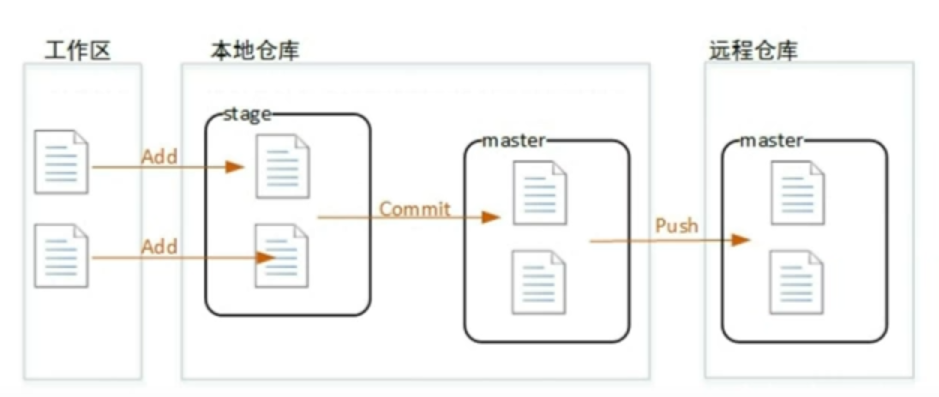

## Git & Gitee多人协作开发

### 一、Git原理和常用命令

**Git原理图**

- `git add files` 把当前文件放入暂存区域。

- `git commit` 给暂存区域生成快照并提交。

  提交时，git用暂存区域的文件创建一个新的提交，并把此时的节点设为父节点。然后**把当前分支指向新的提交节点**。上图中，当前分支是*master*。

- `git checkout -- files` 把文件从暂存区域复制到工作目录，用来丢弃本地修改。

  `checkout`命令用于**从历史提交（或者暂存区域）中拷贝文件到工作目录**，也可用于**切换分支**（不同分支代表不同版本）。

**个人浅薄理解：**

- Git的版本控制其实是通过**对树进行节点的添加和删除**来实现的，项目主干是*master*节点（当前项目版本），项目的不同版本则有*branch*节点。
- Git的树模型感觉是采用并查集的方式，可以判断当前的节点A（文件A）和节点B（文件B）是否在同一个*branch*节点，即是否在同一个项目中，而项目的*root*节点为*master*节点

参考[图解git基本使用](https://blog.csdn.net/ZYC88888/article/details/82142262)

### 二、安装Git

参考[Git下载、安装与环境配置](https://blog.csdn.net/huangqqdy/article/details/83032408)

### 三、Git在IDEA上的使用

#### 1、在Gitee上新建项目

参考[码云如何创建项目？](https://jingyan.baidu.com/article/48a420571a0971a92425041c.html)

#### 2、本地项目上传Gitee

##### 1）直接拖拽文件上传

缺点：一次最多只能上传20个文件。

##### 2）IDEA / 手动配置实现本地项目上传

参考如下两个博客

1、在IDEA中直接导入项目到码云：参考[IDEA上传本地项目到码云](https://www.cnblogs.com/zyboGarden/p/9950907.html)

2、从码云中clone项目到指定文件夹，然后通过本地的git来提交项目：参考[将本地项目上传到码云，只需这几步，每个步骤都有图文](https://www.jianshu.com/p/3e0b213ab03d)

我就很纳闷了，尝试了上面两种方法。

- 第一种为什么Gitee提交后，**日志报错，但是却正确提交了**，那请问这个项目提交到哪了？在我的Gitee，Github中没有这个仓库
- 第二种则手动`clone`、`add`、`commit`、`push`，也是在Gitee没有这个仓库。(**问题原因请见四.4**)

##### 3）通过Github Desktop间接上传到Gitee

**问题**：如何将原来的项目导入Gitee？

**解决方法**：先通过**Github Desktop**将项目上传到Github，然后再通过Gitee去克隆Github的仓库

Github Desktop上传项目离不开`commit`，`push`，具体如何使用请自行百度。Gitee如何克隆Github的仓库请见[Github资源下载慢怎么办](https://blog.csdn.net/qq_33934427/article/details/108181573)

#### 3、IDEA从Gitee下载项目（clone）

注意项目是公开项目，否则需要身份验证

还可以在**项目导入界面**采用*Version Control*的方式导入

#### 4、IDEA将项目添加到本地仓库（add + commit）

注意`commit`只是将文件提交到master分支，**不会推送给远程服务器**。

#### 5、IDEA将项目推送到服务器（push）

#### 6、发布新版本 & 切换版本（branch）

注意：

- 是**在整个项目上创建新的分支**，作为一个新的版本
- 为了**修复不同版本的bug**，**可以通过checkout，来切换分支**。

#### 7、多分支合并 & 冲突处理（Merge change）

如果在开发2.0版本时，用户反馈1.0版本出现bug，由于2.0版本是在1.0上的再次开发，虽1.0的bug已经修复，但在2.0中没修复bug。

**1.0版本：**

**当前版本(Master)：**

**分支冲突修复：**

### 四、零碎知识点

#### 1、在IDEA上安装Gitee插件

参考[IDEA 使用插件与码云仓库同步工程](https://blog.csdn.net/qq_17058993/article/details/82215958)

#### 2、IDEA获取Gitee的token

参考[如何获取Gitee的token？](https://blog.csdn.net/weixin_43675566/article/details/105021443)

#### 3、IDEA设置项目文件自动Add到Git

参考[IDEA设置项目文件自动Add到Svn/Git](https://www.cnblogs.com/xdzy/p/10925419.html)

**注意：**

- 如果文件发生冲突时（**标红**），需要手动add
- 如果文件**标蓝**，则说明文件add到本地仓库上，但没有提交到master节点

#### 4、Gitee用户绑定问题

对于IDEA推送**原始项目**到Gitee出现的问题，原因如下（见**三.2.2）**）：

- **Gitee会自动为Github账户创建一个用户**（只有用户名，没有密码），即使在`gist create depository`时输入了用户名和密码（你在注册Gitee时用的邮箱和密码），也不会登录这个账号，**似乎Gitee有Github账户优先的特性**。。。

  如下你就会发现这个问题：我在同一台机器上上传项目，但却出现了2位贡献者。。

  

- 解决方法是**对Github账户对应的Gitee账号进行邮箱绑定**，这样账户就不存在歧义了，也不会出现导入项目成功，却找不到项目的问题。

#### 5、Tomcat配置不一致问题

​		由于我之前tomcat在编译时会出现**中文乱码**，参考了这篇博客[解决tomcat启动时的中文乱码问题](https://blog.csdn.net/JF_OnTheWay/article/details/87889558)，在配置文件中**将UTF-8修改成GBK**之后，tomcat正常显示中文。

​		但是在和小伙伴A合作开发时（之前没碰到过），发现我的**tomcat控制台中文输出全为'？'**，参考了[使用idea控制台System.out，输出中文后为？？？](https://blog.csdn.net/dachaoa/article/details/82845176)之后，发现还是解决不了问题。

​		这时**我考虑A的tomcat是否是采用UTF-8进行编码的，而我的tomcat是用GBK编码的**，我删除了项目中的一下配置文件（变成裸露的项目），重新运行tomcat，还是乱码，但是乱码和之前不一样。这时我**将GBK修改成UTF-8**，中文就正常显示了。

#### 6、IDEA中Git的更新、提交、还原方法

参考[IDEA中Git的更新、提交、还原方法](https://blog.csdn.net/geng31/article/details/78585557)