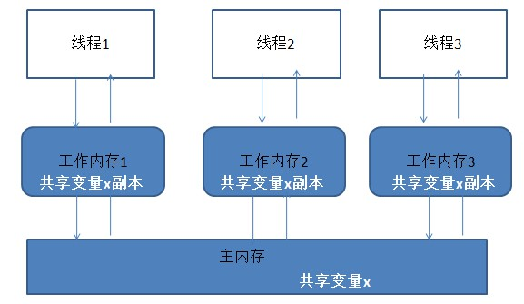
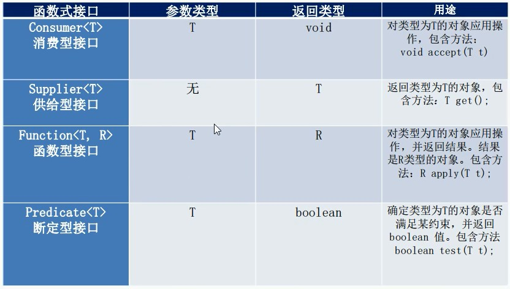
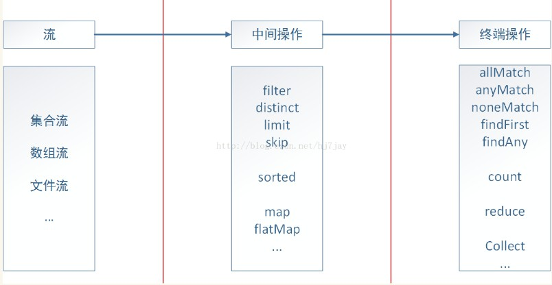
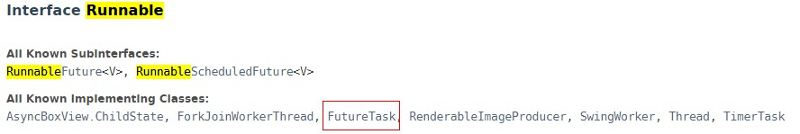

### JUC

#### 一、JUC是什么

- JUC是**java.util.concurrent**并发编程中使用的工具类的缩写
- 注意JUC由三个部分组成
  - **java.util.concurrent（并发包）**
  - **java.util.conncurrent.atomic（并发原子包）**
  - **java.util.concurrent.locks（并发锁包）**

#### 二、JUC需要掌握的知识点

- JUC是什么
- Java8的新特性：
  - 流式计算
  - Java8的lamda表达式
- Lock接口
- 线程通信
- 多线程锁
- Callable接口
- JUC的辅助类
- ReentrantReadWriteLock读写锁
- BlockingQueue阻塞队列
- ThreadPool线程池
- 分支合并框架
- 异步回调

**备注：**

- 要对JUC这个工具类做到“深，透，明，细“

#### 三、学前必备知识

##### 1、进程 & 线程

**进程：**

- 进程是进程实体的一次运行，是系统进行**资源分配和调度的一个独立单位**；

**线程：**

- 引入目的：为了更好的使多道程序并发执行，以**提高资源利用率和系统吞吐量，增加并发程序。**
- 特点：是程序执行的最小单元，**基本不拥有任何系统资源** 。
- 实现方式：用户级线程、系统线程

**参考**[操作系统知识点精简版](https://blog.csdn.net/qq_33934427/article/details/106016562)

##### 2、并发 & 并行

- **并发**：在用户可接受的处理时间段下，多道程序共同执行的过程
- **并行**：同一时刻，多道程序共同执行的过程。

##### 3、分布式系统 & 集群

- **分布式系统**：不同的多台服务器上部署**不同的服务模块**（工程），他们之间通过**Rpc/Rmi之间通信和调用**，对外提供服务和组内协作

- **集群**：多台服务器上面部署**相同的服务模块**，通过**分布式调度软件进行统一的调度**，对外提供服务和访问。

  集群的特点是：**可扩展性，高可用性，负载均衡，错误恢复**。

- **区别和联系**：

  - 分布式是指将**不同的业务**分布到不同的地方。

  - 集群是指将**几台服务器集中在一起**，实现**同一个业务**。

  - **分布式的每一个节点**，都可以用来做**集群**。而集群不一定就是分布式了

**参考**[分布式和集群的意义区别和联系](https://blog.csdn.net/ljj_9/article/details/79156255)

##### 4、多线程 & 多进程 & 分布式进程

- **多线程**：在同一台机器上，多个线程共享同一进程下、主存中的**共享变量**，通过调度系统为线程分配CPU（无论是单个CPU/多个CPU），同时**为线程分配工作内存**（即CPU缓存，保存共享变量的副本），**多线程并发执行**，来完成任务。
- **分布式进程**：在多台机器上，**不同进程各干各的**，并行执行，通过**进程通信**来完成任务。
- **多进程**：在同一台机器上，通过多个CPU，实现**多进程并行执行**。分布式进程也属于多进程。

##### 5、ACID原则

- **事务的原子性(Atomicity)：**是指一个事务要么全部执行，要么不执行
- **事务的一致性(Consistency)：**是指事务的运行并不改变数据库中数据的一致性。例如，**完整性约束了a+b=10**，一个事务改变了a，那么b也应该随之改变。(**保证数据之间的约束关系**)
- **事务的隔离性(Isolation）：**是指**两个以上的事务不会出现交错执行**的状态。
- **事务的持久性(Durability）**：事务的持久性是指事务执行成功以后，该事务对数据库所作的更改便是**持久的保存在数据库**之中，**不会无缘无故的回滚**。

**参考**[ACID原则](https://baike.baidu.com/item/ACID%E5%8E%9F%E5%88%99/9809444?fr=aladdin)

##### 6、CAP原则

- CAP原则又称CAP定理，指的是在一个**分布式系统**中， **Consistency**（强一致性）、 **Availability**（高可用性）、**Partition tolerance**（分区容错性），三者不可得兼，只能取其二。
  - C（一致性）：在分布式系统中的**所有数据备份**，在**同一时刻**是否**同样的值**
  - A（高可用性）：在集群中的**一部分节点故障**后，**集群整体能否还能响应客户端的读写请求**。
  - P（分区容错性）：以实际效果而言，分区相当于**对通信的时限要求**。系统不能**在时限内达成数据一致性**，就以为着发生了分区的情况，就需要就当前操作在C和A中做出选择。
- 在我看来，CAP原则主要应用在**分布式系统的数据访问层**中，对SQL/NOSQL数据库的操作。


##### 7、Base理论

- BASE理论是**Basically Available(基本可用)**，**Soft State（软状态）**和**Eventually Consistent（最终一致性）**三个短语的缩写。

  - **基本可用**：假设系统，**出现了不可预知的故障**，但还是能用，相比较正常的系统而言：
    - **响应时间上的损失**：正常情况下的搜索引擎0.5秒即返回给用户结果，而基本可用的搜索引擎可以在2秒作用返回结果。
    - **功能上的损失**：在一个电商网站上，正常情况下，用户可以顺利完成每一笔订单。但是到了大促期间，为了保护购物系统的稳定性，部分消费者可能会被引导到一个降级页面。

  - **软状态**：允许系统中的**数据存在中间状态**，并认为该状态不影响系统的整体可用性，即**允许系统在多个不同节点的数据副本存在数据延时**。
  - **最终一致性**：上面说软状态，然后**不可能一直是软状态，必须有个时间期限**。在期限过后，应当保证所有副本保持数据一致性
    - 因果一致性（Causal consistency）
    - 读己之所写（Read your writes）
    -  会话一致性（Session consistency）
    - 单调读一致性（Monotonic read consistency）
    - 单调写一致性（Monotonic write consistency）：单调写一致性指的是：一个系统要能够保证来自**同一个节点的写操作被顺序的执行**

- **BASE**是**对CAP中一致性和可用性权衡**的结果，其来源于对大规模互联网分布式系统实践的总结，是**基于CAP定律逐步演化而来**。其核心思想是即使无法做到强一致性，但每个应用都可以根据自身业务特点，**采用适当的方式**来使系统**达到最终一致性**。

**参考**[分布式理论：BASE理论](https://baijiahao.baidu.com/s?id=1634401106583534524&wfr=spider&for=pc)

##### 8、ACID & CAP & BASE三者关系

总体来说**BASE理论**面向的是大型**高可用、可扩展的分布式系统**。与传统ACID特性相反，不同于ACID的强一致性模型，**BASE提出通过牺牲强一致性来获得可用性**，并允许数据段时间内的不一致，**但是最终达到一致状态**。同时，在实际分布式场景中，不同业务对数据的一致性要求不一样。因此在设计中，ACID和BASE理论往往又会结合使用。


**参考**[分布式理论：BASE理论](https://baijiahao.baidu.com/s?id=1634401106583534524&wfr=spider&for=pc)

##### 9、并发编程的本质是什么？

- 并发编程的本质其实是要解决：**可见性、原子性、有序性**这三大问题。

- **可见性：** 就是**一个线程对共享变量的修改，另外一个线程能够立刻看到**。（这时可以联想到volatile关键字，在Java**内存模型**中提到了**线程栈**为**线程的工作内存**，其实线程的**工作内存**是对 **CPU 寄存器和高速缓存的抽象描述**）

  

  

- **原子性：** 把一个或者多个操作在 CPU 执行的过程中**不被中断的特性**称为原子性。

- **有序性**：**程序执行的顺序**按照**代码的先后顺序**执行。


**参考**

- [Java并发编程的本质是解决这三大问题](https://www.cnblogs.com/ystblog/p/13043365.html)

- [Java中Volatile关键字详解](https://www.cnblogs.com/zhengbin/p/5654805.html)

##### 10、备注

- 为什么我觉得ACID原则，CAP原则，BASE理论是了解JUC之前必备知识？

  因为再复杂的程序运行都离不开进程，线程的基础概念，再复杂的程序运行离不开各种业务的需求。ACID原则，CAP原则，BASE理论从不同角度**强调了数据的一致性**。**JUC工具类是处理并发问题的一种解决方法**，其中**同步机制只适用于同一台机器**，但在以后的**分布式系统开发**中，你会找到和JUC类似的，处理并发问题的解决方案，可以**将并发问题从单机扩展到分布式系统**。

#### 四、Java8新特性 - lambda & 流式计算

##### 1、函数式接口

- 函数式接口(Functional Interface)是Java 8对一类特殊类型的接口的称呼。 这类接口只定义了**唯一的抽象方法的接口**，并且这类接口使用了**`@FunctionalInterface`**进行注解，一般**和lambda表达式一起使用**。

- 在jdk8中，引入了一个新的包`java.util.function`, 可以使java 8 的函数式编程变得更加简便。

- **四大函数型接口**

  - **Function**: 接收参数，并返回结果，主要方法 `R apply(T t)`
  - **Consumer**: 接收参数，无返回结果, 主要方法为 `void accept(T t)`
  - **Supplier**: 不接收参数，但返回结构，主要方法为 `T get()`
  - **Predicate**: 接收参数，返回boolean值，主要方法为 `boolean test(T t)`

  

- 用**`default`**关键字修饰方法，默认实现接口中的方法

- 函数式接口中还可以**实现静态方法**，用类名进行调用。

参考[JAVA 8 函数式接口( java.util.function 详解)](https://segmentfault.com/a/1190000016596774)

##### 2、lambda表达式

- Lambda 表达式是 JDK8 的一个新特性，可以**取代大部分的匿名内部类**，写出更优雅的 Java 代码，尤其在集合的遍历和其他集合操作中，可以**极大地优化代码结构**。

- **对接口的要求**：虽然使用 Lambda 表达式可以对某些接口进行简单的实现，但并不是所有的接口都可以使用 Lambda 表达式来实现。**Lambda 规定接口中只能有一个需要被实现的方法，不是规定接口中只能有一个方法（可以用default，在接口中默认实现方法）**

- **lambda表达式语法**：() -> {}; 其中**()是参数列表**，可以不写参数类型，**{}用来描述方法体**，类似于匿名内部类，但又比其**简化**。

- 代码如下

  ```java
  //函数式接口（主要有4种类型）
  /**无参数，无返回*/
  @FunctionalInterface
  interface Foo{
      void print();
      //default 默认实现方法
      default void print1(){
          System.out.println("print1");
      };
      public static int getPlus(int x,int y){
          return x + y;
      }
  }
  
  /**无参数，有返回*/
  @FunctionalInterface
  interface Foo1{
      int print();
  }
  
  /**多参数，有返回*/
  @FunctionalInterface
  interface Foo5{
      int print(int a,char b);
  }
  
  public class Main{
  
      /**无参数，无返回*/
      @Test
      public void testFoo() {
  
          Foo foo = new Foo() {
              @Override
              public void print() {
                  System.out.println("Anonymous Foo");
              }
          };
          foo.print();
  
          Foo foo1 = ()->{
              System.out.println("Lamda Foo");
          };
          foo1.print();
      }
  
      /**无参数，有返回*/
      @Test
      public void testFoo1() {
  
          //匿名内部类
          Foo1 foo = new Foo1() {
              @Override
              public int print() {
                  System.out.println("Anonymous Foo1");
                  return 1;
              }
          };
          System.out.println(foo.print());
  
          //lambda表达式
          Foo1 foo1 = ()->{
              System.out.println("Lamda Foo1");
              return 1;
          };
          System.out.println(foo1.print());
      }
  
      /**多参数，有返回*/
      @Test
      public void testFoo5() {
  
          //匿名内部类
          Foo5 foo = new Foo5() {
              @Override
              public int print(int a,char b) {
                  System.out.println("Anonymous Foo5");
                  return a + b;
              }
          };
          System.out.println(foo.print(1,'a'));
  
          //可以不写参数类型
          Foo5 foo1 = (a,b)->{
              System.out.println("Lamda Foo5");
              return a + b ;
          };
          System.out.println(foo1.print(1,'a'));
      }
  }
  ```
  
  比如在集合的遍历中，也可以**使用lambda表达式访问4种类型的函数式接口**
  
  ```java
  class User{
      private String id;
      private String name;
  
      public User(String id) {
          this.id = id;
          switch (id){
              case "1" : this.name = "小王";break;
              case "2" : this.name = "老王";break;
              case "3" : this.name = "小李";break;
              case "4" : this.name = "老李";break;
              default: this.name = "陌生人";
          }
      }
      getter,setter,toString
  }
  ```
  
  
  
  ```java
  List<User> list = new ArrayList<>();
  list.add(new User("1"));
  list.add(new User("2"));
  list.add(new User("3"));
  list.add(new User("4"));
  
  //增强版的for
  for(User user : list){
      System.out.println(user);
  }
  
  /**
   *
   * Iterable接口中默认实现消费型方法（接口）
   * default void forEach(Consumer<? super T> action) {
   *       Objects.requireNonNull(action);
   *       for (T t : this) {
   *           action.accept(t);
   *       }
   * }
   */
  list.forEach((user)->{
      System.out.println(user);
  });
  
  ---
  //1
  User{id='1', name='小王'}
  User{id='2', name='老王'}
  User{id='3', name='小李'}
  User{id='4', name='老李'}
  //2
  User{id='1', name='小王'}
  User{id='2', name='老王'}
  User{id='3', name='小李'}
  User{id='4', name='老李'}    
  ```

**参考**[Lambda表达式详解](https://www.cnblogs.com/haixiang/p/11029639.html)

##### 3、流式计算

​		就上面的集合而言，如何筛选出集合中"name“”包含"王"的王氏家族呢？有了stream之后，我们还可以这样写：

```java
System.out.println("找出王某");

/**
 *	Stream<T>接口中的方法
 *  Stream<T> filter(Predicate<? super T> predicate);
 */
List<User> wangList = list.stream().filter(user -> {return user.getName().contains("王");}).collect(Collectors.toList());
      wangList.forEach(user -> {
      System.out.println(user);
});
---
找出王某
User{id='1', name='小王'}
User{id='2', name='老王'}
```

​		java8的**流式处理极大的简化了对于集合的操作**，实际上**不光是集合，包括数组、文件**等，只要是可以**转换成流（封装成Stream对象）**，我们都可以借助流式处理，类似于我们写**SQL语句**一样对其进行操作。java8通过内部迭代来实现对流的处理，一个流式处理可以分为三个部分：**转换成流、中间操作（仍然是流）、终端操作**。



详细内容参考[java1.8新特性之stream流式算法](https://www.cnblogs.com/gaopengfirst/p/10813803.html)

---------------------------完美分割线------------------------

#### 五、预备

##### 1、分析思路

​		接下来正式进入JUC并发编程，我打算**以问题为导向**，通过对比JUC并发编程包中**不同类型锁的效率**，了解**JUC并发包日渐完善**的过程，即使JUC包以后加了新的功能，也可以游刃有余的学习掌握。

##### 2、各版本jdk中JUC的演化

​	**以下信息不一定准确**，我只想呈现JUC的发展过程，至于是在什么场景下孕育出来的，前者为何无法解决该场景，我还没有仔细研究。

- `synchronized`：

  jdk1.6之前，依赖于 JVM，jdk1.6得到优化<https://blog.csdn.net/qq_34337272/article/details/83409990>

- `ReenTrantLock`：

  jdk1.6，依赖于API。 <https://blog.csdn.net/qq_34337272/article/details/83409990>

- 集合安全类（`ConcurrentHashMap,CopyOnWriteArrayList,CopyOnWriteArraySet`）：

  jdk1.5 ，其中Collections有实现集合安全的方法。<https://blog.csdn.net/chushoufengli/article/details/87704786>

- `AtomicInteger`，`AtomicLong`：

  好像是在jdk1.5开始出现  <https://www.cnblogs.com/jyroy/p/11365935.html>

- JUC一些辅助类（`CountDownLatch,CyclicBarrier,Semaphore`）：

  没找到起源，至少在jdk8中出现（好吧，是我比较懒）

##### 3、JUC中锁的分类

[java中的各种锁详细介绍](https://www.cnblogs.com/jyroy/p/11365935.html)


##### 4、Java创建线程的4种方式

[Java创建线程的四种方式](https://blog.csdn.net/weixin_41891854/article/details/81265772)

- **继承`Thread`类**，编写run()方法

- **实现`Runnable`接口**，编写run()方法，但需要**通过`Thread`类，来启动线程**，执行start()

- **Callable接口**，编写**call方法，为其设置返回值**，**告知该线程已完成任务**。其中要注意的是，如何将`Callable`接口和线程类`Thread`建立关系？由于`Thread`的一个构造器中，`Runnable`作为参数传入，及**`Runnable`的实现类都可以作为参数传入**。是否存在一个**Runnable实现类的构造器，Callable作为参数传入**呢？当然是有的：`FutureTask`。

  

  ```java
  //FutureTask
  public FutureTask(Callable<V> callable) {
          if (callable == null)
              throw new NullPointerException();
          this.callable = callable;
          this.state = NEW;       // ensure visibility of callable
  }
  ```

  **小案例：卖票**

  代码如下：

  ```java
  //资源类
  class Ticket{
      private AtomicInteger number = new AtomicInteger(15);
  
      public int sale(){
          if(number.get() > 0) {
              //注意它返回的是未改变之前的值
              return number.getAndDecrement() - 1;
          }
          return 0;
      }
  }
  ```

  ```java
  @Test
  public void test1() throws ExecutionException, InterruptedException {
  
      Ticket ticket = new Ticket();
  
      Callable<String> callable1 = new Callable<String>() {
          @Override
          public String call() throws Exception {
              System.out.println(Thread.currentThread().getName() + "开始取票");
              for(int i = 0; i < 10; i++){
                  System.out.println(Thread.currentThread().getName() + "购入1张票," + "现剩余" + ticket.sale() + "张票");
                  Thread.sleep(1000);
              }
              return Thread.currentThread().getName() + "finished";
          }
      };
  
      Callable<String> callable2 = new Callable<String>() {
          @Override
          public String call() throws Exception {
              System.out.println(Thread.currentThread().getName() + "开始取票");
              for(int i = 0; i < 10; i++){
                  System.out.println(Thread.currentThread().getName() + "购入1张票," + "现剩余" + ticket.sale() + "张票");
                  Thread.sleep(1000);
              }
              return Thread.currentThread().getName() + "finished";
          }
      };
  
      FutureTask futureTask1 = new FutureTask(callable1);
      FutureTask futureTask2 = new FutureTask(callable2);
  
      new Thread(futureTask1,"A").start();
      new Thread(futureTask2,"B").start();
  
      futureTask1.get();
      futureTask2.get();
  
      System.out.println("票已空");
  }
  ---
  A开始取票
  A购入1张票,现剩余14张票
  B开始取票
  B购入1张票,现剩余13张票
  A购入1张票,现剩余12张票
  B购入1张票,现剩余11张票
  A购入1张票,现剩余10张票
  B购入1张票,现剩余9张票
  A购入1张票,现剩余8张票
  B购入1张票,现剩余7张票
  A购入1张票,现剩余6张票
  B购入1张票,现剩余5张票
  A购入1张票,现剩余4张票
  B购入1张票,现剩余3张票
  B购入1张票,现剩余2张票
  A购入1张票,现剩余1张票
  B购入1张票,现剩余0张票
  A购入1张票,现剩余0张票
  B购入1张票,现剩余0张票
  A购入1张票,现剩余0张票
  A购入1张票,现剩余0张票
  B购入1张票,现剩余0张票
  票已空
  ```

  **备注：**

  - `futureTask.get()`要得到线程的返回结果，会**阻塞主进程**，一般**将get()放到计算机完成后面**

  - **不同线程调用同一个futureTask对象**，正确结果复用，**只会执行一次**Callable中的call()方法

    ```java
    new Thread(futureTask1,"A").start();
    new Thread(futureTask1,"B").start();
    ---
    A开始取票
    A购入1张票,现剩余14张票
    A购入1张票,现剩余13张票
    A购入1张票,现剩余12张票
    A购入1张票,现剩余11张票
    A购入1张票,现剩余10张票
    A购入1张票,现剩余9张票
    A购入1张票,现剩余8张票
    A购入1张票,现剩余7张票
    A购入1张票,现剩余6张票
    A购入1张票,现剩余5张票    
    ```

- **线程池**

  - 线程池做的工作只要是控制运行的线程数量，**处理过程将任务放入队列**，然后在线程创建后启动这些任务，**如果线程数量超过了最大数量，超出数量的线程排队等候**，等其他线程执行完毕，再从队列中取出任务来执行。

  - 主要特点是：**线程复用；控制最大并发数；管理线程**。

  **线程池的7大参数（很重要）**：

  - corePoolSize：核心线程最大数量，通俗点来讲就是，线程池中**常驻线程的最大数量**
  - maximumPoolSize：线程池中**运行最大线程数(包括核心线程和非核心线程)**
  - keepAliveTime：线程池中空闲线程（仅适用于非核心线程）所能存活的最长时间
  - unit：存活时间单位，与keepAliveTime搭配使用
  - workQueue：存放任务的阻塞队列
  - handler：线程池**饱和策略**

  详见<https://blog.csdn.net/zycxnanwang/article/details/105563351>

  **java线程池的种类**：

  - `newFixedThreadPool(int n)`：固定大小的线程池

  - `SingleThreadExecutor()` ：单线程池，需要**保证顺序执行各个任务**的场景 

  - `CachedThreadPool()`：缓存线程池（**业务快，可扩容；业务慢，可减少**），当提交任务速度高于线程池中任务处理速度时，**缓存线程池会不断的创建线程**，适用于提交短期的异步小程序，以及负载较轻的服务器

  - 自定义线程池：

    ```java
    public static void main(String[] args) {
        ExecutorService threadPool = new ThreadPoolExecutor(2,5,
                3L, TimeUnit.SECONDS,
                new LinkedBlockingDeque<>(3),
                Executors.defaultThreadFactory(),
                new ThreadPoolExecutor.DiscardPolicy());
    
        for (int i = 0; i < 10 ; i++) {
            threadPool.execute(()->{
                System.out.println(Thread.currentThread().getName() + "\t --处理业务");
            });
        }
    
        threadPool.shutdown();
    }
    ---
    pool-1-thread-1	 --处理业务
    pool-1-thread-1	 --处理业务
    pool-1-thread-1	 --处理业务
    pool-1-thread-1	 --处理业务
    pool-1-thread-4	 --处理业务
    pool-1-thread-5	 --处理业务
    pool-1-thread-3	 --处理业务
    pool-1-thread-2	 --处理业务   
    ```

  **线程池执行过程**

  详见<https://blog.csdn.net/zycxnanwang/article/details/105563351>

  - 判断线程池中核心线程数是否已达阈值corePoolSize,若否，则创建一个新核心线程执行任务

  - 若核心线程数已达阈值corePoolSize,判断阻塞队列workQueue是否已满，若未满，则将新任务添加进阻塞队列

  - 若满，再判断，线程池中线程数是否达到阈值maximumPoolSize,若否，则新建一个非核心线程执行任务。若达到阈值，则执行线程池饱和策略。

  

  **备注：**

  - **`Executors`是线程池的工具类**。

  - 线程池返回对象是`ExecutorService`，可以**把`ExecutorService`当作一个线程池**

  - 线程池**不允许使用`Executors`去创建，而是通过`ThreadPoolExecutor`的方式**，这样的处理方式可以更加明确线程池的运行规则，避免资源耗尽的风险。
    - `newFixedThreadPool(int n)`和`SingleThreadPoolExecutor` 允许的请求**队列（阻塞队列）长度为Integer.MAX_VALUE**，可能会**堆积大量的请求**，从而**导致OOM**
    - `CachedThreadPool()`和`ScheduledThreadPool`**允许创建线程数量为Integer.MAX_VALUE**，可能会**创建大量的线程**，从而**导致OOM**
  - **三个线程池API底层都是用到了`ThreadPoolExecutor`**，因此要自定义线程池，离不开`ThreadPoolExecutor`

  ```java
  public static ExecutorService newCachedThreadPool() {
      return new ThreadPoolExecutor(0, Integer.MAX_VALUE,
                                    60L, TimeUnit.SECONDS,
                                    new SynchronousQueue<Runnable>());
  }
  ```

#### 六、lock接口

##### 1、卖票题目

- 描述：三个售票员卖出30张票，**如何在并发下保证票的数量一致性**。

- **套路模版**

  - 在高内聚低耦合的前提下，通过**线程操作资源类，资源对外提供方法接口；切勿将资源类继承`Thread`**或者实现`Runnable`接口。
- 使用**`new Thread(Runnable target, String name).start()`**来创建线程，实现Runnable接口即可；一般不使用`new Thread(){}.start()`匿名内部类（**lamda表达式**）来创建线程。
  
- **代码如下：**

  ```java
  class Ticket{
  
      private int number = 15;
  
      public synchronized void sale(){
  
          Lock lock = new ReentrantLock();
  
          lock.lock();
          try{
              if(number > 0) {
                  System.out.println(Thread.currentThread().getName() + "购入一张票，还剩" + --number + "张票");
              }
          }catch (Exception e){
              e.printStackTrace();
          }finally {
              lock.unlock();
          }
      }
  }
  
  public class Demo1 {
  
      //线程 操作 资源类
      public static void main(String[] args) {
  
          Ticket ticket = new Ticket();
          new Thread(()->{for (int i = 0; i < 15 ; i++) {
              ticket.sale();
          }},"A").start();
  
          new Thread(()->{for (int i = 0; i < 15 ; i++) {
              ticket.sale();
          }},"B").start();
      }
  }
  ---
  A购入一张票，还剩14张票
  A购入一张票，还剩13张票
  A购入一张票，还剩12张票
  A购入一张票，还剩11张票
  A购入一张票，还剩10张票
  A购入一张票，还剩9张票
  A购入一张票，还剩8张票
  A购入一张票，还剩7张票
  A购入一张票，还剩6张票
  A购入一张票，还剩5张票
  A购入一张票，还剩4张票
  A购入一张票，还剩3张票
  A购入一张票，还剩2张票
  A购入一张票，还剩1张票
  A购入一张票，还剩0张票
  ```

  

