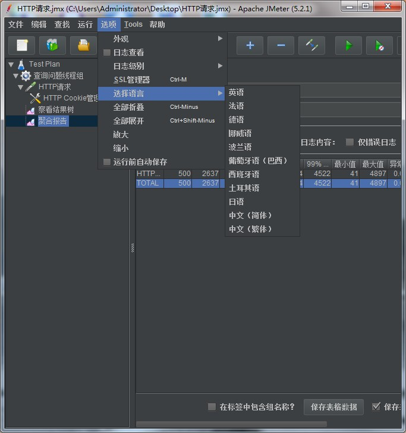

## Jmeter进行性能测试

网上有很多关于Jmeter使用的文档，我就简单记录一下吧

### 一、Jmeter的安装

- 为什么我要用Jmeter？因为**postman无法使用压力测试**，所以我就用了jmeter。postman进行接口测试可见这里<https://blog.csdn.net/qq_33934427/article/details/105883517>
- postman交互做得很好，基本操作会了的话，jmeter很好上手

- **Jmeter下载地址**：<http://jmeter.apache.org/download_jmeter.cgi>，注意Jmeter使用之前需要安装jdk8等以上版本的jdk
- 解压后，在bin下点击**Jmeter.bat**文件启动Jmeter（我是使用window7安装的）

### 二、性能测试，负载测试和压力测试的区别

**性能测试：**

- 多**用户并发**性能测试
- 通过**模拟多种正常、峰值以及异常负载条件**来对系统的**各项性能指标**进行测试

**负载测试：**

- 通过逐步**增加系统负载，测试系统性能的变化**，并在**满足最终确定性能指标**的情况下，系统所能承受的**最大负载量**。

**压力测试：**

- 压力测试是**评估系统处于或超过预期负载**时系统的运行情况，关注点在于系统在峰值负载或**超出最大载荷情况下的处理能力**。

**三者的联系和区别：**

- 负载测试，压力测试都属于性能测试。
- 从测试方法和测试工具来说，三者都是一样的。
- 从测试目的来说，三者却是不同的。
  - 负载测试是为了确定满足性能指标的最大并发用户数，**关注点在性能指标上**。
  - 性能测试就是在服务器指标不超过80%下的测试来获取性能指标
  - 而压力测试则是在高负载的情况下进行，它的**关注点不在性能指标，而是系统能否可以稳定**运行。压力测试时服务器的**指标一般不超过90%。**

### 三、Jmeter的使用

##### 1、预备工作

- 先汉化

  

##### 2、对http请求下的url进行接口测试

- 创建线程组，模拟并发操作，进行压力测试

  

- 在线程组的基础上创建HTTP请求

  

- 对于系统内部的网页，需要登录帐号后才可以访问，这时需要创建cookie

  

##### 3、对接口测试，压力测试的结果进行查看

- 结果树

  

- 聚合报告

  

结果如何分析，具体参数是什么意思，网上该文档总结得不错[JMeter做压力测试教程及结果分析](https://blog.csdn.net/weixin_39089928/article/details/87369101?utm_medium=distribute.pc_relevant_right.none-task-blog-BlogCommendFromBaidu-1&depth_1-utm_source=distribute.pc_relevant_right.none-task-blog-BlogCommendFromBaidu-1)

##### 4、保存成jmx后缀名的文件，再运行文件。

#### 参考文档

1、[如何用Jmeter做接口测试](https://www.cnblogs.com/Sean-Pan/p/8571240.html)

2、[如何使用Jmeter进行压力测试](https://www.cnblogs.com/Sean-Pan/p/8622077.html)

3、[JMeter做压力测试教程及结果分析](https://blog.csdn.net/weixin_39089928/article/details/87369101?utm_medium=distribute.pc_relevant_right.none-task-blog-BlogCommendFromBaidu-1&depth_1-utm_source=distribute.pc_relevant_right.none-task-blog-BlogCommendFromBaidu-1)

4、[性能测试、压力测试与负载测试的区别](https://blog.csdn.net/super_vicky/article/details/99460617?utm_medium=distribute.pc_relevant.none-task-blog-BlogCommendFromBaidu-3&depth_1-utm_source=distribute.pc_relevant.none-task-blog-BlogCommendFromBaidu-3)

5、[性能测试，压力测试，负载测试的区别与联系](https://blog.csdn.net/LANNY8588/article/details/89677367)