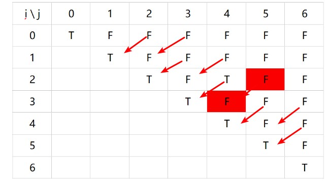

## 5.最长回文子串

[5. 最长回文子串](https://leetcode-cn.com/problems/longest-palindromic-substring/)

### 一、题目描述

**示例 1：**

```
输入: "babad"
输出: "bab"
注意: "aba" 也是一个有效答案。
```

**示例 2：**

```
输入: "cbbd"
输出: "bb"
```

### 二、方法1：动态规划

**分析1：**

​	一开始我的思路是这样的：将**字符串s反转成s1**，然后对**s和s1进行最长公共子串的匹配**。匹配的方法和昨天的[1143.最长公共子序列](https://editor.csdn.net/md/?articleId=105976063)一样：

-  如果s1[j] != s[i]，选择三个方向的最大值
-  如果s1[j] == s[i]，选择三个方向的最小值 + 1

**代码如下：**

```java
class Solution {

  public String longestPalindrome(String s) {

    if(s.length() == 0){
      return "";
    }

    /**先将字符串逆序成s1，然后s1和s2进行字符串匹配。*/
    /** 
         * S=“abacdfgdcaba”, S' =“abacdgfdcaba”：
         * S 以及 S′ 之间的最长公共子串为“abacd”。
         * 显然，这不是回文。
         */
    String s1 = reverse(s);
    // System.out.println(s1);
    int dp[][] = new int[s.length() + 1][s.length() + 1];

    int max = 0;
    int max_i = 0;
    int max_j = 0;
    for(int i = 1; i <= s.length(); ++i){
      for(int j = 1; j <= s.length(); ++j){

        /**
                 * 和最长公共子序列思想相同
                 * 如果s1[j] != s[i]，选择三个方向的最大值
                 * 如果s1[j] == s[i]，选择三个方向的最小值 + 1
                 */
        if(s.charAt(i - 1) != s1.charAt(j - 1)){
          dp[i][j] = Math.max(Math.max(dp[i][j - 1],dp[i - 1][j]),dp[i - 1][j - 1]);
        }else{
          dp[i][j] = Math.min(Math.min(dp[i][j - 1],dp[i - 1][j]),dp[i - 1][j - 1]) + 1;
        }

        if(max < dp[i][j]){
          max = dp[i][j];
          max_i = i;
          max_j = j;
        }
      }
    }

    for(int i = 0; i <= s.length(); ++i){
      for(int j = 0; j <= s.length(); ++j){
        System.out.print(dp[i][j] + " ");
      }
      System.out.println();
    }

    // System.out.println(max + " " + max_i + " " + max_j);

    //根据dp数组回显最长回文子串
    String str = "";
    int i = max_i;
    int j = max_j;
    while(i >= 1 && j >= 1 && dp[i][j] != 0){

      // System.out.println(i + " " + j);

      /**
             * 如果s1[j] != s[i]，选择三个方向的最大值，默认斜向上
             */
      if(s.charAt(i - 1) != s1.charAt(j - 1)){
        int a = dp[i - 1][j];
        int b = dp[i][j - 1];
        int c = dp[i - 1][j - 1];

        //找最大值
        if(a > b){
          if(a > c){
            i = i - 1;
          }else{
            i = i - 1;
            j = j -1;
          }
        }else{
          if(b > c){
            j = j - 1;
          }else{
            i = i - 1;
            j = j -1;
          } 
        }

      }else{

        /**如果s1[j] == s[i]，则一直斜向上，知道dp[i][j]为0结束*/
        str += s.charAt(i - 1);
        i = i - 1;
        j = j - 1;
        // System.out.println(str);
      }
    }

    return reverse(str);
  }

  public String reverse(String s){

    int length = s.length();
    char[] s1 = s.toCharArray();

    int middle = length / 2;
    for(int i = 0; i < middle; i++){
      char temp = s1[i];
      s1[i] = s1[length - i - 1];
      s1[length - i - 1] = temp;
    }

    return new String(s1);
  }
}
```

​         虽然发现这个思想可以满足一些解，但是会发现这种**瞎猜的，没有逻辑分析就进行dp二维表格的填写**，无疑是错误的。原题给的"babad"，“cbbd“都行得通，但会在第43个例子"abcda"卡壳了

```
Your Input："abcda"
Output (8 ms)："aca"
Expected Answer："a"

---
dp二维数组如下
0 0 0 0 0 0 
0 1 1 1 1 1 
0 1 1 1 2 2 
0 1 1 2 2 2 
0 1 2 2 2 2 
0 1 2 2 2 3 
```

​	该思路显然不正确。

​	但是能否有其他的转移方程呢？在leetcode官方题解中<https://leetcode-cn.com/problems/longest-palindromic-substring/solution/zui-chang-hui-wen-zi-chuan-by-leetcode/>，**最长公共子串的方法不可行** ：

​	eg：s = “abacdfgdcaba“，s1=“abacdfgdcaba“，最长公共子串是“abacdfgdcaba“，但是s显然不是回文串。

---

**分析2：**

​	以s = “ xacay”为例，由于“aca“为回文串，

- 如果x == y，则s为回文串
- 如果x != y，则s不是回文串。

  所以**s是否为回文串取决于两个因素**：

- 以s\[ i ]，s\[ j ]作为两边的，**中间包括的子串是否为回文串**
- **s\[ i ]，s\[ j ]是否相等**
  - 如果相等，则当前串为回文串
  - 如果不等，则**当前串破坏了回文的好机会**，当前串不再是回文串了。

**转移方程为：**

​	dp\[ i ]\[ j ] = (dp\[ i + 1]\[j - 1]) && (s\[ i ] == s\[ j ])

**注意**

- dp二维表格存储的是**boolean值**
- i，j表示在s字符串中移动的**两指针**
- **dp\[ i ]\[ j ] = true**的含义是：在i，j这个区域（左闭右闭），**s[i，j]子串是回文串**。
- 要想得到最长回文子串，及**得到i，j之间的最大差值**。注意是上三角矩阵，若i表示行，j表示列，则**i总小于j**。 
- 由于**j指针一直在i指针之前**，所以当 **j = i + 1时，dp\[ i + 1]\[j - 1]是无效的**，所以需要**在初始化斜对角线后，再初始化j = i + 1的斜对角线**，才能进行动态规划的填表。
- 每趟填表时**按照斜对角线的方向填写** 。

**代码如下：**

```java
/*
 * @lc app=leetcode.cn id=5 lang=java
 *
 * [5] 最长回文子串
 */

// @lc code=start
class Solution {

  public String longestPalindrome(String s) {

    if(s.length() == 0 ) return "";

    boolean[][] dp = new boolean[s.length()][s.length()];

    //对角线初始化
    for(int i = 0; i < s.length(); ++i){
      dp[i][i] = true;
    }

    int max = 0;
    int max_i = 0;
    int max_j = 0;
    //当i，j相差1个单位时，及dp[i][i+1] = s.charAt(i) == s.charAt(i+1)
    int ii = 0;
    while(ii < s.length() - 1){
      dp[ii][ii+1] = (s.charAt(ii) == s.charAt(ii+1));

      //获取最大j-i
      if(dp[ii][ii + 1] == true && max < 1){
        max = 1;
        max_i = ii;
        max_j = ii + 1;
      }

      ii++;
    }


    //斜对角线填值，共s.length - 1趟，第一趟填写dp[j][j + 1]，第二趟填写第一趟填写dp[j][j + 2]
    for(int k = 1; k < s.length() - 1; ++k){
      int i = 0;
      int j = i + k + 1;
      while(i < s.length() && j < s.length()){
        dp[i][j] = (dp[i + 1][j - 1]) && (s.charAt(i) == s.charAt(j));

        //获取最大j-i
        if(dp[i][j] == true && max < (j - i)){
          max = j - i;
          max_i = i;
          max_j = j;
        }

        i++;
        j = i + k + 1;
      }
    }
    
     System.out.println(max + " " + max_i + " " + max_j);
     for(int i = 0; i < s.length(); ++i){
         for(int j = 0; j < s.length(); ++j){
             System.out.print(dp[i][j] + " ");
         }
         System.out.println();
     }

    String str = s.substring(max_i,max_j + 1);
    System.out.println(str);
    return str;

    //超时"jglknendplocymmvwtoxvebkekzfdhykknufqdkntnqvgfbahsljkobhbxkvyictzkqjqydczuxjkgecdyhixdttxfqmgksrkyvopwprsgoszftuhawflzjyuyrujrxluhzjvbflxgcovilthvuihzttzithnsqbdxtafxrfrblulsakrahulwthhbjcslceewxfxtavljpimaqqlcbrdgtgjryjytgxljxtravwdlnrrauxplempnbfeusgtqzjtzshwieutxdytlrrqvyemlyzolhbkzhyfyttevqnfvmpqjngcnazmaagwihxrhmcibyfkccyrqwnzlzqeuenhwlzhbxqxerfifzncimwqsfatudjihtumrtjtggzleovihifxufvwqeimbxvzlxwcsknksogsbwwdlwulnetdysvsfkonggeedtshxqkgbhoscjgpiel"

  }

}
// @lc code=end


```

测试结果

```
Your Input
"babad"
Output (13 ms)
"bab"
Expected Answer
"bab"

Stdout
2 0 2
true false true false false 
false true false true false 
false false true false false 
false false false true false 
false false false false true 
----
Your Input
"bb"
Output (8 ms)
"bb"
Expected Answer
"bb"

Stdout
1 0 1
true true 
false true 
```



注意在测试"jglknendplocymmvwtoxvebkekzfdhykknufqdkntnqvgfbahsljkobhbxkvyictzkqjqydczuxjkgecdyhixdttxfqmgksrkyvopwprsgoszftuhawflzjyuyrujrxluhzjvbflxgcovilthvuihzttzithnsqbdxtafxrfrblulsakrahulwthhbjcslceewxfxtavljpimaqqlcbrdgtgjryjytgxljxtravwdlnrrauxplempnbfeusgtqzjtzshwieutxdytlrrqvyemlyzolhbkzhyfyttevqnfvmpqjngcnazmaagwihxrhmcibyfkccyrqwnzlzqeuenhwlzhbxqxerfifzncimwqsfatudjihtumrtjtggzleovihifxufvwqeimbxvzlxwcsknksogsbwwdlwulnetdysvsfkonggeedtshxqkgbhoscjgpiel"时会超时，打印不出dp二维表格。

**Accepted**

- 103/103 cases passed (132 ms)
- Your runtime beats 35.08 % of java submissions
- Your memory usage beats 15.18 % of java submissions (41.8 MB)

参考<https://leetcode-cn.com/problems/longest-palindromic-substring/solution/dong-tai-gui-hua-jie-fa-by-curshallproblem/>

### 三、总结

​	某位网友对动态规划的题型总结得很好，他的题解在这<https://leetcode-cn.com/problems/longest-palindromic-substring/solution/zhong-xin-kuo-san-dong-tai-gui-hua-by-liweiwei1419/>


- 这道题在dp二维表格的**初始化上有点特殊**：先初始化斜对角线后，还需要再初始化另一条对角线，否则直接循环填dp表会出现逻辑上的错误，及**dp\[ i ][ i + 1]依赖于dp\[ i + 1][ i ]的情况，显然不合逻辑**。
- 在dp二维表循环填表时，**是斜对角线依次向内填写，而不是逐行填写**。
- **如何填写dp二维表**，该表的含义是什么
  - 对于两个变量[1143.最长公共子序列](https://editor.csdn.net/md/?articleId=105976063)，可以采用**i，j指针分别遍历两个变量**来填写dp二维表
  - 对于单个变量[5. 最长回文子串](https://leetcode-cn.com/problems/longest-palindromic-substring/)，可以采用**i，j指针遍历当个变量，规定j在i之前**，来填写这个dp二维表。
- 每到动态规划的题的解法是不同的，需要具体问题具体分析，**不要盲目的猜填写dp表的转移方程** ，将大问题化解成子问题，**用大问题依赖前一个状态的小问题的方法来分析** ，
- **子问题，子问题，子问题，重要事情强调3遍！**。