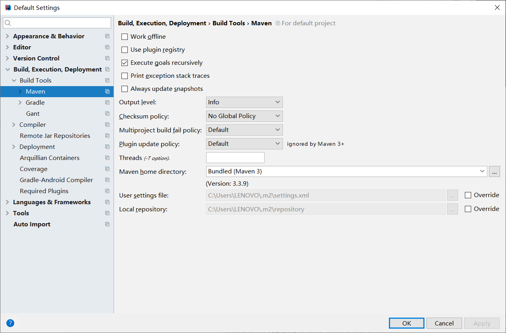

## IDEA配置maven环境

### 一、配置maven本地环境

先参照以下博客进行maven的安装，配置

- [IDEA 如何搭建maven 安装、下载、配置（图文）](https://www.cnblogs.com/xihehua/p/9639045.html)

- [使用IntelliJ IDEA 配置Maven（入门）](https://www.cnblogs.com/telwanggs/p/10820701.html)

maven本地环境配置成功

### 二、IDEA配置maven环境

#### 1、使用IDEA内置maven及默认配置

​		需要修改IDEA内置maven的`setting.xml`文件，更改中央仓库的地址，否则下载jar包会极其的慢。

​		以下是默认的maven配置，其中**.m2这个文件夹**不是自己创建的，是**IDEA在内置maven组件（maven，maven-ext）的基础上**，当我们**创建maven项目或者springboot项目后自动创建**的。默认的仓库也在.m2文件夹中。

​		当我想要修改setting.xml文件，配置新的中央仓库镜像时，发现.m2文件夹下并没有setting.xml文件。我不得不**重写IDEA中maven的默认配置**。

#### 2、使用本地maven	

​		在IDEA中配置maven：修改maven的默认版本，setting.xml的位置，以及本地仓库的位置。注意**如果项目已经创建，default setting对该项目无效，对以后创建的项目有效**，要想该项目使用本地maven，**还需要配置setting**

- **default settings**

  

- **settings**

  

- 当我配置好，点击maven project刷新键之后，会发现这个问题：`Unable to import maven project`，网上说是**IDEA版本低于maven版本的问题**，可以看该博客下的评论https://blog.csdn.net/Certain_/article/details/90745360

  

#### 3、使用内置maven + 本地maven配置文件 + 仓库

记得也把default settings修改了，这样就OK了。

### 三、备注

- 吐槽一下，setting.xml中就已经配置了仓库的位置，即使在IDEA中配置了仓库的位置，maven在部署时还是会将下载的jar包放在setting.xml中指定的仓库中，那为啥还要设置Local repository？

- **IDEA的默认plugins是不能删除的，否则很难下回来**，下面是我的惨痛教训

  - 一开始我打算删掉IDEA的默认maven，验证一下是不是IDEA安装maven，maven-ext后会自动创建这个.m2文件夹

    

  - 当我删除掉maven，maven-ext之后，maven projects找不到了

    

  - 下载插件中显示很多maven的组件，我也不知道下载哪个。只能重新安装IDEA

    

    

