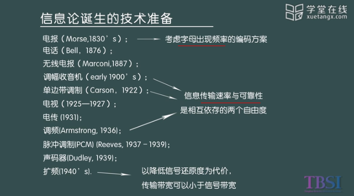
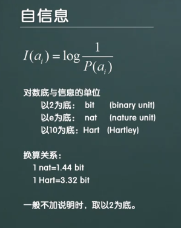
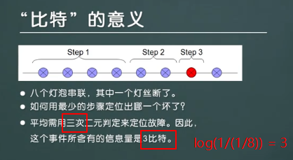
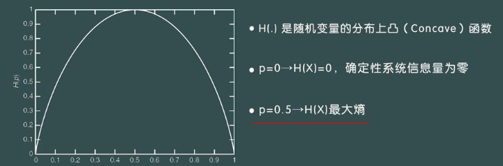

## 应用信息论基础

#### 一、信息论诞生的技术背景

#### 二、信息论贡献

**信息的定义**：在**随机**事件上的选择以及**不确定性**的消除（区分于信源，信道）。我们消除的不确定性越多，能获得的信息量就越大。

**基础性贡献**：

- 信息论给出了信息量的定义
- 信息论给出了通信系统的模型

- 经典信息论为**信源的压缩极限**进行定界（信源编码定律）
- 定义了在一定的信道下，能够通过信道的**最大信息量的极限**（信道编码定律）
- 给出了在允许容忍一定信源失真的情况下，得到**最小码率的极限**。（率失真编码定律）

#### 三、随机事件的自信息

四个基本性质：

- **随机性与概率的关系**。

  概率越高的随机事件提供的自信息就小，**概率越低的随机事件提供的自信息量就越大**（eg：夏天会下雪 -> 小概率，信息量大）。

- **概率为1的事件提供的自信息量为0**，因为没有对不确定性进行消除。
- **概率为0的事件提供的自信息量为无穷大**

- **两个独立随机事件的联合信息量** = 两个随机事件各自的自信息量的算数和。

#### 四、信息熵

##### 1、离散随机变量的信息熵

- **信息熵$H(x)$定义**为：
  $$
  H(X) = -\sum_{x \in X}p(x)log(p(x))
  $$
  这里要注意的是

  - H(.)的综量是**随机变量的分布，而非取值**
  - $0log0 = 0$ ($x \rightarrow 0$时，$xlogx \rightarrow 0$),

- **平均不确定性**，即信息熵为：
  $$
  H(X) = -\sum_{n=1}^Np_nlog(p_n)
  $$

- **伯努利信息熵**：设
  $$
  X=\begin{cases} 1 & 以概率p \\ 0 & 以概率1-p \end{cases}
  $$
  则有：
  $$
  H(x) = plog(\frac{1}{p}) + (1-p)log(\frac{1}{1-p})
  $$
  

##### 2、信息熵的唯一性定理

信息熵函数满足的三个条件

- **连续性**：随机系统中概率分布出现微小变化，信息量不会出现显著的变化
- **等概时的单调增函数特性**：当集合中数据增加，则信息熵函数具有单调增特性。
- **可加性**。

满足上述三个条件的随机变量不确定性度量函数为：
$$
f(p_1,p_2,...,p_N) = -C\sum_{n=1}^{N}p_nlog(p_n)
$$

#### 五、联合熵