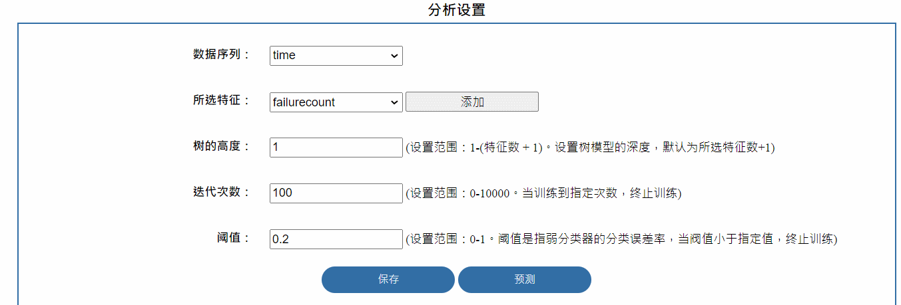

## js知识点积累

#### 1、js如何在jsp中，通过点击事件创建多个表单？

这里主要通过dom对象，用`innerHTML`或`appendChild`来创建多个表单。**但是要注意的是`element.innerHTML`会将`element`原来的代码覆盖，而`appendchild`会在`element`中进行追加**。

参考

- [DOM向HTML中添加元素Failed to execute 'appendChild' on 'Node': parameter 1 is not of type 'Node'问题](https://www.cnblogs.com/cff2121/p/10912718.html)
- [js中appendChild()用法](https://blog.csdn.net/q285661571/article/details/7447762)
- [解决JS 中 innerHTML is not a function](https://blog.csdn.net/qq_43778308/article/details/103290070)

```jsp
...
<div id="selectAdd">
    <div class="parametersetup_title">所选特征：</div>
    <div class="parametersetup_content">
        <div id="bbb">
            <select id="Feature" name="Feature">
                <%--<%	for(int i=1;i<=inputdata.getdimension();i++)--%>
                <%--{%>--%>
                <%--<option value="<%= String.valueOf(i)%>"--%>
                <%--<%if(i==1) %>><%= inputdata.getcolname(i)%>--%>
                <%--</option>--%>
                <%--<%	}%>--%>
            </select>
            <input type="button" value="添加" onclick="add()"/>
        </div>
    </div>
</div>
...
<script type="text/javascript">

	//将java数组转化成json，可和js进行类型转换
    var featureName = <%= featureName%>;  //不知道为啥子不能用el表达式，只能用jsp表达式

    //console.log(featureName)

	//判断"数据序列"选了什么，避免特征选择和数据序列选择重复
	var sequenceId = document.getElementById("Sequence").selectedIndex;
	//console.log((sequenceId))

	innerHTMLStr = "";
	if(sequenceId == 0){
        var k = 0;
        for (var i = 1; i < featureName.length; ++i){
            if(k == 1){
                innerHTMLStr += "<option value =" + (i + 1) + "selected>" +  featureName[i] + "</option>";
			}else{
                innerHTMLStr += "<option value =" + (i + 1) + ">" +  featureName[i] + "</option>";
			}
        }
	}else{
        var k = 0;
        for (var i = 0; i < featureName.length; ++i){
            if(k == 0){
                innerHTMLStr += "<option value =" + (i + 1) + "selected>" +  featureName[i] + "</option>";
            }else if(k != sequenceId){
                innerHTMLStr += "<option value =" + (i + 1) + ">" +  featureName[i] + "</option>";
            }
        }
	}

    document.getElementById("Feature").innerHTML = innerHTMLStr;

    function add(){

        var dom1 = document.createElement('div');
        dom1.className = 'parametersetup_title';
        document.getElementById("selectAdd").appendChild(dom1);

        var dom2 = document.createElement('div');
        dom2.className = 'parametersetup_content';

        var str = "<select>";

        innerHTMLStr = "";
        if(sequenceId == 0){
            var k = 0;
            for (var i = 1; i < featureName.length; ++i){
                if(k == 1){
                    innerHTMLStr += "<option value =" + (i + 1) + "selected>" +  featureName[i] + "</option>";
                }else{
                    innerHTMLStr += "<option value =" + (i + 1) + ">" +  featureName[i] + "</option>";
                }
            }
        }else{
            var k = 0;
            for (var i = 0; i < featureName.length; ++i){
                if(k == 0){
                    innerHTMLStr += "<option value =" + (i + 1) + "selected>" +  featureName[i] + "</option>";
                }else if(k != sequenceId){
                    innerHTMLStr += "<option value =" + (i + 1) + ">" +  featureName[i] + "</option>";
                }
            }
        }

        str += innerHTMLStr + "</select>";
        console.log(str);
        dom2.innerHTML = str;
        document.getElementById("selectAdd").appendChild(dom2);
    }
</script>
```

运行效果：



#### 2、js创建二维数组

参考[JS定义二维数组的三种方法](https://blog.csdn.net/u010743370/article/details/50977005)

#### 3、js用split()切分字符串

js在接收java的JSON数据（假设为arr）时，需要对数据进行**split**，但是直接用会出现问题，需要将arr转成字符串（**toString()**）参考[value.split is not a function 的原因](https://blog.csdn.net/eddy23513/article/details/87100752)