## 微信小程序

详见这里<https://developers.weixin.qq.com/miniprogram/dev/framework/>

### 1、环境准备

#### 1.1 注册账号

<https://mp.weixin.qq.com/cgi-bin/wx?token=&lang=zh_CN>

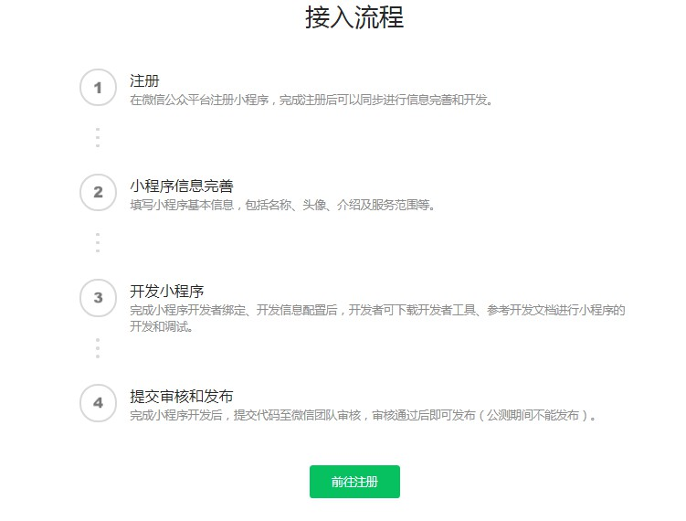

#### 1.2 获取开发者APPID

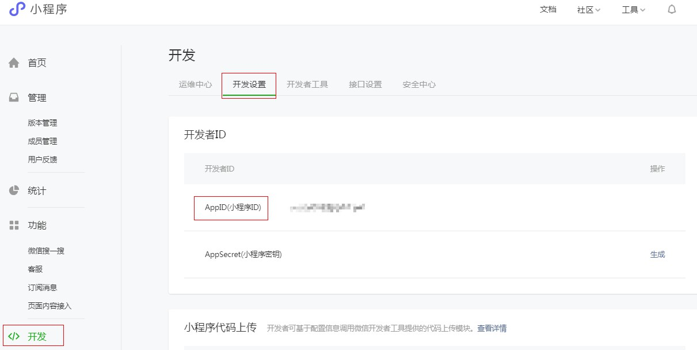

#### 1.3 开发工具

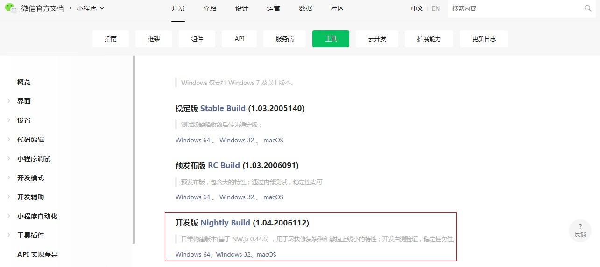

### 2、第一个微信小程序

#### 2.1 新建项目

​	扫码进入微信小程序开发者工具，如果项目无需上线，用测试号即可，无需使用APPID。注意**填写APPID后才可以使用云服务，而测试号不可以**。

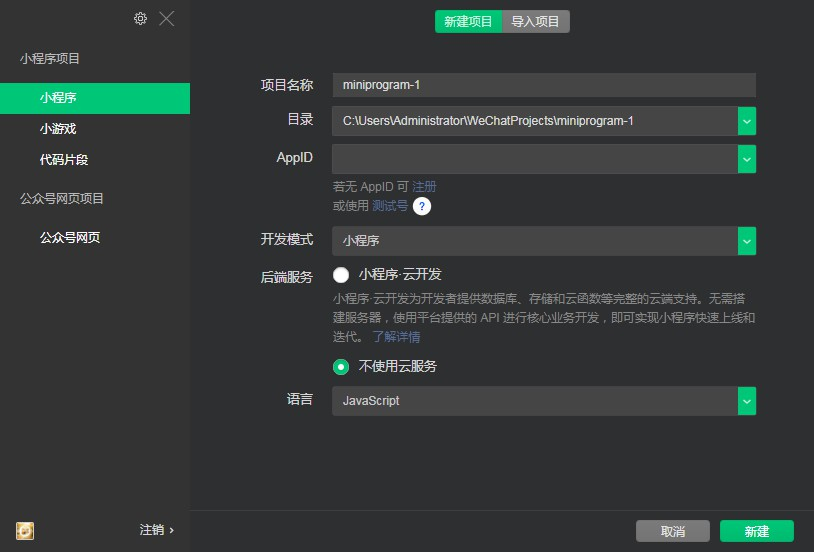

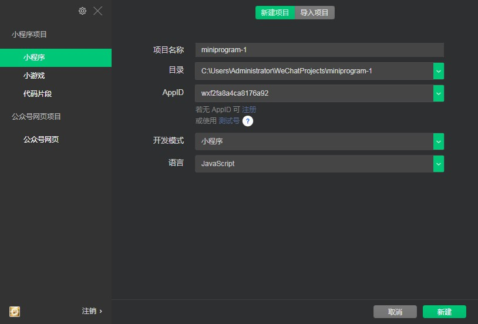

#### 2.2 工具界面

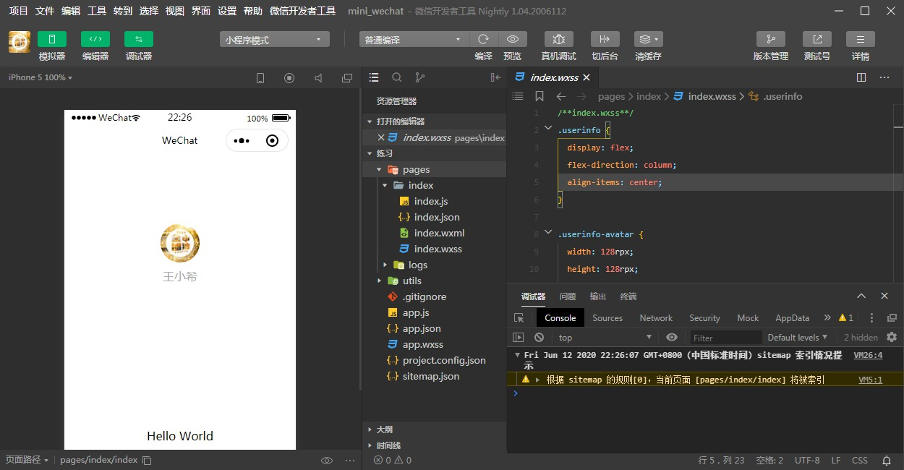

### 3、 小程序结构目录

#### 3.1 结构目录

​		整个小程序框架系统分为两部分：**逻辑层（App Service）和 视图层（View）**。小程序提供了自己的**视图层**描述语言 **`WXML` 和 `WXSS`**，以及基于 **`JavaScript` 的逻辑层框架**，并在视图层与逻辑层间提供了数据传输和事件系统，让开发者能够**专注于数据与逻辑（类似于react，vue）**。

| 结构 | 传统web    | 微信小程序 |
| ---- | ---------- | ---------- |
| 结构 | HTML       | WXML       |
| 样式 | CSS        | WXSS       |
| 逻辑 | Javascript | Javascript |
| 配置 | 无         | JSON       |

​		通过以上对比得出，**传统web是三层结构**，而**微信小程序是四层结构**，多了一层配置json。

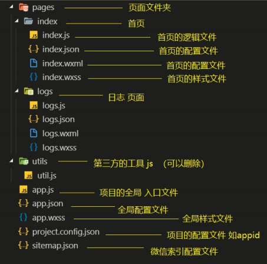

#### 3.2 全局配置app.json

字段的含义

- **pages**：用于描述**当前小程序所有页面路径**，这是为了让微信客户端知道你的小程序页面定义在哪个目录
- **window**：定义小程序所有页面的顶部背景颜色，文字颜色定义等

```json
{
  "pages":[
    "pages/demo1/demo1",
    "pages/index/index",
    "pages/logs/logs"
  ],
  "window":{
    "backgroundTextStyle":"light",
    "navigationBarBackgroundColor": "#0094ff",
    "navigationBarTitleText": "我的应用",
    "navigationBarTextStyle":"black",
    "enablePullDownRefresh": true,
    "backgroundColor":"#0000ff"
  },
  "style": "v2",
  "sitemapLocation": "sitemap.json"
}
```

效果如下：

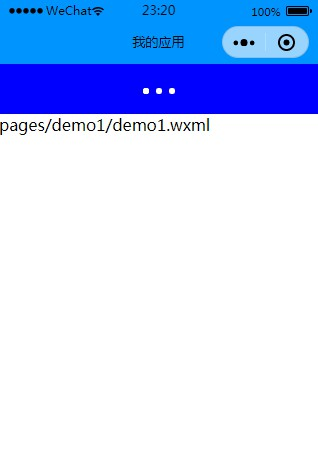

备注：

- 在微信开发者工具中，配置pages页面，工具会可以**自动化创建该页面的文件夹**
- 在微信开发者工具中，pages中的第一个配置的页面，即为**微信小程序的首页**
- pages，window中其他属性请见这里<https://developers.weixin.qq.com/miniprogram/dev/reference/configuration/app.html>

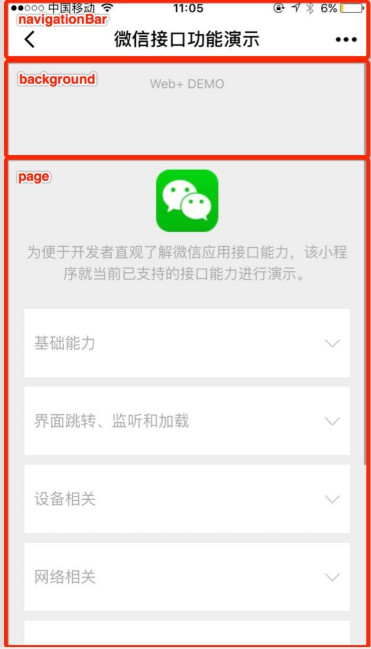

##### 3.2.1 tabBar

​		如果小程序是一个多 tab 应用（客户端窗口的**底部或顶部有 tab 栏可以切换页面**），可以通过 tabBar 配置项指定 tab 栏的表现，以及 tab 切换时显示的对应页面。

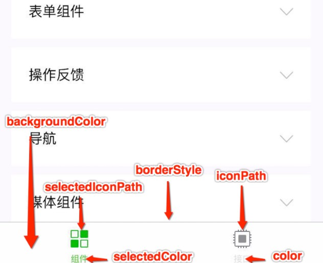

​		其中 list 接受一个数组，**只能配置最少 2 个、最多 5 个 tab**。tab 按数组的顺序排序，每个项都是一个对象，其属性值如下：

| 属性             | 类型   | 必填 | 说明                                                         |
| :--------------- | :----- | :--- | :----------------------------------------------------------- |
| pagePath         | string | 是   | 页面路径，必须在 pages 中先定义                              |
| text             | string | 是   | tab 上按钮文字                                               |
| iconPath         | string | 否   | 图片路径，icon 大小限制为 40kb，建议尺寸为 81px * 81px，不支持网络图片。 **当 `position` 为 `top` 时，不显示 icon。** |
| selectedIconPath | string | 否   | 选中时的图片路径，icon 大小限制为 40kb，建议尺寸为 81px * 81px，不支持网络图片。 **当 `position` 为 `top` 时，不显示 icon。** |

```json
{
  "pages":[
    "pages/index/index",
    "pages/home/home",
    "pages/img/img",
    "pages/mine/mine",
    "pages/search/search",
    "pages/logs/logs",
    "pages/demo1/demo1"
  ],
  "window":{
    "backgroundTextStyle":"light",
    "navigationBarBackgroundColor": "#0094ff",
    "navigationBarTitleText": "我的应用",
    "navigationBarTextStyle":"black",
    "enablePullDownRefresh": true,
    "backgroundColor":"#0000ff"
  },
  "tabBar": {
    "list": [
      {
        //注意第一个pagePath是首页的路径，及首页的默认点击效果，如果填写pages/home/home，会显示不了tabBar
        "pagePath": "pages/index/index",
        "text": "首页",
        "iconPath": "icon/_home.png",
        "selectedIconPath": "icon/home.png"
       },
     {
      "pagePath":"pages/img/img",
      "text":"图片",
      "iconPath":"icon/_img.png",
      "selectedIconPath":"icon/img.png"
    },
    {
      "pagePath": "pages/mine/mine",
      "text": "我的",
      "iconPath": "icon/_my.png",
      "selectedIconPath": "icon/my.png"
    },
    {
      "pagePath": "pages/search/search",
      "text": "搜索",
      "iconPath": "icon/_search.png",
      "selectedIconPath": "icon/search.png"
    }
  ]
  },
  "style": "v2",
  "sitemapLocation": "sitemap.json"
}
```


备注：

- 注意**第一个pagePath是首页的路径**，及首页的默认点击效果，如果**填写pages/home/home，会显示不了tabBar**。

  参考<https://blog.csdn.net/ktucms/article/details/80727455>

- **position属性可以设置tabBar的位置**：bottom/top，若改为top

  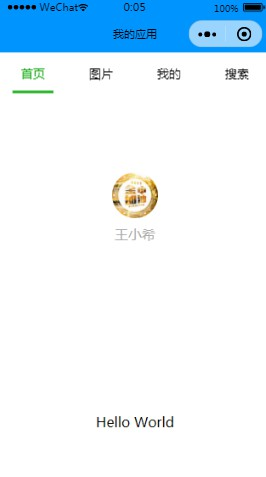

#### 3.3 页面配置

​	**每一个小程序页面也可以使用 `.json` 文件**来对本页面的窗口表现进行配置。页面中配置项在当前页面会覆盖 `app.json` 的 `window` 中相同的配置项。

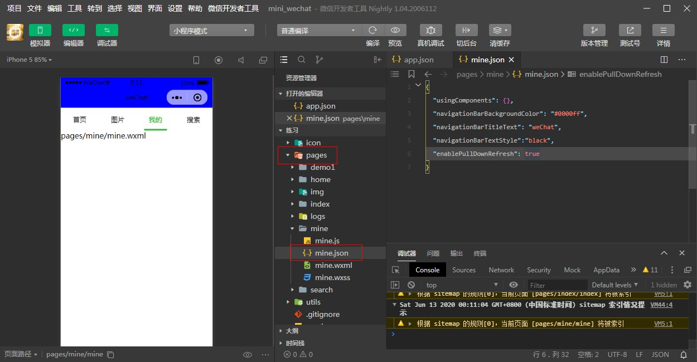

#### 3.4 sitemap配置

​		微信现已开放小程序内搜索，开发者可以通过 `sitemap.json` 配置，或者管理后台页面收录开关来配置其小程序页面是否允许微信索引。当开发者**允许微信索引**时，微信会通过爬虫的形式，**为小程序的页面内容建立索引**。**当用户的搜索词条触发该索引时，小程序的页面将可能展示在搜索结果中**。<https://developers.weixin.qq.com/miniprogram/dev/reference/configuration/sitemap.html>

备注

- 在项目发布时才会配置该文件