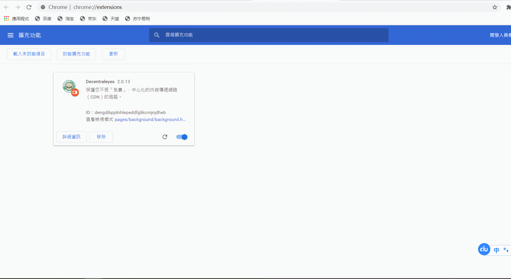

### 解决stack overflow访问慢的问题

#### 一、主要问题

​		网上说，浏览stack overflow时，浏览器请求**google的jquery库**，导致耗时长

#### 二、解决方法

​		在chrome中**安装插件Decentraleyes**，使其**访问本地的jquery**。但是我的chrome无法科学上网，**无法安装插件**，所以需要借助这个网站<https://www.gugeapps.net/>，输入要安装的插件即可。

如果不知道如何在chrome中安装本地解压的插件，可见这里[Google Chrome浏览器如何安装插件应用](https://www.gugeapps.net/doc/archives/92)

​		我的stack overflow无比流畅了

#### 三、参考文档

1、[stack overflow访问缓慢解决办法](https://zhuanlan.zhihu.com/p/97579389)

2、[Chrome插件下载不了怎么办？](https://www.zhihu.com/question/26078369/answer/32062616)

3、[Google Chrome浏览器如何安装插件应用](https://www.gugeapps.net/doc/archives/92)