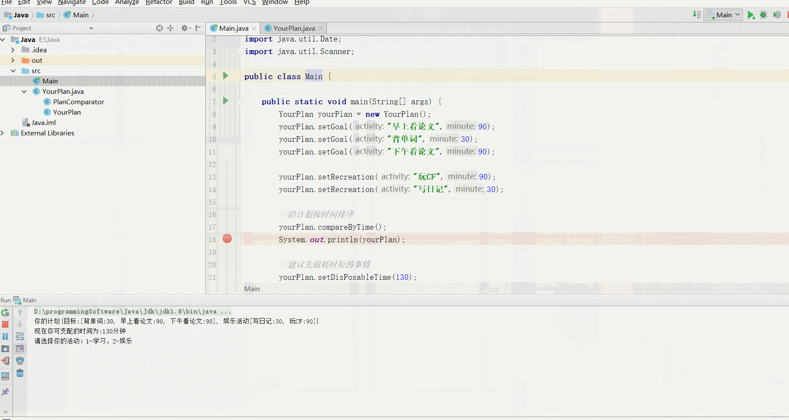

## 计划管家娱乐版1.0

#### 1、初衷：

你是否有选择困难的经历，反正对于我来说，我在选择面前焦虑大于选择，对于一些不太重要的选择，比如日常规划，娱乐活动等，我也会有选择困难。所以对于不太重要的选择，或者说同等重要的选择，我打算用程序来自动帮我做出选择。我打算一步步完善我的计划，迭代我的程序，让程序更加智能。

#### 2、计划管家娱乐版1.0的功能：

- 活动计划分成两个部分：**学习目标 & 娱乐活动**
- 在主方法中输入学习目标（或娱乐活动），格式如下(字符串）：**activity:minute**，例如 "背单词:30"，”写日记:30“
- 在主方法中输入自己当前**可以支配的连续时间段（单位为minute）**
- 系统内部功能：
  - 系统先将学习目标（或娱乐活动）按照活动的**耗费时长**对其进行**排序**。
  - 根据用户提供的可支配的连续时间段，类比0-1背包问题，系统会给用户提供**1个或多个建议**，**这些建议可以让用户在这个时间段内尽可能多的完成任务**。

#### 3、效果



#### 4、核心代码

##### 1）YourPlan类

```java
public class YourPlan {

    private int goalsNum; //目标个数
    private int recreationsNum; //娱乐活动个数
    private int disPosableTime; //可以支配的一连串时间

    private List<String> goals; //目标列表，值为类键值对"事情:耗时"
    private List<String> recreations; //娱乐活动列表，值为类键值对"事情:耗时"

    //初始化目标和娱乐活动
    public YourPlan() {
        this.goals = new LinkedList<>();
        this.recreations = new LinkedList<>();
        this.goalsNum = 0;
        this.recreationsNum = 0;
    }

    //添加目标
    public void setGoal(String activity,int minute){
        String goal = activity + ":" + minute;
        goals.add(goal);
        this.goalsNum = goals.size();
    }

    //添加娱乐活动
    public void setRecreation(String activity,int minute){
        String recreation = activity + ":" + minute;
        recreations.add(recreation);
        this.recreationsNum = recreations.size();
    }

    public void setDisPosableTime(int disPosableTime) {
        this.disPosableTime = disPosableTime;
    }

    public int getDisPosableTime() {
        return disPosableTime;
    }

    //对计划按时间进行排序
    public void compareByTime() {
        Comparator ct = new PlanComparator();
        Collections.sort(this.goals,ct);
        Collections.sort(this.recreations,ct);
    }

    //给出你的目标建议(0,1背包问题）
    public void goalsAdvice() {

        int length = disPosableTime/10; //根据disPosableTime确定列数
        int [][]dp = new int[goals.size() + 1][length + 1];  //dp表
        String [][]path = new String[goals.size() + 1][length + 1];  //path表记录当前状态所选物品

        //初始化dp第一行，代表时间间隔
        int j = 0;
        for(int i = 0; i <= this.getDisPosableTime(); i += 10){
            dp[0][j++] = i;
        }

        //提取goals里面的时间到新的数组中，第一个元素为0
        int goalsTemp[] = new int[goals.size() + 1];
        for (int i = 0; i < goals.size(); ++i) {
            goalsTemp[i + 1] = Integer.valueOf(goals.get(i).split(":")[1]); //下标从1开始
        }

        //初始化dp第二行，表示执行第一个计划
        for (j = 1; j < dp[0].length; j++) {
            if(goalsTemp[1] <= dp[0][j]) {
                dp[1][j] = goalsTemp[1];
                path[1][j] = "1-";
            }
            else{
                dp[1][j] = 0;
            }
        }

        //状态转移方程（正在考虑是否加入第i个计划）,goalsTemp[i]为第i个计划所耗费时间
        // if(j * 10 - goalsTemp[i] >= 0){dp[i][j] = dp[i - 1][(j * 10 - goalsTemp[i])/10] + goalsTemp[i])}
        // else{dp[i][j] = dp[i-1][j]}
        for(int i = 2; i <= goals.size(); ++i){
            for(j = 2; j < dp[0].length; ++j){

                int temp = j * 10 - goalsTemp[i]; //通过时间间距变换得到坐标

                if(temp >= 0){
                    dp[i][j] = dp[i - 1][temp/10] + goalsTemp[i];
                    path[i][j] = path[i - 1][temp/10] + i + "-";
                }else{
                    dp[i][j] = dp[i-1][j];
                    path[i][j] = path[i-1][j];
                }
            }
        }

        //打印dp表
//        for(int i = 0; i <= goals.size(); ++i){
//            if(i > 0){
//                System.out.print(goals.get(i - 1) + "分钟--");
//            }else{
//                System.out.print("时间间隔--");
//            }
//            for(j = 0; j < dp[0].length; ++j){
//                System.out.print(dp[i][j] + " ");
//            }
//            System.out.println();
//        }

        //通过dp表查看要执行的计划
        Set<String> activities = getActivities(path, dp);

        //存储多条建议
        List<String> advices = new ArrayList<>();

        j = 1;
        for (String activity: activities) {
            String[] split = activity.split("-");
            String advice = "建议" + (j++) + ":";
            for (int i = 0; i < split.length; i++) {
                advice += goals.get(Integer.valueOf(split[i])-1) + "分钟，";
            }
            advices.add(advice);
        }

        System.out.println(advices);
    }

    //给出你的娱乐活动建议(0,1背包问题）
    public void recreationsAdvice() {

        int length = disPosableTime/10; //根据disPosableTime确定列数
        int [][]dp = new int[recreations.size() + 1][length + 1];  //dp表
        String [][]path = new String[recreations.size() + 1][length + 1];  //path表记录当前状态所选物品

        //初始化dp第一行，代表时间间隔
        int j = 0;
        for(int i = 0; i <= this.getDisPosableTime(); i += 10){
            dp[0][j++] = i;
        }

        //提取recreations里面的时间到新的数组中，第一个元素为0
        int recreationsTemp[] = new int[recreations.size() + 1];
        for (int i = 0; i < recreations.size(); ++i) {
            recreationsTemp[i + 1] = Integer.valueOf(recreations.get(i).split(":")[1]); //下标从1开始
        }

        //初始化dp第二行，表示执行第一个计划
        for (j = 1; j < dp[0].length; j++) {
            if(recreationsTemp[1] <= dp[0][j]) {
                dp[1][j] = recreationsTemp[1];
                path[1][j] = "1-";
            }
            else{
                dp[1][j] = 0;
            }
        }

        //状态转移方程（正在考虑是否加入第i个计划）,recreationsTemp[i]为第i个计划所耗费时间
        // if(j * 10 - recreationsTemp[i] >= 10){dp[i][j] = dp[i - 1][(j * 10 - recreationsTemp[i])/10] + recreationsTemp[i])}
        // else{dp[i][j] = dp[i-1][j]}
        for(int i = 2; i <= recreations.size(); ++i){
            for(j = 2; j < dp[0].length; ++j){

                int temp = j * 10 - recreationsTemp[i]; //通过时间间距变换得到坐标

                if(temp >= 0){
                    dp[i][j] = dp[i - 1][temp/10] + recreationsTemp[i];
                    path[i][j] = path[i - 1][temp/10] + i + "-";
                }else{
                    dp[i][j] = dp[i-1][j];
                    path[i][j] = path[i-1][j];
                }
            }
        }

        //打印dp表
//        for(int i = 0; i <= recreations.size(); ++i){
//            if(i > 0){
//                System.out.print(recreations.get(i - 1) + "分钟--");
//            }else{
//                System.out.print("时间间隔--");
//            }
//            for(j = 0; j < dp[0].length; ++j){
//                System.out.print(dp[i][j] + " ");
//            }
//            System.out.println();
//        }

        //通过dp表查看要执行的计划
        Set<String> activities = getActivities(path, dp);

        //存储多条建议
        List<String> advices = new ArrayList<>();

        j = 1;
        for (String activity: activities) {
            String[] split = activity.split("-");
            String advice = "建议" + (j++) + ":";
            for (int i = 0; i < split.length; i++) {
                advice += recreations.get(Integer.valueOf(split[i])-1) + "分钟，";
            }
            advices.add(advice);
        }

        System.out.println(advices);
    }

    //通过path表查看活动计划
    public Set getActivities(String[][] path, int[][]dp){

        //打印path表
//        for(int i = 0; i < path.length; ++i){
//            for(int j = 0; j < path[0].length; ++j){
//                System.out.print(path[i][j] + " ");
//            }
//            System.out.println();
//        }

        int max = dp[dp.length - 1][dp[0].length - 1];

        //找出周围的max，即为多种方案
        Set<String> activities = new HashSet<>();
        for(int i = dp.length - 1; i >= dp.length - 2; --i){
            for(int j = dp[0].length - 1; j >= dp[0].length - 2; --j){
                if(max == dp[i][j]){
                    //去掉path中字符串存在的"null"
                    activities.add(path[i][j].replace("null",""));
                }
            }
        }

//        System.out.println(activities);
        return activities;
    }

    @Override
    public String toString() {
        return "你的计划{" +
                "目标:" + goals +
                ", 娱乐活动" + recreations +
                '}';
    }
}
```

##### 2）PlanComparator活动排序器

```java
class PlanComparator implements Comparator<String>{

    @Override
    public int compare(String o1, String o2) {
        String time1 = o1.split(":")[1];
        String time2 = o2.split(":")[1];
        return time1.compareTo(time2);
    }
}
```


