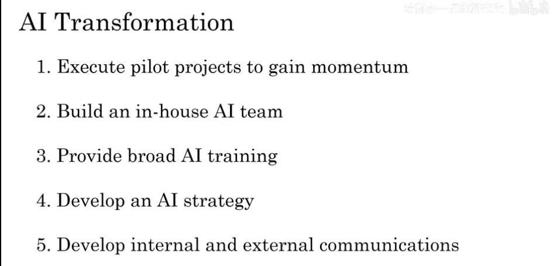
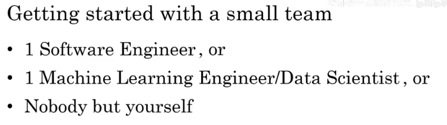
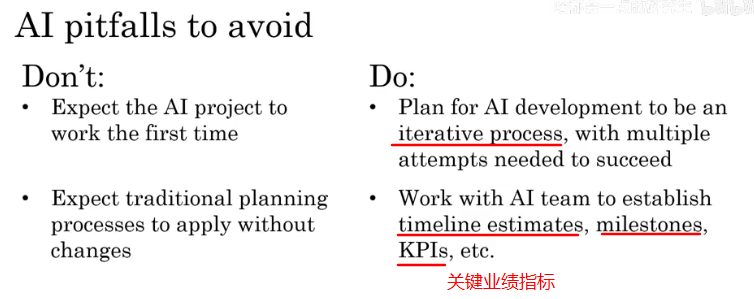
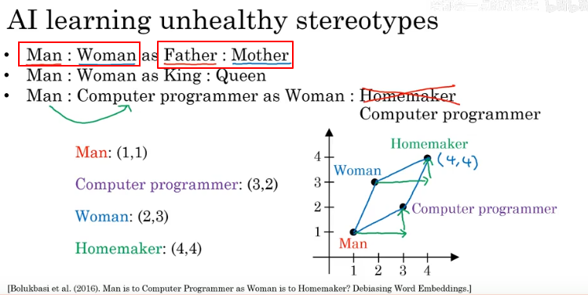

## 对现阶段AI技术的基本认识

### 一、What is AI

​		AI ：ANI（artificial narrow intelligence，弱人工智能 self-driving car）AGI（artificial general intelligence 强人工智能 Do anything a human can do）

#### 1、What is machine learning

​		machine learning：**input(A) -> output(B)**

#### 2、What is data?

**Acquiring data：**

**Data is messy：**

#### 3、The terminology of AI

**Machine learning & Data Science**

#### 4、What make an AI company

**tasks which AI company should have.**

**AI transformation（AI转型手册）**

#### 5、What machine learning today can and cannot do

​		为了增强自己或团队的直觉，判断是否是机器学习问题，做出可行性分析。

##### 5.1 Strengths and weaknesses of machine learning

##### 5.2、What is neural network

**预测需求**

**face recognition**

### 二、Building AI Project

#### 1、workflow of machine learning project

#### 2、workflow of data science project

#### 3、the different workflow between data science and machine learning.

#### 4、How to choose an worthy AI project

#### 5、Due Diligence on project.

**Due Diligence：**

**Buy or Build：**

#### 6、technical tools for AI

### 三、Building AI in your Company

#### 1、case1：smart speaker

#### 2、case2：self-drivering car

#### 3、example roles of AI company

#### 4、AI transformation PlayBook

**转型AI公司手册**（主要给CEO看的）下载链接<https://landing.ai/ai-transformation-playbook/>

##### 4.1 Execute Pilot projects to gain momentum

##### 4.2 Build an in-house AI team

##### 4.3 provide broad AI training

##### 4.4 Develop an AI strategy

##### 4.5  Develop internal and external communication

#### 5、AI pitfalls to awoid

#### 6、Some initial steps you can take

#### 7、AI in professional field

##### 7.1 Computer Vision

##### 7.2  Natural Language Processing

##### 7.3 Robotics

#### 8、Survey of major AI techniques

##### 8.1 Unsupervised learning

##### 8.2 Trasfer learning

##### 8.3 Reinforcement learning

##### 8.4 GANS （Generative Adversarial Network）

生成对抗网络（无中生有，制造新内容）

##### 8.5 Knowledge Graph

​	知识图谱对建立数据库很重要

### 四、AI and Society

#### 1、realistic view of AI 

AI and Hype（大肆宣传）

#### 2、Limitations of AI

##### 2.1  The reasoning and anology of AI is biased

##### 2.2 Why bias matters

为什么偏差问题这么重要

##### 2.3 Combating bias

​	减少AI的偏见比减少人类的偏见更加简单

#### 3、 Adversarial attacks on AI

对抗性攻击

计算机和人看图片的方式是不同的，有些图片稍加修改就可以愚弄AI

对抗性防御

#### 4、Adverse use of AI

#### 5、How developing economies can build AI

现在AI发展还是不成熟

用AI来加强国家的垂直行业

#### 6、AI and jobs

### 总结

<https://www.bilibili.com/video/BV1gE411M7Eg?p=35>

备注：

- 该课程主要是以**工程化的思想**（任务流程分工）来向我们介绍AI技术。让我了解到
  - AI是什么（ANI,AGI），数据是什么（结构化，非结构化的数据）
  - machine learning的大致过程是什么（其实就是一个算法，输入和输出的映射）
  - AI中的术语（神经网络：多个输入通过神经元建立联系）
  - AI实际上能做和不能做的事
  - AI公司的构成
  - AI项目如何立项（技术评估：是否可行，商业价值评估）
  - 机器学习和数据科学的工作流程比较。
- 而且从AI和**社会的角度**，让我重新用理性态度去认识AI
  - 认识到**AI系统的局限性**：在推理类比上是存在偏见的（也许会存在对一部分人的歧视）
  - AI与安全
  - AI与经济发展
  - AI与未来职位变化