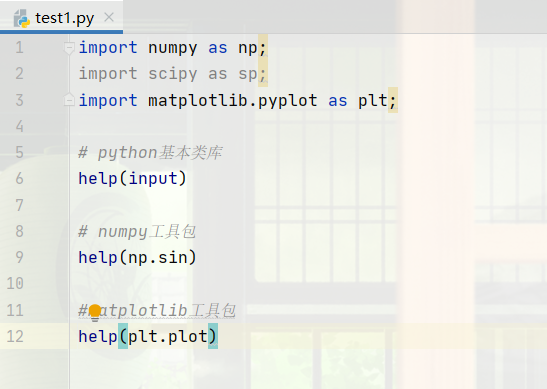
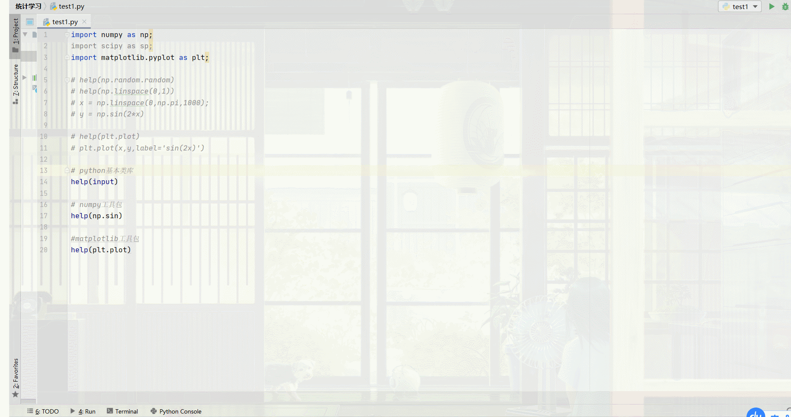
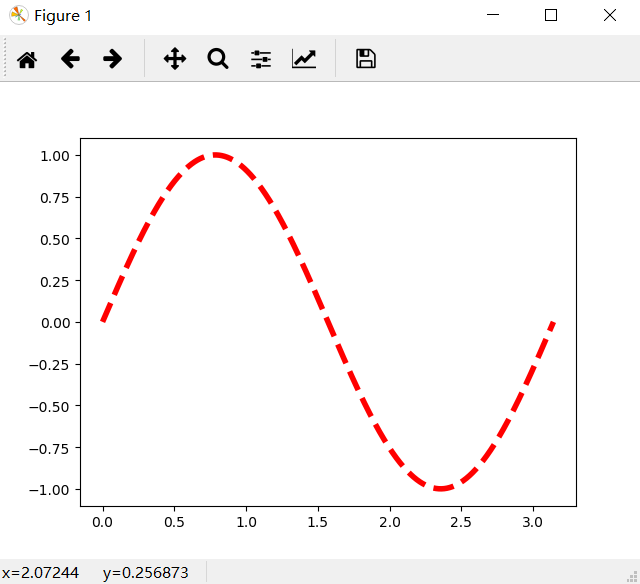

### python学习必备技巧（待更新）

#### 一、用help()查看python + 工具包的API

​		最近开始自学python，但是网上好像找不到类似java API的开发文档。在困惑之际，发现了python里的help函数，解决了我的燃眉之急。

​		无论是python的基本类库，或者是工具包中类，使用`help()`可查看API的使用。而且还会提供**API的使用小例子**





注意help方法的使用，**填入方法名即可，不能加"()"**。

```python
class _Helper(builtins.object)
 |  Define the builtin 'help'.
 |  
 |  This is a wrapper around pydoc.help that provides a helpful message
 |  when 'help' is typed at the Python interactive prompt.
 |  
 |  Calling help() at the Python prompt starts an interactive help session.
 |  Calling help(thing) prints help for the python object 'thing'.
 |  
 |  Methods defined here:
 |  
 |  __call__(self, *args, **kwds)
 |      Call self as a function.
 |  
 |  __repr__(self)
 |      Return repr(self).
 |  
 |  ----------------------------------------------------------------------
 |  Data descriptors defined here:
 |  
 |  __dict__
 |      dictionary for instance variables (if defined)
 |  
 |  __weakref__
 |      list of weak references to the object (if defined)
```

#### 二、如何阅读函数参数

##### 1、函数参数中*args, **kwargs表示什么

​		`*args`表示在调用该函数时，可以一次性**传入多个参数（允许不同数据类型）**，函数会将多个参数**转化为元组**的形式

​       `**kwargs`表示在调用该函数时，可以一次性传入**多个键值对形式的参数**，格式是**参数名=数据类型**，函数会将多个键值对**转化成字典**的形式。

​		备注：函数调用时注意**不是使用元组/字典进行传参**

```python
def testArgs(*args):
    print("输出元组:",args)

def testKwargs(**kwargs):
    print("输出字典:",kwargs)

#正确传参
testArgs(1,2,[1,2,3])
testKwargs(name="wangxiaoxi",gender="male",tuple=(1,2,3))

#错误传参
# testArgs((1,2,3))
# testKwargs({"name":"wangxiaoxi","gender":"male"})
---
输出结果
输出元组: (1, 2, [1, 2, 3])
输出字典: {'name': 'wangxiaoxi', 'gender': 'male', 'tuple': (1,2,3)}
```

##### 2、如何查看默认参数描述

​		以`matplotlib.pyplot.plot`为例，参数为*args, **kwargs，你怎么知道要传入什么参数合适？用`help()`查文档

```python
plot(*args, **kwargs)
    Plot y versus x as lines and/or markers.
    
    Call signatures::
    
        plot([x], y, [fmt], data=None, **kwargs)
        plot([x], y, [fmt], [x2], y2, [fmt2], ..., **kwargs)
    
    The coordinates of the points or line nodes are given by *x*, *y*.
    
    The optional parameter *fmt* is a convenient way for defining basic
    formatting like color, marker and linestyle. It's a shortcut string
    notation described in the *Notes* section below.
    
    >>> plot(x, y)        # plot x and y using default line style and color
    >>> plot(x, y, 'bo')  # plot x and y using blue circle markers
    >>> plot(y)           # plot y using x as index array 0..N-1
    >>> plot(y, 'r+')     # ditto, but with red plusses
    
    You can use `.Line2D` properties as keyword arguments for more
    control on the  appearance. Line properties and *fmt* can be mixed.
    The following two calls yield identical results:
    
    >>> plot(x, y, 'go--', linewidth=2, markersize=12)
    >>> plot(x, y, color='green', marker='o', linestyle='dashed',
            linewidth=2, markersize=12)
    
    When conflicting with *fmt*, keyword arguments take precedence.
    
    **Plotting labelled data**
    
    There's a convenient way for plotting objects with labelled data (i.e.
    data that can be accessed by index ``obj['y']``). Instead of giving
    the data in *x* and *y*, you can provide the object in the *data*
    parameter and just give the labels for *x* and *y*::
    
    >>> plot('xlabel', 'ylabel', data=obj)
    
    All indexable objects are supported. This could e.g. be a `dict`, a
    `pandas.DataFame` or a structured numpy array.
    
    
    **Plotting multiple sets of data**
    
    There are various ways to plot multiple sets of data.
    
    - The most straight forward way is just to call `plot` multiple times.
      Example:
    
      >>> plot(x1, y1, 'bo')
      >>> plot(x2, y2, 'go')
    
    - Alternatively, if your data is already a 2d array, you can pass it
      directly to *x*, *y*. A separate data set will be drawn for every
      column.
    
      Example: an array ``a`` where the first column represents the *x*
      values and the other columns are the *y* columns::
    
      >>> plot(a[0], a[1:])
    
    - The third way is to specify multiple sets of *[x]*, *y*, *[fmt]*
      groups::
    
      >>> plot(x1, y1, 'g^', x2, y2, 'g-')
    
      In this case, any additional keyword argument applies to all
      datasets. Also this syntax cannot be combined with the *data*
      parameter.
    
    By default, each line is assigned a different style specified by a
    'style cycle'. The *fmt* and line property parameters are only
    necessary if you want explicit deviations from these defaults.
    Alternatively, you can also change the style cycle using the
    'axes.prop_cycle' rcParam.
    
    Parameters
    ----------
    x, y : array-like or scalar
        The horizontal / vertical coordinates of the data points.
        *x* values are optional. If not given, they default to
        ``[0, ..., N-1]``.
    
        Commonly, these parameters are arrays of length N. However,
        scalars are supported as well (equivalent to an array with
        constant value).
    
        The parameters can also be 2-dimensional. Then, the columns
        represent separate data sets.
    
    fmt : str, optional
        A format string, e.g. 'ro' for red circles. See the *Notes*
        section for a full description of the format strings.
    
        Format strings are just an abbreviation for quickly setting
        basic line properties. All of these and more can also be
        controlled by keyword arguments.
    
    data : indexable object, optional
        An object with labelled data. If given, provide the label names to
        plot in *x* and *y*.
    
        .. note::
            Technically there's a slight ambiguity in calls where the
            second label is a valid *fmt*. `plot('n', 'o', data=obj)`
            could be `plt(x, y)` or `plt(y, fmt)`. In such cases,
            the former interpretation is chosen, but a warning is issued.
            You may suppress the warning by adding an empty format string
            `plot('n', 'o', '', data=obj)`.
    
    
    Other Parameters
    ----------------
    scalex, scaley : bool, optional, default: True
        These parameters determined if the view limits are adapted to
        the data limits. The values are passed on to `autoscale_view`.
    
    **kwargs : `.Line2D` properties, optional
        *kwargs* are used to specify properties like a line label (for
        auto legends), linewidth, antialiasing, marker face color.
        Example::
    
        >>> plot([1,2,3], [1,2,3], 'go-', label='line 1', linewidth=2)
        >>> plot([1,2,3], [1,4,9], 'rs',  label='line 2')
    
        If you make multiple lines with one plot command, the kwargs
        apply to all those lines.
    
        Here is a list of available `.Line2D` properties:
    
          agg_filter: a filter function, which takes a (m, n, 3) float array and a dpi value, and returns a (m, n, 3) array 
      alpha: float (0.0 transparent through 1.0 opaque) 
      animated: bool 
      antialiased or aa: bool 
      clip_box: a `.Bbox` instance 
      clip_on: bool 
      clip_path: [(`~matplotlib.path.Path`, `.Transform`) | `.Patch` | None] 
      color or c: any matplotlib color 
      contains: a callable function 
      dash_capstyle: ['butt' | 'round' | 'projecting'] 
      dash_joinstyle: ['miter' | 'round' | 'bevel'] 
      dashes: sequence of on/off ink in points 
      drawstyle: ['default' | 'steps' | 'steps-pre' | 'steps-mid' | 'steps-post'] 
      figure: a `.Figure` instance 
      fillstyle: ['full' | 'left' | 'right' | 'bottom' | 'top' | 'none'] 
      gid: an id string 
      label: object 
      linestyle or ls: ['solid' | 'dashed', 'dashdot', 'dotted' | (offset, on-off-dash-seq) | ``'-'`` | ``'--'`` | ``'-.'`` | ``':'`` | ``'None'`` | ``' '`` | ``''``]
      linewidth or lw: float value in points 
      marker: :mod:`A valid marker style <matplotlib.markers>`
      markeredgecolor or mec: any matplotlib color 
      markeredgewidth or mew: float value in points 
      markerfacecolor or mfc: any matplotlib color 
      markerfacecoloralt or mfcalt: any matplotlib color 
      markersize or ms: float 
      markevery: [None | int | length-2 tuple of int | slice | list/array of int | float | length-2 tuple of float]
      path_effects: `.AbstractPathEffect` 
      picker: float distance in points or callable pick function ``fn(artist, event)`` 
      pickradius: float distance in points
      rasterized: bool or None 
      sketch_params: (scale: float, length: float, randomness: float) 
      snap: bool or None 
      solid_capstyle: ['butt' | 'round' |  'projecting'] 
      solid_joinstyle: ['miter' | 'round' | 'bevel'] 
      transform: a :class:`matplotlib.transforms.Transform` instance 
      url: a url string 
      visible: bool 
      xdata: 1D array 
      ydata: 1D array 
      zorder: float 
    
    Returns
    -------
    lines
        A list of `.Line2D` objects representing the plotted data.
    
    
    See Also
    --------
    scatter : XY scatter plot with markers of variing size and/or color (
        sometimes also called bubble chart).
    
    
    Notes
    -----
    **Format Strings**
    
    A format string consists of a part for color, marker and line::
    
        fmt = '[color][marker][line]'
    
    Each of them is optional. If not provided, the value from the style
    cycle is used. Exception: If ``line`` is given, but no ``marker``,
    the data will be a line without markers.
    
    **Colors**
    
    The following color abbreviations are supported:
    
    =============    ===============================
    character        color
    =============    ===============================
    ``'b'``          blue
    ``'g'``          green
    ``'r'``          red
    ``'c'``          cyan
    ``'m'``          magenta
    ``'y'``          yellow
    ``'k'``          black
    ``'w'``          white
    =============    ===============================
    
    If the color is the only part of the format string, you can
    additionally use any  `matplotlib.colors` spec, e.g. full names
    (``'green'``) or hex strings (``'#008000'``).
    
    **Markers**
    
    =============    ===============================
    character        description
    =============    ===============================
    ``'.'``          point marker
    ``','``          pixel marker
    ``'o'``          circle marker
    ``'v'``          triangle_down marker
    ``'^'``          triangle_up marker
    ``'<'``          triangle_left marker
    ``'>'``          triangle_right marker
    ``'1'``          tri_down marker
    ``'2'``          tri_up marker
    ``'3'``          tri_left marker
    ``'4'``          tri_right marker
    ``'s'``          square marker
    ``'p'``          pentagon marker
    ``'*'``          star marker
    ``'h'``          hexagon1 marker
    ``'H'``          hexagon2 marker
    ``'+'``          plus marker
    ``'x'``          x marker
    ``'D'``          diamond marker
    ``'d'``          thin_diamond marker
    ``'|'``          vline marker
    ``'_'``          hline marker
    =============    ===============================
    
    **Line Styles**
    
    =============    ===============================
    character        description
    =============    ===============================
    ``'-'``          solid line style
    ``'--'``         dashed line style
    ``'-.'``         dash-dot line style
    ``':'``          dotted line style
    =============    ===============================
    
    Example format strings::
    
        'b'    # blue markers with default shape
        'ro'   # red circles
        'g-'   # green solid line
        '--'   # dashed line with default color
        'k^:'  # black triangle_up markers connected by a dotted line
    
    .. note::
        In addition to the above described arguments, this function can take a
        **data** keyword argument. If such a **data** argument is given, the
        following arguments are replaced by **data[<arg>]**:
    
        * All arguments with the following names: 'x', 'y'.

```

接下来就尽情传参吧！参数不知道怎么使用的，上网查即可

```python
x = np.linspace(0,np.pi,1000);
y = np.sin(2*x)

plt.plot(x,y,label='sin(2x)',color="r",ls='dashed', lw=4.0)
plt.show()
```



#### 三、参考文档

1、[python学习（一）---基础知识（安装、pycharm、API查询、常见问题）](https://blog.csdn.net/xiake001/article/details/77542129)

2、[python函数参数中令人看不懂的*，**表示什么？](https://blog.csdn.net/qq_37887537/article/details/79700016)