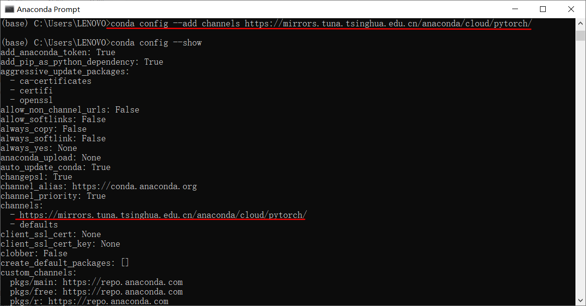

## 【1】在window+Anaconda环境下安装pytorch

### 一、安装Anaconda

​		官网给出的是python3.7版本的Anaconda，如果想安装python3.6的，可以浏览这里：<https://repo.anaconda.com/archive/>，里面有其他版本的anaconda。

​		注意Anaconda有Anaconda2，Anaconda3的区别，分别对应python2，python3。这里我们安装[Anaconda3-5.2.0-Windows-x86_64.exe](https://repo.anaconda.com/archive/Anaconda3-5.2.0-Windows-x86_64.exe)。

​		安装过程中，可以自定义安装路径，其他的next即可，anaconda安装好后，可以跳过vscode的安装。

### 二、安装pytorch

[Getting started with Anaconda](https://docs.anaconda.com/anaconda/user-guide/getting-started/)

#### 1、建立Pytorch Anaconda虚拟环境

- 打开*Anaconda prompt*，输入命令：`conda create -n pytorch python=3.6`，输入y，对pytorch进行安装。

  

  - conda create命令参数：**-n, --name**表示环境的名字。conda的命令参数详见 <https://conda.io/projects/conda/en/latest/commands/create.html#Named%20Arguments>

  - conda和pip的区别：conda可以让你同时管理安装处理有关的python任务和跟python无关任务，即**pip**可以允许在任何环境中**安装python包**，**conda**允许你在conda环境中**安装任何语言包（包括C语言或者python）**，两个命令**装的东西不是在一个地方。**

    可以查看官方文档进行比较[Conda vs. pip vs. virtualenv commands](https://conda.io/projects/conda/en/latest/commands.html#id2)

- 安装成功后，可以打开*Anaconda Navigator*，查看已经安装好的pytorch虚拟环境包

  

#### 2、启动pytorch Anaconda虚拟环境

- 打开*Anaconda prompt*，输入命令：`activate pytorch`，但是会出现错误：*'chcp' 不是内部或外部命令，也不是可运行的程序或批处理文件。*
- 在系统变量的path中，追加  *;C:\Windows\System32* 即可解决上面那个问题 ['chcp' 不是内部或外部命令解决方法](https://www.cnblogs.com/Aaron12/p/9989470.html)

#### 3、安装pytorch环境

1）pytorch官网：<https://pytorch.org/>


2）查看CUDA版本号 ，才能确定安装哪个版本的pytorch，参考该博客<https://www.jianshu.com/p/d3b9419a0f89>，我使用的是Navidia Quadro M1000M，如果没有Nividia显卡，或者不支持CUDA，也不用担心，选择None安装pytorch即可。


3）确定好CUDA后，根据提示命令在Anaconda promp中输入即可，但是你会发现在安装*cudatoolkit*和*pytorch*这**两个最大的安装包时，真！的！很！慢！**，这里参考[pytorch慢到无法安装，该怎么办？](https://blog.csdn.net/xo3ylAF9kGs/article/details/104104041/)


4）**pytorch安装慢的解决方法**

- **查看是否配置镜像**：`conda config --show` （其他参数详见官网<https://conda.io/projects/conda/en/latest/commands/config.html>），channels中使用的是默认下载路径，没有配置镜像

  

- **配置镜像**：输入`conda config --add channels https://mirrors.tuna.tsinghua.edu.cn/anaconda/cloud/pytorch/`

  

- **修改安装pytorch命令**：如果你的安装命令是:`conda install pytorch torchvision cudatoolkit=10.1 -c pytorch`，将其修改成`conda install pytorch torchvision cudatoolkit=10.1`，因为`conda install -c channel`，如果是`-c pytorch`,则是使用pytorch官网，而非镜像来下载。

  

#### 4、测试pytorch是否安装成功

​		在anaconda prompt中输入`python`，进入python，然后输入

```python
import torch
import torchvision
print(torch.__version__)
---
输出结果为
1.5.1
```

#### 5、关闭Anaconda虚拟环境

输入`conda deactivate`

### 三、pycharm运行Anaconda


### 四、参考文档

1、[使用anaconda安装pytorch](https://blog.csdn.net/qq_38704904/article/details/95192856)

2、[Win10+Anaconda环境下安装Pytorch](https://www.jianshu.com/p/ee08ca2c1160)

3、[conda 和 pip的区别](https://blog.csdn.net/qxqsunshine/article/details/82911115)

4、['chcp' 不是内部或外部命令解决方法](https://www.cnblogs.com/Aaron12/p/9989470.html)

5、[Windows系统查看CUDA版本号](https://www.jianshu.com/p/d3b9419a0f89)

6、[pytorch慢到无法安装，该怎么办？](https://blog.csdn.net/xo3ylAF9kGs/article/details/104104041/)