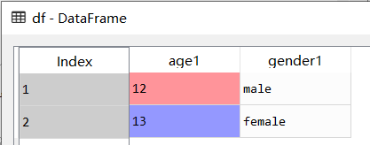
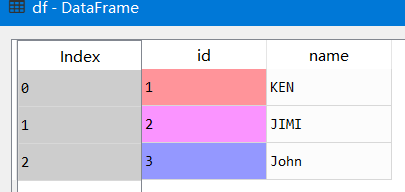

## python数据分析入门

## 一、数据准备

### 1、数据结构

#### 1.1 Series系列

系列用于存储**一行或者一列**的数据，以及与之相关的索引集合

##### 1）创建系列，并修改index

```python
from pandas import Series
x = Series(['a',True,1])
x = Series(['a',True,1],index=['first','second','third'])
```


##### 2）根据索引访问系列

```python
x[1]
---
Out[4]: True
    
x['second']
---
Out[3]: True
```

##### 3）系列追加元素

append方法**返回值是一个Series对象**，而不是在原有的x上追加Series

```python
#不能追加单个元素，会报TypeError: cannot concatenate object of type "<class 'str'>"; 
#only pd.Series, pd.DataFrame, and pd.Panel (deprecated) objs are valid 异常
x.append('2')

#追加单个系列，append返回值是一个Series对象，而不是在原有的x上追加Series
x = x.append(Series(['0',5]))
x
---
Out[6]: 
first        a
second    True
third        1
0            0
1            5
```

##### 4）成员检测

用Series的**values属性**，判断系列中是否存在该值

```python
'0' in x
---
 Out[7]: False
    
'0' in x.values
---
 Out[8]: True
```

##### 5）系列切片

```python
x[1:3]
---
Out[9]: 
second    True
third        1
dtype: object
```

##### 6）系列元素重排

定位获取，这个方法常用与**随机抽样**

```python
x[[0,2,1]]
---
Out[10]: 
first        a
third        1
second    True
dtype: object
```

##### 7）删除元素

`Series`的drop方法返回值是Series对象，不在原有的x上进行删除

- **根据index删除**，主要有两种方法

  ```python
  # 方法1
  x.drop(0)
  ---
  Out[11]: 
  first        a
  second    True
  third        1
  1            5
  dtype: object
      
  x.drop('first')
  ---
  Out[12]: 
  second    True
  third        1
  0            0
  1            5
  dtype: object
  ```

  ```python
  # 方法2
  x.index[3]
  ---
  Out[16]: 0
      
  #根据第i个位置上的index进行删除
  x.drop(x.index[3])
  ---
  Out[13]: 
  first        a
  second    True
  third        1
  1            5
  dtype: object
  ```

- **根据值删除**

  这里用到了向量化计算，即该计算应用在系列中的所有元素上

  ```python
  # 根据值删除
  '0' != x.values
  ---
  Out[15]: array([ True,  True,  True, False,  True])
      
  x['0' != x.values]
  ---
  Out[14]: 
  first        a
  second    True
  third        1
  1            5
  dtype: object
  ```

#### 1.2 DataFrame数据框

用于存储**多行和多列**的数据集合

##### 1）定义DataFrame，并修改index

```python
from pandas import DataFrame

df = DataFrame({
    'age': [12, 13],
    'gender': ['male', 'female']
}
)

df = DataFrame({
    'age': [12, 13],
    'gender': ['male', 'female']
},
    index=['first', 'second']
)
```


##### 2）按列名，行索引，行与列访问

- **按列名访问**：单列/多列

  - 注意区别**两种单列访问**形式：一种[]，一种是[]里面套Series，**输出效果看是否存在列名**的Series
  - 还可以使用`df.age`来获取age列的值，但是这种获取是**不含列名**的的Series。

  ```python
  # 单列访问1
  df['age']
  ---
  Out[5]: 
  first     12
  second    13
  
  # 单列访问2
  df[['age']]
  ---
  Out[63]: 
          age
  first    12
  second   13
  
  # 单列访问3
  df.age
  ---
  Out[64]: 
  first     12
  second    13
  
  # 多列访问
  df[['age', 'gender']]
  ---
  Out[6]: 
          age  gender
  first    12    male
  second   13  female
  ```

- **按行访问（参考时间抽取那一块）**

  ```python
  # 按行访问
  df[0:2]
  ---
  Out[7]: 
          age  gender
  first    12    male
  second   13  female
  
  # 按行索引访问（loc是属性，不是函数）
  df.loc[["first", "second"]]
  ---
  Out[8]: 
          age  gender
  first    12    male
  second   13  female
  
  # 按行索引范围访问（ix是属性）
  # =============================================================================
  # Warning: Starting in 0.20.0, the .ix indexer is deprecated, 
  # in favor of the more strict .iloc and .loc indexers.
  # =============================================================================
  df = DataFrame({
      'age': [12, 13],
      'gender': ['male', 'female']
  },
       index=['2', '6']
  )
  df.ix[0:1]
  ---
     age1 gender1
  2    12    male
  
  df.ix[0:2]
     age  gender
  2   12    male
  6   13  female
  ```

- **按行列访问**：

  访问单个：**at属性**；访问多个：**iloc属性**

  ```python
  # 按行名,列号访问多个元素
  df.iloc[0:2, 0:2]
  ---
  Out[10]: 
          age  gender
  first    12    male
  second   13  female
  
  # D:按行名,列名访问单个元素
  df.at['first', 'age']
  ---
  Out[11]: 12
  ```

##### 3）修改列名，行索引

修改属性，即**在原有的df上修改列名，行索引**

```python
"""修改列名"""
df.columns=['age1','gender1']

'''修改行索引'''
df.index = range(1,3)
```



##### 4）按行索引，列名删除

`DataFrame`的drop方法返回值是Series对象，不在原有的df上进行删除

```python
'''G:根据行索引删除,axis=0则删除行，axis=1则删除列,默认axis=0'''
df.drop(1,axis=0)
---
Out[16]: 
   age1 gender1
2    13  female

df.drop('age1',axis=1)
---
Out[17]: 
  gender1
1    male
2  female
```

##### 5）增加行，列

```python
'''增加行/列(在原有的数据上加,访问/切片不对原始数据进行修改)'''
#增加行
#注意这种方法效率非常低，不应该用在遍历中
df.index = range(0,2)
df.loc[len(df)] = [24,'male']

#增加列
df["birth"] = ["1997-10-1","1998-5-21","1998-6-23"]
```


##### 6） Dataframe中MultiIndex的操作

- 在**交叉分析**中，索引值（列/行）可能存在多重索引`MultiIndex`

- 如果采用以上的查询方法来访问表格元素，是不可行的，这里使用`pandas.DataFrame.xs`方法来访问`MultiIndex`

  参考[python/pandas dataframe中multiindex的操作](https://blog.csdn.net/tpoy0099/article/details/49074551)

##### 7）Dataframe中CategoricalIndex的操作

参考[Pandas多层级索引](https://blog.csdn.net/Python_Ai_Road/article/details/96604292)

#### 1.3 备注

判断是否在原有数据上修改数据，有个比较普遍的判断方式：

- **属性修改**即在原有的数据上修改
- **方法修改**不在原有的数据上修改，需要重新赋值

### 2、向量化计算

​		向量化计算是一种特殊的**并行计算的方式**，他可以在同一时间执行多次操作，通常是对不同的数据执行同样的一个或一批指令，或者说把**指令应用于一个数组/向量**。

#### 2.1 生成等差数列

```python
import numpy as np

#生成等差数列
r = np.arange(0.1,0.5,0.01)
```


#### 2.2 四则运算

```python
r + r
---
Out[2]: 
array([0.2 , 0.22, 0.24, 0.26, 0.28, 0.3 , 0.32, 0.34, 0.36, 0.38, 0.4 ,
       0.42, 0.44, 0.46, 0.48, 0.5 , 0.52, 0.54, 0.56, 0.58, 0.6 , 0.62,
       0.64, 0.66, 0.68, 0.7 , 0.72, 0.74, 0.76, 0.78, 0.8 , 0.82, 0.84,
       0.86, 0.88, 0.9 , 0.92, 0.94, 0.96, 0.98])

r * r
---
Out[3]: 
array([0.01  , 0.0121, 0.0144, 0.0169, 0.0196, 0.0225, 0.0256, 0.0289,
       0.0324, 0.0361, 0.04  , 0.0441, 0.0484, 0.0529, 0.0576, 0.0625,
       0.0676, 0.0729, 0.0784, 0.0841, 0.09  , 0.0961, 0.1024, 0.1089,
       0.1156, 0.1225, 0.1296, 0.1369, 0.1444, 0.1521, 0.16  , 0.1681,
       0.1764, 0.1849, 0.1936, 0.2025, 0.2116, 0.2209, 0.2304, 0.2401])

r - r
---
Out[4]: 
array([0., 0., 0., 0., 0., 0., 0., 0., 0., 0., 0., 0., 0., 0., 0., 0., 0.,
       0., 0., 0., 0., 0., 0., 0., 0., 0., 0., 0., 0., 0., 0., 0., 0., 0.,
       0., 0., 0., 0., 0., 0.])

r / r
---
Out[5]: 
array([1., 1., 1., 1., 1., 1., 1., 1., 1., 1., 1., 1., 1., 1., 1., 1., 1.,
       1., 1., 1., 1., 1., 1., 1., 1., 1., 1., 1., 1., 1., 1., 1., 1., 1.,
       1., 1., 1., 1., 1., 1.])
```

#### 2.3 函数计算

##### 1）基本数学运算

```python
'''指数运算'''
np.power(r,5)
--- 
Out[6]: 
array([1.00000000e-05, 1.61051000e-05, 2.48832000e-05, 3.71293000e-05,
       5.37824000e-05, 7.59375000e-05, 1.04857600e-04, 1.41985700e-04,
       1.88956800e-04, 2.47609900e-04, 3.20000000e-04, 4.08410100e-04,
       5.15363200e-04, 6.43634300e-04, 7.96262400e-04, 9.76562500e-04,
       1.18813760e-03, 1.43489070e-03, 1.72103680e-03, 2.05111490e-03,
       2.43000000e-03, 2.86291510e-03, 3.35544320e-03, 3.91353930e-03,
       4.54354240e-03, 5.25218750e-03, 6.04661760e-03, 6.93439570e-03,
       7.92351680e-03, 9.02241990e-03, 1.02400000e-02, 1.15856201e-02,
       1.30691232e-02, 1.47008443e-02, 1.64916224e-02, 1.84528125e-02,
       2.05962976e-02, 2.29345007e-02, 2.54803968e-02, 2.82475249e-02])
```

##### 2）获得行列最大最小值

```python
from pandas import DataFrame
df = DataFrame({
    "column1": np.random.randn(5),
    "column2": np.random.randn(5),
})
```


使用`apply()`获取最大最小值，行：`axis = 1`，列：`axis = 0`

```python
'''获得行/列最小值'''
#列最小值，axis默认为0
df.apply(min)
---
Out[11]: 
column1   -1.775344
column2   -1.488538
dtype: float64
    
#列最大值，axis默认为0
df.apply(max)
---
Out[12]: 
column1    1.634778
column2    1.371921
dtype: float64

#行最小值
df.apply(min,axis=1)
Out[13]: 
0   -1.775344
1    1.004980
2    0.474506
3   -1.572299
4    0.400025
dtype: float64
```

#### 2.4 比较计算（结合过滤使用）

##### 1）一维数组比较大小

```python
r > 0.3
Out[7]: 
array([False, False, False, False, False, False, False, False, False,
       False, False, False, False, False, False, False, False, False,
       False, False, False,  True,  True,  True,  True,  True,  True,
        True,  True,  True,  True,  True,  True,  True,  True,  True,
        True,  True,  True,  True])

#结合过滤一起使用
r[r > 0.3]
---
Out[8]: 
array([0.31, 0.32, 0.33, 0.34, 0.35, 0.36, 0.37, 0.38, 0.39, 0.4 , 0.41,
       0.42, 0.43, 0.44, 0.45, 0.46, 0.47, 0.48, 0.49])
```

##### 2）DataFrame比较大小

lambda表达式参考这里<https://www.cnblogs.com/tianqianlan/p/11082183.html>

```python
#all()函数用于判断整个数组中的元素的值是否全部满足条件，如果满足条件返回True，否则返回False。本质上讲，all()实现了或(AND)运算
df.apply(lambda x : np.all(x > 0), axis = 1)
---
Out[14]: 
0    False
1     True
2     True
3    False
4     True
dtype: bool

df[df.apply(lambda x : np.all(x > 0), axis = 1)]
---
Out[15]: 
    column1   column2
1  1.634778  1.004980
2  0.474506  1.371921
4  0.534127  0.400025
```

#### 2.5 矩阵计算

```python
np.dot(r,r.T)
---
Out[9]: 4.013999999999998
```

1.4 备注：

注意向量化使用的原则：

- 代码中尽可能**避免显式的for**循环
- 过早优化是魔鬼

## 二、数据处理

### 1、数据导入和导出

#### 1.1 数据的导入

##### 1）一般方式导入文件

用python内置的`open()`和`read()`，缺点是**不能对数据按格式划分**，并封装成可计算的对象

```python
data = open('E://python//数据集//数据分析入门//1.csv').read()
```


##### 2）导入csv文件

- 使用`np.read_csv()`，如果存在中文路径会报错，此时使用`open()`打开文件即可（参考<https://blog.csdn.net/qq_35318838/article/details/80564938>）。得到的数据会被封装成`DataFrame`对象

- `np.read_csv()`默认分隔符是','

  ```python
  from pandas import read_csv
  
  # 这样读文件会报错:OSError: Initializing from file failed
  # df = read_csv(
  #    'E://python//数据集//数据分析入门//1.csv'
  # )
  df = read_csv(open('E://python//数据集//数据分析入门//1.csv'))
  ```

  

- `np.read_csv()`修改分隔符`seq`，并修改列名`names`

  ```python
  df4 = read_csv(
      open('E://python//数据集//数据分析入门//4.11 字段合并/data.csv'),
      names=['brand','area','num'],
      sep=' '
  )
  ```

##### 3）导入文本文件

注意文本文件**一上来就是数据，没有表头**，所以要设置列名，并设置分隔符。

```python
"""用read_table导入文本文件(文本文件一上来就是数据，没有表头)"""
from pandas import read_table
df1 = read_table(open('E://python//数据集//数据分析入门//1.txt'))

df2 = read_table(
    open('E://python//数据集//数据分析入门//1.txt'),
    #设置列名
    names=['name', 'age', 'gender'],
    #分隔符
    sep=','
)
```


##### 4）导入excel文件（后缀xlsx）

​	对于导入文件编码错误问题，可以用`encoding`指定编码格式

```python
from pandas import read_excel
df3 = read_excel(
   'E://python//数据集//数据分析入门//1.xlsx',
   #不设置编码格式，会报错:UnicodeDecodeError: 'gbk' codec can't 
   #decode byte 0x90 in position 22: illegal multibyte sequence
    encoding='UTF-8'
)
```


#### 1.2 数据的导出

##### 1）导出csv/txt文件

​	用`df.to_csv()`导出**csv，文本**等文件，可以设置`index=False`，表示不打印索引列（没有`to_table()`)

```python
"""D:用to_csv导出csv,文本，xlsx等文件"""
from pandas import DataFrame
DataFrame.to_csv()
df.to_csv(
        'E://python//数据集//数据分析入门//2.csv'，
        #不打印索引列
        index=False
)
df2.to_csv('E://python//数据集//数据分析入门//2.txt')
```


##### 2）导出xlsx文件

​	用`df.to_xlsx()`导出**csv，文本**等文件，可以设置`index=False`，表示不打印索引列

```python
df3.to_excel('E://python//数据集//数据分析入门//2.xlsx',encoding='UTF-8')
```


### 2、值处理

值处理包括：重复值，缺失值，空格值的处理

#### A、重复值处理

```python
import pandas as pd

df = pd.read_csv(
    open(r"E://python/数据集/数据分析入门/data.csv")
)

df4 = pd.DataFrame(df)
```


##### 2.1 用duplicated()找出重复位置

###### 1）找出行的重复位置

`duplicated()`不指定列，则对行（所有列）进行重复值位置查找

```python
"""找出行的重复位置"""
# 得到重复行的索引系列
dIndex = df4.duplicated()
```


###### 2）根据列，找出重复位置

```python
"""根据某些列，找到重复的位置"""
dIndex = df4.duplicated("id")
```


```python
dIndex = df4.duplicated(["id","name"])
```


根据返回值，把重复数据提取出来
df[dIndex]

##### 2.2 用drop_duplicates()删除重复值

###### 1）根据行重复值进行删除

```python
"""用drop_duplicate(),直接删除重复值(会保留唯一一条数据)"""
# 默认根据所有的列，进行删除(数据结构中，行相同的数据只保留一行)
newDF = df4.drop_duplicates()
```


###### 2）通过指定列，删除重复值

```python
newDF1 = df4.drop_duplicates(["id","name"])
```


##### 2.3 向量化计算提取重复值

​	对于boolean类型的一维数组A，可以根据A，**利用向量化计算，提取重复值数据**。

```python
dIndex = df4.duplicated(["id","name"])

"""根据返回值，把重复数据提取出来"""
df[dIndex]
---
Out[38]: 
        id   name  age  gender
3  1251147  wang2   22    male
5  1251147  wang2   22  female
```

#### B、缺失值处理

##### 2.1、缺失值的产生和处理方法

**缺失值的产生：**

- 有些信息暂时**无法获取**
- 有些信息被遗漏或者**错误处理**了（年龄那一列要求是数字，但是填入了‘a’，‘b’）

**缺失值的处理方法：**

- 数据补齐（填充平均值）
- 删除对应缺失行（数据量少慎用）
- 删除对应缺失行
- 不处理

##### 2.2、用 isnull() 找到空值位置

```python
from pandas import read_csv 

df = read_csv(
    open(r"E:\python\数据集\数据分析入门\4.4 缺失值处理\data.csv")
)

"""A:找出空值的位置,空值位置显示true"""
isNA = df.isnull()
```


##### 2.3、获取空值所在的行

###### 1）默认所有列

```python
from pandas import DataFrame
isNa = DataFrame(isNA)


"""B:获取空值所在的行(对于所有列来说)"""
#Return whether any element is True over 
#requested axis.
#说白了，判断所有列，如果某一列存在一个true值，则该行返回true
#如果全为false，则返回false
df[isNa.any(axis = 1)]

---
Out[9]: 
        id   key value
2  1251147  商品毛重   NaN
3  1251147   NaN    中国
```

###### 2）指定判断空值的列

```python
"""C:获取某一列含有NA值的行"""
#注意Dataframe如何访问单列/多列,如果是[[]],即里面是series的话，输出会保留列名；
#如果是[],输出不会保留列名；
#如果使用单列1访问，则会报:ValueError: No axis named 1 for 
#object type <class 'pandas.core.series.Series'>
df[isNa[['key']].any(axis = 1)]
---
Out[10]: 
        id  key value
3  1251147  NaN    中国

df[isNa[['key','value']].any(axis = 1)]
---
Out[11]: 
        id   key value
2  1251147  商品毛重   NaN
3  1251147   NaN    中国
```

##### 2.4、用 fillna() 填充空值

```python
'''D:填充空值'''
df.fillna('未知')
---
Out[12]: 
        id   key          value
0  1251147    品牌          Apple
1  1251147  商品名称  苹果iPad mini 3
2  1251147  商品毛重             未知
3  1251147    未知             中国
4  1251147    硬盘           128G
5  1251147    尺寸      7.8英寸-9英寸
```

##### 2.5、用 dropna() 删除空值所在的行

```python
'''E:删除空值所在的行(不是在原数据上删除)'''
newDF = df.dropna()
newDF
---
Out[14]: 
        id   key          value
0  1251147    品牌          Apple
1  1251147  商品名称  苹果iPad mini 3
4  1251147    硬盘           128G
5  1251147    尺寸      7.8英寸-9英寸
```

#### C、空格值处理

##### 2.1、用str.strip()处理某一列的空格值

```python
from pandas import read_csv
from pandas import Series
from pandas import Index
df = read_csv(
    open(r"E:\python\数据集\数据分析入门\4.5 空格值处理\data.csv")
)
---
'''一列可作为Series，会自动添加缺失的索引'''
# Vectorized string functions for Series and Index
# 该语法会报错：Series s = df['name']
# 也不能作为索引：Index index = df['name']，语法会报错

'''注意Python对象类型转换和java的区别'''
s = Series(df['name'])
type(df['name'])
# pandas.core.series.Series
```


```python
'''A:处理某一列的空格值'''
#'DataFrame' object has no attribute 'str'
# 注意DataFrame.str不存在，而Series.str存在
'''处理左空格'''
newName = df['name'].str.lstrip()
---
Out[18]: 
0       KEN
1    JIMI  
2      John

'''处理右空格'''
newName1 = df['name'].str.rstrip()
---
Out[23]: 
0         KEN
1        JIMI
2        John

'''处理左右空格'''
newName2 = df['name'].str.strip()
---
Out[25]: 
0     KEN
1    JIMI
2    John
```

##### 2.2、将处理好的数据放回原列

```python
'''B:将处理好的数据放回原来的列'''
df['name'] = newName2
```



### 3、字段处理

#### A、字段抽取

字段抽取：

- 根据**已知列数据**的开始和结束位置，**抽取出新的列**。
- 例如对于电话号：138 0013 8000，其中138是运营商，0013是地区，8000是号码

```python
from pandas import read_csv
from pandas import Series

df = read_csv(
    open(r"E:\python\数据集\数据分析入门\4.6 字段抽取\data.csv")
)

type(df.at[0,'tel'])
---
Out[35]: numpy.int64
```


##### 3.1、用Series.astype()转换数据类型

```python
# Cast a pandas object to a specified dtype dtype.
Series.astype()

'''A:用Series.astype()，将电话号转成字符串'''
df['tel'] = df['tel'].astype(str)
type(df.at[0,'tel'])
--- 
Out[37]: str
```

##### 3.2、用str.slice()字段抽取

```python
# 运营商
brand = df['tel'].str.slice(0,3)
# 地区
area = df['tel'].str.slice(3,7)
# 号码段
nums = df['tel'].str.slice(7,11)

#赋值回去
df['brand'] = brand
df['area'] = area
df['nums'] = nums
```


#### B、字段拆分

字段拆分：按照**固定的字符**，拆分已有字符串

```python
from pandas import read_csv

df = read_csv(
    open(r"E:\python\数据集\数据分析入门\4.7 字段拆分\data.csv"),
)
```


##### 3.1、用split()拆分得到DataFrame

```python
# =============================================================================
# split(sep,n,expand=False)
# 参数说明:
#     sep用于分割的字符串，
#     n分割为多少列，
#     expand为true，则返回DataFrame
#     expand为false，则返回Series
# =============================================================================
# 1表示将数据分割成2列,返回值为DataFrame
newDF = df['name'].str.split(' ', 1, True)
#依次修改DataFrame的列名
newDF.columns = ['band','name']
```


##### 3.2、用split()拆分得到Series

```python
newDF1 = df['name'].str.split(' ', 2, False)
```


#### C、字段合并

字段合并：指将同一个**数据框中的不同的列，进行合并**，形成新的列（字段拆分的逆操作）

```python
# 字段合并方法：x1 + x2 + x3，合并后返回一个Series
df4 = read_csv(
    open('E://python//数据集//数据分析入门//4.11 字段合并/data.csv'),
    names=['brand','area','num'],
    sep=' '
)
```


注意**先将Int64转化成str**，才能进行**字段合并(字符串加法)**

```python
# 注意先将Int64转化成str，才能进行字段合并
# data1 = df4['brand'] + df4['area'] + df4['num']

# Cast a pandas object to a specified dtype ``dtype``
df4 = df4.astype(str)
data1 = df4['brand'] + df4['area'] + df4['num']

df4['tel'] = data1
```


#### D、字段匹配

字段匹配：根据**各表共有的关键字段**（eg：id字段，且数据类型一致），把各表所需的记录**一一对应**起来，**组成**一条**新的记录**

```python
from pandas import read_csv
import pandas as pd
df1 = read_csv(
    open('E://python//数据集//数据分析入门//4.12 字段匹配/data1.csv'),
    names=['id','comments','title'],
    sep='|'
)

df2 = read_csv(
    open('E://python//数据集//数据分析入门//4.12 字段匹配/data2.csv'),
    names=['id','oldPrice','nowPrice'],
    sep='|'
)
```


##### 3.1、用pd.merge()左连接

```python
# ============================================================================
# merge(x,y,left_on,right_on)
# x:第一个数据框
# y:第二个数据框
# left_on:第一个数据框用于匹配的列(共同字段名,不是Series)
# right_on:第二个数据框用于匹配的列(共同字段名,不是Series)
# 返回DataFrame
# ============================================================================
```

```python
data1 = pd.merge(
    left = df1,
    right= df2,
    left_on = 'id',
    right_on= 'id',
    how = "left"
)
```


##### 3.2、用pd.merge()右连接

```python
'''B:右连接，即使连接不上，也保留右边没连上的部分'''
data2 = pd.merge(
    left = df1,
    right= df2,
    # left_on = df1['id'],
    # right_on= df2['id'],
    left_on='id',
    right_on='id',
    how = "right"
)
```


##### 3.3、用pd.merge()外连接

```python
'''C:外连接，即使连接不上，也保留没连上的部分'''
data3 = pd.merge(
    left = df1,
    right= df2,
    # left_on = df1['id'],
    # right_on= df2['id'],
    left_on='id',
    right_on='id',
    how = "outer"
)
```


### 4、记录处理

#### A、记录抽取

记录抽取：指根据**一定的条件**，对数据进行抽取

```python
from pandas import read_csv
import pandas as pd

df = read_csv(
    open(r"E:\python\数据集\数据分析入门\4.8 记录抽取\data.csv"),sep='|'
)
```


##### 4.1、比较运算

```python
'''A:比较运算'''
df1 = df[df['comments'] > 10000]
df2 = df[df.comments > 10000]
```

结果都是


##### 4.2、范围运算

```python
'''B:范围运算'''
df3 = df[df.comments.between(1000,10000)]
```


```python
'''也可以是组合的逻辑运算（结果同上）'''
df7 = df[(df.comments > 1000) & (df.comments < 10000)]
```

##### 4.3、空值匹配

```python
'''C:空值匹配'''
df4 = df[pd.isnull(df.title)]
pd.isnull(df.title)
---
Out[60]: 
0    False
1    False
2    False
3    False
4    False
5     True
6    False
7    False
8    False
```


##### 4.4、根据关键字过滤

```python
'''D:根据关键字过滤'''
# na = False表示空值不用匹配
df5 = df[df.title.str.contains('华为',na=False)]

# ~取反
df6 = df[~df.title.str.contains('华为',na=False)]
```


#### B、随机抽样

随机抽样：随机从数据中，按照**一定的行数**或者**比例**抽取数据

```python
import numpy as np
import pandas as pd

df = pd.read_csv(
    open(r"E:\python\数据集\数据分析入门\4.9 随机抽样\data.csv")
)
#共有100条数据
```


##### 4.1、按个数抽样

```python
#设置随机种子
np.random.seed(seed = 2)

'''A:按个数抽样'''
df.sample(n = 10)
---
Out[67]: 
    id  class  score
64  65      3     57
43  44      1     50
85  86      2     77
51  52      2     88
42  43      3     86
97  98      2     82
75  76      2     59
71  72      2    107
77  78      3     77
15  16      2     91
```

##### 4.2、按百分比抽样

```python
'''B:按百分比抽样'''
df.sample(frac = 0.02)
---
Out[68]: 
     id  class  score
99  100      2     80
13   14      2     69
```

##### 4.3、可放回的抽样

```python
'''C:可放回抽样'''
df.sample(n = 102, replace=True)
#报错 ValueError: Cannot take a larger sample than population when 'replace=False'
#df.sample(n = 102, replace=False)
---
Out[69]: 
     id  class  score
23   24      1     84
30   31      1     46
53   54      1     95
55   56      3    126
98   99      1     71
..  ...    ...    ...
84   85      2     85
54   55      2    121
99  100      2     80
77   78      3     77
3     4      2    122
57   58      2     82
61   62      3    103
```

##### 4.4、分层抽样

**用`df.sample(n = n)`按个数抽样**

```python
'''D:典型抽样，分层抽样'''
#按照class先对数据进行分组
data = df.groupby("class")
#查看分组情况(字典类型 ：{类别:数组})
data.groups

'''1:分层抽样定义(字典类型):1类中抽取2个，2类中抽取4个，3类中抽取6个'''
typicalNDict = {
    1: 2,
    2: 4,
    3: 6
}
type(typicalNDict)

#group难道是df.groupby的返回值传进去的？
#是的，请看df.groupby( 'class',group_keys = False).apply帮助文档
def typicalSampling(group,typicalNDict):
    name = group.name
    n = typicalNDict[name]
    return group.sample(n = n)

# =============================================================================
#  df.groupby.apply()
#    
#  Parameters
#     ----------
#     func : function
#         A callable that takes a dataframe as its first argument, and
#         returns a dataframe, a series or a scalar. In addition the
#         callable may take positional and keyword arguments
#     args, kwargs : tuple and dict
#         Optional positional and keyword arguments to pass to ``func``
#     
#     Returns
#     -------
#     applied : Series or DataFrame
# =============================================================================
result = df.groupby(
    'class'
).apply(typicalSampling,typicalNDict)

result1 = df.groupby(
    'class',
     #不将组键（键值对）添加到索引,而是将值添加到索引
     group_keys = False
).apply(typicalSampling,typicalNDict)

help(df.groupby( 'class',group_keys = False).apply)
help(df.groupby)
```


**用`df.sample(frac = frac)`按比例抽样**

```python
typicalFracDict = {
    1: 0.2,
    2: 0.4,
    3: 0.6
}

def typicalSampling1(group,typicalFracDict):
    name = group.name
    frac = typicalFracDict[name]
    return group.sample(frac = frac)

result2 = df.groupby(
    'class',
     #不将组键（键值对）添加到索引,而是将值添加到索引
     group_keys = True
).apply(typicalSampling1,typicalFracDict)
```


#### C、记录合并

记录合并：指将**两个结构相同的数据框**，合并成一个数据框

```python
from pandas import concat
from pandas import read_csv
#seq默认为,
df = read_csv(
    open('E://python//数据集//数据分析入门//4.10 记录合并/data1.csv'),
    sep='|'
)

df1 = read_csv(
    open('E://python//数据集//数据分析入门//4.10 记录合并/data2.csv'),
    sep='|'
)

df2 = read_csv(
    open('E://python//数据集//数据分析入门//4.10 记录合并/data3.csv'),
    sep='|'
)
```


##### 4.1、数据框结构相同时的合并

```python
'''A：数据框结构相同时合并'''
# =============================================================================
# concat参数是一个DataFrame或Series的列表
# objs : a sequence or mapping of Series, DataFrame, or Panel objects
# =============================================================================
data = concat([df,df1,df2])
```


##### 4.2、数据框结构不同时的合并

```python
'''B：数据框结构不同时，先进行列的筛选再合并(为筛选的列填空值)'''
data = concat([
    df[['id','comments']],
    df1[['comments','title']],
    df2[['id','title']]
])
```


### 5、其余操作

#### A、简单计算

简单计算：指通过对已有字段进行加减乘除等运算，得到**新的字段**

```python
'''A:简单计算'''
df1 = pd.read_csv(
    open('E://python//数据集//数据分析入门//4.13 简单计算/data.csv'),
    sep='|'
)

df1['totalPrice'] = df1['price'] * df1['num']
```


#### B、数据标准化

数据标准化：指将数据按比例缩放，使之落入到特定区间，方便**不同变量的比较关系**：聚类分析，主成分分析等。

0-1标准化（**方便十分制，百分制的换算**）： $ x^* = \frac{x - min}{max -min}$

```python
'''B:数据标准化'''
df2 = pd.read_csv(
    open('E://python//数据集//数据分析入门//4.14 数据标准化/data.csv'),
    sep=','
)
```


```python
'''0-1标准化（保留2位小数）'''
df2.score = round(
    (df2.score - df2.score.min()) / 	(df2.score.max() - df2.score.min()),
    2
)
```


#### C、数据分组

数据分组：根据数据分析对象的特征，按照一定的数值指标，**把数据分析对象划分为不同的区间**进行研究，以揭示其内在的联系和规律性。


##### 5.1、用pd.cut按区间分组

```python
# =============================================================================
# cut(series,bins,right=True,labels=NULL)
# series 需要分组的数据
# bins 分组的划分数组
# right 分组的时候，右边是否闭合
# labels 分组的自定义标签，可以不自定义
# =============================================================================

df3 = pd.read_csv(
    open('E://python//数据集//数据分析入门//4.15 数组分组/data.csv'),
    sep='|'
)

bins = [
    min(df3.cost) - 1,20,30,40,50,60,max(df3.cost) + 1
]

# 区间右边不闭合
df3['cut'] = pd.cut(
    df3.cost,
    bins,
    right=False
)
```


##### 5.1、用pd.cut按区间自定义标签分组

```python
labels = [
    '20以下','20到30','30到40','40到50','50到60','60以上'
]
df3['cut1'] = pd.cut(
    df3.cost,
    bins,
    right = False,
    labels = labels
)
```


#### D、时间处理

- **时间转换**：指将**字符型的时间格式**数据，转换成为**时间型数据**的过程
- **时间格式化**：将**时间型数据**，按照指定格式，**转为字符型数据**
- **时间属性抽取**：指从日期格式里面，**抽取出需要的部分属性**

##### 5.1、用to_datetime()时间转换

```python
'''1、时间转换'''
df4 = pd.read_csv(
    open('E://python//数据集//数据分析入门//4.16 时间处理/data.csv'),
    sep=','
)

dateTime = pd.to_datetime(
    df4['注册时间'],
    #format为数据中的时间格式
    format='%Y/%m/%d'
)

df4['时间'] = dateTime
type(dateTime)
```


##### 5.2、用dt.strftime()格式化时间

```python
'''2、时间格式化'''
# 使用时间的dt属性来格式化时间
df4['格式化时间'] = df4['时间'].dt.strftime('%Y-%m-%d')
```


##### 5.3、用dt.xx抽取时间属性

```python
'''3、时间属性抽取'''
# 使用时间的dt属性来抽取年，月，日...
df4['年'] = df4['时间'].dt.year
df4['月'] = df4['时间'].dt.month
df4['周'] = df4['时间'].dt.week
df4['日'] = df4['时间'].dt.day
df4['时'] = df4['时间'].dt.hour
df4['分'] = df4['时间'].dt.minute
df4['秒'] = df4['时间'].dt.second
```

#### E、时间抽取

**时间抽取**：指根据**一定的条件**，对时间格式的数据进行抽取

- 根据**索引**进行抽取
- 根据**时间列**进行抽取

```python
import pandas as pd

'''时间抽取'''
df1 = pd.read_csv(
    open('E://python//数据集//数据分析入门//4.17 时间抽取/data.csv'),
    sep=','
)
```


##### 5.1、时间处理

```python
# =============================================================================
# @classmethod
#     def strptime(cls, date_string, format):
#         'string, format -> new datetime parsed from a string (like time.strptime()).'
#         import _strptime
#         return _strptime._strptime_datetime(cls, date_string, format)
# =============================================================================
dateParser = lambda date : pd.datetime.strptime(
    # date是每一次遍历的对象，不能用df1.date,
    # date_string = date, format = "%Y%m%d" 会出现TypeError: strptime() takes no keyword arguments
    date,"%Y%m%d"
)
#是一个function对象
type(dateParser)
---
function

# =============================================================================
# pd.read_csv
# date_parser : function, default None
#     Function to use for converting a sequence of string columns to an array 
#     of datetime instances. The default uses dateutil.parser.parser to do the 
#     conversion. Pandas will try to call date_parser in three different ways, 
#     advancing to the next if an exception occurs: 1) Pass one or more arrays 
#     (as defined by parse_dates) as arguments; 2) concatenate (row-wise) the 
#     string values from the columns defined by parse_dates into a single array 
#     and pass that; and 3) call date_parser once for each row using one or more
#      strings (corresponding to the columns defined by parse_dates) as arguments.
#      
# parse_dates : boolean or list of ints or names or list of lists or dict, default False
#     boolean. If True -> try parsing the index.
#     list of ints or names. e.g. If [1, 2, 3] -> try parsing columns 1, 2, 3 each as a separate date column.
#     list of lists. e.g. If [[1, 3]] -> combine columns 1 and 3 and parse as a single date column.
#     dict, e.g. {'foo' : [1, 3]} -> parse columns 1, 3 as date and call result 'foo'     
# =============================================================================
'''A:在读取文件时，将str类型的date列转化成dateTime类型'''
'''B:并将时间列作为索引列'''
df2 = pd.read_csv(
    open('E://python//数据集//数据分析入门//4.17 时间抽取/data.csv'),
    sep=',',
    # 日期转换的方法
    date_parser = dateParser,
    # 要转换的日期所在的列
    parse_dates = ['date','date1'],
    #将'date'列作为索引列(时间从小到大排序)
    index_col= 'date'
)
```


##### 5.2、按索引抽取

```python
'''C:根据索引进行抽取'''
import datetime
dt1 = datetime.date(year=2016,month=2,day=1)
dt2 = datetime.date(year=2016,month=2,day=5)

#获取索引列中，dt1~dt2时间段内的数据
# =============================================================================
# Warning: Starting in 0.20.0, the .ix indexer is deprecated, 
# in favor of the more strict .iloc and .loc indexers.
# =============================================================================
df2.ix[dt1:dt2]
df2.loc[dt1:dt2]

#获取dt1,dt2这两时间点的数据
df2.ix[[dt1,dt2]]
```

##### 5.3、按时间列（dateTime）抽取

```python
df3 = pd.read_csv(
    open('E://python//数据集//数据分析入门//4.17 时间抽取/data.csv'),
    sep=','
)

dt1 = datetime.date(year=2016,month=2,day=1)
dt2 = datetime.date(year=2016,month=2,day=5)

df3['date'] = pd.to_datetime(df1['date'],format='%Y%m%d')

type(df3.at[0,'date'])
---
pandas._libs.tslibs.timestamps.Timestamp

type(dt1) 
---
datetime.date
```


```python
# 按时间列进行记录抽取
# 如果时间格式不匹配（eg：date和dateTime比较大小），好像不能用运算符比较大小；
# 但是用索引列（df.ix),即使时间格式不同，也可以比较时间
# df4 = df3[(df3.date >= dt1) & (df3.date <= dt2)]

dt3 = datetime.datetime(2016,2,1,0,0,0)
dt4 = datetime.datetime(2016,2,5,0,0,0)

df4 = df3[(df3.date >= dt3) & (df3.date <= dt4)]
```


注意区别两种时间抽取的方法：一种是**按索引列抽取**，另一种是**按非索引列抽取**。

### 6、虚拟变量

**虚拟变量**：也叫**离散特征编码**，可用于表示分类变量，非数量因素可能产生的影响。

- **离散特征的取值**之间有**大小的意义**（eg：尺寸（L，XL,XXL）

  用`pandas.Series.map(dict)`来处理

- 离散特征的取值之间**没有大小的意义**（eg：颜色（Red，Blue，Green）

  用`pandas.get_dummies(...)`来处理(dummy仿制品)

```python
import pandas as pd

df = pd.read_csv(
    open('E://python//数据集//数据分析入门//4.18 虚拟变量/data.csv'),
    sep=','
)

# 得到学历（唯一）
educationLevel = df['Education Level'].drop_duplicates()
---
Out[158]: 
0               Doctorate
3       Bachelor's Degree
6         Master's Degree
20     Associate's Degree
35           Some College
102              Post-Doc
111          Trade School
157           High School
187          Grade School
```


##### 6.1、Series.map()处理有大小关系的离散变量

```python

'''A:离散变量(学历）之间具有大小关系'''
"""
博士后    Post-Doc
博士      Doctorate
硕士      Master's Degree
学士      Bachelor's Degree
副学士    Associate's Degree
专业院校  Some College
职业学校  Trade School
高中      High School
小学      Grade School
"""
dict = {
    'Post-Doc': 9,
    'Doctorate': 8,
    'Master\'s Degree': 7,
    'Bachelor\'s Degree': 6,
    'Associate\'s Degree': 5,
    'Some College': 4,
    'Trade School': 3,
    'High School': 2,
    'Grade School': 1
}
df['Education Level Map'] = pd.Series.map(df['Education Level'],dict)

#或者
df['col'] = df['Education Level'].map(dict)
```


##### 6.2、pd.get_dummies()处理无大小关系的离散变量

```python

'''B:离散变量（性别）之间没有大小关系'''

# =============================================================================
# pd.get_dummies(data=None,prefix=None,prefix_sep=None,dummy_na=False,columns==None,drop_first=False)
# data 要处理的DataFrame
# prefix 列名的前缀，在多个列有相同的离散项时候使用
# prefix_sep 前缀和离散值得分隔符，默认为下划线，默认即可
# dummy_na 是否把NA值，作为一个离散之进行处理
# columns 要处理的列名，如果不指定该列，那么默认处理所有列
# drop_first 是否从备选项中删第一个，建模的时候为避免共线性使用
# =============================================================================
df1 = pd.get_dummies(
        df,
        # columns是list
        columns=['Gender'],
        # prefix可以使字符串，或者是字符串列表
        prefix='Gender1',
        prefix_sep='_',
        dummy_na= False,
    
        # 默认用False，原因我也不知道啊。。
        drop_first= False
)

#在使用get_dummies()时，是在原列的基础上进行修改，需要将原来的Gender列重新赋值回去
df1['Gender'] = df['Gender']
```


## 三、数据分析

### 1、基本统计

常用的统计指标有：**计数，求和，平均值，方差，标准差**

| 统计函数 | 注释           |
| -------- | -------------- |
| describe | 描述性统计分析 |
| size     | 计数           |
| sum      | 求和           |
| mean     | 平均值         |
| var      | 方差           |
| std      | 标准差         |

### 2、分组分析

- **分组分析**：指根据分组字段，将分析对象划分成不同的部分，以进行**对比分析各组间的差异性**的一种分析方法（定性分组，定量分组）
- 常用的统计指标有：**计数，求和，平均值**

### 3、分布分析

**分布分析**：根据分析目的，将数据（**定量数据**）进行等距或者不等距的分组，进行研究各组规律的一种分析方法（eg：用户消费分布，用户年龄分布）

### 4、交叉分析

**交叉分析**：通常用于分析**两个或两个以上**，**分组变量之间的关系**，以交叉表形式进行变量间关系的**对比分析**（eg：在年龄分组的情况下，对性别进行再分组，统计不同性别，不同年龄分组下的人数）

- 定量，定量分组交叉
- 定量，定性分组交叉
- 定性，定性分组交叉

### 5、结构分析

**结构分析**：是**在分组和交叉的基础上**，计算各组成部分所占的比重，进而分析总体的内部特征，主要是**定性分析**（eg：市场占有率，股权等，一般用**饼图**表现）。

- 数据框的**外运算**函数

  | 运算     | 注释 |
  | -------- | ---- |
  | add      | 加   |
  | sub      | 减   |
  | multiply | 乘   |
  | div      | 除   |

- 数据框的**内运算**函数

  | 运算 | 注释   |
  | ---- | ------ |
  | sum  | 求和   |
  | mean | 均值   |
  | var  | 方差   |
  | std  | 标准差 |

### 6、相关分析

- **相关分析**：研究两个或两个以上随机变量之间相互依赖关系的方向和密切程度的方法，包括**线性相关，而非线性相关**

- 线性相关关系主要采用Pearson**相关系数r**来度量连续变量之间**线性相关强度**（还有其他指标：kendall, spearman）

  | 线性相关系数\|r\|取值范围 | 相关程度 |
  | ------------------------- | -------- |
  | $0<=|r|<0.3$              | 低度相关 |
  | $0.3<= |r| < 0.8$         | 中度相关 |
  | $0.8<=|r|<=1$             | 高度相关 |

### 7、RFM分析

- **RFM分析**：根据客户**活跃程度**和**交易金额**贡献，进行**客户价值细分**的一种方法

| 指标               | 解释                         | 意义                                                 |
| ------------------ | ---------------------------- | ---------------------------------------------------- |
| R（Recency）近度   | 客户最近一次交易时间的交隔   | R越大，客户越久未发生交易；R越小，客户越近有交易发生 |
| F（Frequency）频度 | 客户最近一段时间内交易的次数 | F越大，客户交易越频繁；F越小，表示客户不够活跃       |
| M（Monetary）额度  | 客户最近一段时间内交易的金额 | M越大，客户价值越高；M越小，客户价值越小；           |


- **RFM分析过程**
  - 1）计算RFM各项分值：
    - R_S，距离当前日期越近，得分越高，最高5分，最低1分
    - F_S，交易频率越高，得分越高，最高5分，最低1分
    - M_S，交易金额越高，得分越高，最高5分，最低1分
  - 2）汇总RFM分值：$RFM = 100 * R_S  + 10 * F_S + 1 * M_S$
  - 3）根据RFM分值对客户分类
- **RFM分析前提**
  - 1.最近有过交易行为的客户，再次发生交易的可能性要高于最近没有交易行为的客户；
  - 2.交易频率较高的客户比交易频率较低的客户，更有可能再次发生交易行为；
  - 3.过去所有交易总金额较多的客户，比交易总金额较少的客户，更有消费积极性。

### 8、矩阵分析

**矩阵分析**：指根据事物（如产品，服务等）的**两个重要属性**（指标）作为**分析的依据**，进行关联分析，找出解决问题的一种分析方法。


### 9、补充：定性/定量分组

参考<https://www.baidu.com/link?url=ctsUJdrjP9U10bbW4WSztxRxRhEyfzD5pxrxyhFR7xH8XO-3Ng1bpXMof3cUK6FUrYiBWMBCUm8l9Qq441845fb1ytxsSCC1d5VKOk_UIJy&wd=&eqid=e6ff222a00028d5c000000065f1a78d8>

- **定性分组** -- 用**文字语言**进行相关描述，eg：按班级划分学生，班级之间没有数量关系。

  在此分组的基础上进行分析的方法称为**定性分析法**

- **定量分组** -- 用**数学语言**进行描述，eg：在成交额数值范围中，对不同区间的成交额进行用户量的划分，用户消费分布，用户年龄分布。

  在此分组的基础上进行分析的方法称为**定量分析法**