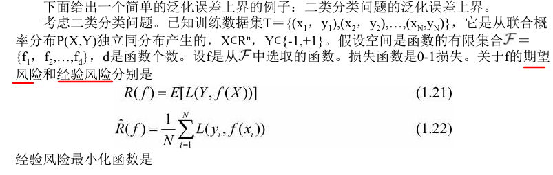

## 第一章、统计学习方法概论

### 1、统计学习的特点

- 计算机**基于数据构建模型**，并运用模型**对数据进行预测和分析**。其中**研究对象**是数据，**研究的目**的是对未知的数据进行预测。
- 统计学习建立在一个**基本假设**上：同类数据具有一定的统计规律性。
  - 统计规律：**对大量偶然事件整体起作用**的规律，表现这些**事物整体的本质和必然的联系**。<https://baike.baidu.com/item/%E7%BB%9F%E8%AE%A1%E8%A7%84%E5%BE%8B/894528?fr=aladdin>
- 统计学习是**概率论、统计学、信息论、计算理论、最优化理论、计算机科学**等多个领域的交叉学科。

### 2、统计学习的研究

- **统计学习方法**：旨在开发新的学习方法
- **统计学习理论**：探求统计学习方法的有效性与效率
- **统计学习应用：** 考虑将统计学习方法应用到实际问题中

### 3、统计学习方法的基本步骤

- 1）得到一个有限的**训练数据集合**
- 2）确定**包含所有可能模型**的**假设空间**，及学习模型的集合
- 3）确定**模型选择的准则**，及学习的策略
- 4）**实现求解最优模型的算法**，及学习的算法
- 5）通过学习方法**选择最优模型**
- 6）利用学习的最优模型对新数据进行预测或分析

### 3、监督学习

统计学习包括监督学习，半监督学习，非监督学习，强化学习。

监督学习利用训练数据集学习的一个模型，再用模型对测试样本集进行预测，**训练集往往是人工给出的，所以称之为监督学习**。

#### 3.1 基本概念

##### 1）输入变量 & 输入空间 & 特征向量 & 特征空间

- **输入空间**是在输入过程中，所有可能取值的集合。

- **输入变量常用X**表示，**输入变量的值用x**表示

- 每个具体的输入是一个**实例 x**，用**特征向量**（列向量）表示

  $x^{(i)}$ 表示x的**第i个特征**

  

- $x_{(i)}$表示多个**输入变量X中的第i个**

  

- 我的理解是：

  - 每个特征向量对应一个实例x；有多少个特征向量，输入变量X就有多少个实例xi。
  - 输入变量X可以统计实例个数，而输入空间指的是一个二维矩阵
  - **实例是从输入空间映射到特征空间上的**。

##### 2）输出变量 & 输出空间

- **输出空间**是在输出过程中，所有可能取值的集合

- **输出变量常用Y**表示，**输出变量的值用y**表示

##### 3）训练集

由**输入（或特征向量）与输出对**组成


##### 4）预测任务的分类

人们根据输入，输出变量的不同类型，对预测任务给予不同的名称

**回归问题**：X，Y均为**连续变量**的预测

**分类问题**：X，Y均为**有限个离散变量**的预测

**标注问题**：X，Y均为变量**序列**的预测

#### 3.2 问题的形式化


- 监督学习分为**学习和预测**过程
- **学习系统**：学习系统通过不断的尝试，**选取最好的模型**。学习系统利用给定的训练数据集，通过学习（或训练）得到一个模型，表示为**条件概率分布 P^(Y|X)**或**决策函数Y＝ f^(X)**。条件概率分布P^(Y|X)或决策函数Y＝ f^(X)描述输入与输出随机变量之间的映射关系。(用P^,f^表示学习系统学习得到的那个模型)
- **预测系统**：在预测过程中，预测系统对于给定的测试样本集中的输入$x_{N+1}$ ，由模型$y_{N+1} = arg max_{N+1} P(y_{N+1} | x_{N+1})$或$y_{N+1}$ ＝ $f(x_{N+1} )$给出相应的输出$y_{N+1}$ 。

#### 3.3、小总结

​		监督学习可以归结为**最小化一个目标函数**。求模型多项式的参数，防止过拟合。


### 4、统计学习的三要素

方法 = 模型 + 策略 + 算法

#### 4.1 假设空间(模型)

- 假设空间用F表示，模型的假设空间包含**所有可能的条件概率分布或决策函数**。

- 假设决策函数是输入变量的线性函数，那么模型的假设空间就是所有这些线性函数构成的函数集合。**假设空间中的模型一般有无穷多个**。假设空间（模型）的确定意味着学习范围的确定。

- 假设空间的定义

  决策函数的集合：

  

  条件概率分布的集合：

  

- 参数向量 & 参数空间：

  - 参数向量θ取值于**n维欧氏空间$R^n$**，称为参数空间
  - 假设“真模型”是决策函数，输入变量X的每一个实例x**只有一个特征**，那么我们可以用**泰勒多项式来逼近这个真模型**，得到最优的模型。其中多项式中特征x前的**系数随着多项式的次数变化而变化**，所有的系数构成一个参数向量。

#### 4.2 策略

##### 1）策略是什么

- 使它对已知训练数据和未知测试数据，在**给定的评价准则**下有**最优的预测**。我的理解是：利用训练集学习模型，在给定的评价标准下选择最优的模型，这个模型可以**使得测试误差最小**。

##### 2）评价准则

- **损失函数**

  - 预测值f(X)与真实值Y可能一致也可能不一致，用一个损失函数或代价函数来**度量预测错误的程度**

  - 损失函数是f(X)和Y的**非负实值函数**

  - 损失函数的类型：

    - **0-1损失函数**：

      

    - **平方损失函数**：

      

    - **绝对损失函数**：

      

    - **对数损失函数**：

      

  - 备注：如何理解对数损失函数

    - **对数损失函数**和**似然函数**的关系
      - 似然函数是指**一组参数在一堆数据下的似然值**，这个值等于每一条数据在该组参数下的**条件概率之积**，公式为`P(theta | x1, ..., xn) = P(x1 | theta) * ... * P(xn | theta) `其中theta是参数，xi是数据。
      - 贝叶斯公式 P(si | c) = P(c | si) * P(si)，如果实例c只有一个特征（一个句子），则**P(c| si) 是最简单的似然函数**，其中**P(si)**是先验概率，是接下来介绍的结构风险中的**正则化项（罚项）**
      - **对数损失函数 = 负对数似然**
      - **对数损失函数最小** = - log（**最大似然函数**）

    - 为什么要取对数？

      - **累乘变累加**，方便计算

        

    - 为什么要取负数？

      - **概率值是[0,1]内**，所以**概率值累乘会变成一个很小的值**。

      - 根据对数的图像，如果以大于1的数作为对数的底数，**累乘的概率值一定小于0**，而损失函数是**非负实值**，所以要取负。

        

- **风险函数 & 经验风险** 

  - **损失函数值越小，模型就越好**。由于模型的输入、输出（X,Y）是随机变量，遵循联合分布P(X,Y)，所以损失函数的期望是

    

    这是理论上模型f(X)关于**联合分布P(X,Y)的平均意义下的损失**，称为**风险函数**（risk function）或**期望损失**（expected loss）。

    由于**联合概率分布**在学习系统中是**未知的**（无论是学习模型，还是生成模型），所以**期望损失（风险函数）无法计算**，只能**用经验风险来替代**。

  - 模型f(X)关于**训练数据集的平均损失**成为**经验风险**或者**经验损失**。

    

  - 期望风险和经验风险的关系：

    **期望风险**$R_{exp} (f)$是模型**关于联合分布的期望损失**，**经验风险**$R_{emp} (f)$是模型**关于训练样本集的平均损失**。根据大数定律，当样本容量N趋于无穷时，经验风险$R_{emp} (f)$趋于期望风险$R_{exp} (f)$。

- **结构风险**

  - 在经验风险上加上表示**模型复杂度**的**正则化项**（regularizer）或**罚项**（penalty term）

    

  - $J(f)$为模型的复杂度，复杂度表示了对复杂模型的惩罚，模型$f$越复杂，复杂度$J(f)$就越大；反之，**模型$f$越简单，复杂度$J(f)$就越小**

  -  **λ≥0是系数**，用以权衡经验风险和模型复杂度

  - 对正则化项的理解

    - 正则化项可以取不同的形式。例如，回归问题中，**损失函数是平方损失**，正则化项可以是**参数向量的L-2 范数**。$||w||_2 $表示**参数向量w**的L-2 范数。

      

    - 正则化项也可以是参数向量的**L-1 范数**。$||w||_1$ 表示参数向量w的L-1 范数。

      

  - **为什么要引入范数？**

    - **二维实数空间中，取两个点**（1，1）和（0，3），这个时候我们就**没办法比较它们之间的大小**，因为它们不是可以比较的实数，于是我们引入范数这个概念，把我们的（1，1）和（0，3）通过范数分别映射到实数\sqrt{2} 和 3 ，这样我们就比较这两个点了。所以你可以看到，范数它其实是一个函数，它把不能比较的向量转换成可以比较的实数。
    - **范数它其实是一个函数**，它把不能比较的**向量转换成可以比较的实数**方便比较大小

  - **范数的分类？**

    - **矩阵范数**：描述矩阵引起变化的大小，AX=B，矩阵X变化了A个量级，然后成为了B。

    - 向量范数：描述向量在空间中的大小。**向量范数**的通用公式为**L-P范数**。

      

      - **L-0范数**：用来统计**向量中非零元素的个数**。0的任何次方都为0
      - **L-1范数 $||W||_1$**：向量中所有元素的绝对值之和。可用于**优化中去除没有取值的信息**，又称稀疏规则算子。**稀疏规则化算子**的引入就是为了**完成特征自动选择**的光荣使命，它会学习地去掉这些没有信息的特征，也就是把这些特征对应的权重置为0。
      - **L-2范数** $||W||_2$：典型应用——**欧式距离**。可用于优化正则化项，**避免过拟合**。
      - **L-∞范数**：计算向量中的最大值。

##### 3）基本策略

- **经验风险最小化**

  - 经验风险最小化的策略认为，**经验风险最小的模型**是**最优的模型**。

    

  - 当**模型是条件概率分布**，损失函数是**对数损失函数**时，**经验风险最小化**就等价于**极大似然估计**。

  - 缺点：当**样本容量很小**时，会产生“**过拟合**(over-fitting)”现象。

- **结构风险最小化**

  - 结构风险最小化（structural risk minimization，SRM）是为了**防止过拟合**而提出来的策略。**结构风险最小化**等价于**正则化**（regularization）。

    

  - 当**模型是条件概率分布**、损失函数是**对数损失函数**、模型**复杂度由模型的先验概率**表示时，**结构风险最小化**就等价于**最大后验概率估计**。

  - **结构风险小**需要**经验风险与模型复杂度同时小**。结构风险小的模型往往对训练数据以及未知的测试数据都有较好的预测。

  - 注意**训练集的个数N和参数的个数M不一定相等**，所以**加号不表示数组依次相加，而是数组的合并**。

  - 这里可以参考两个视频进行理解正则化

    [什么是 L1 L2 正规化 正则化 Regularization (深度学习 deep learning)](https://www.bilibili.com/video/BV1Tx411j7tJ/?spm_id_from=333.788.videocard.1)

    [10分钟彻底搞懂L2正则化--转自台大老师李宏毅2020](https://www.bilibili.com/video/BV18V411o7fX/?spm_id_from=333.788.videocard.3)

#### 4.3  算法

- 模型学习的算法（算法）是指**学习模型的具体计算方法**
- 统计学习问题归结为最优化问题，统计学习的算法成为**求解最优化问题的算法**。

### 5、模型评估与模型选择

#### 5.1 训练误差 & 测试误差

- **基于损失函数**的模型的训练误差（training error）和模型的测试误差（test error）就自然成为学习方法**评估的标准**。**最终的目的是使测试误差达到最小。**

- **训练误差**：模型Y= f^(X)关于训练数据集的平均损失（N为训练样本容量）

  

- **测试误差**：模型Y= f^(X)关于测试数据集的平均损失（N'为测试样本容量）

  

  - **误差率**(error rate)：当**损失函数是0-1损失**时，**测试误差**就变成了常见的测试数据集上的误差率，**y != f(x)时为1，否则为0**

    

  - **准确率**(accuracy)：注意准确率的计算不使用0-1损失函数，而与之相反，即**y = f(x)时为1，否则为0**

    

  - 误差率和准确率的关系

    

- 统计学习方法具体采用的损失函数未必是评估时使用的损失函数。当然，让**两者一致是比较理想**的。

#### 5.2 模型选择

- 当假设空间含有不同复杂度（例如，**不同的参数个数**）的模型时，就要面临模型选择（model selection）的问题。所选择的模型要与真模型的参数个数相同，**所选择的模型的参数向量与真模型的参数向量相近**。

##### 1）过拟合

- 指学习时选择的模型所包含的**参数过多**，以致于出现这一**模型对已知数据预测得很好**，但**对未知数据预测得很差**的现象

- 举个栗子：

  

  

  如果M＝9，多项式曲线通过每个数据点，训练误差为0。从对给定训练数据拟合的角度来说，效果是最好的。但是，因为**训练数据本身存在噪声**，这种拟合曲线对未知数据的预测能力往往并不是最好的。

  当M＝3时，多项式曲线对训练数据拟合效果足够好，模型也比较简单，是一个较好的选择。

##### 2）模型复杂度

- 随着**多项式次数（模型复杂度）**的增加，训练误差会减小，直至趋向于0，但测试误差却不如此，它会随着多项式次数（模型复杂度）的增加先减小而后增大。**多项式的次数越大，输入变量x前的次数越多（参数就越多），模型复杂度越大**。

- 训练误差和测试误差与模型复杂度的关系

  

##### 3）交叉验证

- 如果给定的**样本数据充足**，进行模型选择的一种简单方法是随机地将数据集切分成三部分，分别为训练集（training set）、验证集（validation set）和测试集（test set）。**训练集用来训练模型**，**验证集用于模型的选择**，而**测试集用于最终对学习方法的评估**。由于验证集有足够多的数据，用它对模型进行选择也是有效的。

- 但是，在许多实际应用中**数据是不充足**的。为了选择好的模型，可以采用交叉验证方法。**交叉验证**的基本想法是**重复地使用数据**；把给定的数据进行切分，将切分的**数据集**组合为**训练集与测试集**，在此基础上**反复地进行训练、测试以及模型选择**。

- **交叉验证的分类**

  - **简单交叉验证：**

    -  从全部的**训练数据S**中**随机选择**s的样例作为训练集 ，**剩余的作为测试集（验证集）**。

      

    - 一般来说，简单交叉验证并非一种交叉验证，因为**数据并没有交叉使用**。

    - 由于验证集和训练集是分开的，就避免了过拟合的现象。

  - **S折交叉验证：**

    -  将全部**训练集 S**分成 **k个不相交的子集**，假设 S中的训练样例个数为 m，那么每一个子集有 m/k 个训练样例，相应的**子集称作 {s1,s2,…,sk}**。每次从分好的子集中里面，拿出**一个作为测试集（验证集）**，其它**k-1个作为训练集。**

      

  - **留一交叉验证：**

    - 留一法就是每次只留下**一个样本做测试集**，其它样本做训练集，如果有k个样本，则**需要训练k次，测试k次**。
    - 留一法计算最繁琐，但**样本利用率最高**。适合于小样本的情况。

### 6、泛化能力

​		学习方法的**泛化能力**（generalization ability）是指由该方法学习到的模型对未知数据的预测能力

#### 6.1 泛化误差

- 测试误差的缺点：现实中采用最多的办法是**通过测试误差来评价学习方法的泛化能力**。但这种评价是依赖于测试数据集的。因为**测试数据集是有限**的，很有可能由此得到的**评价结果是不可靠**的。

- 如果学到的**模型是f^**，那么用这个模型对未知数据预测的误差即为**泛化误差**。事实上，**泛化误差**就是所学习到的模型的**期望风险**。

  

- 举个栗子：**二类分类问题**的泛化误差

  

  

#### 6.2 泛化误差上界

- 它是**样本容量的函数**，当样本容量增加时，泛化上界趋于0；它是**假设空间容量（capacity）的函数**，假设空间容量越大，模型就越难学，泛化误差上界就越大。

- 泛化误差 & 泛化误差上界：

  

  - 不等式（1.25）**左端$R(f)$是泛化误差**，**右端即为泛化误差上界**。

  - 在泛化误差上界中，**第1项是训练误差(经验风险）**，**训练误差越小，泛化误差也越小**。
  - 第2项**$ξ (d，N, σ)$是N的单调递减函数**，当**N趋于无穷时趋于0**；d是函数的个数，同时它也是**$logd$阶的函数**，假设空间F包含的函数越多，其值越大。(假设空间容量越大，**模型就越难学，泛化误差上界就越大**)

### 7、生成模型和判别模型

​	**监督学习方法**又可以分为**生成方法**（generative approach）和**判别方法**（discriminative approach）。所学到的模型分别称为**生成模型**（generative  model）和**判别模型**（discriminative model）。

#### 7.1 生成方法 & 生成模型

- 生成方法由数据**学习联合概率分布P(X,Y)**，然后**求出条件概率分布P(Y|X)**作为预测的模型，即生成模型：

  

-  **生成方法的特点：**

  - 生成方法可以**还原出联合概率分布P(X,Y)**，而判别方法则不能；
  - 生成方法的**学习收敛速度更快**，即当样本容量增加的时候，学到的模型可以更快地收敛于真实模型；
  - 当存在**隐变量**时，仍可以用生成方法学习，此时判别方法就不能用

- 典型的生成模型有：朴素贝叶斯法和隐马尔可夫模型

#### 7.2  判别方法 & 判别模型

- 判别方法由数据**直接学习决策函数f(X)或者条件概率分布P(Y|X)**作为预测的模型，即判别模型。
- **判别方法的特点：**
  - 判别方法直接学习的是条件概率P(Y|X)或决策函数f(X)，直接面对预测，往往**学习的准确率更高**；
  - 由于直接学习P(Y|X)或f(X)，可以对数据**进行各种程度上的抽象、定义特征并使用特征**，因此可以简化学习问题。
- 典型的判别模型包括：k近邻法、感知机、决策树、逻辑斯谛回归模型、最大熵模型、支持向量机、提升方法和条件随机场等

#### 7.3 分类问题

- 在监督学习中，当输出变量**Y取有限个离散值**时，预测问题便成为分类问题。这时，输入变量X可以是离散的，也可以是连续的。监督学习从数据中学习一个分类模型或分类决策函数，称为**分类器**（classifier）。
- 可能的输出称为类（class）。分类的类别为多个时，称为**多类分类问题**。本书主要讨论**二类分类问题**。

##### 1）正类 & 负类

​		通常以**关注的类为正类，其他类为负类**，分类器在测试数据集上的预测或正确或不正确，4种情况出现的总数分别记作：

- **TP**——将正类预测为正类数；
- **FN**——将正类预测为负类数；
- **FP**——将负类预测为正类数；
- **TN**——将负类预测为负类数。

##### 2）分类指标

- **准确率**（见模型评估那部分）

- **精准率（查准率）**＝检索出的相关信息量 / 检索出的信息总量

  

- **召回率（查全率）**＝检索出的相关信息量 / 系统中的相关信息总量

  

  附上两图便于理解

  

  

##### 3）分类方法

​		k近邻法、感知机、朴素贝叶斯法、决策树、决策列表、逻辑斯谛回归模型、支持向量机、提升方法、贝叶斯网络、神经网络、Winnow等

##### 4）应用


#### 7.4 标注问题

- 可以认为标注问题是分类问题的一个推广，标注问题又是更复杂的结构预测（structure prediction）问题的简单形式。

- 举个栗子：输入：At Microsoft Research，输出：At/O Microsoft/B Research/E

- 标注方法：隐马尔可夫模型、条件随机场。

- 应用：

  

#### 7.5 回归问题

- 回归用于**预测输入变量（自变量）和输出变量（因变量）之间的关系**。**回归模型**正是表示从输入变量到输出变量之间**映射的函数**。

- 回归问题的学习**等价于函数拟合**：选择一条函数曲线使其很好地拟合已知数据且很好地预测未知数据。

- 并**不是所有的拟合问题都是回归问题**，只要**模型是函数**（用函数进行分类），就存在拟合问题。

- **回归的分类：**

  - 回归问题按照**输入变量的个数**，分为**一元回归和多元回归**
  - 按照**输入变量和输出变量之间关系**的类型即模型的类型，分为**线性回归和非线性回归**
    - 线性和非线性的区别是**是否可以用直线将样本划分开**
    - 线性就是每个变量的指数都是1，而非线性就是至少有一个变量的指数不是1

- **回归方法**：

  回归学习最常用的损失函数是平方损失函数，在此情况下，回归问题可以由著名的**最小二乘法**（least squares）求解。

- **应用：**

  

### 8、用python解决一元回归的函数拟合问题

了解代码之前，先回顾之前的概念，以及了解一些新概念

#### 8.1  最小二乘法（最小平方法）

<https://www.zhihu.com/question/37031188>


#### 8.2  L-1，L-2正则化

- 李航老师书中给的公式如下，即**结构风险最小化=正则化= min（经验风险 + 正则化项）**


- 但是在python代码中，用了以下语句实现正则化，会发现得到的ret数组不是在原来的ret数组上，依次加上L-2范数。而是**将ret数组和L-2范数得到的数组，合并成一个大的数组**。

  ```python
   # 经验风险[0.31972216 -0.28167978 -0.64009235 -0.23185228 0.37735337 1.20983082 1.89436378 2.78654483
   # 3.26961043 3.81895049] M+1个数
  
  # 结构风险[3.19722159e-01 -2.81679783e-01 -6.40092347e-01 -2.31852279e-01 3.77353372e-01 1.20983082e+00
  # 1.89436378e+00 2.78654483e+00 3.26961043e+00 3.81895049e+00 4.97801504e-04 8.94357277e-04 2.55965917e-	
  # 03 6.09320893e-03 5.60403167e-03 3.88778337e-04 5.08172080e-03 2.28874924e-03 2.16380642e-03  	
  # 2.23093071e-03] 2*(M+1)个数
  ```

  设想一下，**经验风险是平均损失，与训练数据个数N**有关；而**模型复杂度与参数个数有关**，$J(f)$数组中元素个数，无论用是L-1范数，还是L-2范数计算，**个数都与多项式的次数M有关**；无法保证N和M相等，则**数组不能相加，只能合并**。

  ```python
  residuals_func_regularization:
  ...
   	print(len(ret)," ", len(np.sqrt(0.5*regularization*np.square(p))))
  	ret = ret + np.sqrt(0.5*regularization*np.square(p));
      
  main:
      # 在[0,1]区间内产生10个真实点(x,y)
      x_points = np.linspace(0,1,10)
      y_points = real_func(x_points)
  ... 
  	y_polyld_reg = fit_func(fitting(3, x_points, y_points, residuals_func_regularization), x)
      plt.plot(x, y_polyld_reg, label="regulation curve", color="cyan", lw=2.0)
   
  ---
  ValueError: operands could not be broadcast together with shapes (10,) (4,) 
  ```

- 当**参数$w_i$越趋近于0时，function越光滑**。在计算机制图中，会经常遇到**曲线的光滑处理**。曲线的光滑方法有许多，大体有两种类型：<https://baike.baidu.com/item/%E6%9B%B2%E7%BA%BF%E5%85%89%E6%BB%91/5170091>

  - 一种要求拟合曲线严格通过各离散点

  - 另一种则根据点列的大体趋势按**最小二乘法原理**来拟合一条曲线，该**曲线与离散点有较小偏离**。

  


- **L2正规化可以使function更加光滑**，而**L1正规化得到的解是不稳定**的


#### 8.3 代码中的一些注意点

- **Q1**：为什么**用噪点来训练得到最优的参数向量**（(p_lsq_9[0]），但是**在绘制图像时不用噪点x_point，y_point来绘制**?

  **A1**：因为如果用噪点画function，画不出光滑曲线，应该用非噪点的x，代入选择的最优模型，求y_point进行绘制。

  ```python
  plt.plot(x, fit_func(p_lsq_9[0], x), label='fitted curve')
  ```

- **`np.poly1d()`的使用**：通过传入长度为M+1的参数列表，构造M次多项式

- 通过最小二乘法（fitting方法里）+ 残差函数（或者正则化的残差函数）训练得到**最优的参数列表**

#### 8.4 代码演示

```python
import numpy as np;
from scipy.optimize import leastsq
import matplotlib.pyplot as plt;

# 目标函数sin(2πx)
def real_func(x):
    return np.sin(2*np.pi*x)

# 关于一个变量x的(次数依次递减）多项式函数
# p是一个多项式的系数列表，次数为M，系数个数为M+1
def fit_func(p,x):
    # np.poly1d的使用
    # >>> p = np.poly1d([1, 2, 3])
    # |  >>> print(np.poly1d(p))
    # |     2
    # |  1 x + 2 x + 3
    # |
    # |  Evaluate the polynomial at :math:`x = 0.5`:
    # |
    # |  >>> p(0.5)
    # |  4.25
    f = np.poly1d(p)
    return f(x)

# 经验风险(残差函数):预测值 - 真实值
def residual_func(p,x,y):
    return fit_func(p,x) - y

# 在residual_func经验风险的基础上，加上正则化项，变成结构风险
def residuals_func_regularization(p, x, y):

    regularization = 0.0001

    # 经验风险
    ret = residual_func(p,x,y)
    # print("经验风险", ret)
    # 经验风险[0.31972216 -0.28167978 -0.64009235 -0.23185228 0.37735337 1.20983082 1.89436378 2.78654483
    # 3.26961043 3.81895049] M+1个数
    

    # 结构风险(np。append()将两个数组合并成一个大数组，不是两个数组依次相加)
    ret = np.append(ret, np.sqrt(0.5*regularization*np.square(p))) # L2范数作为正则化项
    # print("结构风险", ret)
    # 结构风险[3.19722159e-01 -2.81679783e-01 -6.40092347e-01 -2.31852279e-01 3.77353372e-01 1.20983082e+00
    # 1.89436378e+00 2.78654483e+00 3.26961043e+00 3.81895049e+00 4.97801504e-04 8.94357277e-04 2.55965917e-	# 03 6.09320893e-03 5.60403167e-03 3.88778337e-04 5.08172080e-03 2.28874924e-03 2.16380642e-03  			# 2.23093071e-03] 2*(M+1)个数
    
    #如果是经验风险和正则化项依次相加，则有可能报错
    #print(len(ret)," ", len(np.sqrt(0.5*regularization*np.square(p))))
    #ret = ret + np.sqrt(0.5*regularization*np.square(p));
    
    return ret


# 函数参数是：M=多项式次数，x=训练集（噪点）横坐标，y=训练集（噪点）纵坐标，func=最小二乘法中选择的策略函数
# 通过产生M+1个随机的，[0,1]内的系数列表
# 使用最小二乘法的策略来避免学习到的多项式过拟合于目标函数
# 返回值是最优参数列表
def fitting(M, x, y, func):

    # dn表示数组的维度
    # out: ndarray, shape
    # ``(d0, d1, ..., dn)``
    # Random values.
    # >> > np.random.rand(3, 2)
    # array([[0.14022471, 0.96360618],  # random
    #        [0.37601032, 0.25528411],  # random
    #        [0.49313049, 0.94909878]])  # random
    p_init = np.random.rand(M + 1)
    print("初始参数列表", p_init)

    # 最小二乘法得到最优的参数向量（多项式中的系数（权值）列表）
    # leastsq()第一个参数为模型选择的策略函数：损失函数，经验风险函数，结构风险函数
    # 这里使用residual_func()，或者residuals_func_regularization作为策略函数，目的是得到最优的p_init列表,
    # args=(x,y)为residual_func()剩余的参数
    # 注意第一个参数是函数名，不带()
    p_lsq = leastsq(func,p_init,args=(x,y))
    print('最优参数列表', p_lsq[0])

    return p_lsq[0]

if __name__ == '__main__':
    # 在[0,1]区间内产生10个真实点(x,y)
    x_points = np.linspace(0,1,10)
    y_points = real_func(x_points)

    # 将真实点加上正态分布噪音的目标函数的值，作为训练集，散点表示
    # 参数loc(float)：正态分布的均值，对应着这个分布的中心。loc=0说明这一个以Y轴为对称轴的正态分布，
    # 参数scale(float)：正态分布的标准差，对应分布的宽度，scale越大，正态分布的曲线越矮胖，scale越小，曲线越高瘦。
    # 参数size(int 或者整数元组)：输出的值赋在shape里，默认为None。
    y_points = [np.random.normal(0, 0.1) + y1 for y1 in y_points]
    plt.scatter(x_points, y_points, label="noise",color="blue")

    # 在[0,1]区间内产生1000个点，汇出光滑的目标函数曲线
    x = np.linspace(0,1,1000)
    y = real_func(x)
    plt.plot(x, y, label="real curve",color="red",lw=2.0)

    # 利用噪点来训练多项式
    # 1、利用最小二乘法得到最优的参数列表  print(fitting(3,x_points,y_points))
    # 2、将最优的参数列表，噪点x代入fit_func(p, x),得到最优的多项式，即最优的模型
    y_polyld = fit_func(fitting(9,x_points,y_points,residual_func),x)
    plt.plot(x, y_polyld, label="fitted curve", color="green",lw=2.0)

    
    y_polyld_reg = fit_func(fitting(9, x_points, y_points, residuals_func_regularization), x)
    plt.plot(x, y_polyld_reg, label="regulation curve", color="cyan", lw=2.0)

    # 把所有图例放在一起
    plt.legend()
    plt.show()
```


### 9、本章问题

**Q1**：L-2范数的正则化项如何避免过拟合？

**Q2**：回归问题的学习**等价于函数拟合**，是不是说函数拟合问题只在回归问题中出现，在分类，标注问题中没出现？

**Q3**：联合概率分布是不是在判别模型中是未知的，但在生成模型中是已知的？

A3：联合概率在学习系统中是未知的

### 10、参考文档

1、[对数损失函数](https://zhuanlan.zhihu.com/p/89614607)

2、[对数损失函数是如何度量损失的？](https://www.zhihu.com/question/27126057/answer/88843578)

3、[机器学习中的范数规则化之（一）L0、L1与L2范数](https://blog.csdn.net/zouxy09/article/details/24971995)

4、[L1,L2,L0区别，为什么可以防止过拟合 - 简书](https://www.jianshu.com/p/475d2c3197d2)

5、[范数的用途、什么是范数](https://blog.csdn.net/a6333230/article/details/87860875)

6、[交叉验证（Cross Validation）](https://blog.csdn.net/weixin_40475450/article/details/80578943)

7、[交叉验证（简单交叉验证、k折交叉验证、留一法）](https://blog.csdn.net/u010451580/article/details/51373081)

8、[李航统计学习方法笔记——泛化误差上界](https://blog.csdn.net/ghr19961014/article/details/104549797)

9、[机器学习面试之生成模型VS判别模型](https://www.jianshu.com/p/4ef549eb0ad4)

10、[如何解释召回率与精确率？](https://www.zhihu.com/question/19645541)

11、[怎样区分线性和非线性_线性与非线性的区别（线性分析、线性模型）](https://blog.csdn.net/weixin_41797870/article/details/85012811)

12、[最小二乘法的本质是什么？](https://www.zhihu.com/question/37031188)

13、[什么是 L1 L2 正规化 正则化 Regularization (深度学习 deep learning)](https://www.bilibili.com/video/BV1Tx411j7tJ/?spm_id_from=333.788.videocard.1)

14、[10分钟彻底搞懂L2正则化--转自台大老师李宏毅2020](https://www.bilibili.com/video/BV18V411o7fX/?spm_id_from=333.788.videocard.3)


