## K近邻法（KNN）

[TOC]

### 零、预备知识

#### 1、方差

参考<https://baike.baidu.com/item/%E6%96%B9%E5%B7%AE%E8%AE%A1%E7%AE%97%E5%85%AC%E5%BC%8F/5318566?fr=aladdin>

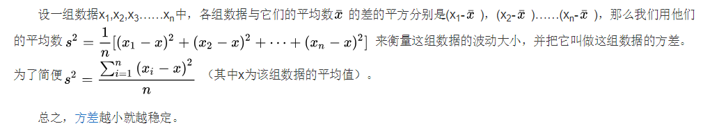

#### 2、标准差

 参考<https://baike.baidu.com/item/%E6%A0%87%E5%87%86%E5%B7%AE/1415772?fr=aladdin>

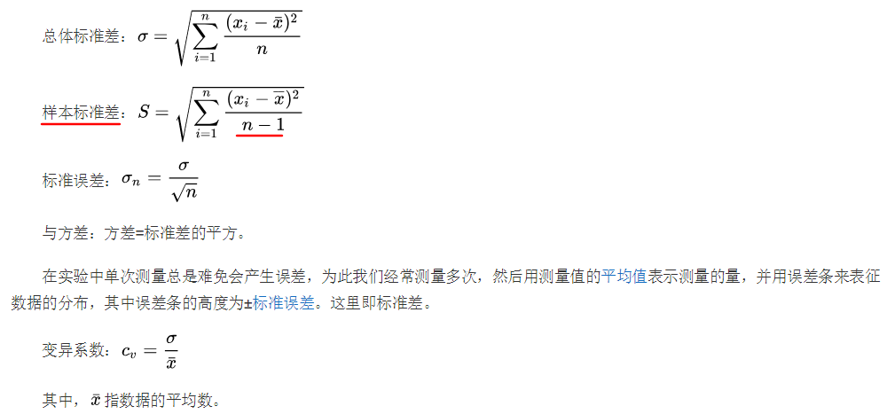

#### 3、正态分布

<https://baike.baidu.com/item/%E6%AD%A3%E6%80%81%E5%88%86%E5%B8%83/829892?fr=aladdin>

- 正态分布的特点：
  - **集中性**：正态曲线的高峰位于正中央，即[均数](https://baike.baidu.com/item/均数)所在的位置。
  - **对称性**：正态曲线以均数为中心，左右对称，曲线两端永远不与[横轴](https://baike.baidu.com/item/横轴)相交。
  - **均匀变动性**：正态曲线由均数所在处开始，分别向左右两侧逐渐均匀下降。

- 方差为什么要开平方得到标准差？

  - 因为**方差是x的二次方**，不能直接反映到直线上，而**标准差是x的一次方**，可以直接反映到直线上。
  - 标准差反映了正态分布曲线的扩张程度，**方差越大分布越分散，方差越小分布越集中**。

  参考[StatQuest - 统计基础之均值, 方差和标准差 (中英字幕)](https://www.bilibili.com/video/BV1Wt411K7hr?from=search&seid=15908315471189209313)

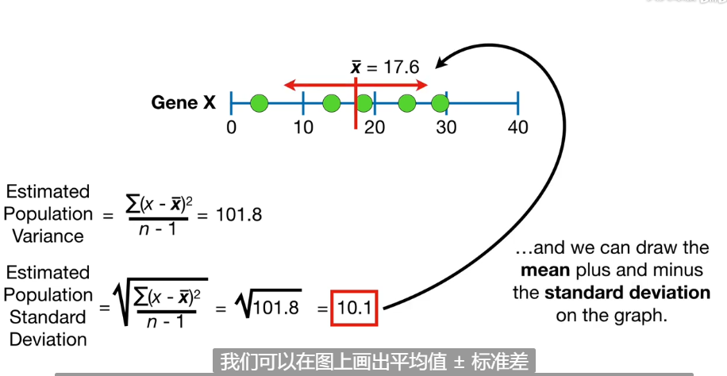

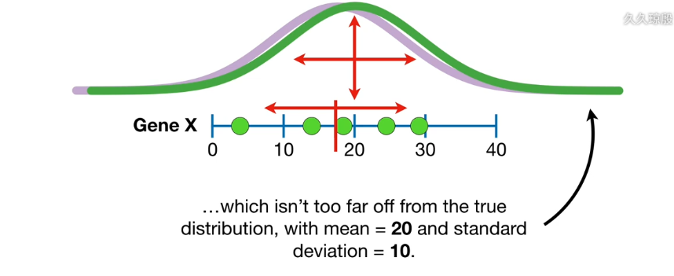

- **二维正态分布**：可以看出方差在二维平面中，可以反映实例点的密集情况<https://baike.baidu.com/item/%E4%BA%8C%E7%BB%B4%E6%AD%A3%E6%80%81%E5%88%86%E5%B8%83/2951835?fr=aladdin>

  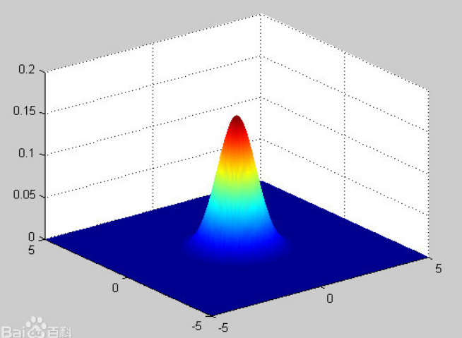

#### 4、备注

##### 1）区别欧氏距离和标准差：

- 标准差是在**均值基础**上计算的，反映数据的**分布密集**情况。
- 欧氏距离是在**点与点**基础上计算的，反映两个实例点的**相似程度**。

##### 2）为什么样本标准差时要除以$n-1$而不是$n$

- 除以$n$则低估了总体的方差

- **样本的均值和总体均值存在误差**，而除以$n-1$弥补了这个误差

- 无论样本均值是**大于还是小于**总体均值，**样本的方差都小于总体的方差**。

  通过求导研究“方差”曲线的变化率，发现在样本均值下，样本方差为最小值（极小值）。详细证明请见这里[StatQuest - 为什么除以 n 会低估了方差？(中英字幕)](https://www.bilibili.com/video/BV1d4411X7fk?spm_id_from=333.788.b_636f6d6d656e74.19)

- 可以通过令“方差”曲线导数为0，求出均值v，再拿v和样本均值比较，发现是一样的。

### 一、KNN基本概念

#### 1、基本概念

- K近邻法（k-Nearest Neighbor，KNN）是一种基本**分类与回归**方法。分类时，根据其**k个最近邻**的训练实例的类别，通过**多数表决**等方式进行预测

  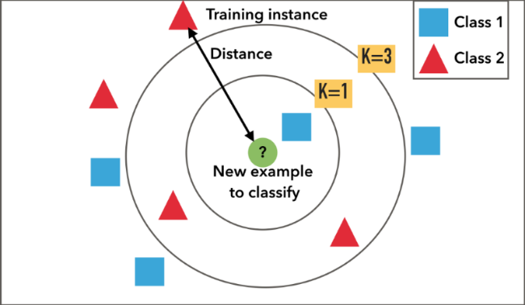

- K近邻**不具有显式**的学习过程

- K近邻法的最简单的实现方法是**线性扫描**，这时要计算**输入实例**与**每一个训练实例的距离**。当训练集很大时，计算**非常耗时**，这种方法是不可行的。为了提高k近邻搜索的效率，引入**kd树**

- 说到底，K近邻就是**找k值 + 多数表决**进行类别的预测

#### 2、KNN优缺点

**优点：**

- 简单，易于理解，无需建模与训练，易于实现；

- 适合对稀有事件进行分类；

- 适合与多分类问题，例如根据基因特征来判断其功能分类，kNN比SVM的表现要好。

**缺点：**

- 惰性算法，内存开销大，对测试样本分类时计算量大，性能较低；

- 可解释性差，无法给出决策树那样的规则。

#### 3、备注

参考[深入浅出KNN算法（一） 介绍篇](https://zhuanlan.zhihu.com/p/61341071)

KNN是一种**非参的**，**惰性**的算法模型。什么是非参，什么是惰性呢？

- **非参**的意思**并不是说这个算法不需要参数，而是意味着这个模型不会对数据做出任何的假设**，与之相对的是线性回归（我们总会假设线性回归是一条直线）。也就是说KNN建立的模型结构是根据数据来决定的，这也比较符合现实的情况，毕竟在现实中的情况往往与理论上的假设是不相符的。

- **惰性**又是什么意思呢？想想看，同样是分类算法，逻辑回归需要先对数据进行大量训练（tranning），最后才会得到一个算法模型。而KNN算法却不需要，它没有明确的训练数据的过程，或者说这个过程很快。

### 二、KNN模型

​		KNN模型由三个基本要素构成：**距离度量（欧氏距离）**，**k值的选择**和**分类决策规则（多数表决）**

#### 1、距离度量

- 特征空间中，所有训练实例点的单元构成对特征空间的一个划分。最近邻法将实例ix的类iy作为其单元中所有点的类标记（class label），**每个单元**的**实例点的类别是确定**的。

  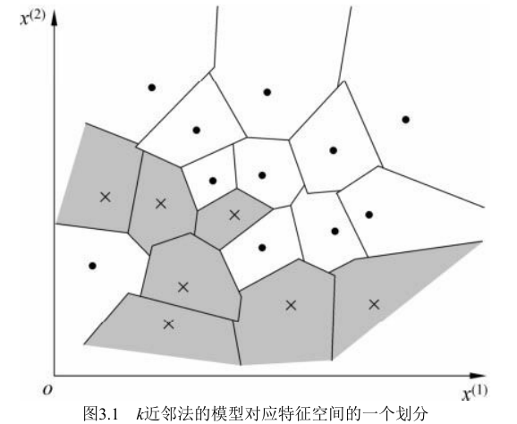

- 特征空间中**两个实例点的距离**是两个实例点**相似程度**的反映

- $x_i,x_j$的$L_p$距离为： $L_p(x_i,x_j) = (\sum_{l=1}^n |x_i^{(l)} - x_j^{(l)}|^p)^{\frac{1}{p}}$，当$p$取不同值时，有不同的距离度量方式：

  - **欧式距离**：$p$ = 2时，$L_p(x_i,x_j) = (\sum_{l=1}^n |x_i^{(l)} - x_j^{(l)}|^2)^{\frac{1}{2}}$
  - **曼哈顿距离**：$p$ = 1时，$L_p(x_i,x_j) = (\sum_{l=1}^n |x_i^{(l)} - x_j^{(l)}|)$
  - **L-∞距离**： $p$= ∞时，$L_p(x_i,x_j) = max_l |x_i^{(l)} - x_j^{(l)}|$

- $L_p$距离间的关系（会不会感觉**欧式距离曲线比较平滑**，其他距离曲线变化不稳定（拐点不能求导），所以在线性回归中，**用L-2范数（欧式距离）优化正则化项，防止曲线过拟合**）

  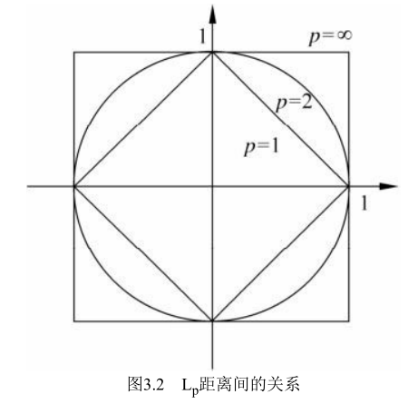

- 距离度量与最近邻点：**不同的距离度量所确定的最近邻点是不同的**。

#### 2、K值的选择

在进行k值选择之前，先了解一下什么是近似误差和估计误差<https://blog.csdn.net/mxg1022/article/details/80689662>

- **近似误差关注训练集**，如果近似误差小了会出现过拟合的现象，对现有的训练集能有很好的预测，但是对未知的测试样本将会出现较大偏差的预测。模型本身不是最接近最佳模型。
- **估计误差关注测试集**，估计误差小了说明对未知数据的预测能力好。模型本身最接近最佳模型。

**较小的k值：**

- 如果选择**较小的k值**，就相当于用**较小的邻域**中的训练实例进行预测，“学习”的**近似误差（approximation  error）会减小**，只有与输入实例较近的（**相似的**）训练实例才会对预测结果**起作用**。但缺点是“学习”的**估计误差（estimation error）会增大**，预测结果会对近邻的实例点非常敏感 [2] 。如果邻近的实例点恰巧是噪声，预测就会出错。换句话说，**k值的减小**就意味着整体模型变得复杂，容易发生**过拟合**。

**较大的k值：**

- 如果选择**较大的k值**，就相当于用**较大邻域**中的训练实例进行预测。其优点是可以减少学习的估计误差。但缺点是学习的近似误差会增大。这时与输入实例较远的（**不相似的**）训练实例也会对预测**起作用**，使预测发生错误。k值的增大就意味着整体的模型变得
  简单。

**最优k值：**

- 在应用中，k值一般取一个比较小的数值。通常采用**[交叉验证法](https://baike.baidu.com/item/%E4%BA%A4%E5%8F%89%E9%AA%8C%E8%AF%81/8543100?fr=aladdin)**来选取**最优的k值**。

#### 3、分类决策规则

- 多数表决规则等价于**经验风险最小化**。

- 如果分类的**损失函数**（预测值f(X)与真实值Y可能一致也可能不一致，用一个损失函数或代价函数来度量预测错误的程度）为**0-1损失函数**，**分类函数**为$f:R^n -> \{c_1,c_2,...,c_k\}$

  那么误分类的概率为：$P(Y != f(X)) = 1 - P(Y = f(X))$

  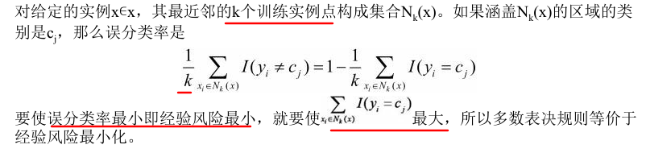

#### 4、备注

- 问：K近邻算法一开始不是说它是一个**不具显式的学习过程**吗？没有学习过程，即**没有预测值和真实值的比较（单纯求出以k为半径的圆域内最多的类）**，怎么能得到最小化的误分类率呢？

- 换句话说，**为什么多数表决策略**等价于经验风险最小化，误分类率最小化

  - 对于多数表决策略，先**假设最近邻的圆域半径r确定**（因为**最优的半径r**也是通过交叉验证得到的）

  - 可以采用**S折交叉验证法**，在n个实例的训练集（已知$x_i^{(j)}$特征和分类标记$y_i$）中，取1个实例x作为输入实例，其余n-1点作为训练集，经过S折后求出一个**平均损失**（经验风险）
  - 要保证经验风险最小，又因为损失函数是一个**0-1损失函数**，误分类率 = 1 - 准确率，即保证**准确率最大**即可。准确率要大，即在以半径r的圆域中，预测正确的类尽可能多，这就有了多数表决。

### 三、KNN的实现方法 - kd树

#### 1、kd树概念

- kd-树是**K-dimension tree**的缩写，是对数据点在k维空间（如二维(x，y)，三维(x，y，z)，k维(x1，y，z..)）中划分的一种数据结构
- Kd-Tree是从**BST(Binary search tree)**发展而来，是一种高维索引树形数据结构，二叉搜索树的特点：
  - 若它的左子树不为空，则它的左子树节点上的值皆小于它的根节点。
  - 若它的右子树不为空，则它的右子树节点上的值皆大于它的根节点。
  - 它的左右子树也分别是二叉查找树。
- kd树是一种**空间划分树**，主要应用于多维空间关键数据的搜索（如：**范围搜索和最近邻搜索**）。本质上说，Kd-树就是一种**平衡二叉树**。参考[KNN（三）--KD树详解及KD树最近邻算法](https://blog.csdn.net/App_12062011/article/details/51986805)

#### 2、kd树构造算法

##### 1）算法

​		有些kd树在选择特征作为切分时是以**最大方差**来作为标准，而有些就**按顺序选取（即x，y，z...循环划分）**。

###### A：最大方差

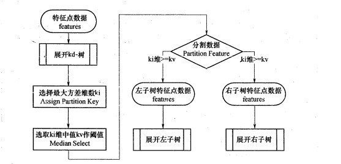

- 先通过**方差最大值**确定要划分的维度，再通过该维度的**中位数**作为**切分超平面**

- 优点是：数据点在某一维度坐标值的**方差越大分布越分散，方差越小分布越集中**。从方差大的维度开始切分可以取得很好的切分效果及平衡性。

- 缺点是：如果通过计算方差得到维度，那么如果存在多次对同一维（比如x维）进行划分，就会使得**kd树不平衡**，搜索效率低

  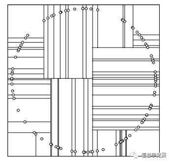

- 为了避免这种情况，需要修改一下算法，纬度的选择的依据为**数据范围最大的那一维作为分割纬度**，之后也是选中这个纬度的中间节点作为轴点，然后进行分割，分割出来的结果是：

  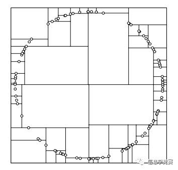

  参考[KD树](https://blog.csdn.net/Bluenapa/article/details/88206111)

###### B：顺序选取

​		以三维空间为例，这样kd树的层级关系为$(x -> y -> z -> x -> y -> z ... )$

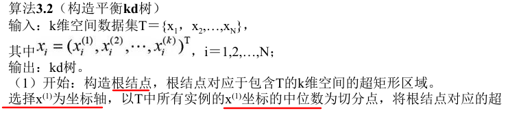

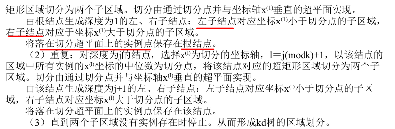

##### 2）kd树的构造

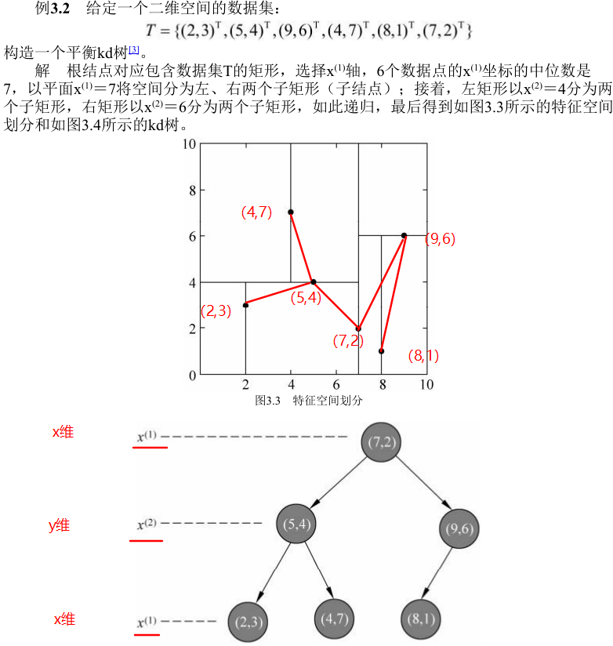

#### 3、kd树最近邻搜索算法

##### 1）搜索过程

参考[KD树](https://blog.csdn.net/Bluenapa/article/details/88206111)

- 这里还有几个细节需要注意一下，如下图，假设标记为星星的点是 test point， 绿色的点是找到的近似点，在回溯过程中，需要用到**一个队列，存储需要回溯的点**，在判断其他子节点空间中是否有可能有距离查询点更近的数据点时，做法是**以查询点为圆心，以当前的最近距离为半径画圆**，这个圆称为候选超球（candidate hypersphere），**如果圆与回溯点的轴相交，则需要将轴另一边的节点都放到回溯队列里面来**。

  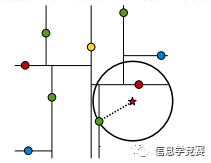

  判断轴是否与候选超球相交的方法可以参考下图：

  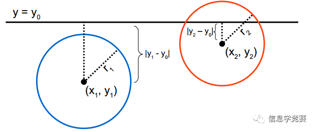

- 举个栗子：题目在*三.2.B*中，kd树结构如下

  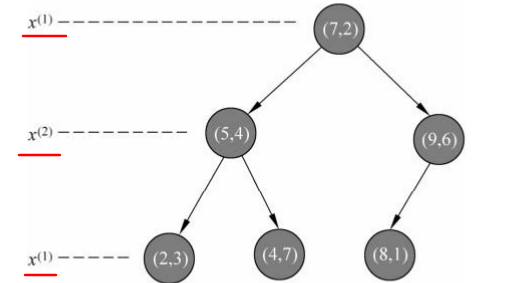

  - 我们来查找点(2,4.5)，在(7,2)处测试到达(5,4)，在(5,4)处测试到达(4,7)叶子节点，然后search_path中的结点为**<(7,2), (5,4), (4,7)>**，从search_path中取出**(4,7)**作为当前最佳结点**nearest,** **dist为3.202**；

  - 然后**回溯至(5,4)**，以(2,4.5)为圆心，以**dist=3.202为半径画一个圆与超平面y=4相交**（第二层特征为y），如下图，所以需要跳到(5,4)的左子空间去搜索。所以要**将(2,3)加入到search_path**中，现在search_path中的结点为<(7,2), (2, 3)>；另外，(5,4)与(2,4.5)的距离为3.04 < dist = 3.202，所以将**(5,4)赋给nearest**，并且**dist=3.04**。

    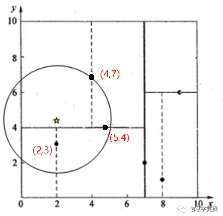

  - **回溯至(2,3)，(2,3)是叶子节点**，直接平判断(2,3)是否离(2,4.5)更近，计算得到距离为1.5，所以**nearest更新为(2,3)，dist更新为1.5**

    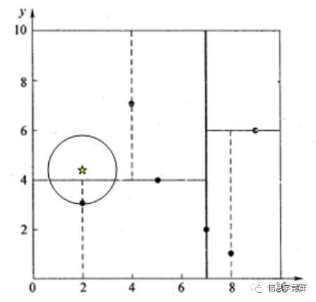

  - 回溯至(7,2)，同理，以(2,4.5)为圆心，以dist=1.5为半径画一个圆并**不和超平面x=7相交**, 所以不用跳到结点(7,2)的右子空间去搜索。

  至此，search_path为空，结束整个搜索，返回nearest(2,3)作为(2,4.5)的最近邻点，最近距离为1.5。

##### 2）备注

- 注意kd树的每一层对应不同的特征，要进行实例点的搜索比较，则是**在该层中进行同一特征的大小比较**。判断圆域是否和划分超平面相交，也是在**同一特征上**进行判断。
- kd树算法在回溯过程中用到**一个队列，存储需要回溯的点**。方便根据左右子树的回溯节点，或者叶子节点，比较计算**最小的距离dist，和最近节点nearest**。

#### 4、kd树的删除

​		这里详见[KNN（三）--KD树详解及KD树最近邻算法](https://blog.csdn.net/App_12062011/article/details/51986805)即可

### 四、问题

1、Kd树可以存在多个根节点吗，假设实例x的$x^{(i)}$中位数存在多个，这样第一次划分超平面时就存在多个根节点了...

- 应该不会，只是构造出来的**kd树非常不平衡**，搜索效率差而已。举个栗子：${(3,1),(3,2),(3,4),(3,6)}$，第一次划分，四个点都在一条线上，假设将$(3,1)$作为根节点，则根据kd树构造过程，会得到一个**每个节点只有右子树的kd树**，非常不平衡。

2、kd树通过筛选得到最近邻的点，将该点的类别作为对输入实例点的类别的预测。这里kd树没有用到多数表决，是吗？

3、KNN还有哪些算法？

### 五、参考文档

1、[KD树](https://blog.csdn.net/Bluenapa/article/details/88206111)

2、[KNN（三）--KD树详解及KD树最近邻算法](https://blog.csdn.net/App_12062011/article/details/51986805)

3、[k-d tree算法原理及实现](https://leileiluoluo.com/posts/kdtree-algorithm-and-implementation.html)

4、[KNN算法和kd树详解（例子+图示）](https://blog.csdn.net/zzpzm/article/details/88565645)

5、[深入浅出KNN算法（一） 介绍篇](https://zhuanlan.zhihu.com/p/61341071)