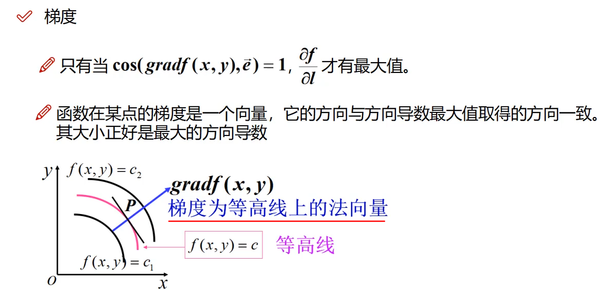

## 第二章、感知机

[TOC]


### 1、预备知识

#### 1.1 线性可分 & 线性不可分

<https://zhidao.baidu.com/question/7372652.html>

- **线性可分**就是说可以用**一个线性函数（一次函数）**把两类样本分开，比如二维空间中的**直线**、三维空间中的**平面**以及高维空间中的线性函数。可分指可以没有误差地分开；（油和水）
- 线性不可分指有部分样本用线性分类面划分时会产生**分类误差**的情况。（酒精可溶于水）

#### 1.2 内积(数量积，点积)

<https://baike.baidu.com/item/%E7%82%B9%E7%A7%AF/9648528fromtitle=%E5%86%85%E7%A7%AF&fromid=422863&fr=aladdin>

- 设二维空间内有两个向量$\vec{a} = (x_1,y_1) $和$\vec{b} = (x_2,y_2) $，定义它们的**数量积**（又叫**内积、点积**）为以下实数：

  

  更一般地，n维向量的内积定义如下：

  

- 使用矩阵乘法并把列向量当作n×1矩阵，点积还可以写为：$\vec{a} \cdot \vec{b} = (a^T) * b $这里的$a^T$指示矩阵a的转置。

- 设二维空间内有两个向量$\vec{a}$和$\vec{b}$，$|\vec{a}|和$$|\vec{b}|$表示向量a和b的大小，它们的夹角为

  

   则内积定义为以下实数：

  

  该定义**只对二维和三维空间有效**。

- u的大小、v的大小、u,v夹角的余弦。在u,v非零的前提下，**点积如果为负**，则u,v形成的**角大于90度**；如果为**零**，那么**u,v垂直**；如果为**正**，那么**u,v形成的角为锐角**。

#### 1.3 方向导数 & 梯度 & 梯度下降

##### 1）方向导数

参考 [方向导数](https://baike.baidu.com/item/%E6%96%B9%E5%90%91%E5%AF%BC%E6%95%B0/8923917?fr=aladdin)

[终于理解了方向导数与梯度](https://www.cnblogs.com/key1994/p/11503840.html)

- 方向导数的本质是一个数值，简单来说其定义为：一个函数**沿指定方向的变化率**。构建方向导数需要有两个元素： **函数和指定方向**

- 设函数$z=f(x,y) $在点$P(x,y)$的某一邻域$U(P)$内有定义，自点P引射线$l$，自**x轴的正向到射线$l$的转角为φ** ，

  

   为$l$上的另一点，若

  

   存在，则称此极限值为$f(x,y)$ 在点P沿方向$l$的方向导数，记作$\frac{Эf}{Эl}$．其计算公式为

  

- 三元函数u=f(x,y,z)在点P(x,y,z)沿着方向$l$ (方向角为α，β，γ）的方向导数的定义为

  

  其中

  

   其计算公式为

  

- 以下山为例，山的表面可以通过一个函数描述，假设人在山上某个位置，他可以选择多种下山的方向，但是不同的方向，下山的速率是不同的。**速度的值就是方向导数的直观理解**。

- 以一个例题为例

  

##### 2）梯度

参考[什么是梯度？为什么梯度方向就是函数上升最快的方向？](https://blog.csdn.net/weixin_42398658/article/details/83017995)

- 梯度与方向导数是有本质区别的，**梯度其实是一个向量**，既有大小又有方向，其定义为：一个函数对于其自变量分别求偏导数，**这些偏导数所组成的向量**就是函数的**梯度**。

  

- 函数在某点的梯度是这样一个向量，梯度的**方向**与取得**最大方向导数的方向**一致，即它的方向是**函数增长最快的方向**。

  而它的**模**为**方向导数的最大值**。严格应该说，梯度的模是该点在**局部区域上的极大值**。

- 一般该点的**切线方向**即为**梯度的方向**：三维空间中，$cosφ$ = 1，即$φ$ = 90°时，方向导数最大，**速率增长最大**，所以梯度是函数上升方向；而$cosφ$ = -1，即$φ$ = -90°时，方向导数最小，**速率下降最大**，所以梯度反方向是函数下降最快方向；梯度是等高线上的法向量。

  

- 以一个例题为例

  

##### 3）梯度下降

参考[梯度](https://study.163.com/course/courseLearn.htm?courseId=1005695008&share=1&shareId=1141610980#/learn/video?lessonId=1052965107&courseId=1005695008)

- 梯度下降是针对梯度而言的，在机器学习中，我们要**保证损失函数尽可能的小**，如果使用梯度（上升），则违背我们的目的。而恰恰梯度下降可以帮我们找到局部下降最快的方向，找到最优最小的损失函数。

#### 1.4 点到直线（平面）的距离

**向量法**计算点到平面的距离，就是把点和平面放在直角坐标系下进行计算。这样，点和平面均可用坐标来表示（如图所示）。设平面Π的方程为：


点到平面的距离公式为：


#### 1.5 Gram矩阵

摘取自<https://blog.csdn.net/wangyang20170901/article/details/79037867/>


- 格拉姆矩阵可以看做feature之间的**偏心协方差矩阵**（即没有减去均值的协方差矩阵），在**feature map**中，每个数字都来自于一个特定滤波器在特定位置的卷积，因此每个数字代表**一个特征的强度**，而**Gram**计算的实际上是**两两特征之间的相关性**，哪两个特征是**同时出现**的，哪两个是**此消彼长**的等等，同时，Gram的对角线元素，还体现了每个特征在图像中出现的量，因此，**Gram有助于把握整个图像的大体风格**。有了表示风格的Gram Matrix，要度量两个图像风格的差异，只需比较他们Gram Matrix的差异即可。
- 总之， 格拉姆矩阵用于度量**各个维度自己的特性**以及**各个维度之间的关系**。内积之后得到的多尺度矩阵中，对角线元素提供了不同特征图各自的信息，其余元素提供了不同特征图之间的相关信息。这样一个矩阵，既能体现出有哪些特征，又能体现出不同特征间的紧密程度。

#### 1.6 补充知识点

#####  1）线性 & 非线性，齐次 & 非齐次

参考<https://www.zhihu.com/question/19816504?sort=32>

以微分方程为例

- 以**未知函数和它的各阶导数作为总体**是**一次**的就称为线性微分方程，否则是非线性微分方程，eg：$y' +p(x)y = q(x)$是一阶线性非齐次微分方程
- $y'' + p(x)y' + q(x)y = f(x)$，其中$p(x)$，$q(x)$，$f(x)$都为连续函数，当**右端项$f(x)=0$**时，称为**齐次方程**，否则为非齐次方程。

说白了，线性就是指未知数（自变量x或者是n阶导数$y^{(n)}$) 都是**一次幂**；

##### 2）线性变换

参考[线性变换](https://baike.baidu.com/item/%E7%BA%BF%E6%80%A7%E5%8F%98%E6%8D%A2/5904192?fr=aladdin)

- 线性变换是线性代数研究的一个对象，即[向量空间](https://baike.baidu.com/item/向量空间)到自身的保运算的映射。例如，对任意线性空间V，[位似](https://baike.baidu.com/item/位似)是V上的线性变换，**平移则不是V上的线性变换**。对**线性变换的讨论可借助矩阵实现**。σ关于不同基的矩阵是相似的。Kerσ={a∈V|σ（a）=θ}（式中θ指[零向量](https://baike.baidu.com/item/零向量)）称为σ的核，Imσ={σ（a）|a∈V}称为σ的象，是刻画σ的两个重要概念。

- 对于欧几里得空间，若σ关于[标准正交基](https://baike.baidu.com/item/标准正交基)的矩阵是正交（对称）矩阵，则称σ为正交（对称）变换。**正交变换具有保内积、保长、保角等性质**，对称变换具有性质：〈σ(a)，β〉=〈a，σ（β）〉。

- **为什么要选择非退化的线性替换？**

  [如何理解二次型的线性替换](https://zhuanlan.zhihu.com/p/139794652)

  如果仅仅为了代数表达式的替换，是不需要考虑线性替换是否退化的。但因为研究二次型的目的是刻画所有二次曲线、二次曲面的图像。而**线性替换的目的，是为了通过坐标系的变换，而得出标准形**，从而发现这个二次方程的图像。因此，替换矩阵必须是可逆矩阵，不然无法进行坐标系变换。

  继续考虑文章开头的二次型$f = x^2 + 2xy  + 2y^2 = 16$，经过一个退化的线性替换

  ![[公式]](https://www.zhihu.com/equation?tex=%7B%5Cbinom%7Bx%7D%7By%7D%3D%5Cleft%28+%5Cbegin%7Barray%7D%7B%7D+1+%26-1++%5C%5C+-1+%26+1+%5C%5C+%5Cend%7Barray%7D+%5Cright%29+%5Cbinom%7Bu%7D%7Bv%7D%7D%5C%5C)

  化为了$(u-v)^2 = 16$.这是替换矩阵的列向量线性相关，无法构造新的坐标系。就算把$u,v$理解成线性无关的两个向量，那么也$(u-v)^2 = 16$是两条平行直线，早已经与原来的椭圆图形相距甚远。很显然，**一个退化的线性替换对于研究二次方程的图像是没有帮助的**。

### 2、感知机模型

#### 2.1 感知机基本概念

- 感知机（perceptron）是**二类分类的线性分类模型**(线性分类器），其输入为实例的特征向量，输出为实例的类别，取**+1和–1二值**。
- 感知机对应于输入空间（特征空间）中将实例划分为正
  负两类的**分离超平面**，属于**判别模型**。
- 感知机学习旨在求出将训练数据进行**线性划分**的分离超平面，为此，导入基于**误分类的损失函数**，利用**梯度下降法**对损失函数进行极小化，求得感知机模型。
- 感知机模型是一个神经元模型，它是神经网络与支持向量机的基础。

#### 2.2 感知机定义

- 假设输入空间（特征空间）是x⊆$R^n$ ，**输出空间是 $γ$＝{+1,-1}**。输入x∊x表示实例的**特征向量**，**对应于输入空间（特征空间）的点**（实例x有多少特征，就对应多少维度）；输出y∊ $γ$表示实例的类别。由输入空间到输出空间的如下函数称为感知机

  

  其中，$w$和$b$为感知机模型**参数**，w∊$R^n$ 叫作权值（weight）或**权值向量**（weight vector），b∊R叫作**偏置（**bias），**w·x**表示w和x的**内积**。sign是符号函数

  

  感知机模型图示：[感知机：教程，实现和可视示例](https://baijiahao.baidu.com/s?id=1671690598229222256&wfr=spider&for=pc)

  

- 感知机有如下几何解释：线性方程

  

  对应于特征空间$R^n$ 中的一个超平面S，其中**$w$是超平面的法向量**（补充中有证明），b是超平面的截距。

  

#### 2.3 数据集 & 线性可分性

- 感知机学习，由**训练数据集**（实例的**特征向量及类别**）

  

  其中，$x_i$∊x＝$R^n$ ，$y_i$ ∊ ＝{+1,-1}，i＝1,2,…,N，求得感知机模型，即求得模型参数$w$,$b$。

- **数据集的线性可分**：

  如果存在某个超平面S：$w \cdot x + b = 0$能够将数据集的**正实例点**和**负实例点**完全正确地划分到**超平面的两侧**(点是由X的特征（维度）表示）

  - 对所有$y_i ＝+1$的实例i，有$w \cdot x + b > 0$
  - 对所有$y_i ＝-1$的实例i，有$w \cdot x + b < 0$
- 备注：
    - **S上方（S下方）为正实例点($y_i$)或者负实例点($y_i$)都行**，因为**实例x中，1个特征（维度）作为因变量，其余特征作为自变量**，从而组成的一个超平面S）
  - 保证所有实例中，$y_i$和$w \cdot x + b$同号，即可线性可分
  
  ​    则称数据集T为线性可分数据集；否则，称数据集**T线性不可分**
  
  

#### 2.4 补充

##### 1）为什么w​是超平面的法向量？

[怎么求一个超平面的法向量(垂直向量)？](http://www.sofasofa.io/forum_main_post.php?postid=1003646)

​		如果一个**超平面的方程**是$a^Tx+b=0$，那么**法向量**$v$就必须垂直于这个超平面内的任意一个向量。假设$x_1$,$x_2$是超平面上的**任意两点(**两个$x$实例)，那么它们满足

$a^Tx_1+b=0$, $a^Tx_2+b=0$

​		**$x_1$和$x_2$构成的向量是$x_1−x_2$。**根据上面的式子，我们也知道$a^T(x_1−x_2) = 0$（内积为0，两向量正交）。所以a向量就是始终和超平面内任意一个向量垂直的向量，所以法向量$v$就等于$a$

##### 2）区别感知机模型和超平面S？

- 感知机模型：是一个线性函数和符号函数复合形成的**复合函数**
- 超平面S：是复合函数里的**线性函数**

##### 3）为什么感知机可以实现二分类问题？

​		在我看来，在感知机模型$f(x) = sign(w \cdot x + b) $中，$w \cdot x + b$是复合函数的**自变量**，这个线性函数的取值决定了最后复合函数的结果是**+1还是-1**。

​	  这样可以理解成用某个**超平面S**将数据集的正实例点和负实例点完全正确地划分到超平面的**两侧**（注意$w \cdot x + b = 0$是**隐函数**（x实例某一个特征作为因变量，其余特征作为自变量），$w \cdot x + b > 0$是指S的上方，不是指第一象限的）。

##### 4）感知机的y标记必须是{+1,-1}吗？

- 假设正类数据有50个，负类数据有50个，那么正类一定标为+1，而负类标为-1吗？其实不为然。

  可以通过python编码来验证一下。发现**无论是哪个标为+1，哪个标为-1，对分离直线（超平面S）是没有影响的**。

  ```python
  # 对data再筛选，得到数据集X和真实标记y
  X, y = data[0:100, [0, 1]], data[0:100, -1]
  # 在标签数组y中，如果i = 1,则将该位置的值重置为1，如果i！=1（else），则将该位置的值重置为-1
  y = np.array([1 if i == 1 else -1 for i in y])
  ```

  ```python
  # 当正类为1，负类为-1时
  真实类别: -1---sign(w·x + b)的值: 0.0---将w更新为: [-5.1 -3.5]---将b更新为: -1
  真实类别: 1---sign(w·x + b)的值: -47.9---将w更新为: [ 1.9 -0.3]---将b更新为: 0
  ...
  
  # 当正类为-1，负类为+1时
  真实类别: 1---sign(w·x + b)的值: 0.0---将w更新为: [5.1 3.5]---将b更新为: 1
  真实类别: -1---sign(w·x + b)的值: 47.9---将w更新为: [-1.9  0.3]---将b更新为: 0
  ```

  误分条件是：标记**y和预测的分类值是异号**时，则该点为**误分类点**。

  ```python
  y * self.sign(x,self.w,self.b) <= 0
  ```

- **为什么直线（超平面S）不会随着标记改变而改变?** 

  首先，我们要知道w是如何修正的：$w ← w +ηy_i x_i$，可以看出$w$主要与$ηy_i x_i$的增量有关，而$ηy_i$可以看成是标量，使得**误分类点在修正$w$时，$w$和$y_i$异号**

  接着，因为要画出直线，有一个公式$x_1 = -(b + w_0 * x_0)/w_1$，这里的$x_1$是纵坐标，**无论如何标记，$w_0 * w_1$是不变的**，所以划分的直线不会变。

- 其实不用把类别规定死，只要有个类别为+1，另一个类别为-1，或者说**两个类别的值互为相反数**即可，但是{0,1}的标记肯定不行

### 3、感知机学习策略

#### 3.1 如何定义损失函数？

​		确定感知机模型参数w,b，需要确定一个学习策略，即定义（经验）损失函数并将**损失函数极小化**。

​		我们可以定义感知机的**损失函数**是**误分类点到超平面S的总距离**。某点$x_0$到S的距离如下，$||w||$是L-2范数


​		回想一下，损失函数是啥？它是**预测值与真实值（$y_i$）**之间的误差，并且是**正值**。所以$x_i$求距离不把$y_i$带上，怎么能行？对于误分类的数据$（x_i ，y_i ）$来说，当$w·x_i +b>0$时，$y_i ＝-1$，而当$w·x_i +b<0$ ，$y_i＝+1$


进而得到误分类点$x_i$到S的距离


假设超平面S的误分类点集合为M，那么**所有误分类点**到超平面S的**总距离**为


不考虑$\frac{1}{||w||}$，就得到了感知机学习的**损失函数**。

#### 3.2 损失函数


注意$M$**是误分类点的集合**。如果没有误分类点，损失函数值是0。而且，**误分类点越少，误分类点离超平面越近**，损失函数值就越小。

### 4、感知机学习算法

​		感知机学习问题转化为求解损失函数式的最优化问题，最优化的方法是**随机梯度下降法**。

#### 4.1 随机梯度下降法

1）首先，任意选取$w_0 ,b_0 $，作为一个初始化的超平面

2）然后用梯度下降法不断地极小化目标函数。极小化过程中**不是**一次使M中**所有误分类点**的梯度下降，而是一次**随机选取一个误分类点使其梯度下降**。或者是在cyclic PLA中，**选取第一个**误分类点进行梯度下降。（但是在大数据背景下，还是采用随机选取比较合适）

参考[林轩田机器学习基石](https://www.bilibili.com/video/BV1Cx411i7op?p=7)


- 假设误分类点集合M是固定的，那么损失函数$L(w,b) = -\sum_{x_i \in M} y_i(w\cdot x_i + b )$的梯度由下面给出

  

  - 备注：**$w，b$梯度如何计算？**
    - 注意**损失函数是关于$w，b$的函数**，求偏导时是**对$w，b$求偏导**。
    - 即梯度w，梯度b指的是损失函数分别在$w$和$b$上的**具有最大增长率的，某一个方向上的向量**
  - 备注：随机选取一个误分类点使其梯度下降，不断地更新权重，修正直线，直到**没有误分类点，损失函数达到极小**。

- 随机**选取一个误分类点**$(x_i ，y_i)$，对$w,b$进行更新：η(0< ≤1)是步长，η在统计学习中又称为学习率

  

  - 备注：**为什么中间是加号？**

    其实这就是使用了梯度下降的算法。梯度的方向是函数增长最快的方向。而**梯度的反方向是函数下降最快的方向**。所以**梯度前加$-$，表示梯度的反方向**，式子：$w ← w +(-η(-y_i x_i))$

#### 4.2 学习算法1（原始形式）


#### 4.3 做一个例题（原始形式）


##### 1）求解的迭代过程


##### 2）备注

- 当所有数据点$y_i（w_7 \cdot x_i + b_7) > 0$，则没有误分类点，达到PLA迭代的终止条件。

- 感知机学习算法由于采用**不同的初值**或**选取不同的误分类点**，解可以不同，得到的分离超平面也不同。

#### 4.4 算法的收敛性

#### 4.5 学习算法2（对偶形式）

- 对偶形式的基本想法是，将**$w$和$b$表示为实例$x_i$ 和标记$y_i$** 的**线性组合**的形式，通过求解其**系数$a_i$**而求得w和b。

- 在原始形式算法中，假设**初始值$w_0 ,b_0 $均为0**，对误分类点$（x_i, y_i）$通过

  

  逐步修改w,b，设修改n次，则**w,b关于$（x_i ，y_i ）$的增量分别是$a_i y_i x_i $和$a_i y_i $**（注意$w_0 ,b_0 $均为0）。这里的$a_i = n_i η$。

- w，b如何用实例$x_i$ 和标记$y_i$的**线性组合**得到，公式如下**（注意有多少个实例$x_i$，就有多少个系数$a_i$）**

  

- $a_i $≥0，i＝1,2,…,N，当η＝1时，表示**第i个实例点**由于**误分类而进行更新**的次数。实例点**更新次数越多**，意味着它距离分离超平面越近，也就**越难正确分类（我的理解是：更新那么多次还是误分类点，所以该点难分。好比过滤很多层的杂质，它太小了，很难过滤）**。

- **算法流程**

  
  
  备注：N是训练集容量，j是第几个训练集实例。

#### 4.6 做一个例题（对偶形式）


#### 4.7 备注

[如何理解感知机学习算法的对偶形式？](https://www.zhihu.com/question/26526858)

- 可以看出，其实**对偶形式和原始形式并没有本质区别**，那么对偶形式的意义在哪里？从式子可以看出，样本点的特征向量以内积的形式存在于感知机对偶形式的训练算法中，因此，如果**事先计算好所有的内积**，也就是**Gram矩阵**，就可以大大地加快计算速度。
- 对偶形式的感知机，把每轮迭代的时间复杂度的数据规模**从特征空间维度 !$n$ 转移到了训练集大小$N$上**，那么对于维度非常高的空间，自然就能提升性能了。

### 5、感知机的局限

不能用在线性不可分的数据集上：

- 感知机模型就是利用复合函数的自变量（线性函数）作为超平面S，若S>0，则将实例x划分成+1；若S<0，则将实例x划分为-1。但是如果**数据集线性不可分**，则**感知机就会失效**。

  

### 6、代码实现

以上面的例题为例（见4.3）

```python
import pandas as pd
import numpy as np
from sklearn.datasets import load_iris
import sklearn
import matplotlib.pyplot as plt

#注意要将一般的数组转化成numpy的ndarray数组，否则会报TypeError: 'numpy.float64' object cannot be interpreted as an integer
x1,x2,x3 = np.array([3.0,3.0]),np.array([4.0,3.0]),np.array([1.0,1.0])
y1,y2,y3  = 1,1,-1

X_train = np.array([x1,x2,x3])
Y_train = np.array([y1,y2,y3])
"""
梯度下降的原始形式
"""
class Model:
	...
    
"""
梯度下降的对偶形式(不引入Gram矩阵，内积重复运算，耗时长)
"""
class Model1:
    ...
    
"""    
梯度下降的对偶形式(引入Gram矩阵)
"""
class Model2:
    ...

if __name__ == "__main__":

    # 绘制iris数据的散点图(前50条数据是1类，50~100数据为2类）
    plt.scatter(x1[0],x1[1],color='blue')
    plt.scatter(x2[0], x2[1], color='blue')
    plt.scatter(x3[0], x3[1], color='orange')

    """
    采用学习算法的原始形式，得到感知机模型的w，b,将函数方程转化为一次函数
    """
    perception = Model()
    perception.fitting(X_train,Y_train)
    x_points = np.linspace(0,5,2)
    y_ = -(perception.b + perception.w[0] * x_points)/perception.w[1]
    plt.plot(x_points,y_,color='cyan',lw=2.0)
    plt.legend()
    plt.show()

    """
    采用学习算法的对偶形式，得到感知机模型的系数ai，b
    """
    perception1 = Model2()
    perception1.fitting(X_train,Y_train)
    x_points = np.linspace(-4,5,2)
    y_ = -(perception1.b + perception1.w[0] * x_points)/perception1.w[1]
    plt.plot(x_points,y_,color='cyan',lw=2.0)
    plt.legend()
    plt.show()
    
---
Model1：
真实类别: 1---sign(w·x + b)的值: 0.0---将w更新为: [3. 3.]---将b更新为: 1
真实类别: -1---sign(w·x + b)的值: 7.0---将w更新为: [2. 2.]---将b更新为: 0
真实类别: -1---sign(w·x + b)的值: 4.0---将w更新为: [1. 1.]---将b更新为: -1
真实类别: -1---sign(w·x + b)的值: 1.0---将w更新为: [0. 0.]---将b更新为: -2
真实类别: 1---sign(w·x + b)的值: -2.0---将w更新为: [3. 3.]---将b更新为: -1
真实类别: -1---sign(w·x + b)的值: 5.0---将w更新为: [2. 2.]---将b更新为: -2
真实类别: -1---sign(w·x + b)的值: 2.0---将w更新为: [1. 1.]---将b更新为: -3

Model2：
[[18 21  6]
 [21 25  7]
 [ 6  7  2]]
将a更新为: [1. 0. 0.] 将b更新为: 1
将a更新为: [1. 0. 1.] 将b更新为: 0
将a更新为: [1. 0. 2.] 将b更新为: -1
将a更新为: [1. 0. 3.] 将b更新为: -2
将a更新为: [2. 0. 3.] 将b更新为: -1
将a更新为: [2. 0. 4.] 将b更新为: -2
将a更新为: [2. 0. 5.] 将b更新为: -3
```


#### 6.1 感知机的原始形式

```python
class Model:
    """
    将w,b分别初始化为元素均为0的向量,b = 0，并且初始化学习率l_rate
    """
    def __init__(self):
        self.w = np.zeros(2)
        self.b = 0
        self.l_rate = 1

    """
    感知机模型虽然是sign(w·x + b),但实际上我们要训练的是w，b，所以使用分离超平面S作为目标函数即可
    """
    def sign(self,x,w,b):
        return np.dot(x,w) + b

    def fitting(self,X_train,Y_train):
        is_wrong = True

        # 直到没有误分类点，则找到分类直线
        while is_wrong:
            wrong_count = 0

            # 循环遍历训练集，寻找误分类点
            for i in range(len(X_train)):
                x = X_train[i]
                y = Y_train[i]

                if y * self.sign(x,self.w,self.b) <= 0:
                    print("真实类别:",y,end="---")
                    print("sign(w·x + b)的值:",self.sign(x,self.w,self.b),end="---")
                    wrong_count += 1
                    # 更新w，b
                    self.w = self.w + self.l_rate * np.dot(x,y)
                    self.b = self.b + self.l_rate * y
                    print("将w更新为:",self.w,end="---")
                    print("将b更新为:", self.b)
            if wrong_count == 0:
                is_wrong = False
```


#### 6.2  感知机的对偶形式

​		如果不使用Gram矩阵，$x_i·x_j$内积会重复计算多次。

​		**如何求Gram矩阵**：$X·X^T$，$X^T$表示将每行表示实例的矩阵转化成每列表示实例的矩阵，使得实例$x_i$与实例$x_j$算内积。

```python
class Model1:	
    """
    对偶形式是针对所有实例x，标记y进行迭代计算a，进而得到w
    假设样本有100个实例，正类和负类均有50个，则a是100个元素的向量
    初始化：a所有元素为0，b为0
    """
    def __init__(self):
        self.a = np.zeros(len(X_train))
        self.b = 0
        self.l_rate = 1
        self.w = []

    """
    将w转化成 1~N个aj*xj*yj累加来计算
    """
    def sign(self,a,X_train,Y_train,b,x):

        w_ = np.zeros(len(X_train[0]))
        print("误分条件中w部分的运算:",end=" ")
        for j in range(0,len(X_train)):
            if j != len(X_train) - 1:
                print(a[j],"*", X_train[j], "*", Y_train[j],"+",end=" ")
            else:
                print(a[j], "*", X_train[j], "*", Y_train[j])
            w_ += a[j] * X_train[j] * Y_train[j]
        self.w = w_
        return np.dot(x, w_) + b


    def fitting(self,X_train,Y_train):
        is_wrong = True

        # 直到没有误分类点，则找到分类直线
        while is_wrong:
            wrong_count = 0

            # 循环遍历训练集，寻找误分类点
            for i in range(len(X_train)):
                x = X_train[i]
                y = Y_train[i]

                if y * self.sign(self.a, X_train,Y_train,self.b,x) <= 0:
                    print("误分类点:", x, end="---")
                    # print("真实预测值:", y, end="---")
                    # print("sign(w·x + b)的值:", self.sign(self.a, X_train,Y_train,self.b,x), end="---")
                    wrong_count += 1
                    # 更新w，b
                    self.a[i] = self.a[i] + self.l_rate
                    self.b = self.b + self.l_rate * y
                    print("将a更新为:", self.a,end="---")
                    print("将b更新为:", self.b)
            if wrong_count == 0:
                is_wrong = False
```

```python
class Model2:	
    """
    对偶形式是针对所有实例x，标记y进行迭代计算a，进而得到w
    假设样本有100个实例，正类和负类均有50个，则a是100个元素的向量
    初始化：a所有元素为0，b为0
    """
    def __init__(self):
        self.a = np.zeros(len(X_train))
        self.b = 0
        self.l_rate = 1
        self.w = np.zeros(2)
        # 初始化N * N维的Gram矩阵
        self.Gram = np.array([len(X_train) * [0]] * len(X_train))
        # print(self.Gram)

    # 计算上三角元素即可，将元素拷贝到下三角
    def calGram(self, X_train):
        # for i in range(0, len(self.Gram)):
        #     for j in range(i, len(self.Gram[0])):
        #         self.Gram[i][j] = np.dot(X_train[i], X_train[j])
        #         self.Gram[j][i] = self.Gram[i][j]
        
        # X_train必须是numpy的ndarray类型，才能用.T表示转置
        self.Gram = np.dot(X_train,X_train.T)
        print(self.Gram)

    """
        sign函数的功能是返回超平面S
        将w转化成 1~N个aj*xj*yj累加来计算，但是不要单独计算w，因为计算w后需要和xi求内积，出现重复计算，
        所以使用Gram矩阵，w·xi同时计算，减少计算耗时。
    """
    def sign(self, a, Y_train, i, b):
        w_x = 0
        for j in range(0, len(Y_train)):
            w_x += a[j] * Y_train[j] * self.Gram[i][j]
        return w_x + b

    def fitting(self, X_train, Y_train):
        is_wrong = True

        # 先计算Gram矩阵
        self.calGram(X_train)

        # 直到没有误分类点，则找到分类直线
        while is_wrong:
            wrong_count = 0

            # 循环遍历训练集，寻找误分类点
            for i in range(len(X_train)):
                x = X_train[i]
                y = Y_train[i]

                if y * self.sign(self.a, Y_train, i,self.b) <= 0:
                    # print("真实类别:", y, end="---")
                    # print("sign(w·x + b)的值:", self.sign(self.a, X_train,Y_train,self.b,x), end="---")
                    wrong_count += 1
                    # 更新w，b
                    self.a[i] = self.a[i] + self.l_rate
                    self.b = self.b + self.l_rate * y
                    print("将a更新为:", self.a, end=' ')
                    print("将b更新为:", self.b)

            if wrong_count == 0:
                # 注意最后一趟a更新完后，需要更新w,w = sum{ai*xi*yi)*(x1,x2,x3)
                for i in range(0,len(X_train)):
                    self.w += np.dot(self.a[i], X_train[i]) * Y_train[i]
                is_wrong = False
```

#### 6.3 遗留问题

​		换了数据集后，发现这个对偶形式（带Gram矩阵）算法好像有问题。非Gram矩阵打印得出分离超平面S；而带Gram矩阵w，b无限减小，不收敛，打印不出图像。

```python
import pandas as pd
import numpy as np
from sklearn.datasets import load_iris
import sklearn
import matplotlib.pyplot as plt

# ----------------------------------数据预处理------------------------------------
"""
 The iris dataset is a classic and very easy multi-class classification
 dataset.
 =================   ==============
    Classes                          3
    Samples per class               50
    Samples total                  150
    Dimensionality                   4
    Features            real, positive
    =================   ==============
data : Bunch(结构化数据）
        Dictionary-like object, the interesting attributes are:
        'data', the data to learn,
        'target', the classification labels,
        'target_names', the meaning of the labels,
        'feature_names', the
        meaning of the features, and 'DESCR', the
        full description of the dataset.
  [5.1 3.5 1.4 0.2]
  [4.9 3.  1.4 0.2]
  [4.7 3.2 1.3 0.2]
  [4.6 3.1 1.5 0.2]
  [5.  3.6 1.4 0.2]
"""
iris = load_iris()
# Numpy是以矩阵为基础的数学计算模块，纯数学。
# Scipy基于Numpy，科学计算库，有一些高阶抽象和物理模型。比方说做个傅立叶变换，这是纯数学的，用Numpy；做个滤波器，这属于信号处理模型了，在Scipy里找。
# Pandas提供了一套名为DataFrame的数据结构，比较契合统计分析中的表结构，并且提供了计算接口，可用Numpy或其它方式进行计算。
df = pd.DataFrame(iris.data, columns=iris.feature_names)

# print(df['sepal length (cm)'])
# print(df.columns)

"""
dataFrame的特征选择：如果没有该特征‘label’，则在dataFrame表末追加一列,给实例添加标注
"""
df['label'] = iris.target
df.columns = ['sepal length', 'sepal width', 'petal length', 'petal width', 'label']
# print(df)
# 每种标签数据量有多少
# print(df.label.value_counts())

# 0~49为0类，50~99为1类，100~149为2类
# plt.scatter(df[:50]['sepal length'], df[:50]['sepal width'], label='0')
# plt.scatter(df[50:100]['sepal length'], df[50:100]['sepal width'], label='1')
# plt.xlabel('sepal length')
# plt.ylabel('sepal width')

# --------------------------------数据输入：确定输入变量（特征向量），以及输出变量的真实值（类别）-----------------------------------------------
# While standard Python / Numpy expressions for selecting and setting are intuitive and
# come in handy for interactive work, for production code, we recommend the optimized pandas
# data access methods, .at, .iat, .loc and .iloc.
# 获取特征为'sepal length', 'sepal width', 'label'的前100条数据,是ndarray类型的二维数组
"""
我们选取0,1两类的数据，并提取特征：'sepal length'，'sepal width'作为实例x，'label'作为标记y
"""
data = np.array(df.iloc[:100, [0, 1, -1]])
# 对data再筛选，得到数据集X和真实值y
X, y = data[0:100, [0, 1]], data[0:100, -1]

# <https://blog.csdn.net/qq_38402294/article/details/95763489>
"""
在标签数组y中，如果i = 1,则将该位置的值重置为1，如果i！=1（else），则将该位置的值重置为-1
其实不用把类别规定死，只要有个类别为+1，另一个类别为-1，或者说两个类别的值互为相反数即可。
"""
y = np.array([1 if i == 1 else -1 for i in y])
# print(y)

"""
梯度下降的原始形式
"""
class Model:

    """
    将w,b分别初始化为元素均为0的向量,b = 0，并且初始化学习率l_rate
    """
    def __init__(self):
        self.w = np.zeros(len(data[0]) - 1)
        self.b = 0
        self.l_rate = 1

    """
    感知机模型虽然是sign(w·x + b),但实际上我们要训练的是w，b，所以使用分离超平面S作为目标函数即可
    """
    def sign(self,x,w,b):
        return np.dot(x,w) + b

    def fitting(self,X_train,Y_train):
        is_wrong = True

        # 直到没有误分类点，则找到分类直线
        while is_wrong:
            wrong_count = 0

            # 循环遍历训练集，寻找误分类点
            for i in range(len(X_train)):
                x = X_train[i]
                y = Y_train[i]

                if y * self.sign(x,self.w,self.b) <= 0:
                    # print("真实类别:",y,end="---")
                    # print("sign(w·x + b)的值:",self.sign(x,self.w,self.b),end="---")
                    wrong_count += 1
                    # 更新w，b
                    self.w = self.w + self.l_rate * np.dot(x,y)
                    self.b = self.b + self.l_rate * y
                    print("将w更新为:",self.w,end="---")
                    print("将b更新为:", self.b)
            if wrong_count == 0:
                is_wrong = False

"""
梯度下降的对偶形式（耗时大）
"""
class Model1:
    """
    对偶形式是针对所有实例x，标记y进行迭代计算a，进而得到w
    假设样本有100个实例，正类和负类均有50个，则a是100个元素的向量
    初始化：a所有元素为0，b为0
    """
    def __init__(self):
        self.a = np.zeros(len(data))
        self.b = 0
        self.l_rate = 1
        self.w = []

    """
    将w转化成 1~N个aj*xj*yj累加来计算，但是不要单独计算w，因为计算w后需要和xi求内积，出现重复计算，
    所以使用Gram矩阵，w·xi同时计算，减少计算耗时。
    """
    def sign(self,a,X_train,Y_train,b,x):

        w_ = np.zeros(len(X_train[0]))
        for j in range(0,len(X_train)):
            w_ += a[j] * X_train[j] * Y_train[j]
        self.w = w_
        temp = np.dot(x, w_) + b
        print("w_x + b",temp)
        return temp


    def fitting(self,X_train,Y_train):
        is_wrong = True

        # 直到没有误分类点，则找到分类直线
        while is_wrong:
            wrong_count = 0

            # 循环遍历训练集，寻找误分类点
            for i in range(len(X_train)):
                x = X_train[i]
                y = Y_train[i]

                if y * self.sign(self.a, X_train,Y_train,self.b,x) <= 0:

                    # print("y",y)
                    # print("真实类别:", y, end="---")
                    # print("sign(w·x + b)的值:", self.sign(self.a, X_train,Y_train,self.b,x), end="---")
                    wrong_count += 1
                    # 更新w，b
                    self.a[i] = self.a[i] + self.l_rate
                    self.b = self.b + self.l_rate * y
                    print("将w更新为:", self.w, end=' ')
                    print("将b更新为:", self.b)
            # 注意a更新完后，需要更新w
            if wrong_count == 0:
                self.sign(self.a, X_train, Y_train, self.b, x)
                is_wrong = False

class Model2:
    """
    对偶形式是针对所有实例x，标记y进行迭代计算a，进而得到w
    假设样本有100个实例，正类和负类均有50个，则a是100个元素的向量
    初始化：a所有元素为0，b为0
    """
    def __init__(self):
        self.a = np.zeros(len(data))
        self.b = 0
        self.l_rate = 1
        self.w = np.zeros(2)
        #初始化N * N维的Gram矩阵,注意Gram矩阵精度
        self.Gram = np.array([len(data) * [0]] * len(data),dtype=np.float64)
        # print(self.Gram)


    # 计算上三角元素即可，将元素拷贝到下三角
    # 注意Gram矩阵的精度，避免计算误差（数据越多，误差越大）
    def calGram(self,X_train):
        # for i in range(0,len(self.Gram)):
        #     for j in range(i,len(self.Gram[0])):
        #         self.Gram[i][j] = np.dot(X_train[i], X_train[j])
        #         self.Gram[j][i] = self.Gram[i][j]
        self.Gram = np.dot(X_train,X_train.T)
        print(self.Gram)


    """
        sign函数的功能是返回超平面S
        将w转化成 1~N个aj*xj*yj累加来计算，但是不要单独计算w，因为计算w后需要和xi求内积，出现重复计算，
        所以使用Gram矩阵，w·xi同时计算，减少计算耗时。
    """
    def sign(self,a,Y_train,i,b):
        w_x = 0
        for j in range(0,len(Y_train)):
            w_x += a[j] * Y_train[j] * self.Gram[i][j]

        print("w_x + b",w_x + b)
        return w_x + b

    def fitting(self,X_train,Y_train):
        is_wrong = True

        # 先计算Gram矩阵
        self.calGram(X_train)

        # 直到没有误分类点，则找到分类直线
        while is_wrong:
            wrong_count = 0

            # 循环遍历训练集，寻找误分类点
            for i in range(len(X_train)):
                x = X_train[i]
                y = Y_train[i]

                if y * self.sign(self.a,Y_train,i,self.b) <= 0:
                    # print("y",y)
                    # print("真实类别:", y, end="---")
                    # print("sign(w·x + b)的值:", self.sign(self.a, X_train,Y_train,self.b,x), end="---")
                    wrong_count += 1
                    for i in range(0, len(X_train)):
                        self.w += np.dot(self.a[i], X_train[i]) * Y_train[i]

                    # 更新w，b
                    self.a[i] = self.a[i] + self.l_rate
                    self.b = self.b + self.l_rate * y

                    print("将w更新为:", self.w, end=' ')
                    print("将b更新为:", self.b)

            if wrong_count == 0:
                # 注意最后一趟a更新完后，需要更新w,w = sum{ai*xi*yi)*(x1,x2,x3)
                for i in range(0, len(X_train)):
                    self.w += np.dot(self.a[i], X_train[i]) * Y_train[i]
                is_wrong = False

if __name__ == "__main__":

    # 绘制iris数据的散点图(前50条数据是1类，50~100数据为2类）
    plt.scatter(X[:50,0],X[:50,1],color='blue')
    plt.scatter(X[50:100,0], X[50:100, 1], color='orange')

    """
    采用学习算法的原始形式，得到感知机模型的w，b,将函数方程转化为一次函数
    """
    perception = Model1()
    perception.fitting(X,y)
   	x_points = np.linspace(4,7,2)
    y_ = -(perception.b + perception.w[0] * x_points)/perception.w[1]
    plt.plot(x_points,y_,color='cyan',lw=2.0)
    plt.legend()
    plt.show()

    """
    采用学习算法的对偶形式，得到感知机模型的系数ai，b,将函数方程转化为一次函数
    """
    perception1 = Model2()
    perception1.fitting(X,y)
    x_points = np.linspace(4,7,2)
    y_ = -(perception1.b + perception1.w[0] * x_points)/perception1.w[1]
    plt.plot(x_points,y_,color='cyan',lw=2.0)
    plt.legend()
    plt.show()
    
---
将w更新为: [0. 0.] 将b更新为: -1
w_x + b -34.64
w_x + b -38.75
w_x + b -40.309999999999995
w_x + b -35.98
w_x + b -40.309999999999995
w_x + b -35.66
w_x + b -40.98
w_x + b -38.05
w_x + b -47.9
将w更新为: [-5.1 -3.5] 将b更新为: 0
w_x + b 8.810000000000002
w_x + b 9.830000000000002
w_x + b 9.930000000000003
w_x + b 9.960000000000003
w_x + b 10.910000000000004
w_x + b 8.940000000000001
w_x + b 9.990000000000002
w_x + b 8.640000000000002
将w更新为: [ 1.9 -0.3] 将b更新为: -1
...
w_x + b -31.709999999997592
w_x + b -49.89999999999765
w_x + b 26.43000000000211
将w更新为: [ 83.5 -98.4] 将b更新为: -124
w_x + b -98.63999999999851
w_x + b -81.44999999999828
w_x + b -103.75999999999829

[[38.26 35.49 35.17 ... 41.77 34.76 38.87]
 [35.49 33.01 32.63 ... 39.08 32.49 36.33]
 [35.17 32.63 32.33 ... 38.42 31.97 35.75]
 ...
 [41.77 39.08 38.42 ... 46.85 38.87 43.46]
 [34.76 32.49 31.97 ... 38.87 32.26 36.07]
 [38.87 36.33 35.75 ... 43.46 36.07 40.33]]
w_x + b 0.0
将w更新为: [0. 0.] 将b更新为: -1
w_x + b 35.330000000000005
将w更新为: [5.7 2.8] 将b更新为: -2
w_x + b 69.5
将w更新为: [17.1  8.4] 将b更新为: -3
w_x + b 101.69999999999999
将w更新为: [34.2 16.8] 将b更新为: -4
w_x + b 150.32
...
w_x + b 118279.87999999999
将w更新为: [26992367.1 13259408.4] 将b更新为: -3078
w_x + b 117456.48
将w更新为: [27009911.7 13268026.8] 将b更新为: -3079
w_x + b 106995.25
将w更新为: [27027462. 13276648.] 将b更新为: -3080
w_x + b 107923.2
```


### 7、备注

#### 7.1、感知机和一元回归预测内容是否有区别？

统计学习方法的三要素是：模型 + 策略 +算法，其中**算法**是最优模型的实现方法，**一定会有输出**。

- 一元回归问题的输出是通过训练数据集，利用**结构风险最小化**的策略得出多项式最优参数$（w,b）$后，得到一条**拟合的函数曲线**（直线），这条函数曲线可以对测试数据集进行**预测函数值**。
- 感知机的输出是通过训练数据集，利用随机梯度下降的策略计算**损失函数最小化**，进而得出最优的$（w,b）$后，得到一条对训练集线性可分的分离超平面S，这条S可以对测试数据集进行**预测分类**（说到底还是用sign函数预测函数值）。

#### 7.2、如何理解超平面S修正过程中，$w$的变化情况？

因为$w ← w + ηy_i x_i$，其中$ηy_i$是一个整数，**$w$的修正 = 原来的$w$和$x$做加法**，几何意义是


这里参考[林轩田机器学习基石](https://www.bilibili.com/video/BV1Cx411i7op?p=7)，给出$w$和超平面S的变化过程


7.3、

### 8、参考文档

1、[李航老师《统计学习方法》](https://github.com/fengdu78/lihang-code)

2、[终于理解了方向导数与梯度](https://www.cnblogs.com/key1994/p/11503840.html)

3、[什么是梯度？为什么梯度方向就是函数上升最快的方向？](https://blog.csdn.net/weixin_42398658/article/details/83017995)

4、[利用matplotlib绘制多个实时刷新的动态图表](https://blog.csdn.net/u013950379/article/details/87936999)

5、[Python可视化中Matplotlib绘图(2.设置范围、标签、标题、图例(详细参数))](https://blog.csdn.net/wei18791957243/article/details/83828337)

6、[林轩田机器学习基石](https://www.bilibili.com/video/BV1Cx411i7op?p=7)

7、[《人工智能》机器学习 - 第6章感知机模型（一 理论讲解）](https://blog.csdn.net/u013162035/article/details/83895099)

8、[《人工智能》机器学习 - 第6章感知机模型（二 感知机算法实现）](https://blog.csdn.net/u013162035/article/details/83899200?)

9、[Gram矩阵](https://blog.csdn.net/wangyang20170901/article/details/79037867/)

10、[感知机python实现(原始形式与对偶形式)](https://zhuanlan.zhihu.com/p/111702874)

11、[黄海广博士感知机代码](https://github.com/fengdu78/lihang-code/tree/master/%E7%AC%AC02%E7%AB%A0%20%E6%84%9F%E7%9F%A5%E6%9C%BA)