## 决策树

### 零、预备知识

#### 1、数学期望

#### 2、熵 & 条件熵

​	见 *三.2*

#### 3、信息增益 & 信息增益比

​	见 *三.4 & 三.5*

#### 4、基尼指数

​	见 *三.7*

#### 5、回归树 & 分类树

​	见 *六.1*

#### 6、KL散度和信息增益

### 一、基本概念

- 决策树（decision  tree）是一种基本的**分类与回归**方法。
- 决策树可以认为是**if-then规则的集合**；也可以认为是定义在**特征空间**与**类空间**上的**条件概率分布**。
- 学习时，利用训练数据，根据**损失函数最小化**的原则**建立决策树模型**。预测时，对新的数据，利用决策树模型进行分类。
- **决策树学习**通常包括**3个步骤**：**特征选择**、决策树的**生成**和决策树的**修剪**。

### 二、决策树模型

- 决策树由**结点**和**有向边**组成。结点有两种类型：**内部结点**表示一个**特征或属性**，**叶结点**表示一个**类**。**每一个子结点**对应着该**特征的一个取值**。如此递归地对实例进行测试并分配，直至达到叶结点。最后**将实例分到叶结点的类中**。

  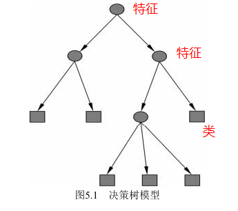

#### 1、if-then规则

- 由决策树的根结点到叶结点的**每一条路径构建一条规则**
- 决策树的路径或其对应的if-then规则集合具有一个重要的性质：**互斥并且完备**。（说到底就是**条件（嵌套条件）语句**）
- 这里所谓**覆盖**是指**实例的特征**与**路径上的特征一致**或实例满足规则的条件。

#### 2、条件概率分布

- 条件概率分布定义在**特征空间的一个划分**上。将特征空间划分为互**不相交的单元**（cell）或区域（region），并在**每个单元定义一个类**的概率分布就构成了一个条件概率分布。

- 决策树的 **一条路径**对应于划分中的**一个单元**。

- 假设**X**为表示**特征的随机变量**，**Y**为表示**类的随机变量**，那么这 个条件概率分布可以表示为$P(Y|X)$。决策树分类时将该结点的**实例**强行分到**条件概率大的那一类**去。

- **特征空间划分**：图中的**大正方形表示特征空间**。这个大正方形被若干个小矩形分割，每个小矩形表示一个单元（说到底就是if-then规则的图像化表示），其中的*+1*，*-1*是在结合训练数据集得到的**条件概率分布下**，进行的**类的划分**。

  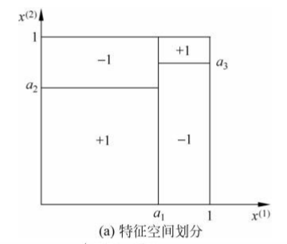

- **条件概率分布**：假设只有两类：正类和负类，即Y取值为 *+1*和*–1*。小矩形中的数字表示单元的类。当某个单元c的条件概率满足$P(Y＝ +1| X ＝ c)>0.5$时，则认为**这个单元**属于**正类**， 即落在这个单元的实例都被视为**正例**。(图a是图b的俯视图)

  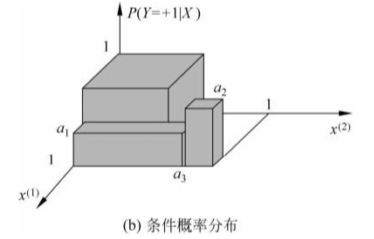

- 条件概率分布下对应的决策树

  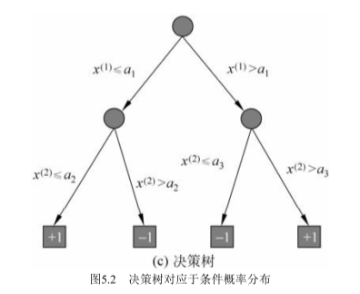

#### 3、决策树的学习

**本质：**

- 决策树学习本质上是**从训练数据集中归纳**出一组**分类规则**。
- 与训练数据集不相矛盾的决策树（即能对训练数据进行正确分类的决策树）可能有**多个**，也可能**一个也没有**。
- 我们需要的是一个与训练数据矛盾较小的决策树，同时具有**很好的泛化能力**。

**决策树的生成：**

- 决策树学习的**损失函数**通常是正则化的**极大似然函数**。决策树**学习的策略**是以**损失函数**为目标函数的**最小化**。
- 决策树学习的算法通常是一个**递归地选择最优特征**，并根据该特征对训练数据进行分割，使得对各个子数据集有一个最好的分类的过程（说到底就是**依次选择特征**构建决策树的每一层节点，**下一层依赖于上一层**已经分类好的训练数据的集合（不再是原有的训练数据集了））。
- 决策树的**生成**只考虑**局部最优。**

**决策树的剪枝：**

- **决策树**可能对训练数据有很好的分类能力，但对未知的测试数据却未必有很好的分类能力，即可能**发生过拟合**现象。我们需要对已生成的树自下而上进行**剪枝**，将树**变得更简单**，从而使它具有**更好的泛化能力**。
- 具体地，就是**去掉过于细分的叶结点**，使其回退到父结点，甚至更高的结点，然后将父结点或更高的结点改为新的叶结点。
- 决策树的**剪枝**则考虑**全局最优**。

**决策树算法：**

- **ID3、C4.5与CART**，这些算法包括特征选择、决策树的生成和剪枝过程。

#### 4、备注

- 决策树的条件概率分布说到底就是if-then规则的**图像化表示**。

- 决策树学习的**损失函数**是什么？

  

- **问**：为什么说决策树学习的**损失函数**通常是正则化的**极大似然函数**？换句话说：为什么在决策树中，极大似然函数等价于损失函数最小化。

  - **联想朴素贝叶斯公式**（对于一个分类问题，假设**一个实例可能存在多个类别**，比如星期五是阴，雨，晴）
  - 似然函数是指在已有的数据中计算出**某一类别下实例出现的概率**，通过极大似然函数可以得到该实例最大可能的类别。
  - 损失函数有多种，其中对数**损失函数最小 = - log（最大似然函数）**，极大似然函数得到这个类别具有最大的可能性，相应的损失函数最小。参考[第一章、统计学习方法概论](https://blog.csdn.net/qq_33934427/article/details/107356918)

### 三、特征选择

#### 1、基本概念

- 特征选择在于选取对训练数据**具有分类能力**的特征。这样可以提高决策树学习的效率。**特征选择是决定用哪个特征来划分特征空间**。
- 如果利用一个特征进行分类的结果与**随机分类**的结果没有很大差别，则称这个特征是**没有分类能力**的。
- 通常特征选择的**准则**是**信息增益**或**信息增益比**。

#### 2、熵和条件熵

##### 1）熵

- 在信息论与概率统计中，**熵**（entropy）是表示**随机变量不确定性的度量**。设X是一个取有限个值的**离散随机变量**，其概率分布为$P(X = x_i) = p_i，i = 1,2,...,n$

  **随机变量X的熵定义**为：
  $$
  H(X) = -\sum_{i=1}^{n} p_i log(p_i)
  $$
  $xlog(x)$函数图像为：

  

- 通常，式子中的对数以2为底或以e为底，这时熵的单位分别称作**比特**（bit）或**纳特**（nat）。

- **熵只依赖于$X$的分布**，而**与$X$的取值无关**，所以也可将$X$的熵记作$H(p)$，即为
  $$
  H(p) = -\sum_{i=1}^{n} p_i log(p_i)
  $$
  **熵越大，随机变量的不确定性就越大（纯度越低）**。参考[信息量，信息熵，纯度](https://blog.csdn.net/u010916338/article/details/91127242)

  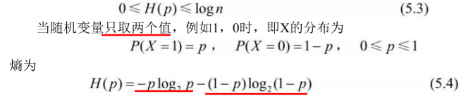

  随机变量只取两个值时，熵$H(p)$随概率$p$变化的曲线如图，当**$p$ = 0或1时，表示只存在一个类**，那么经验条件熵 = 经验熵 = 0，不存在不确定性，**信息增益为0**。参考[昆兰（ID3,C4.5的作者）原话](https://www.zhihu.com/question/22928442)

  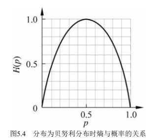

##### 2）条件熵

​		条件熵$H(Y|X)$表示在**已知随机变量**$X$（有限个离散随机变量）的条件下**随机变量**$Y$的**不确定性**。随机变量$X$给定的 条件下随机变量$Y$的条件熵（conditional entropy）$H(Y|X)$，定义为$X$给定条件下$Y$的**条件概率分布的熵**对$X$的**数学期望**：
$$
H(Y|X) = \sum_{i = 1}^{n} p_iH(Y|X = x_i)
$$

#### 3、经验熵和经验条件熵

​		当熵和条件熵中的概率由**数据估计**（特别是**极大似然估计**）得到时，所对应的熵与条件熵分别称为**经验熵**（empirical entropy）和**经验条件熵**（empirical conditional entropy）。

#### 4、信息增益 

##### 1）信息增益公式

- 特征A对训练数据集$D$的**信息增益**$g(D,A)$，定义为集合$D$的**经验熵**$H(D)$与特征$A$给定条件下$D$的**经验条件熵$H(D|A)$之差。**
  $$
  g(D,A) = H(D) - H(D|A)
  $$

- 一般地，熵$H(Y)$与条件熵$H(Y|X)$之差称为**互信息**（mutual information）。决策树学习中的**信息增益**等价于训练数据集中**类与特征的互信息**。

- 显然，对于数据集D而言，信息增益依赖于特征， **不同的特征**往往具有**不同的信息增益**。**信息增益大的特征**具有**更强的分类能力**（经验条件熵相对较小（经验熵相对较大，这样就有了接下来的**信息增益比**，这一点在下面的韦恩图可以看出来），即该特征Y下，关于D的分类**不确定性较小**，说白了就是Y对于D的分类具有很好的分类能力）。

##### 2）信息增益算法

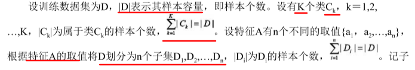

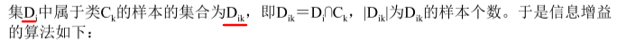

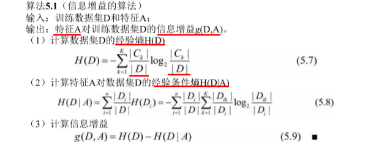

##### 3）举个栗子

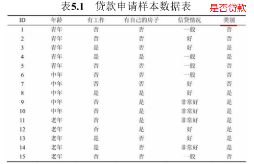

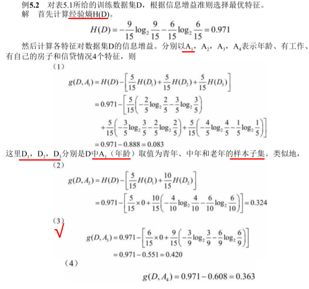

​		由于特征$A_3$ 大，所以选择特征$A_3$（有自己的房子）的信息增益值最作为最优特征。

##### 4）信息增益 & 互信息

参考[统计自然语言处理](https://book.douban.com/subject/25746399/)

- **熵的连锁规则**，有
  $H（X，Y）＝ H（X）＋H（Y|X）＝ H（Y）＋H（X|Y）$

- 互信息反映的是在知道了$Y$的值以后$X$的**不确定性的减少量**。可以理解为$Y$**的值透露了多少关于$X$的信息量**。

  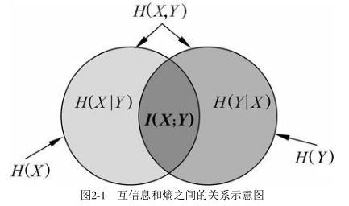

##### 5）备注

- 无论是**经验熵**还是**经验条件熵**，都是**对于训练数据集D**的分类不确定性的计算，为了计算特征A对训练集D分类的影响情况。

- **问**：$P(X=x_i) = p_i$$，p_i$**究竟是什么？**在经验熵中是$\frac{|C_k|}{|D|}$，在条件经验熵中是$\frac{|D_i|}{|D|}$，$\frac{|D_{ik}|}{|D_i|}$？

  **答**：经验**条件熵和经验熵**，它们的**$p_i$是不同**的，看累加的下标就明白了（下面有解释）。

- 注意经验熵是**根据实例的类别**进行累加（即$k = 1,2,...,K$)

  而经验条件熵是**根据特征A划分（分组）的子集**进行的累加（即$i = 1,2,...,n$）

  - $H(D|A)$中的$H(D_i)$ 表示经过特征A分类后得到的**子集$D_i$的经验熵**。

  - 说白了经验条件熵就是在A划分的子集中，**依次累加（$D_i$在$D$中的占比 * $D_i$的经验熵）**

- 特征$A$在划分$D$时，$A$**可以是连续，也可以是离散**

#### 5、信息增益比

##### 1）信息增益比公式

- **信息增益值**的大小是**相对于训练数据集**而言的，并没有绝对意义。

- 在分类问题困难时，也就是说在训练数据集的经验熵大的时候，信息增益值会偏大。反之，信息增益值会偏小。使用**信息增益比**（information gain ratio）可以**对这一问题进行校正**。

- 特征$A$对训练数据集$D$的信息增益比$g_R(D,A)$ 定义为其**信息增益**$g(D,A)$与训练数据集D的**经验熵$H(D)$之比**：
  $$
  g_R(D,A) = \frac{g(D,A)}{H(D)}
  $$

##### 2）信息增益 & 信息增益比 

参考[决策树--信息增益，信息增益比，Geni指数的理解](https://blog.csdn.net/Tomcater321/article/details/80699044)

- **信息增益**偏向**取值较多的特征**，我理解的是：因为特征取值越多，**分组越多，$\frac{|D_i|}{|D|}$越小，条件熵就越小**，信息增益越大。（并不绝对，还与特征值**分组后子集的样本个数有关**，[c4.5为什么使用信息增益比来选择特征？](https://www.zhihu.com/question/22928442))

- **信息增益比**偏向**取值较少的特征**  ，我理解的是：熵的定义是：
  $$
  H(X) = -\sum_{i=1}^{n} p_i log(p_i)
  $$
  
- 信息增益并不是说一定会偏向于取值多的特征，而是**数据集的不充足**以及**客观存在的大数定律**导致取值多的特征在计算条件熵时容易出现**偏小的条件熵**

##### 3）备注

- 为什么**信息增益比**不能是**信息增益**$g(D,A)$与训练数据集D的**经验条件熵$H(D|A)$之比**? （不必纠结）

  我觉得拿$H(D)$比拿$H(D|A)$作为$g(D,A)$的比较对象更有意义。因为**$H(D|A)$和$g(D,A)$都是相对于H(D)计算出来**的（前者是在D集合上，通过**特征A划分D集合**，然后求出特征A下的$H(D_i)$，最后累加成$H(D)$；后者则是求差值）。

  简单理解，可以把$H(D)$看做静止的，而$H(D|A)$和$g(D,A)$是相对于$H(D)$动的，要想信息增益比更有意义，还是**拿$H(D)$作为$g(D, A)$参照物比较好**

#### 6、平方误差最小化（最小二乘法）

​		对**回归树**用平方误差最小化准则进行特征选择，生成二叉树。

##### 1）回归树模型

- 回归树模型是一个二叉树模型

- 假设$X$与$Y$分别为输入和输出变量，并且**$Y$是连续变量**，给定训练数据集$D = \{(x_1,y_1),(x_2,y_2),...,(x_N,y_N)\}$

  **一个回归树**对应着输入空间（即特征空间）的**一个划分**以及在**划分的单元上的输出值**。假设已将输入空间划分为**M个单元**$R_1,R_2,...,R_M$，并且在每个单元$R_m$上有一个**固定的输出值**$c_m$，于是**回归树模型**可表示为

$$
f(x) = \sum_{m=1}^{M}c_mI(x \in R_m)
$$

- $I$代表的是**指示函数（indicator function）**。

  - 它的含义是：当输入为True的时候，输出为1，输入为False的时候，输出为0。

  - 例如：$I(f(x_i) ≠ y_i)$表示当$f(x_i)$不等于$y_i$的时候输出为1，否则输出为0。

    参考[机器学习当中I函数代表什么意思？](https://blog.csdn.net/tiange_xiao/article/details/81631812)

- 其中主要问题是：
  - 如何得到**最优的切分变量（特征），最优切分点**，来划分输入空间（特征空间）
  - 以及如何求出最优**固定输出值$\hat{c_m}$**

##### 2）**最优输出值$\hat{c_m}$ ** —— 平方误差最小

- 当输入空间的**划分确定**时，可以用平方误差$\sum_{x_i \in R_m} (y_i - f(x_i))^2$来表示回归树对于训练数据的**预测误差**。

- 用**平方误差最小的准则**求解每个单元上的**最优输出值$\hat{c_m}$**。易知，$\hat{c_m}$是$R_m$上的所有输入实例$x_i$对应的**输出$y_i$的均值**（y是连续变量），即
  $$
  \hat{c_m} = ave(y_i | x_i \in R_m)
  $$

##### 3）最优切分变量和最优切分点

- 这里采用启发式的方法，选择**第$j$个变量（特征）$x^{(j)} $**和它**取的值s（离散或连续变量）**，作为切分变量和切分点（初始值），划分的**两个区域**如下（$c_1,c_2$可以通过均值求得）：

  $R_1(j,s) = \{x | x^{(j)} \leq s\}$，$R_2(j,s) = \{x | x^{(j)} >s\}$

- 然后寻找最优切分变量$j$和最优切分点$s$。具体地，求解
  $$
  min_{j,s}[min_{c_1}\sum_{x_i \in R_1(j,s)} (y_i - c_1)^2 + min_{c_2}\sum_{x_i \in R_2(j,s)} (y_i - c_2)^2 ]
  $$

- 备注：$x^{(j)}$ **和 $s$均为变量**。

  - 为了使平方误差最小，就需要**依次对每个特征的取值进行遍历**。
  - 并计算出当前每一个可能的切分点误差，最后**选择切分误差最小的点**，并将输入空间切分为两部分

#### 7、基尼指数

​		对**分类树**用基尼指数（Gini index）最小化准则，进行特征选择，生成二叉树。

参考[决策树--CART树详解](https://www.cnblogs.com/wqbin/p/11689709.html)

##### 1）基尼指数

- 分类问题中，假设有$K$个类，样本点属于第$k$类的概率为$p_k$，则概率分布的基尼指数定义为（$p_k$累加和为1）

$$
Gini(p) = \sum_{k = 1}^Kp_k(1-p_k) = 1 - \sum_{k=1}^K{p_k}^2
$$

- 对于**二类分类问题（预测类别只有两类）**，若样本点属于第1个类的概率是p，则概率分布的基尼指数为
  $$
  Gini(p) = 2p(1-p)
  $$

- 对于给定的样本集合D，其基尼指数为
  $$
  Gini(p) = 1 - \sum_{k=1}^K{(\frac{|C_k|}{|D|})}^2
  $$
  

  这里，$C_k$是$D$中属于第$k$类的样本子集，$K$是类的个数。

- 基尼指数$Gini(D)$表示集合**D的不确定性**，基尼指数值越大，样本集合的不确定性也就越大，这一点与熵相似。

##### 2）带条件的基尼指数

- 如果样本集合D根据特征A是否取某一可能值a被分割成D1和D2两部分，即$D_1 = \{(x,y) \in D|A(x) = a\},D_2 = D - D_1$

  则**在特征A的条件下，集合D的基尼指数定义**为
  $$
  Gini(D,A) = \frac{|D_1|}{|D|}Gini(D_1) + \frac{|D_2|}{|D|}Gini(D_2)
  $$

- 基尼指数$Gini(D,A)$表示经$A＝a$分割后集合D的不确定性。

- **注意$D_2$是$D-D_1$**

##### 3）基尼指数 & 熵

- 下图显示**二类分类问题**中**基尼指数**$Gini(p)$、**熵**（单位比特）之半$\frac{1}{2}H(p)$和**分类误差率**的关系。横坐标表示概率$p$，纵坐标表示损失。可以看出基尼指数和熵之半的曲线很接近，都可以近似地代表分类误差率。

  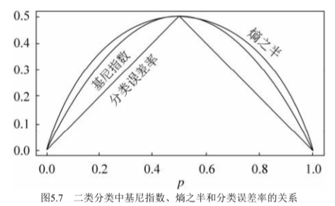

- 二分类问题的分类误差率如何理解：**分类误差率越大，说明分类的不确定性越大**（应该是使用极大似然法来求实例的**最大可能类别**）

  参考[在分析Gini系数，熵，分类误差率时。其中，分类误差率具体是什么，为什么一定小于等于0.5?](https://www.zhihu.com/question/351016937)

  假设有10个样本

  - 当$P（A）= 0.5$时（5个A，5个B），预测结果为A或B，分类误差率为0.5；
  - 当$P（A）= 0.8$时（8个A，2个B），预测结果为A，分类误差率为 0.2；
  - 当$P（A）= 0.2$时（2个A，8个B），预测结果为B，分类误差率为0.2；

### 四、决策树的生成

#### 1、ID3算法 - 信息增益

##### 1）算法描述

- **ID3算法的核心**是在决策树各个结点上应用**信息增益**准则**选择特征**，递归地构建决策树。直到**所有特征的信息增益均很小**（递归结束条件）或没有特征可以选择为止。

- ID3相当于用**极大似然法**（一个实例存在多个类，找出该实例最有可能的类）进行概率模型的选择。

- **ID3算法流程**

  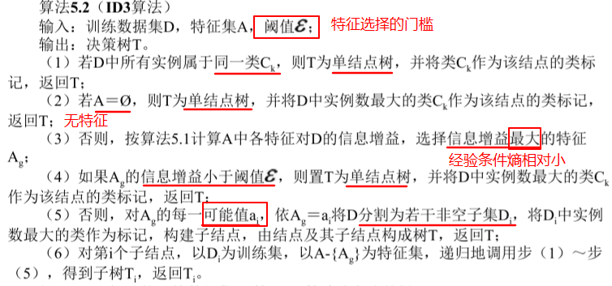

##### 2）举个栗子

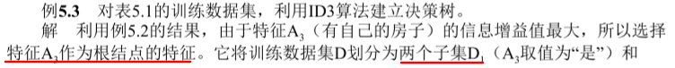

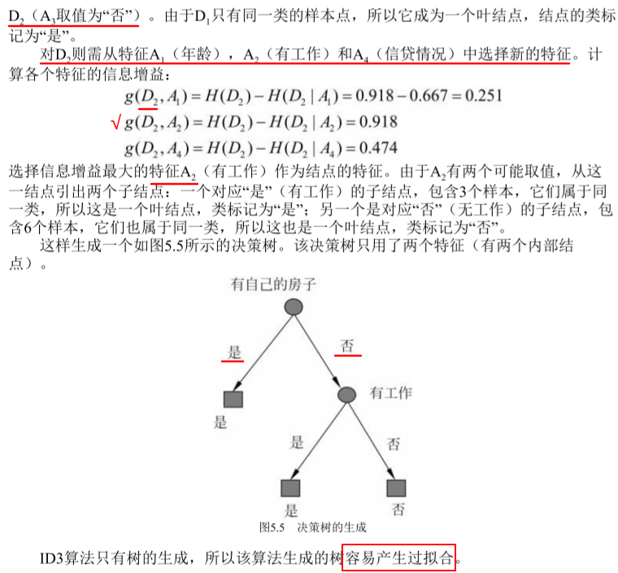

#### 2、C4.5算法 - 信息增益比

​		C4.5算法与ID3算法相似，C4.5算法对ID3算法进行了改进。C4.5在生成的过程中，用**信息增益比**来选择特征。

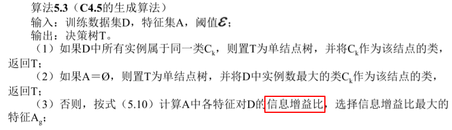

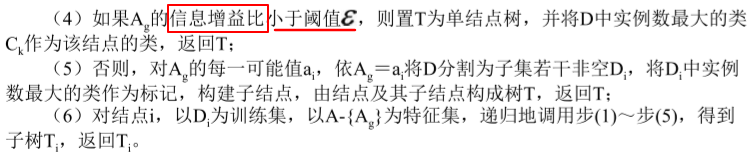

#### 3、CART算法 - 最小二乘 & 基尼指数

##### 1）CART树的概念

参考[分类与回归树](https://baike.baidu.com/item/%E5%88%86%E7%B1%BB%E4%B8%8E%E5%9B%9E%E5%BD%92%E6%A0%91/20868547?fr=aladdin)

- **分类与回归树**的英文是Classification and regression tree，缩写是**CART**。CART是在给定输入随机变量X条件下输出随机变量Y的条件概率分布的学习方法。**CART假设决策树是二叉树**，内部结点特征的取值为**“是”和“否”**，**左分支**是取值为“**是”**的分支，**右分支**是取值为**“否”**的分支。这样的决策树等价于**递归地二分每个特征**，将输入空间即特征空间划分为有限个单元，并在这些单元上确定预测的概率分布，也就是在输入给定的条件下输出的条件概率分布。它由树的生成、树的剪枝构成。

- 决策树的生成就是递归地构建二叉决策树的过程。对**回归树**用**平方误差最小化**准则， 对**分类树**用**基尼指数（Gini index）最小化**准则，进行特征选择，生成二叉树。

##### 2）回归树生成算法

- 遍历所有输入变量，找到最优的切分变量$j$，**构成一个对**$(j,s)$。依此将输入空间划分为两个区域。接着，**对每个区域重复上述划分过程**，直到满足停止条件为止。这样就生成一棵回归树。这样的回归树通常称为**最小二乘回归树**(Least squares regression tree)

- 算法如下:

  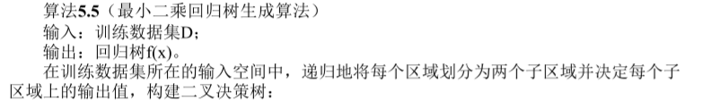

  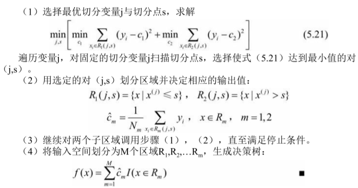

##### 3）最小二乘回归树的缺点

​		这种方法的**复杂度较高**，尤其在寻找切分点时，需要遍历当前所有特征的可能取值，如共有 **F 个特征值**，其中**每个特征有 N 个取值**，其生成的决策树**有 S 个内部节点**，则该算法的时间复杂度为 **O(F * N * S)**。

参考[最小二乘回归树 Least squares regression tree](https://hyper.ai/wiki/4268)

##### 4）分类树生成算法

​		算法停止计算的条件是**结点中的样本个数小于预定阈值**，或样本集的**基尼指数小于预定阈值**（样本基本属于同一类），或者没有更多特征。

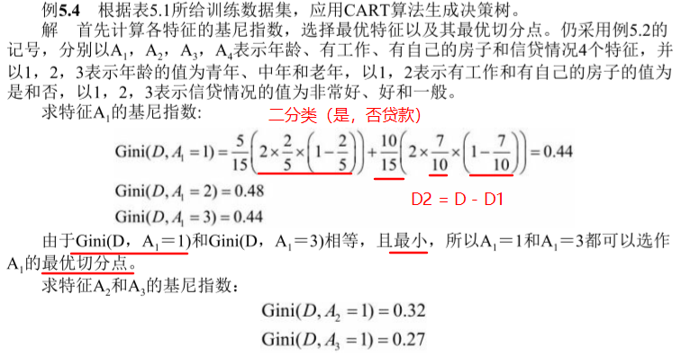

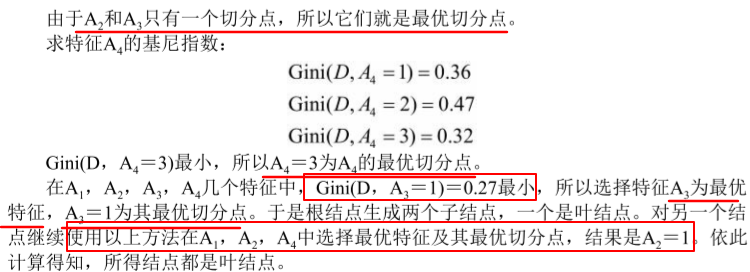

备注

- **注意$D_2$是$D-D_1$**
- 计算集合$D$在**所有特征**$X^{(j)}$，以及**对应特征的取值**$s$的条件下的**基尼系数**，然后每次从中比较，**得到最小的基尼系数**。其中对应的特征$X^{(j)}$即为**最优的切分特征**，对应的特征值s即为**最优的切分点**。

#### 4、三种算法的比较

参考[Regression Tree 回归树](https://zhuanlan.zhihu.com/p/82054400)

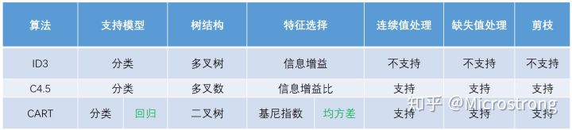

### 五、决策树的剪枝

- 决策树生成算法递归地产生决策树，直到不能继续下去为止。这样产生的树往往**对训练数据的分类很准确**，但对未知的测试数据的分类却没有那么准确，**构建出过于复杂的决策树**，即出现**过拟合现象**。
- 简化分类树模型采用**剪枝**的方式：具体地，剪枝从已生成的树上裁掉一些子树或叶结点，并将其根结点或父结点作为新的叶结点。

#### 1、剪枝算法公式

- 决策树的剪枝往往通过**极小化决策树整体的损失函数**来实现。设树$T$的**叶结点个数为$|T|$**，**$t$是树$T$的叶结点**，该叶结点有**$Nt$个样本点**（有$N_t$个样本点落到这条路径下的叶子结点），其中$k$**类的样本点有$N_{tk}$个**，$k＝1,2,…,K$，$H_t(T)$为叶结点$t$上的经验熵，$a \geq0$为参数，则决策树学习的损失函数可以定义为（$a|T|$类似是经验损失上加上的**正则化项**）
  $$
  C_a(T) = \sum_{t = 1}^{|T|}N_tH_t(T) + a|T|
  $$
  其中经验熵为
  $$
  H_t(T) =-\sum_{k}\frac{N_{tk}}{N_t}log(\frac{N_{tk}}{N_t})
  $$

- $C(T)$表示模型**对训练数据的预测误差**，即模型与训练数据的**拟合程度**，**$|T|$ 表示模型复杂度**，参数a≥0控制两者之间的影响。

  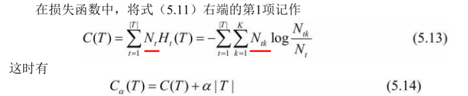

#### 2、剪枝算法

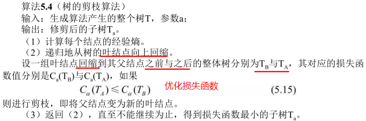

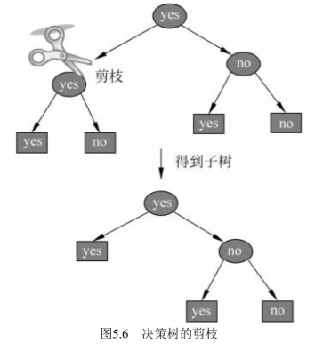

备注：

- 该剪枝算法是在叶结点上，通过回缩，**比较剪枝之前和之后整体树的损失函数值**，如果剪枝后更小，则进行剪枝
- T是整体树

#### 3、CART剪枝算法（待研究）

CART剪枝算法由**两步组成**：

- 首先从生成算法产生的**决策树$T_0$底端开始**不断剪枝，**直到$T_0$的根结点**，形成一个子树序列$\{T_0 ，T_1 ,...,T_n\}$
- 然后通过**交叉验证法**在独立的验证数据集上**对子树序列进行测试，从中选择最优子树**。

##### 1）形成一个子树序列

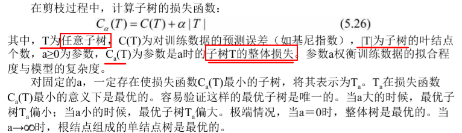

##### 2）交叉验证选最优子树

##### 3）CART剪枝算法

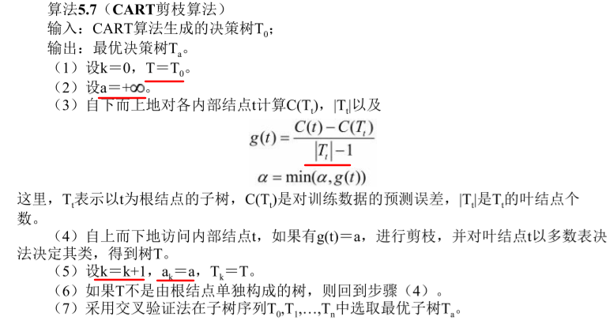

##### 4）备注：为什么分母是$|T_t| -1$

我觉得可以参考[样本标准差为什么要除n-1](https://blog.csdn.net/qq_33934427/article/details/107592970)，进行对比理解

#### 4、生成和剪枝的比较

- **决策树生成**只考虑了通过提高信息增益（或信息增益比）**对训练数据进行更好的拟合**。而决策树剪枝通过**优化损失函数**还考虑了**减小模型复杂度**。
- 决策树生成**学习局部**的模型，而决策树剪枝**学习整体**的模型。

#### 5、其他剪枝算法

参考[说说决策树剪枝算法](https://zhuanlan.zhihu.com/p/31404571)

Reduced-Error Pruning(REP,错误率降低剪枝）

Pesimistic-Error Pruning(PEP,悲观错误剪枝）

Cost-Complexity Pruning（CCP，代价复杂度剪枝)

Minimum Error Pruning (MEP, 最小误差剪枝)

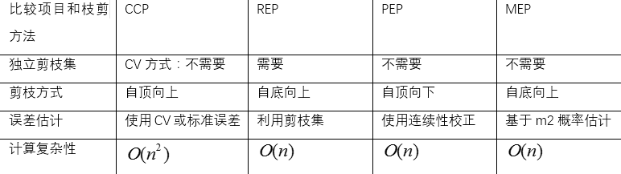

### 六、决策树优缺点

参考[各类分类算法的优缺点简单总结](https://zhuanlan.zhihu.com/p/40294329)

参考[如何提升决策树效果](https://time.geekbang.org/course/detail/100046401-220611)

#### 1、优点

- 简单易于理解，在分类过程中具有很好的解释性

- 具有**非线性效应**
  - 非线性效应可以通过加**平方项**，**立方项**来实现，这里的非线性效应也可说为**非参数效应**。不像线性回归需要通过多项式来拟合。（别把目标函数和损失函数弄混了）
  - **回归树**在进行特征选择的时候，通过**最小平方误差法**计算**最优的切分变量$j$和最优切分点$s$**，这里只是循环遍历所有变量，应该是没有参数的（权重 + 偏置）。
  - **分类树**在特征选择中，对于**离散变量**$y_i$，通过**条件概率分布**来计算信息增益，信息增益比，基尼指数，进而构建决策树，这里显然是没有参数的。

- 能够**自动捕捉交叉效应**：

  - 比如发现**不同群体**（男/女）间在**高收入或者低收入**上的区别。

  - **交叉分析**：通常用于分析**两个或两个以上**，**分组变量之间的关系**，以交叉表形式进行变量间关系的**对比分析** 

    参考[python数据分析入门]()

- 构造的决策树大部分是**稀疏**的：尽管存在高维度变量，但是在特征选择中是**一步步选**的 + **预剪枝**（超过阈值结束），最后生成的决策树应该是稀疏的。

#### 2、缺点

- 具有**不稳定性**：如果换一批训练数据，构建的决策树可能会不一样。
- **表现力差**：
  - 对于**单棵树**：如果树的深度够深，容易过拟合；如果树的深度够浅，则表现力有限2。
  - 可以通过**集成树模型**来弥补这个缺点

- 决策树构建过程中可能会出现过拟合，泛化能力较低。

### 七、决策树 & 集成树模型

**集成树模型的分类**

基本思路：将多个树模型构成进行平均，投票表决

方法：

- **随机森林类**

  - **随机森林**：<http://scikitlearn.com.cn/0.21.3/12/#1112>

    在随机森林中（参见 [`RandomForestClassifier`](https://scikit-learn.org/stable/modules/generated/sklearn.ensemble.RandomForestClassifier.html#sklearn.ensemble.RandomForestClassifier) 和 [`RandomForestRegressor`](https://scikit-learn.org/stable/modules/generated/sklearn.ensemble.RandomForestRegressor.html#sklearn.ensemble.RandomForestRegressor) 类）， 集成模型中的**每棵树**构建时的样本都是由训练集经过**有放回抽样**得来的

    另外，在构建树的过程中进行**结点分割**时，选择的分割点是所有特征的最佳分割点，或特征的大小为 `max_features` 的随机子集的最佳分割点。

    这**两种随机性**的目的是**降低估计器的方差**。的确，单棵决策树通常具有高方差，容易过拟合。随机森林构建过程的随机性能够产生具有不同预测错误的决策树。通过取这些决策树的平均，能够消除部分错误。随机森林虽然能够通过组合不同的树降低方差，但是有时会略微增加偏差。在实际问题中，方差的降低通常更加显著，所以随机森林能够取得更好地效果。

  - **极限随机树：**<http://scikitlearn.com.cn/0.21.3/12/#1112>

    在极限随机树中（参见 [`ExtraTreesClassifier`](https://scikit-learn.org/stable/modules/generated/sklearn.ensemble.ExtraTreesClassifier.html#sklearn.ensemble.ExtraTreesClassifier) 和 [`ExtraTreesRegressor`](https://scikit-learn.org/stable/modules/generated/sklearn.ensemble.ExtraTreesRegressor.html#sklearn.ensemble.ExtraTreesRegressor) 类)， 计算分割点方法中的**随机性进一步增强**。 与随机森林相同，使用的特征是候选特征的随机子集；但是不同于随机森林寻找最具有区分度的阈值，这里的**阈值**是针对每个候选特征**随机生成**的，并且选择这些随机生成的阈值中的最佳者作为分割规则。 这种做法通常能够**减少一点模型的方差**，代价则是**略微地增大偏差**：

- **梯度提升树**：GBDT，XGBoost，LightGBM，CatBoost等

### 八、补充

#### 1、回归树 & 分类树

- 分类决策树可用于处理离散型数据，回归决策树可用于处理连续型数据。
- 在回归树和分类树中，特征可以是连续的，也可以是离散的。
  - 对于连续的特征，找**切分点**划分特征。构造孩子节点（二叉树）；
  - 对于离散的特征，则根据**特征的取值**，构造孩子节点（多叉树）

#### 2、决策树 & kd树

**kd树** <https://blog.csdn.net/qq_33934427/article/details/107592970>

- 在KNN算法中，kd树是一个**空间划分树**，需要每次在所有特征（**高维空间**）中筛选出**要划分的特征**以及**特征对应的划分点**进行kd树的构造。
- 对于一个测试实例来说，在**kd树的搜索**中，采用**距离最小化**策略进行类别的预测
- kd树是一棵二叉平衡树

**决策树**

- 决策树包括回归树和分类树
- 决策树可以采用信息增益，信息增益比，基尼系数或平方差最小化准则来构建；可以使二叉树，也可以是多叉树

#### 3、树 & 神经网络

参考[Regression Tree 回归树](https://zhuanlan.zhihu.com/p/82054400)

​		目前，最流行的两类算法莫过于**神经网络算法（卷积神经网络、循环神经网络、生成式对抗网络和图神经网络）**与**树形算法（随机森林、GBDT、XGBoost和LightGBM）。**树形算法的基础就是**决策树**，由于其易理解、易构建、速度快等特点，被广泛的应用在数据挖掘、机器学习等领域。

#### 4、sklearn实现决策树

**数据如下**

```
年龄,有工作,有自己的房子,信贷情况,类别
青年,否,否,一般,否
青年,否,否,好,否
青年,是,否,好,是
青年,是,是,一般,是
青年,否,否,一般,否
中年,否,否,一般,否
中年,否,否,好,否
中年,是,是,好,是
中年,否,是,非常好,是
中年,否,是,非常好,是
老年,否,是,非常好,是
老年,否,是,好,是
老年,是,否,好,是
老年,是,否,非常好,是
老年,否,否,一般,否
```

##### 1）算法实现

```python
from sklearn.tree import DecisionTreeClassifier
import numpy as np
import  pandas as pd
from pandas import read_csv
from sklearn.tree import export_graphviz
import graphviz

dict1 = {
    '青年': 1,
    '中年': 2,
    '老年': 3,
}

dict2 = {
    '是': 1,
    '否': 0,
}

dict3 = {
    '一般': 1,
    '好': 2,
    '非常好':3,
}

def characterEncoding(df):

    df1 = pd.DataFrame()
    '''处理-年龄'''
    df1['age'] = df['年龄'].map(dict1)

    '''处理-有工作'''
    df1['job'] = df['有工作'].map(dict2)

    '''处理-有自己的房子'''
    df1['house'] = df['有自己的房子'].map(dict2)

    '''处理-信贷情况'''
    df1['trust'] = df['信贷情况'].map(dict3)

    '''处理-类别'''
    df1['type'] = df['类别'].map(dict2)

    return df1

if __name__ == '__main__':
    '''获取数据集'''
    df = read_csv(open('统计学习方法（自）\决策树\data.csv'))

    '''数据处理：离散特征编码'''
    df1 = characterEncoding(df)

    '''划分特征和类别'''
    x_train = df1.iloc[:, 0:-1]
    y_train = df1.iloc[:, -1]

    '''定义一个基于信息熵的决策树'''
    # estimator = DecisionTreeClassifier(criterion="entropy")
    estimator = DecisionTreeClassifier(criterion="gini")
    estimator.fit(x_train,y_train)

    '''可视化决策树'''
    label = ['age','job','house','trust']
    dot_data = export_graphviz(estimator, out_file="data1.dot",feature_names=label)

    graph = graphviz.Source(dot_data)

    '''dot -Tpng E:\python\统计学习\data.dot -o E:\python\统计学习\example.png'''
    graph.render("example")
```

代码在运行时，`graph.render`会报错：*graphviz.backend.CalledProcessError: Command '['dot.bat', '-Tpdf', '-O', 'example']' returned non-zero exit status 1. [stderr: b"Error: example: syntax error in line 1 near 'None'\r\n"]*

将graphviz目录加入到系统path中，但还是无效。

解决方法是在控制台使用graphviz命令来绘制图像，参考[使用graphviz导出模型](https://www.pythonf.cn/read/129001)

导出的图片是这样的：

**信息增益准则：**

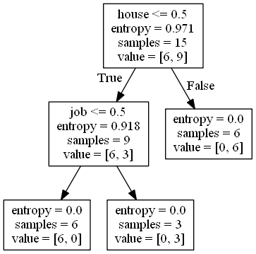

**基尼指数准则：**

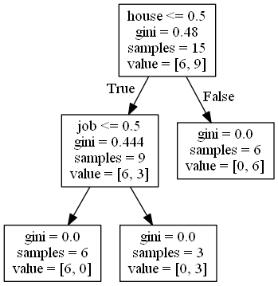

##### 2）`DecisionTreeClassifier `具体用法

参考[使用 sklearn 构建决策树并使用 Graphviz 绘制树结构](https://techlog.cn/article/list/10183267)

| **参数名**               | **类型**                         | **可选参数**                    | **默认值** | **说明**                                                     |
| ------------------------ | -------------------------------- | ------------------------------- | ---------- | ------------------------------------------------------------ |
| criterion                | string                           | 'gini'、'entropy'               | 'gini'     | 构建决策树算法，基尼不纯度准则(CART 算法)或信息熵准则(C4.5算法) |
| splitter                 | string                           | 'best'、'random'                | 'random'   | 决策树分支选取原则，全局最优或选取随机局部最优点             |
| max_depth                | int                              | 正整数或 None                   | None       | 树最大深度，None 表示直到所有叶子都完成划分，需要参考 min_samples_split 与 min_samples_leaf |
| min_samples_split        | int 或 float                     | 正整数或小数                    | 2          | 整数指的是内部节点最少包含样本数，浮点数表示内部节点最少包含样本数为 min_samples_split * n_samples，0.18 版本后才支持浮点数 |
| min_samples_leaf         | int 或 float                     | 正整数或小数                    | 1          | 整数指的是叶子节点最少包含样本数，浮点数表示叶子节点最少包含样本数为 min_samples_leaf * n_samples |
| min_weight_fraction_leaf | float                            | 小数                            | 0          | 叶节点最小样本总权重                                         |
| max_features             | int, float, string 或 None       | 可选参数见下文                  | None       | 节点分裂时参与判断的最大特征数，取值详见下面讲解             |
| random_state             | int, 对象或 None                 | 正整数、RandomState 对象或 None | None       | 随机数种子值、随机数生成器对象或默认的 numpy 随机数生成器    |
| max_leaf_nodes           | int 或 None                      | 正整数或 None                   | None       | 最大叶节点数                                                 |
| min_impurity_decrease    | float                            | 小于1正浮点数                   | 0          | 节点划分最小不纯度，只有基尼系数、信息增益比大于等于该值才分裂，0.19.1版本以前字段名为min_impurity_split |
| class_weight             | dict, 字典的list, string 或 None | 见下文                          | None       | 类别权重，取值见下文                                         |
| presort                  | bool                             | True 或 False                   | False      | 是否重排序以提高运行速度                                     |

##### 3）`DecisionTreeClassifier `库的局限

参考[为什么DecisionTreeClassifier是二叉树的形式](https://stackoverflow.com/questions/38931245/why-the-decision-tree-structure-is-only-binary-tree-for-sklearn-decisiontreeclas)

​		这是因为**sklearn**的方法是**处理数字特征**，而**不是分类特征**，当你有数字特征时，建立一个好的**分割规则是相对困难**的，它可以有任意数量的阈值(这需要产生两个以上的孩子)。另一方面，对于分类特征(在提供的幻灯片中使用)，另一个可能的选择是尽可能多的子值。这两种方法都有其自身的问题(**当你有大量可能值时，分类方法使其几乎难以理解**)，并且数字需要特定的特征编码(分类的一个热点，这有效地意味着你仍然可以表达同一棵树，但是你将有更深的树来决定:[狗，不是狗]，[不是狗，而是猫，不是狗，不是猫，而是人])。

所以简单的回答是否定的，你不能用这个实现两个以上的孩子（多叉树），但是这并不是真正的限制。

### 九、参考文档

2、[信息量，信息熵，纯度](https://blog.csdn.net/u010916338/article/details/91127242)

3、[决策树--信息增益，信息增益比，Geni指数的理解](https://blog.csdn.net/Tomcater321/article/details/80699044)

4、[c4.5为什么使用信息增益比来选择特征？](https://www.zhihu.com/question/22928442)

5、[统计自然语言处理](https://book.douban.com/subject/25746399/)

6、[最小二乘回归树 Least squares regression tree](https://hyper.ai/wiki/4268)

7、[决策树——从零开始](https://zhuanlan.zhihu.com/p/89607509)

8、[既然使用神经网络也可以解决分类问题，那SVM、决策树这些算法还有什么意义呢？](https://www.zhihu.com/question/331029209/answer/829127310)

9、[说说决策树剪枝算法](https://zhuanlan.zhihu.com/p/31404571)

10、[分类与回归树CART](https://baike.baidu.com/item/%E5%88%86%E7%B1%BB%E4%B8%8E%E5%9B%9E%E5%BD%92%E6%A0%91/20868547?fr=aladdin)

11、[Regression Tree 回归树](https://zhuanlan.zhihu.com/p/82054400)

12、[Sklearn中文文档](http://scikitlearn.com.cn/0.21.3/12/#1112)

13、[DecisionTree决策树算法及参数详解+实例+graphviz生成决策树](https://blog.csdn.net/qq_41577045/article/details/79844709)

14、[为什么DecisionTreeClassifier是二叉树的形式](https://stackoverflow.com/questions/38931245/why-the-decision-tree-structure-is-only-binary-tree-for-sklearn-decisiontreeclas)