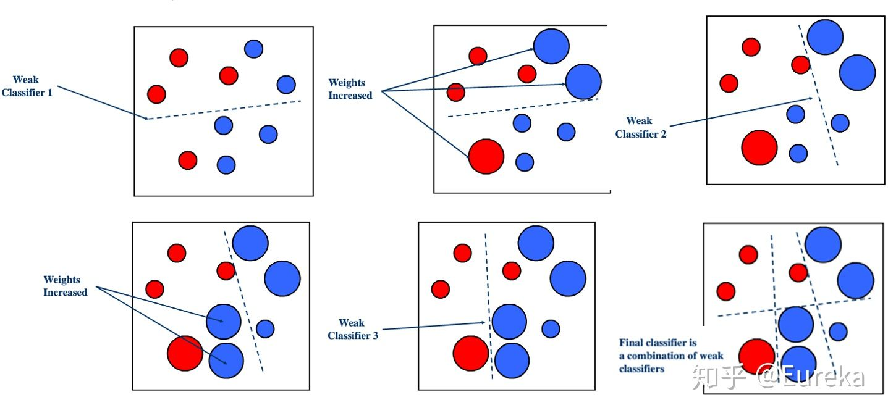
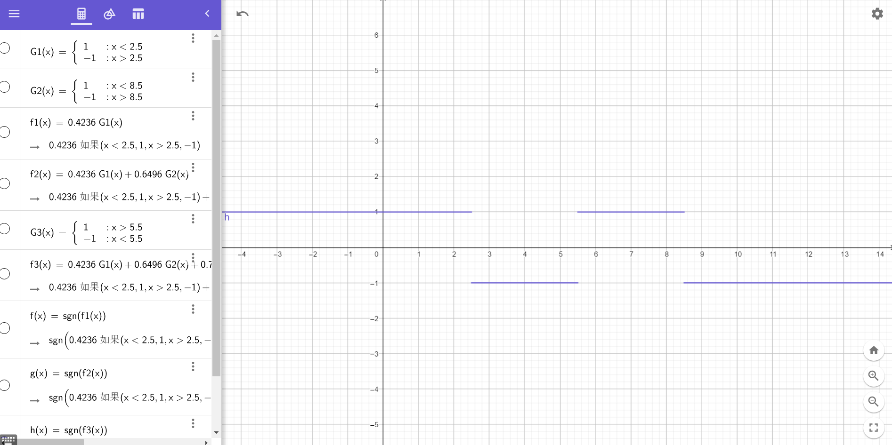
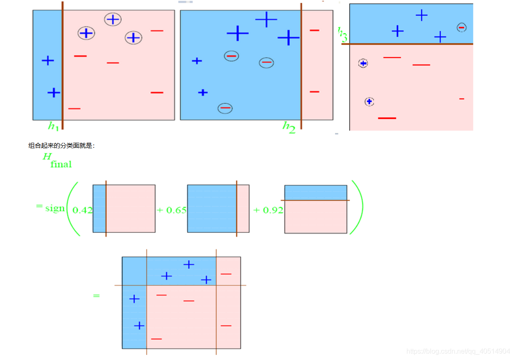
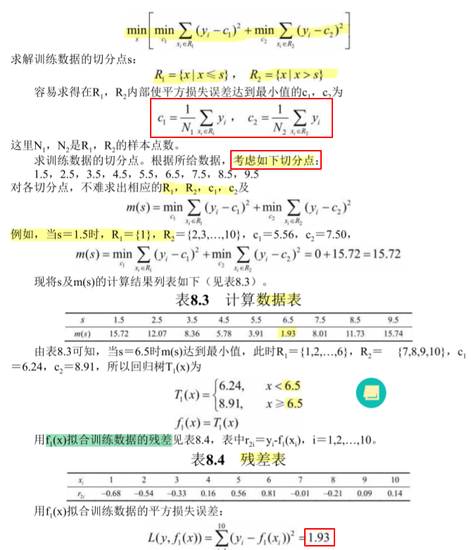
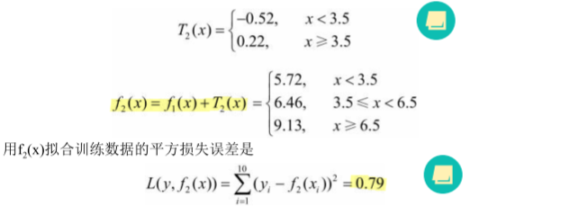
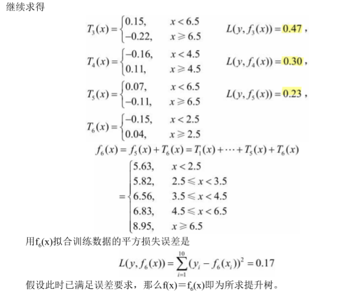
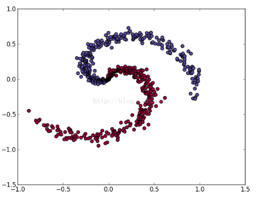

## 提升方法

### 一、什么是提升方法

> 提升（boosting）方法是一种常用的统计学习方法，应用广泛且有效。在分类问题 中，它通过改变训练样本的权重，学习多个分类器，并将这些**分类器进行线性组合**，提高分类的性能。

​		对于提升算法：一是在每一轮如何**改变训练数据**的权值或概率分布；二是如何将**弱分类器组合**成一个强分类器。如何理解这两个步骤，以AdaBoost为例：

- 关于第1个问题，AdaBoost的做法是，**提高**那些被前一轮弱分类器**错误分类样本的权值**，而**降低**那些被**正确分类样本的权值**。这样一来，那些没有得到正确分类的数据，由于其权值的加大而受到后一轮的弱分类器的更大关注。

- 至于第2个问题，即弱分类器的组合，AdaBoost采取**加权多数表决**的方法。具体地，**加大分类误差率小的弱分类器的权值**，使其在**表决中起较大的作用**，减小分类误差率大的弱分类器的权值，使其在表决中起较小的作用。

  关于提升方法，有必要引入另一个概念，那就是“装袋”

>“装袋”（bagging）和“提升”（boost）是构建组合模型的两种最主要的方法，所谓的组合模型是由多个基本模型构成的模型，组合模型的预测效果往往比任意一个基本模型的效果都要好。
>
>- 装袋：每个基本模型由从总体样本中**随机抽样**得到的不同数据集进行训练得到，通过重抽样得到不同训练数据集的过程称为装袋。**随机森林**就是采用的该方法，不同树之间是相互独立的，每个树的权重都是一样的。
>- 提升：每个基本模型训练时的**数据集采用不同权重**，针对上一个基本模型分类错误的样本增加权重，使得新的模型重点关注误分类样本。在boosting中最重要的就是**Adaboost**和**GBDT**。
>- Boosting和Bagging的比较：boosting可以同时降低偏差和方差，bagging只能降低模型的方差，在实际的应用中，**boosting算法**是存在明显的高方差问题，也就是**过拟合**。

​		可以看出，提升和装袋都是针对**不同数据集**进行弱分类器的学习的。但还有其他获得不同弱分类器的方法吗？这显然是有的。

>1）使用**不同的弱学习算法**得到不同基本学习器
>
>- 参数估计、非参数估计…
>
>2）使用相同的弱学习算法，但用**不同的参数**
>
>- K-Mean不同的K，神经网络不同的隐含层…
>
>
>3）相同输入对象的**不同表示**凸显事物不同的特征
>
>4）使用**不同的训练集**
>
>- 装袋（bagging）
>- 提升（boosting）

​		

​		这里补充网上一张图，方便理解boosting提升算法。



### 二、AdaBoost算法

​		AdaBoost是**Adaptive Boosting**的缩写，表明该算法是具有**自适应**性的提升算法。梯度下降算法也是自适应算法，那究竟什么叫自适应呢？[百度百科](https://baike.baidu.com/item/%E8%87%AA%E9%80%82%E5%BA%94/4862182?fr=aladdin)是这样说的

>自适应就是在处理和分析过程中，根据处理数据的数据特征**自动调整**处理方法、处理顺序、**处理参数**、边界条件或约束条件，使其与所处理数据的统计分布特征、结构特征相适应，以取得**最佳的处理效果**的过程。

​		接下来让我们代入数学式子，具体看看AdaBoost算法，也是分成两个步骤：**改变 + 组合**

>输入：训练数据集$T = \{(x1 ，y1),(x2，y2),…,(xN,yN)\}$，其中$x_i \in x \subseteq R^n,y_i \in Y=\{-1,+1\};$，弱学习算法
>
>输出：最终分类器G(x)。 

**Step1：改变**

- 1）初始化训练数据的权值分布
  $$
  D_1 = (w_{11},...,w_{1i},...w_{1N}),w_{1i} = \frac{1}{N},i = 1,2,...，,N
  $$

- 2）对$M＝1,2,…,m$

  - a）使用具有权值分布$D_m$的训练数据集学习，得到**基本分类器**
    $$
    G_m(x): X \to \{-1,+1\}
    $$

  - b）计算$G_m(x)$在训练数据集上的**分类误差率**
    $$
    e_m = P(G_m(x) \neq y_i) = \sum_{i=1}^{N}w_{mi}I(G_m(x_i) \neq y_i)
    $$

  - 计算$G_m(x)$的**系数**
    $$
    a_m = \frac{1}{2}log\frac{1-e_m}{e_m}
    $$
    
  - **更新**训练**数据集的权值分布**
    $$
    D_{m+1} = (w_{m+1,1},w_{m+1,2}...w_{m+1,N})
    $$
    
    $$
    w_{m+1,i} = \frac{w_{mi}}{Z_m} exp(-a_my_iG_m(x_i))
    $$
    
    其中$Z_m$是规范化因子，$Z_m = \sum_{i=1}^Nw_{mi}exp(-a_my_iG_m(x_i)$

**Step2：组合**

- 3）构建基本分类器的**线性组合**
  $$
  f_(x) = \sum_{m=1}^{M}a_mG_m(x)
  $$

- 4）得到**最终分类器**
  $$
  G(x) = sign(f(x)) = sign(\sum_{m=1}^{M}a_mG_m(x))
  $$

​		

​		为什么在更新$w$时，需要先计算$e_m,a_m$，接下来让我们思考一下AdaBoost算法中这个问题：

- 首先要知道，**对于$w_{m,i}$，它的累加和为1**，我们要改变的是数据集中数据的概率分布，每个数据的重要性是不同的。

- 对于**误分类率**$e_m$：由计算公式可知，它是在所有训练数据中，$w_{m,i}$ * 误分类点i（表示为1）的累加。又由于$w_m$累加和在$[0,1]$上，所以$e_m$也在$[0,1]$上。

- 对于该步下**基函数的系数**$a_m$：根据公式，如果误分类率大，则分子小，分母大，$a_m$小，即对于误分类率大的基函数，它在加法模型中（所有弱分类器）比重偏低。

- 对于**权值$w$的更新**：如果$e_m$在$[0,1]$上，$a_m$有没有可能 < 0? 只有满足$\frac{1 - e_m}{e_m} < 1$，即当$\frac{1}{2} < e_m$ 时是存在的。但是根据$w$更新的式子，如果$a_m < 0$，则误分类点的权值会降低，正确分类的点权值会增加，这样更新权值似乎不满足提升方法的假设（即**误分类点权值增加，正确分类点权值降低**。就好比你在背单词，熟悉的单词可以1周后复习，记不住的单词一天后就要复习。之前正确分类的点可能会被错误分类，就好比熟悉单词被遗忘一样）

  而**$e_m$是该步下基函数最小误分类率**（可以分类的切点有很多，需要找损失最小的切分点），**这个最小的误分类率应该不会大于$\frac{1}{2}$**，这样$a_m$**就不可能 < 0**了
  
- $f(x)$和$G(x)$图像基本一致，G(x)只是将结果映射到-1,1上

>AdaBoost的特点：
>
>1）不改变所给的训练数据，而**不断改变训练数据权值的分布**，使得训 练数据在基本分类器的学习中起不同的作用。
>
>2）利用基本分类器的**线性组合**构建最终分类器是AdaBoost的另一特点。
>
>AdaBoost最基本的性质是它能在学习过程中不断减少训练误差，即在训练数据集上的分类误差率。

---

来道AdaBoost的例题：

| 序号     | i    | 1    | 2    | 3    | 4    | 5    | 6    | 7    | 8    | 9    | 10   |
| -------- | ---- | ---- | ---- | ---- | ---- | ---- | ---- | ---- | ---- | ---- | ---- |
| 数据     | x    | 0    | 1    | 2    | 3    | 4    | 5    | 6    | 7    | 8    | 9    |
| 类别标签 | y    | 1    | 1    | 1    | -1   | -1   | -1   | 1    | 1    | 1    | -1   |

最后线性组合得到的分段函数是这样的



AdaBoost例题过程详见这里[Adaboost算法流程及示例](https://www.cnblogs.com/liuq/p/9927580.html)即可，该文思路很清晰。


上面的例题是一维的数据，那么二维应该如何划分呢？二维特征的弱分类器的线性组合可以用下图进行理解



---

AdaBoost算法的**训练误差**：$\frac{1}{N}\sum_iexp(-y_if(x_i))$，它是**存在一个边界**的，即
$$
\frac{1}{N}\sum_i^NI(G(x_i) \neq y_i) \leq \frac{1}{N}\sum_iexp(-y_if(x_i)) \leq \prod_m Z_m
$$
​		对于左边，很容易理解。对于误分类点$y_if(x_i) < 0$，$exp(-y_if(x_i)) \geq 1$ ; 

​		对于右边，则将$f_(x) = \sum_{m=1}^{M}a_mG_m(x)$代入，利用指数运算的特点：指上标累加 = 函数相乘，再代入$Z_m = \sum_{i=1}^Nw_{mi}exp(-a_my_iG_m(x_i)$，即可化简。

---

​		接下来，我们引入**加法模型，前向分步算法**来解释AdaBoost算法。

>加法模型（additive model）
>$$
>f(x) = \sum_{m=1}^Mβ_mb(x;γ_m)
>$$
>其中，$b(x;γ_m)$为基函数，$γ_m$为基函数的参数，$β_m$ 为基函数的系数。
>
>学习加法模型$f(x)$成为经验风险极小化即损失函数极小化问题(8.14式如下）：
>$$
>min_{β_m},{γ_m} \sum_{i = 1}^N L(y_i,\sum_{m=1}^Mβ_mb(x_i;γ_m))
>$$

>前向分步算法（forward stagewise algorithm）求解这 一优化问题的想法是：因为学习的是加法模型，如果能够从前向后，**每一步只学习一个基函数及其系数**，逐步逼近优化目标函数式（8.14），那么就可以简化优化的复杂度。具体地，**每步只需优化如下损失函数**。
>$$
>min_β,γ \sum_{i = 1}^N L(y_i,βb(x_i;γ))
>$$

>AdaBoost算法是前向分步加法算法的特例，损失函数是指数函数。
>$$
>L(y,f(x)) = exp[-yf(x)]
>$$

​		在Adaboost算法中，这里**每步优化损失函数**，可以理解对该步下一个弱分类器的优化，其学习的具体操作等价于AdaBoost算法学习的具体操作。

​		回顾一下AdaBoost有啥具体操作：在**给定概率分布**（$w_i$)的数据集下，求出**最小分类误差率（$e_m$）**，计算最优的$a_m$，并通过指数损失函数，更新$w$，进而得到该步下最优的弱分类器。

​		我们虽然知道**Adaboost的具体操作**流程，但是你是否有疑问：为什么Adaboost要先计算$e_m$，再计算$a_m$，再更新$w$，这其中**有什么科学依据**吗，能否用损失函数来解释AdaBoost这个流程呢？

### 三、提升树

>提升方法实际采用**加法模型**（即基函数的线性组合）与**前向分步算法**。以**决策树为基函数**的提升方法称为**提升树**（boosting tree）。对分类问题决策树是二叉分类树，对回归问题决策树是二叉回归树。在例8.1中看到的基本分类器x<v或x>v，可以看作是由一个根结点直接连接两个叶结点的简单决策树（单层决策树），即所谓的**决策树桩**（decision stump）。提升树模型可以表示为决策树的加法模型：
>$$
>f_M(x) = \sum_{m=1}^MT(x;θ_m)
>$$
>$T(x;θ_m )$表示决策树；$θ_m$为决策树的参数；M为树的个数

​		对于不同问题的提升树学习算法，其主要区别在于使用的**损失函数不同**。在求解下一棵决策树参数时，需要通过经验风险极小化确定参数，一般的式子如下：
$$
\hat{θ_m} = arg min_{θ_m}\sum_{i=1}^NL(y_i,f_{m-1}(x_i) + T(x_i;θ_m))
$$
​		思考一下，提升树和AdaBoost究竟有什么关系？这里先回顾下决策树的一些内容。决策树（只考虑CART）包括**二叉分类树，和二叉回归树**。其中二叉分类树采用最小基尼系数，来得到最优切分量和切分点，而二叉回归树则采用最小平方误差来得到最优切分量和切分点。

​		其实当**提升树的基函数为分类树**时，提升树的算法就是AdaBoost算法的特殊情况。参考AdaBoost的例题，可以把基函数看做是二类分类树（$y = \{+1，-1\}$）。

​		但是当**提升树的基函数为二叉回归树**（CART），损失函数为平方损失函数时，提升树的提升方法就不是AdaBoost了，而是简单地**拟合当前模型的残差**，这种提升树又称为**残差树**。

---

#### 1、残差树

这里我们讨论回归树的boost算法（残差树）。

>如果将输入空间x划分为**J个互不相交的区域**$R_1,R_2,…,R_J$，并且在每个区域上确定输出的**常量$c_j$** ，那么树可表示为：
>$$
>T(x;Θ) = \sum_{j=1}^{J}c_jI(x \in R_j)
>$$
>其中，参数$Θ＝\{(R_1 ，c_1),(R_2,c_2),…,(R_J,c_J)\}$表示树的区域划分和各区域上的常数。**$J$是回归树的复杂度即叶结点个数**。

​		先回顾下基本的决策树：**决策树的内部节点表示特征，叶子节点表示一个类**。$J$是指将空间划分成$J$个区域，即$J$个"类"，那么就要**$J$个叶子节点**。


​		提升方法离不开**更新**，和Adaboost更新$w$一样，$θ_m$是这样更新的（通过拟合残差来更新的，下面整道例题就明白了）。

> 在前向分步算法的第$m$步，给定当前模型$f_{m-1}(x)$ 
> $$
> \hat{θ_m} = argmin_{θ_m} \sum_{i=1}^N L(y_i,f_{m-1}(x + T(x_i;θ_m)))
> $$
> 得到$θ_m$，即**第$m$棵树的参数**。 当采用**平方误差损失函数**时， 
> $$
> L(y,f(x)) = (y-f(x))^2
> $$
> 其损失变为
> $$
> L(y,f_{m-1}(x) + T(x_i;θ_m)) = (y-f_{m-1}(x) - T(x_i;θ_m))^2
> $$
> 记$r = y-f_{m-1}(x)$为**当前模型拟合数据的残差**


​	**回归问题的提升树算法**

>输入：训练数据集$T＝\{(x_1,y_1),(x_2,y_2),...,(x_N,y_N)\},xi ∊x⊆Rn
>，yi∊ ⊆R $
>
>输出：提升树$f_M(x) $
>
>1）初始化$f_0(x) = 0$
>2）对$m＝1,2,…,M$ 
>
>- a）**计算残差**： $r_{mi} = y_i - f_{m-1}(x_i)$
>- b）**拟合残差$r_{mi}$学习一个回归树**，得到$T(x ;Θm) $
>- c）更新$f_m(x)＝f_{m-1} (x)+T(x ;Θm)$
>
>3）得到回归问题提升树


来道例题吧

训练数据表:

| 序号     | i    | 1    | 2    | 3    | 4    | 5    | 6    | 7    | 8    | 9    | 10   |
| -------- | ---- | ---- | ---- | ---- | ---- | ---- | ---- | ---- | ---- | ---- | ---- |
| 数据     | x    | 1    | 2    | 3    | 4    | 5    | 6    | 7    | 8    | 9    | 10   |
| 类别标签 | y    | 5.56 | 5.70 | 5.91 | 6.40 | 6.80 | 7.05 | 8.90 | 8.70 | 9.00 | 9.05 |

**step1：通过训练数据表求出残差表**



**step2：最小二乘拟合残差表，线性组合弱分类器，产生新的残差表**




**after：迭代step2**



补充一下这道题的注意点：

- 第1步是通过**最小二乘法**得到的最优二叉回归树，拟合回归树**预测数据表**，可以求得**残差表**。

- 第2步求$T_2 (x)$。方法与求$T_1(x)$一样（用的是**最小二乘法**，如果不是很清楚，看一下CART中回归树的那一小节），只是**拟合的数据是残差表，不再是原来的数据表了**。对于学习到的决策树，即分段函数，**函数值为划分区域$R_1,R_2$的$y$值的平均**。

- 第2步利用线性组合得到函数$f_2(x)$，与原数据表比较，产生新的残差表。

- 第3步则拟合第2步产生的残差表，学习新的决策树。

- 每一步的最后，需要线性组合现有的弱分类器，并**计算平方损失函数**。

  

​       **和AdaBoost分段函数线性组合不同**，这里可以思考一下为什么残差树在线性组合弱分类器时，是原分段函数 + 残差的分段函数呢？

​		我理解是：残差分段函数是对某个区间$s$上的所有残差取均值，这样子原分段函数和残差分段函数在线性组合时就可以在区间$s$上，均衡、微调原有的分段函数。


​		由于数据集比较特殊，只是一维的，如果是二维的，操作一样吗？其实没差，我们需要**遍历所有输入变量**$j$，对**固定的切分变量$j$扫描切分点**$s$，达到最小值对$(j,s)$。

#### 2、梯度提升树

>提升树利用加法模型与前向分歩算法实现学习的优化过程。当损失函数是**平方损失和指数损失函数**时，每一步**优化是很简单**的。但对**一般损失函数**而言，往往每一步**优化并不那么容易**。针对这一问题，Freidman提出了梯度提升（gradient boosting）算法。
>
>这是利用最速下降法的近似方法，其关键是利用损失函数的**负梯度**在当前模型的值(如下式)作为回归问题提升树算法中的**残差的近似值**，拟合一个回归树。
>$$
>-[\left.\frac{\partial L(y,f(x_i))}{\partial f(x_i)}]\right|_{f(x) = f_{m-1}(x)}
>$$


**梯度提升树算法**

>输入：训练数据集$T＝\{(x_1,y_1),(x_2,y_2),...,(x_N,y_N)\},x_i \in x \subseteq R$；损失函数$L(Y,f(X))$；
>
>输出：回归树 $\hat{f(x)}$。
>
>1）初始化
>$$
>f_0(x) = argmin_c \sum_{i=1}^NL(y_i,c)
>$$
>2）对$m＝1,2,…,M$
>
>- a）对$i＝1,2,…,N$，计算
> $$
>  r_{mi} = -[\left.\frac{\partial L(y,f(x_i))}{\partial f(x_i)}]\right|_{f(x) = f_{m-1}(x)}
> $$
>
>- b）**对$r_{mi}$拟合一个回归树**，得到第$m$棵树的叶结点区域$R_{mj}，j＝1,2,…,J$
>
>- c）对$j＝1,2,…,J$，计算
> $$
>  c_{mj} = arg min_c \sum_{x_i \in R_{mj}} L(y_i,f_{m-1}(x_i) + c)
> $$
>
>- d）更新
> $$
>  f_m(x) = f_{m-1}(x) + \sum_{j=1}^Jc_{mj}I(x\in R_{mj})
> $$
>
>3）得到回归树
>$$
>\hat{f(x)} = f_M(x) = \sum_{m=1}^M \sum_{j=1}^Jc_{mj}I(x \in R_{mj})
>$$


>算法第1步初始化，**估计使损失函数极小化的常数值$c$**，它是只有一个根结点的树。
>
>第 2(a)步计算损失函数的负梯度在当前模型的值，将它作为残差的估计。对于平方损失函数，它就是通常所说的残差；对于**一般损失函数，它就是残差的近似值**。
>
>第2(b)步估计回归树叶结点区域，以**拟合残差**的近似值。
>
>第2(c)步利用线性搜索**估计叶结点区域的值，使**
>**损失函数极小化**。(????)
>
>第2(d)步更新回归树。第3步得到输出的最终模型 (X)。

这里我就有个疑问？负梯度=残差吗？这个疑问在[提升树算法（该博客真的很棒！！）](http://aandds.com/blog/ensemble-gbdt.html#%E9%87%87%E7%94%A8%E2%80%9C%E8%B4%9F%E6%A2%AF%E5%BA%A6%E2%80%9D%EF%BC%8C%E8%80%8C%E9%9D%9E%E2%80%9C%E6%AE%8B%E5%B7%AE%E2%80%9D-org0000005)有很好解释。结论是，当损失函数是平方误差损失函数时，即$L(y,F(x)) = \frac{1}{2}(y -F(x))^2$，负梯度=残差。
$$
[\frac{\partial L(y,F(x_i))}{\partial F(x_i)}] = F(x_i) - y_i 
$$


**梯度提升树为什么使用“负梯度”，而非“残差”呢？**

>**平方损失函数(Square loss)有一个缺点：它对异常点(outliers)比较敏感。其它一些损失函数，如绝对损失函数(Absolute loss)，[Huber loss](https://en.wikipedia.org/wiki/Huber_loss) 函数能更好地处理异常点。** 表 [1](http://aandds.com/blog/ensemble-gbdt.html#org0000003) 是三种损失函数Square loss/Absolute loss/Huber loss对异常点的处理情况。
>
>| yi                | 0.5   | 1.2  | 2     | 5∗    |
>| ----------------- | ----- | ---- | ----- | ----- |
>| F(xi)             | 0.6   | 1.4  | 1.5   | 1.7   |
>| Square loss       | 0.005 | 0.02 | 0.125 | 5.445 |
>| Absolute loss     | 0.1   | 0.2  | 0.5   | 3.3   |
>| Huber loss(δ=0.5) | 0.005 | 0.02 | 0.125 | 1.525 |
>
>在前面的介绍中，我们知道 **采用Square loss为损失函数时，负梯度和残差相等。不过，当我们采用Absolute loss/Huber loss等其它损失函数时，负梯度只是残差的近似。**
>
>**GBDT算法用“负梯度”来取代“残差”。不过需要说明的是，这时新模型不再是 F+h（这个 h 是“残差”的拟合）了，而是 F+ρh （这个 h 是“负梯度”的拟合）。我们把“负梯度”称为“伪残差”(pseudo-residuals)。**


### 四、拓展和补充



​		李航老师《统计学习方法》书中介绍的是**discrete AdaBoost**，虽然随着每一步不断学习弱分类器，线性组合的模型的训练误差是以指数速率下降的（理论上），但是实际上分类效果取决于数据的概率分布，如果数据是如上图所示的，用discrete AdaBoost则比较难切分。这里有两种优化的方法：


1）用**Look-up table型弱分类器**代替阈值分类器：
$$
h(x) = \frac{1}{2}ln(\frac{ \overline{w}_{+1}^j + ξ}{\overline{w}_{-1}^j + ξ})
$$

>AdaBoost 只是一个学习过程 , 最终强分类器的性能还要依赖原始弱分类器空间的特征 . 传统的**阈值型弱分类器过于简单而不适用于复杂的不规则概率分布** , 它基本只适用于 2 类都满足单高斯分布的情况 , 而实际样本分布更倾向于不规则的类似多高斯模型 。

2）使用**模糊的AdaBoost**，比如：广义的discrete AdaBoost，Real AdaBoost。这里参考[AdaBoost算法的优化](https://blog.csdn.net/u014568921/article/details/44860779)

3）我在使用AdaBoost算法做实验中，存在一些疑惑：书中介绍的AdaBoost，作者说在训练误差上会指数型下降，这样不就是说**AdaBoost理论上会过拟合**吗？但是在实验中发现模型不会过拟合，训练集中误分类点个数震荡变化，始终不会到0，**经验说明AdaBoost不易过拟合**？

​		关于这个问题的讨论，可以看一看知乎这一帖子[adaboost为什么不容易过拟合呢？](https://www.zhihu.com/question/41047671)，有些网友实验中还发现："adaboost在实验中表现出更加不容易过拟合（相对于别的boosting方法）的现象，尤其是在实验中发现迭代中**经验误差都已经不变化了的情况下，测试误差居然还能下降一段时间**。这也是adaboost为啥这么牛逼的主要原因。"


### 参考文档

1、李航老师《统计学习方法》

2、[黄海广大佬代码+笔记](https://github.com/fengdu78/lihang-code) 

3、[Adaboost算法流程及示例](https://www.cnblogs.com/liuq/p/9927580.html)

4、[六、(机器学习)-Adaboost提升树-二分类和多分类(最清晰最易懂)](https://blog.csdn.net/qq_40514904/article/details/103394466)

5、[一文弄懂AdaBoost、提升树、残差树、GDBT](https://zhuanlan.zhihu.com/p/59751960)

6、[提升树算法（该博客真的很棒！！）](http://aandds.com/blog/ensemble-gbdt.html#%E9%87%87%E7%94%A8%E2%80%9C%E8%B4%9F%E6%A2%AF%E5%BA%A6%E2%80%9D%EF%BC%8C%E8%80%8C%E9%9D%9E%E2%80%9C%E6%AE%8B%E5%B7%AE%E2%80%9D-org0000005)

7、[AdaBoost算法的优化](https://blog.csdn.net/u014568921/article/details/44860779)

8、[基于多特征的AdaBoost行人检测算法](http://www.cqvip.com/Main/Detail.aspx?id=33956929)

### 附录1：

《统计学习方法》中AdaBoost例题Java代码地址：<https://github.com/GithubWangXiaoXi/ML_algorithm>

核心算法如下：

```java
package code_001_AdaBoost;

import java.math.BigDecimal;
import java.text.DecimalFormat;
import java.util.HashMap;
import java.util.LinkedList;
import java.util.Map;

//其实实现一个AdaBoost没必要实现BasicModel，但是这么写方便通过BasicModel接口获取接口的实现类（存在多个），便于拓展
public class AdaBoost implements BasicModel{

    private double [][] x_train;
    private int [] y_train;
    private double [][] x_test;
    private int [] y_test;
    private double []w;  //样本数据的权值
    private double []e = new double[TIMES];  //每个弱分类器对应的最小误分类率
    private double []a = new double[TIMES];  //每个弱分类器对应的系数
    private double borderIndex_m[]; //用来记录每一步弱分类器的边界索引
    private double borderleft_m[];  //用来记录每一步弱分类器的左边边界类别
    Map<Double,Integer> xMap = new HashMap<>();
    private LinkedList<Double> x_borderList = new LinkedList<>();   //在迭代更新分段函数中，保存一系列间断点
    private LinkedList<Double> y_borderList = new LinkedList<>();  //在迭代更新分段函数中，保存一系列间断点区间的函数值
    private double threshold = 0.01;  //设置迭代过程中误分类率的阈值
    private final static int TIMES = 2000;  //算法迭代次数
    private String f_x;  //输出每一步的基本分类器的线性组合
    private String G_x;  //输出最终的强分类器
    private int[] outdata;  //测试集的预测值

    /**
     * 通过时间序列预测分析
     */
    public void calculate(){

        DecimalFormat dF = new DecimalFormat("0.00000000");

        /**
         * 1、初始化权值w：一开始所有点都未通过函数预测分类，所以各样本数据权值相同，均为1/N
         */
        w = new double[x_train.length];
        for (int i = 0; i < x_train.length; i++) {
            w[i] = Double.parseDouble(dF.format((float)1/x_train.length));
        }

        int m = 0;  //第m步
        e[0] = x_train.length;//初始化第一个弱分类器的误分类率e[0]

        //分类误差率 = 0, 则跳出循环
        BigDecimal e_m = new BigDecimal(e[0]);
        BigDecimal thres = new BigDecimal(threshold);
        while(e_m.compareTo(thres) > 0){

            if(m >= TIMES) break;   //限制迭代次数为50次

            /**
             * 2、计算在该弱分类器上最小的分类误差率e_m
             *   如何求是个问题，大致步骤如下：
             *  a、找到分类的边界，即左边为1或-1，右边为-1或1，记能找到边界个  数为k。
             *  b、如果该边界（q）左边为1，右边为-1，则分类函数为: x < q为1，x>q为-1。对于边界（q）左边为-1，右边为1，分类函数定义则同理
             *  c、经过k次循环，计算误分类最小值e_m
             */
            int h = 0;
            double borderIndex[] = new double[x_train.length];  //可能存在的边界
            int borderleft[] = new int[x_train.length];  //左边界
            for (int i = 0; i < x_train.length; i++) {
                  if(i!= x_train.length - 1 && y_train[i] != y_train[i + 1])  {
                      borderleft[h] = y_train[i];
                      borderIndex[h++] = x_train[i][0] + 0.5;  //只选第一位特征进行计算（时间序列）
                  }
            }

            double e_temp[] = new double[h]; //所有边界可能取到的分类误差率
            for (int i = 0; i < h; i++) {

                double temp = 0.0;
                //累加左边w·误分类点
                for(int j = 0; x_train[j][0] < borderIndex[i]; j++){
                    if(y_train[j] != borderleft[i]){
                        temp += w[j] * 1;
                    }
                }

                //累加右边w·误分类点
                for(int j = (int)Math.ceil(borderIndex[i]); j < x_train.length; j++){
                    if(y_train[j] != borderleft[i] * (-1)){
                        temp += w[j] * 1;
                    }
                }
                e_temp[i] = temp;
            }

            //计算得到该弱分类器最小e_m,以及边界索引，边界左边的值
            double min  = e_temp[0];
            borderIndex_m[m] = borderIndex[0];
            borderleft_m[m] = borderleft[0];
            for (int i = 1; i < h; i++) {
                if(e_temp[i] < min){
                    min = e_temp[i];
                    borderIndex_m[m] = borderIndex[i];
                    borderleft_m[m] =  borderleft[i];
                }
            }

            e[m] = min;

            /**
             * 3、通过e_m计算每一步加法模型G(x)的系数α_m
             */
            a[m] = 0.5 * Math.log((double)(1 - e[m])/e[m]);

            /**
             * 4、更新权值w，对样本数据进行权重的重排：
             */
            double Z_m = 0.0;  //规范化因子
            for (int i = 0; i < x_train.length; i++) {
                if(i + 1 < borderIndex_m[m]){
                    Z_m += w[i] * Math.exp(-a[m] * y_train[i] * borderleft_m[m]);
                }else{
                    Z_m += w[i] * Math.exp(-a[m] * y_train[i] * borderleft_m[m] * (-1));
                }
            }

            for (int i = 0; i < x_train.length; i++) {
                if(i + 1 < borderIndex_m[m]){
                    w[i] = (double)(w[i] * Math.exp(-a[m] * y_train[i] * borderleft_m[m]))/Z_m;
                }else{
                    w[i] = (double)(w[i] * Math.exp(-a[m] * y_train[i] * borderleft_m[m] * (-1)))/Z_m;
                }
            }

            //判断w和是否为1
            double d = 0.0;
            for (int i = 0; i < x_train.length; i++) {
                d += w[i];
            }
            System.out.println("w和为：" + d);

            /**
             * 5、基本分类器的线性组合构造f_x：这里主要是更新x_borderList，y_borderList这两个列表
             */
            func_LinearCombination(a[m], borderIndex_m[m], borderleft_m[m], (-1) * borderleft_m[m]);

            f_x = getF_x();
            G_x = getG_x();

            System.out.print("m = " + m + "  ");
            System.out.print("误差率e_m = " + e[m] + "   ");
            System.out.print("基函数系数a_m = " + a[m] + "   ");
            System.out.print("f(x) = {" + f_x + ")" + "   ");

            //通过G_x判断训练数据，如果不存在误分类点，即G_x为最终的强分类器
            int count = getMissPointCount();
            if(count == 0){
                System.out.println("G_x误分类样本点为" + count + "个");
                break;
            }
            System.out.println("G_x误分类样本点为" + count + "个");

            e_m = new BigDecimal(e[m]);
            m++;
        }
    }

    @Override
    public void inputdata(double[][] x_trainP, int[] y_trainP, double[][] x_testP, int[] y_testP) {
        this.x_train = x_trainP;
        this.y_train = y_trainP;
        this.x_test = x_testP;
        this.y_test = y_testP;
        this.borderIndex_m = new double[TIMES];
        this.borderleft_m = new double[TIMES];
    }

    @Override
    public int[] getoutdata() {
        outdata = new int[x_test.length];

        for (int i = 0; i < x_test.length; i++) {

            if(x_test[i][0] < x_borderList.getFirst()) {

                double val = y_borderList.getFirst();
                if(val > 0.0){
                    outdata[i] = 1;
                }
                //注意数组中存入-1 == 0，而不是真实的-1
                else{
                    outdata[i] = -1;
                }
            }
            else if(x_test[i][0] > x_borderList.getLast()){
                double val = y_borderList.getLast();
                if(val > 0.0){
                    outdata[i] = 1;
                }
                //注意数组中存入-1 == 0，而不是真实的-1
                else{
                    outdata[i] = -1;
                }
            }
            else{
                for (int j = 1; j < x_borderList.size(); j++) {
                    if(x_borderList.get(j) > x_test[i][0]){
                        double val = y_borderList.get(j);
                        //System.out.println(">>>>>>>>>>>" + val);
                        if(val > 0.0){
                            outdata[i] = 1;
                        }
                        //注意数组中存入-1 == 0，而不是真实的-1
                        else{
                            outdata[i] = -1;
                        }
                        break;
                    }
                }
            }
        }
        return outdata;
    }

    @Override
    public double getCorrectRate() {
        double correctRate = 0.0;

        int num = 0;
        for (int i = 0; i < x_test.length; i++) {
            if (y_test[i] == -1 && outdata[i] == 0){
                num++;
            }else if(y_test[i] == outdata[i]){
                num++;
            }
        }
        System.out.println(num + "/" + x_test.length);

        DecimalFormat dF = new DecimalFormat("0.0000");

        return Double.parseDouble(dF.format((float) num / x_test.length));
    }

    //基函数的线性组合
    public void func_LinearCombination(double a_m, double borderIndex, double borderleft, double borderRight){

        //第一次迭代
        borderleft = a_m * borderleft;
        borderRight = a_m * borderRight;
        if(x_borderList.size() == 0){
            x_borderList.add(new Double(borderIndex));
            y_borderList.add(new Double(borderleft));
            y_borderList.add(new Double(borderRight));
            xMap.put(borderIndex,0);
        }
        //非第一次迭代，则插入原有的分段函数
        else{
            //找到插入的位置
            int insertIndex = 0;

            System.out.print("borderIndex: " + borderIndex + ",   ");

            //在表头插入
            if(borderIndex < x_borderList.getFirst()){
                insertIndex = 0;
                // borderleft + 第一个y，borderRight + 列表所有y
                y_borderList.add(insertIndex,borderleft + y_borderList.getFirst());

                for (int i = 1; i < y_borderList.size(); i++) {
                    y_borderList.set(i,(borderRight * a_m) + y_borderList.get(i));
                }
            }
            //在表末插入
            else if(borderIndex > x_borderList.getLast()){
                insertIndex = x_borderList.size();

                // borderleft + 所有y，borderRight + 最后一个y
                y_borderList.add(insertIndex + 1,borderRight + y_borderList.getLast());

                for (int i = 0; i < y_borderList.size() - 1; i++) {
                    y_borderList.set(i,borderleft + y_borderList.get(i));
                }
            }
            //在表内插入
            else{
                //新的分段函数间断点在累加的分段函数中存在
                if(xMap.get(borderIndex) != null){

                    //borderleft + y插入位置前所有元素（包含插入位置）
                    for (int i = 0; i <= xMap.get(borderIndex); i++) {
                        y_borderList.set(i, borderleft + y_borderList.get(i));
                    }

                    //borderRight + y插入位置后所有元素
                    for (int i = xMap.get(borderIndex); i < x_borderList.size(); i++) {
                        y_borderList.set(i + 1, borderRight + y_borderList.get(i));
                    }
                }
                else{
                    for (int i = 1; i < x_borderList.size(); i++) {
                        if(x_borderList.get(i) > borderIndex){
                            insertIndex = i;
                            // borderleft + [y_first...y_index]，borderRight + [y_index...y_end]
                            for (int j = 0; j <= insertIndex; j++) {
                                y_borderList.set(j,borderleft + y_borderList.get(j));
                            }

                            y_borderList.add(insertIndex + 1, borderRight + y_borderList.get(insertIndex));

                            for (int j = insertIndex + 2 ; j <= x_borderList.size(); j++) {
                                y_borderList.set(j,borderRight + y_borderList.get(j));
                            }

                            break;
                        }
                    }
                }
            }
            //插入borderIndex
            if(xMap.get(borderIndex) == null){
                x_borderList.add(insertIndex,borderIndex);
                xMap.put(borderIndex,insertIndex);
            }
        }

        System.out.print("x边界列表:");
        for (Double d: x_borderList) {
            System.out.print(d + ",");
        }

        System.out.print("    ");
        System.out.print("y边界列表:");
        for (Double d: y_borderList) {
            System.out.print(d + ",");
        }
        System.out.println();
    }

    public String getF_x(){

        String str = "";

        str += "x < " + x_borderList.get(0) + ", y = " + y_borderList.get(0) + "; ";

        for (int i = 1; i < x_borderList.size(); i++) {
            str += x_borderList.get(i-1) + "< x <" + x_borderList.get(i) + ", y = " + y_borderList.get(i) + "; ";
        }

        str += "x > " + x_borderList.get(x_borderList.size() - 1) + ", y = " + y_borderList.getLast() + "; ";

        return str;
    }

    public String getG_x(){
        return "sign[ ( " + f_x + " ) ]";
    }

    public int getMissPointCount() {
        int missPointCount = 0;

        for (int i = 0; i < x_train.length; i++) {

            //样本x值在G_x分段函数的首部
            if(x_train[i][0] < x_borderList.getFirst()) {
                if(isMissPoint(y_train[i],y_borderList.getFirst())) {
                    missPointCount++;
                }
            }
            //样本x值在G_x分段函数的末尾
            else if(x_train[i][0] > x_borderList.getLast()) {
                if(isMissPoint(y_train[i],y_borderList.getLast())) {
                    missPointCount++;
                }
            }
            //样本x值在G_x分段函数的中间
            else {
                for(int j = 0; j < x_borderList.size(); j++) {
                    if (x_borderList.get(j) > x_train[i][0]) {
                        double val = y_borderList.get(j);
                        if(isMissPoint(y_train[i],val)){
                            missPointCount++;
                        }
                        break;
                    }
                }
            }
        }

        return missPointCount;
    }


    public boolean isMissPoint(int y_real, double y_predict) {

        int predict = 0;
        if(y_predict > 0.0){
            predict = 1;
        }else{
            predict = -1;
        }

        if (y_real == predict) return false;
        return true;
    }

}
```

数据就用李航老师《统计学习方法》中的例题吧

效果演示：

```
数据字段:  x  y  
----------------------------------------------
请筛选你要的特征字段(eg：1,2): 1-x, 2-y
1
你筛选特征字段是：x  
请筛选你要的预测字段(只能选一个): 1-x, 2-y
2
你筛选预测字段是：y
----------------------------------------------
你的测试数据集如下
0.0  1
1.0  1
2.0  1
3.0  -1
4.0  -1
5.0  -1
6.0  1
7.0  1
8.0  1
9.0  -1

你的训练数据集如下
0.0  1
1.0  1
2.0  1
3.0  -1
4.0  -1
5.0  -1
6.0  1
7.0  1
8.0  1
9.0  -1
w和为：0.9999999999999999
x边界列表:2.5,    y边界列表:0.4236489301936017,-0.4236489301936017,
m = 0  误差率e_m = 0.30000000000000004   基函数系数a_m = 0.4236489301936017   f(x) = {x < 2.5, y = 0.4236489301936017; x > 2.5, y = -0.4236489301936017; )   G_x误分类样本点为3个
w和为：1.0
borderIndex: 8.5,   x边界列表:2.5,8.5,    y边界列表:1.1304955978476043,0.2831977374604009,-1.1304955978476043,
m = 1  误差率e_m = 0.19565217391304346   基函数系数a_m = 0.7068466676540026   f(x) = {x < 2.5, y = 1.1304955978476043; 2.5< x <8.5, y = 0.2831977374604009; x > 8.5, y = -1.1304955978476043; )   G_x误分类样本点为3个
w和为：0.9999999999999999
borderIndex: 5.5,   x边界列表:2.5,5.5,8.5,    y边界列表:0.3271674631114925,-0.520130397275711,0.2831977374604009,-1.1304955978476043,
m = 2  误差率e_m = 0.16705336426914152   基函数系数a_m = 0.8033281347361119   f(x) = {x < 2.5, y = 0.3271674631114925; 2.5< x <5.5, y = -0.520130397275711; 5.5< x <8.5, y = 0.2831977374604009; x > 8.5, y = -1.1304955978476043; )   G_x误分类样本点为0个
----------------------------------------------
输出最终强分类器
sign[ ( x < 2.5, y = 0.3271674631114925; 2.5< x <5.5, y = -0.520130397275711; 5.5< x <8.5, y = 0.2831977374604009; x > 8.5, y = -1.1304955978476043;  ) ]
x  y  预测值
0.0   1  1
1.0   1  1
2.0   1  1
3.0   -1  -1
4.0   -1  -1
5.0   -1  -1
6.0   1  1
7.0   1  1
8.0   1  1
9.0   -1  -1
10/10
准确率：100.0%

Process finished with exit code 0

```

