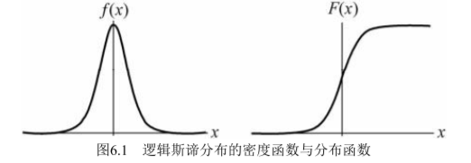
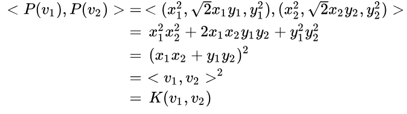

## 逻辑回归

接下来我打算以设问的形式来理解逻辑回归每个知识点

### 一、逻辑回归基本概念

#### 1、什么是逻辑分布

逻辑分布函数和其导数，即密度函数如下
$$
F(x) = P(X \leq x) = \frac{1}{1 + e^{-(x-μ)/γ}}
$$

$$
f(x) = F'(x) = \frac{e^{-(x-μ)/γ}}{γ(1 + e^{-(x-μ)/γ)^2}}
$$

逻辑分布函数，密度函数图像如下

#### 2、什么是Sigmoid函数

S型函数：
$$
σ(z) = \frac{1}{1+e^{-z}} = \frac{e^z}{1+e^{z}}
$$

#### 3、什么是逻辑回归

- 第一种理解角度：**基于Sigmoid函数**

  参考[看完这篇，逻辑回归80%都懂了](https://zhuanlan.zhihu.com/p/73608677)

  逻辑回归是用来做**分类算法**的，大家都熟悉线性回归，一般形式是$Y=aX+b$，y的取值范围是$[-∞, +∞]$，有这么多取值，怎么进行分类呢？不用担心，伟大的数学家已经为我们找到了一个方法。

  也就是把$Y$的结果带入一个**非线性变换**的**Sigmoid函数**中，即可得到$[0,1]$之间取值范围的数S，**S可以把它看成是一个概率值**，如果我们设置**概率阈值为0.5**，那么S大于0.5可以看成是正样本，小于0.5看成是负样本，就可以进行分类了。
  $$
  \frac{1}{1 + e^{-(\sum_jw_jx_j + b)}} =  \frac{e^{(\sum_jw_jx_j + b)}}{1+e^{(\sum_jw_jx_j + b)}}
  $$

- 第二种理解角度：**基于逻辑分布**

  参考[对逻辑斯蒂回归的一些细节剖析](https://blog.csdn.net/xmu_jupiter/article/details/46755679)

  一开始看李航老师利用逻辑分布讲逻辑回归时，有点懵。为啥$P(Y = 1|x)，P(Y = 0|x)$要这么定义
  $$
  P(Y = 1|x) = \frac{e^{(w·x + b)}}{1 + e^{(w·x + b)}}
  $$

  $$
  P(Y = 0|x) = \frac{1}{1 + e^{(w·x + b)}}
  $$

  但后来基本明白了，老师接下来引出**几率的概念**：一个事件的几率是指该事件发生的概率与该事件不发生的概率的比值。如果事件发生的概率是$p$，那么该事件的几率是$\frac{p}{(1-p)}$

  而**对数几率**或l**ogit函数**是：
  $$
  logit(p)=log\frac{p}{(1-p)}
  $$
  这样**实例为$Y=1$类的几率**为
  $$
  logit(P(Y = 1 | x))=log\frac{P(Y = 1 | x)}{1-P(Y = 1 | x)} = log(e^{w·x+b}) = w·x + b
  $$
  说明$Y=1$的**对数几率**对应一个输入$x$的**线性函数**

  这样到后来就绕回来了，说
  $$
  P(Y = 1|x) = \frac{e^{(w·x + b)}}{1 + e^{(w·x + b)}}
  $$
  是**逻辑回归模型**（其中$P(Y = 1|x) + P(Y = 0|x) = 1$，如果使用$P(Y = 0|x)$对应的函数作为逻辑回归模型，则性质与下面相反）

  - 当$x = 0$时，取1的概率值为$\frac{1}{2}$；
  - 当$x = -∞$时，取1的概率值为0，即取0的概率值为1；
  - 当$x = +∞$时，取1的概率值为1

  老师的目的应该是想在逻辑回归模型中，证明只研究**$x$的线性函数**是有意义的

#### 4、什么是Softmax函数

softmax函数，又称**归一化指数函数。**它是**二分类函数Sigmoid在多分类上的推广**，目的是将多分类的结果以概率的形式展现出来。
$$
softmax(z_j) = \frac{e^{z_j}}{\sum_Ke^{z_j}}
$$
下图展示了softmax的计算方法：

由于指数函数值域是$[0，+∞]$，所以可以通过指数函数将分类结果映射到一个非负数上，再通过$Softmax$函数进行归一化处理，使得所有的**预测结果概率之和为1**

详细例子请见这里[一分钟理解softmax函数（超简单）](https://blog.csdn.net/lz_peter/article/details/84574716)

#### 5、什么是核函数

- 核函数（Kernel Function，Kernel Trick）就是指：在低维空间中存在一个函数，如果采用内积运算来进行**非线性变换**（空间发生扭曲），那么**该函数等价于**低维空间经过非线性变换$φ(x)$映射到一个高维空间上的**内积**，即$K(x_1,x_2) = <φ(x),φ(x)>$ 

  更多介绍请见[百度百科](https://baike.baidu.com/item/%E6%A0%B8%E5%87%BD%E6%95%B0/4693132)

- 由于低维空间上数据集线性不可分，核函数的作用就是通过**内积**的计算，**将低维（特征）空间映射成高维（特征）空间**，使得在高维上的数据集线性可分。避免了“维数灾难”

  >这个核函数对应着一个二维空间到三维空间的映射（两特征计算后再添一维），它的表达式是：
  >$$
  >P(x,y) = (x^2,\sqrt2xy,y^2)
  >$$
  >可以验证，
  >

- 常见的核函数有

  1) 线性：$K(v_1,v_2) = <v_1,v_2>$ 
  2) 多项式：$K(v_1,v_2) = (γ<v_1,v_2> + c)^n $
  3) Radial basis function：$K(v_1,v_2) = tanh(γ<v_1,v_2> + c)$
  4) Sigmoid：$K(v_1,v_2) = exp{(-γ||v_1 - v_2||^2)}$

- 在实用中，很多使用者都是**盲目地试验各种核函数**，并扫描其中的参数，选择效果最好的。

参考[核函数的定义和作用](https://www.zhihu.com/question/24627666)，其中答主采用的是核函数$K(v_1,v_2) = <v_1,v_2>^2$进行实验

更多解释请看<https://www.zhihu.com/question/24627666>

#### 6、感知机和逻辑回归

1）逻辑回归的模型：

- 逻辑函数(S函数)，连续光滑可导
  $$
  \frac{1}{1 + e^{-(\sum_jw_jx_j + b)}}
  $$

- 其中$z = w · x + b$，所以在分类过程中**训练这个超平面**（或者是**超曲面**）$w · x + b$，进而来训练模型。
- 逻辑回归可以对线性，或**非线性划分的数据集**进行分类。但对于非线性的，需要自己去**定义一个非线性映射**，将低维空间通过**核函数**，映射到高维空间上。参考[逻辑斯蒂回归能否解决非线性分类问题？](https://www.zhihu.com/question/29385169)
- 对于非线性划分数据集的逻辑回归，代码参考[非线性逻辑回归--sklearn](https://www.cnblogs.com/lqk0216/p/12553562.html)

2）感知机模型：

- 阶跃函数，不连续不可导
  $$
  f(x) = sign(w · x + b)
  $$

- 同理，在分类过程中**训练这个超平面**$w · x + b$，进而来训练模型。

#### 7、逻辑回归和神经网络

在[Neutral Network and Deep Learning]()一书中，逻辑回归它区别于感知机，而且有另一个别称：**S神经元**，也可以叫做**逻辑神经元**。S神经元是神经网络的基本单位

### 二、逻辑回归的损失函数

#### 1、感知机的损失函数

对于一个误分类的点$x_1$，满足其实例的**实际类别**$y_1$ * **预测类别**$sign(w·x_1 + b)$ < 0，即$y_1(w·x_1+ b) < 0$，再计算该点到超平面$S: w·x_1 + b$的**距离**，即$-\frac{1}{||w||} y_1(w·x_1+ b)$，得到了一个误分类点的**损失值**（非负数），损失函数则是对所有误分类点（集合$M$）的损失值的累加。
$$
L(w,b) = -\frac{1}{||w||}\sum_{x_i \in M} y_i(w·x_i+ b)
$$
由于$-\frac{1}{||w||}$是个定值，所以损失函数最终定义为
$$
L(w,b) = -\sum_{x_i \in M} y_i(w·x_i+ b)
$$

#### 2、逻辑回归的损失函数

### 四、参考文档

1、[不觉得最大熵原理很奇怪吗？](https://www.zhihu.com/question/27812128/answer/38182071)

- 在最大熵模型中，“保留尽可能多的不确定性”是指“在没有更多的信息时，不擅自做假设”。

2、[各种机器学习算法的应用场景分别是什么（比如朴素贝叶斯、决策树、K 近邻、SVM、逻辑回归最大熵模型）](https://www.zhihu.com/question/26726794/answer/151282052)

- 回归方法的核心就是为函数找到最合适的参数，使得函数的值和样本的值最接近。例如线性回归(Linear regression)就是对于函数f(x)=ax+b，找到最合适的a,b。

  **LR拟合的就不是线性函数**了，它拟合的是一个**概率学中的函数**，f(x)的值这时候就反映了样本属于这个类的概率。

3、[看完这篇，逻辑回归80%都懂了](https://zhuanlan.zhihu.com/p/73608677)

4、[黑塞矩阵](https://baike.baidu.com/item/%E9%BB%91%E5%A1%9E%E7%9F%A9%E9%98%B5/2248782?fr=aladdin)

5、[最大熵模型，为什么最大的是条件熵？](https://www.zhihu.com/question/35295907/answer/161230190)

6、[exp函数](https://baike.baidu.com/item/exp/10942130?fr=aladdin)

7、[随机变量的不确定性及最大熵模型](https://zhuanlan.zhihu.com/p/84654505)

8、[最大熵不确定型决策模型与应用](https://www.zhangqiaokeyan.com/academic-journal-cn_journal-anhui-polytechnic-university_thesis/0201263522175.html)

9、[拉格朗日乘数法](https://baike.baidu.com/item/%E6%8B%89%E6%A0%BC%E6%9C%97%E6%97%A5%E4%B9%98%E6%95%B0%E6%B3%95/8550443?fr=aladdin)

10、[简易解说拉格朗日对偶（Lagrange duality）](https://www.cnblogs.com/90zeng/p/Lagrange_duality.html)

11、[牛顿法和拟牛顿法](https://zhuanlan.zhihu.com/p/46536960)

12、[对逻辑斯蒂回归的一些细节剖析](https://blog.csdn.net/xmu_jupiter/article/details/46755679)

#### 问题

##### 1、如何理解最大熵模型？相比于信息增益有什么优点？

- 不确定型决策是指各种**状态的后果已知**、**状态概率分布未知条件**下的一类决策分析问题。最大熵模型是不确定型的决策模型。
-  有学者将**益损值矩阵**转换成一维可比较序列，提出了解不确定型决策问题的投影寻踪方法． 此方法充分挖掘、利用益损值数据的客观变化信息，具有**决策准则客观**、**决策结果合理**的优点 ． 
- 但投影寻踪方法，仅考虑各方案决策结果期望值的方差最大化准则，**忽略了各种状态分布的不确定性**，不符合现实中**各种状态都存在发生可能性**的实际情况 
- 根据**最大熵原理**对**各种状态的权重分布**状况**做出推断时**，既需要满足各种状态权重分布的信息熵值最大，还应保证不确定型决策结果之间尽可能的分散，由此构成以自然状态为约束条件的复杂优化问题。采用**优化算法如加速遗传算法**优化推断出各种**未知状态权重的概率分布**，从而将不确定型决策问题转化为风险型决策分析问题进行决策分析。
- **概率平均分布等价于最大熵模型**。最大熵模型是基于概率平均分布的假设前提下设计的。
- 对于信息增益来说，训练得到的决策树很依赖于数据集，往往**不同的数据集会生成不同的决策树**，模型不稳定，这是因为没有考虑到数据分布的不确定性。

##### 2、为什么称为逻辑回归而不叫做逻辑分类？

- 将二分类0，1代入S曲线中，得到均匀分布的概率。S曲线比阶跃函数更平滑。
- $z = wx = w_0 + w_1 * x_1 + w_2 * x_2$，其中$z$是Sigmoid函数的自变量

##### 3、逻辑回归如何从二分类问题变成多分类问题？

##### 4、逻辑回归和神经网络的练习和区别？

5、感知机可以通过核函数对线性不可分的数据集进行划分吗，