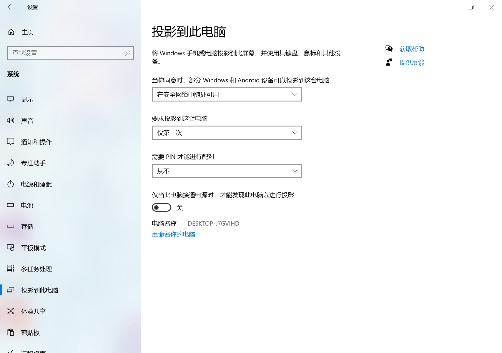

### 如何让surface go变成数位板？

#### 方法1、采用win10的miracast无线投屏功能

[miracast介绍](https://blog.csdn.net/sunmc1204953974/article/details/39611357)

该方法在同一局域网下（同一个路由入口），采用**wifi无线网络**，将PC端页面投射到平板上，而且还可以**设置平板对PC端的控制选项**。

点击设置>>系统>>投射到此电脑，修改三个选项，使**PC端页面投影到平板端**（设置成：不可投PC端，但可投平板端）

**PC端：**

**surface go（平板端）：**

注意**将`在安全网络中随处可用`修改成`所有位置都可用`**，PC端才可以识别surface go的无线设备。

**此时选择在PC端上选择连接，surface上响应连接即可**

而且还可以设置投影的方式：复制，扩展等

**优点**：平板不单单可以充当数位板，还可以充当数位屏

**缺点**：平板上pen的灵敏度，主要取决于wifi的质量

#### 方法2、使用VirtualTablet Server & VirtualTablet

**VirtualTablet Server安装地址：** [VirtualTablet Server for Windows](http://www.sunnysidesoft.com/virtualtablet/download/)，安装后是这个界面

**VirtualTablet客户端安装地址**：上window应用商店搜就行，但是需要收费（28rmb），可以下载试用版（andriod的好像有免费版本），安装后是这个界面

**优点**：pen灵敏度很高，而且可以设置笔压效果

**缺点**：只能充当数位板，不能充当数位屏

#### 其他方法

客户端下载spacedesk，PC端连接无线设备即可

<https://www.bilibili.com/video/BV17t4y127no?t=3>