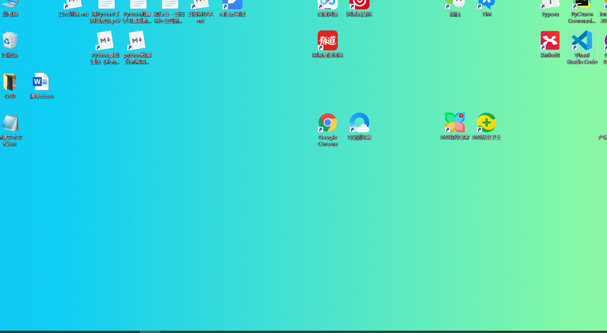
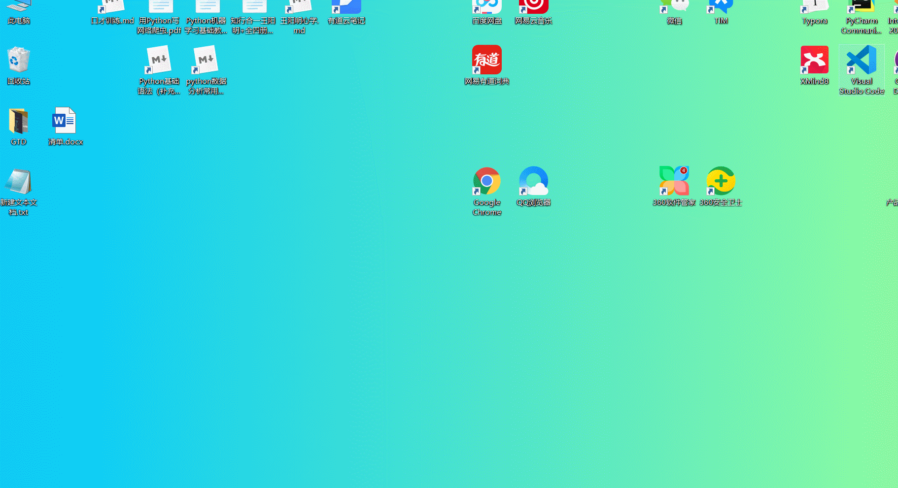
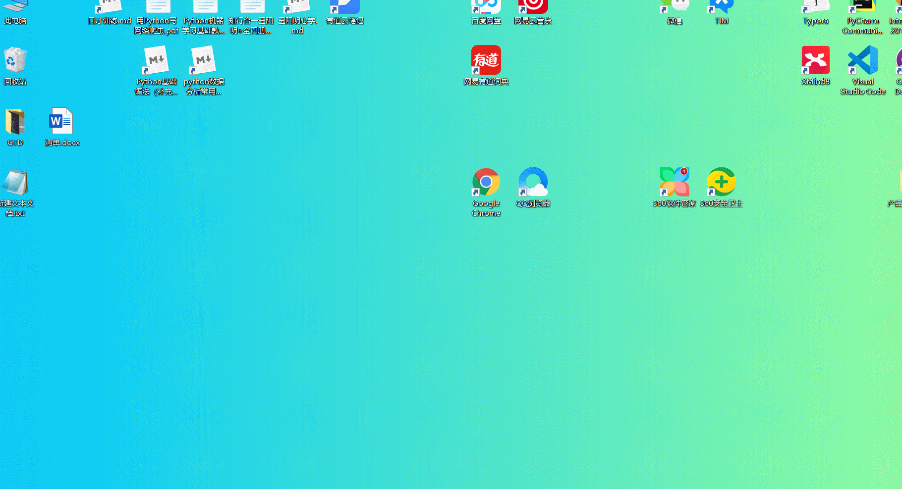
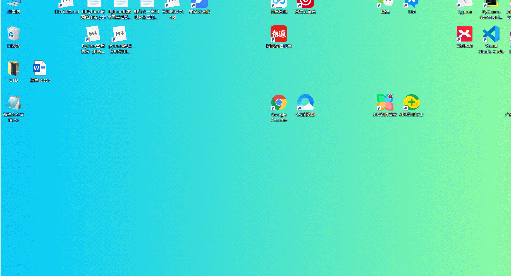

## 生产力工具 - Utools的使用与安装

参考https://blog.csdn.net/u010741032/article/details/102661363

**安装地址：**http://www.u.tools/，傻瓜式安装，不能自定义安装路径，默认安装在*AppData/local/Programs*中

**如何唤起**：打开软件后，每次要呼唤它时，快捷键`alt + space`

**如何使用**：

- 刚开始没有安装任何插件，**可以唤起默认的系统软件**（有些唤起不了）；
- 输入**“插件中心”**，可以下载你喜欢的插件。
- 如果不想安装插件，可以使用**“backspace”删除刚才的输入“插件中心”**

**推荐插件**：

- 各种开发文档：python，redis，linux等；

- 斗图（可用于微信，QQ交流）

- 聚合翻译（默认搜狗，Google，腾讯翻译，可以自定义）

**优点**：方便打开系统软件；方便使用插件扩展额外功能

**体验效果**：

**备注：** 是不是觉得背景图片很舒服，可以到该网站下载<https://coolbackgrounds.io/>，样式任你挑