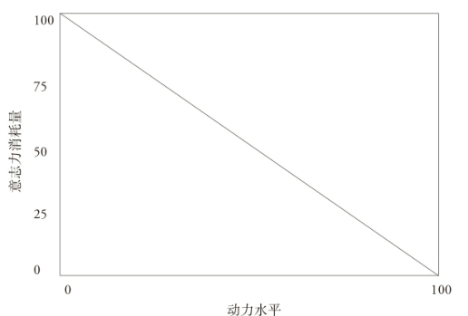

## 《微习惯》摘录

​		这本书强调了**微习惯策略的效用**，很不错的一本书，我将里面我觉得重要的内容摘录在此，方便回顾。**万事开头难**，即使有动力也难以执行，但是**微习惯策略却可以有效地解决拖延的问题**。在本篇最后面，我谈谈了我关于这本[《微习惯》](https://book.douban.com/subject/26877306/)书的理解和体会。

### 第一章、微习惯是什么

- 如果**没有产出什么结果，再大的决心也毫无价值**。比如，我可以“说”我要每天锻炼两小时，可根本就没这么做，**决心再大也就没有意义了**。实际上，**脱离行动的决心反而会有损自信**。
- 核心结论：**小决心比大决心的效果更好**。
- 你还应考虑下面**两个事实**：
  1.  **哪怕是一点点行动，也比毫不作为强无数倍**（在数学意义上如此，实际生活中也是如此）。
  2.  **相比某一天做很多事，每天做一点儿事的影响力会更大**。能大多少？答案是惊人的。因为每天完成一点儿事，积累起来就形成了一辈子的**固定习惯**。很快，你将看到它的影响到底有多大。
- 我之前让你摸自己的鼻子，是因为我希望你能明白一个道理。首先，请注意，**摸鼻子不会带来任何回报**。其次，**你还是这样做了，只是因为这件事你能做到**。如果你刚才没摸，现在摸吧，这样下面的内容就容易理解了（如果你不想摸鼻子，也可以选择其他动作）。你能摸到自己的鼻子，是因为你对这件事的**抵触情绪比你的意志力弱**。恭喜恭喜，你现在已经有资格学习微习惯了。

#### 1、一切的源头：挑战 1 个俯卧撑

- 我手头有个问题需要解决，这个技巧刚好闪现，于是我就开始思考，**30  分锺锻炼的对立面**是什么？吃着冰淇淋看电视可以算一个。在那种情况下，我的确觉得 30 分钟是个艰巨无比的挑战（像珠穆朗玛峰一样高）。换个思路吧，从锻炼强度入手。如果不是 30 分钟的挥汗如雨、浑身酸痛，而**只是做 1 个俯卧撑**会怎样？不必多做，1 个就够了。这正好和我的痛苦锻炼相反！
- 我摆好俯卧撑姿势后，突然注意到这和 30 分锺锻炼开始时的姿势一模一样。**只做了 1 个俯卧撑**，我的肩膀就快要裂开了，胳膊肘也该加润滑油了，肌肉就像睡了 24 年刚醒过来一样。可是，既然都已经摆好姿势了，我**索性又一口气多做了几个**。每做 1 个俯卧撑，迟钝的肌肉和
  顽固的大脑都无比煎熬。
- 这时，我的肌肉活动开了，有兴趣多做几个了，但因为**万事开头难**（而且我那时的身材太差了），**内心难免还有些抵触**。我继续使用相同的策略，每次设立的目标都尽可能小，这样容易坚持。

- 可有一天，直到进了被窝我才想起这件事，于是我翻过身来，趴下，在床上完成了 1 个俯卧撑。想到最后一秒才完成这项每日目标，我大笑起来。这件事**听起来可能意义不大**，但是**轻松成功并能保持成功的感觉真是太美妙了**。之后，我会看到它对我的成功有多么重要。

- 第一，虽然只是每天做几个俯卧撑，但这种**行为的确能在生理和心理上影响你的感受**。我的身体更结实了，肌肉也练出来了。第二，我意识到锻炼正在变成惯性。即使是面对这么微不足道
  的挑战，我每天也都在做了不起的事情。

**2、只为培养好习惯**

- 本书不会帮你戒烟或者控制赌瘾。**微习惯策略只会帮你培养好习惯**，给你的生活增添积极行
  为，持续丰富你的生活。
- 如果你有**坏习惯**，你改变自己的主要动力是**远离这些消极的东西**；如果你有**好习惯**，你改变自己的主要动力是**靠近这些积极的东西**。“靠近”是微习惯策略的重点。
- 像药物成瘾这样**根深蒂固的主动坏习惯**，改变起来需要进行心理治疗，可能还需要专业的辅助治疗。
- 如果你有**懒惰、恐惧或者浪费时间**这样的被动坏习惯，想找到长期的解决方案，那么这本书能帮上大忙。**如果给生活注入好习惯**，被动**坏习惯通常就会被边缘化**。
- 身处黑暗（也许是坏习惯导致的）中的人也需要光明。如果**你的生活因为坏习惯混乱不堪，增加一些好习惯能让它有所改变**。黑暗不是独立存在的，而是我们给“缺乏光明”起的别名。缺少好习惯的光照，生活中出现了黑暗的空洞，也许人们的坏习惯就是这么来的。

#### 2、微习惯简介

- 如果你想培养一个新习惯，微习惯基本上就是它经过**大幅缩减的版本**
- 微习惯体系的威力体现在以下几个方面：**应用、思维模式、固有正反馈循环机制、对自我效能感的自然提升**。
- 按照**微习惯策略**行动，就是运用**少量的意志力强迫自己每天做的微不足道的积极行为**。做一个俯卧撑或者想出几个点子并不需要大量的意志力。
- 利用微习惯做事，你会收获巨大的惊喜。
  - 首先，在完成你的微目标之后，你很可能会继续**完成“额外环节”**，这是因为我们本来就想进行这些积极行为，所以一旦开始，内心的抵触就会减轻。
  - 第二个收获是**惯性**。即使你没有超额完成微目标，你的行为也会**慢慢发展为微习惯**。

#### 3、习惯和大脑探秘

- 习惯了**每天写 1000 字**，一年下来就是 36.5 万字，相当于 7 本 5 万字的小说，当然，肯定没法跟列夫· 托尔斯泰 58 万字的巨著《战争与和平》比了。

  看看这些 5 万字左右的经典小说吧：

  - 道格拉斯·亚当斯的《银河系漫游指南》（46333 字）
  - 斯蒂芬·克莱恩的《红色英勇勋章》（50776 字）
  - F. 斯科特·菲茨杰拉德的《了不起的盖茨比》（50061 字）

  你第一次（或者前 100 次）尝试写的小说可能无法成为这样的世界名著，可是如果**每年都写 7 本**，就可以通过**多次尝试不断完善自己的水平**，对吧？

- 可能改变你一生的习惯还有：

  - 习惯每天锻炼 20 分钟，足够改变你的体格。
  - 习惯吃更加健康的食物，可能延长你的寿命，而且会让你的精力更充沛。
  - 习惯**每天早上早起 1 小时，每年就会多阅读 365 小时**。按照平均每分钟阅读 300 字算，利用这些额外的阅读时间，你每年能多读 657 万字，或 131 本 5 万字的书。这可是相当多的书了，肯定会帮你增长知识。

##### 1）习惯在大脑里的样子

- 它的工作机制是这样的：一旦**某个习惯指定的神经通路被一个想法或外部信号触发**，脑中就会有一个**电荷沿着这条通路放电**，然后你就会有一股想进行这项习惯行为的**强烈欲望**。
- 这就是拥有**习惯的神奇或悲惨**之处，至于到底神奇还是悲惨就要看习惯是好是坏。随着**习惯根深蒂固**，与之关联的**神经通路会变得更粗、更牢固**。
- 理解这一点后，我们的目标变得简单明了。如果想要创建并**强化特定的神经通路**，我们就要**不断重复**。

##### 2）习惯还与压力有关

- 压力会促进习惯性行为，无论这种习惯是好是坏。加州大学洛杉矶分校的两项实验和杜克大学的一项试验都发现：**压力会促进人们更加依赖惯性行为**

- 研究提出:“**遇到压力时**，人们无法轻易做出决定，**意志力会减弱**或令人感到不知所措。**你没有精力做出决定时，往往会重复平时的做法。**”好习惯是这样，坏习惯也是如此。

- 如果**坏习惯让你压力过大**，你会怎么做。压力是**负反馈循环**的绝佳导火索，它会触发一个坏习惯，**坏习惯又会触发内疚感、内心的焦虑和更多压力**，这些消极因素会再次触发这个习惯。

  如果**习惯本身就能缓解压力**会怎样？拿锻炼来说，你的压力把你拽到健身房，锻炼会帮你缓解焦虑。

  以上两种方式对生活的影响会有惊人的差别，因为一个**让你不顾艰难险阻积极地走向成功**，而另一个随时会把你**扔进消极的螺旋**里。

- **压力越多，生活就越难改变**。正如伍德教授所说，“你往往会**重复平时的做法**”。如果压力让我
  们走向习惯，那么它也会**让我们远离其他的一切**，包括我们所青睐的新积极行为（我们希望它能成为习惯）。

##### 3）养成新习惯需要多长时间？

- 关于习惯形成所需时长，被引用最多的是发表于 2009 年的《欧洲社会心理学杂志》（European Journal of Social Psychology ）上的一项研究，研究的每位参与者选择 “每天在同样的条件下（比如“早饭过后”）进食、饮水或做其他活动，总共 12 周”，他们有什么发现呢？

  一个行为变成习惯所需的时间**平均为 66 天** ，但不同行为所需时间相差很大，从 **18 天到 254 天**不等，这表明人们将**习惯自动化所需时间千差万别**。

- 好消息是，**习惯没有“开关键”**——如果你连续  60天做 100 个仰卧起坐，即使还没有形成全自动行为，第 61 天时做得也会比第 1 天时轻松很多。**创建习惯**就好像**骑自行车上陡坡：爬坡，到顶，下坡。**刚开始，你必须用双腿的最**大力量蹬**自行车，之后会**渐渐变得轻松**，但是你必须一直蹬到山顶，否则就会倒退回原地，让之前所有的进步付诸东流。

- 习惯形成的第一个信号是**抵触情绪减弱**。我们的**大脑偏爱执行习惯**，因为它们有**现成的路径**，也有已知的回报。可是**新的行为**没有经过实践，**存在风险**，而且**没有创建起神经通路**，在这个行为还**没有形成坚固的路径时，你必须特意压制**平时的行为。这个过程不断重复，**新生的神经通路就会开始成长**，总有一天，它能和之前的行为抗衡。

- 你已经锻炼了 6 个月，为什么要在达到目标的时候放弃呢？如果已经达到了这个程度，却又倒退回原点，你不会觉得灰心丧气吗？关键在于**能够识别宣告行为变成习惯的信号**，之后你就可以**把关注点转移到其他事情上**，同时继续这种行为。

- 从**生理学角度**看，漏掉一天也不会耽误习惯的养成，一天成就不了这个过程，也毁灭不了这个过程；但从**心理学角度**看，这可能会带来问题。如果你真的漏掉了一天，请记住，以后要**尽量坚持下去，一天都不要偷懒**，因为坚持才能防止你受到打击并前功尽弃。

### 第二章、大脑的工作原理

- **重复**就是（**潜意识**）大脑使用的语言。**创建习惯**的目标是用**重复来改变大脑**。可是**大脑会抗拒改变**，除非它们**能大方地给大脑一些回报**。
- 因此，从大脑的角度看，在事实上**改变习惯**的两个关键是**重复和回报**。
- 潜意识大脑**喜欢效率**，这就是我们能**养成习惯**的原因。

#### 1、变化缓慢、状态稳定的大脑

- 我擅自把大脑分成两个不同的部分——**潜意识部分和意识部分**。大脑由许多部分组成，远比这种分法更复杂，但对我们的目的来说，这种分法已经足够了。

- 人类大脑很稳定，不易改变。它有一套**对外部世界做出反应的固定体系**。试想如果你的人格和生活习惯能一天变一个样会如何——你肯定会发疯的！
- 我们的行为中有 **45% 是自动完成**、无须思考的，既然
  如此，最好能让它们对我们的生活和目标有所帮助。为了能专业地实现这一点，我们需要认识大脑里的**两个核心角色**：愚蠢的重复者 -  **基底神经节**，与聪明的管理者 - **前额皮层**。

#### 2、愚蠢的重复者与聪明的管理者

- 你**大脑中绝大部分是愚蠢**的，你抽烟的时候，它不会考虑到肺癌的可能性。**基底神经节**是大脑里**比较顽固**的部分，会找到长期维持这种状态的方法。它会识别并重复模式，直到接收到不同的新指令。
- 大脑的另一个区域**前额皮层**则相当聪明。它就在前额的后
  面，是个**可以理解长远利益和结果**的管理者。它拥有**抑制基底神经节**的能力。它还负责处理短期思维和决策。
- **前额皮层**在抵抗巧克力蛋糕的诱惑（但愿真能抵抗住），想学法语，希望身体健康，希望有一天能写一本书。它是大脑的意识部分，你会把这部分看作“你”。可问题是，它**容易疲劳**。也许更准确地说，因为它的**功能太过强大，所以会消耗太多精力**，让你感到疲劳。而且**当你疲劳时**（或者像之前说的那样有压力时），**掌管重复的部分就会接管大脑**。
- 基底神经节意识不到只有人类才有的高层次目标，**一旦我们训练基底神经节自动完成积极行为**，我们真的会爱上这种感觉。
- **聪明的前额皮层**不如**没有**思想、一味重复的**基底神经节有**
  **毅力**，我们可以运用**聪明的策略来克服前额皮层天生的弱点**。

#### 3、前额皮层——对抗自动行为的防御武器

- 那些**额叶受损者**忍不住要**模仿实验人员的动作**，哪怕有人要求他们不进行模仿。额叶受损者似乎**无法**做出某些决定来**“抑制”潜意识**。潜意识几乎就像另一个物体，或者一台机器一样。同样有趣的是，额叶正常的被试忘记了实验人员的一些动作，而额叶受损者能记住他们的每一个动作。

#### 4、基底神经节——模式探测器

- 大脑的**基底神经节**从生理角度看是一组神经核，它们形成一个整体，**在习惯的形成和程序性学习中起核心**作用。

- 研究人员召集了 3 类人群——健康人群、帕金森综合征患者和有记忆障碍的人群。由于细胞坏死，**帕金森综合征患者**的大脑很难把神经递质多巴胺运送到基底神经节，从而导致**基底神经节功能障碍**。

  参与者会拿到 4 张卡片，卡片上的图形是随机的，他们被要求预测每张卡片代表的是雨水还是阳光。人们很难有意识地在卡片和结果之间创建联系，但可以在潜意识中掌握某种微妙的联系模式。这项研究总共进行了 50 次测试，大约 10 次之后，**健康的参与者和有记忆障碍的参与者都能逐渐提高猜测的准确率**，从 **50% 提高到 65%~70%**；他们在潜意识中掌握了暗示雨水或阳光的模式。而**帕金森综合征患者的准确率最终也没有超过 50%**。因为不具备正常的基底神经节，他们的大脑**无法探测到模式（因此，他们很难养成新习惯）**。

#### 5、基底神经节 & 前额皮层

- **前额皮层**的管理功能**相当活跃，反应灵敏**，但同时也消耗了大量的精力（和意志力）。**基底神经节**的**自动功能不仅强大**，而且**效率高**。它们能**节省精力**，无须持续监督就能处理各种任务。

### 第三章、动力 V.S 意志力

- 我非常讨厌采用动力作为启动策略，如果**想持久改变**，**动力并不是可靠**的策略。

- 当**动力处于峰值**时（右下角），**意志力消耗量为 0**
  或可忽略不计。这是因为你**无须强迫自己**做你本来就愿意做的事。

  当你**做事缺乏动力**时，意志力的消耗量就会猛涨。**意志力消耗量较高**时，你会**难以长期维持**一个行为并将其培养成**习惯**。

  

#### 1、“激发动力”策略的诸多问题

- 如果你的策略是“激发动力”，那么你就无法创建起习惯。

##### 1）动力并不可靠

- 如果选择**“激发动力”策略**，你不仅要有动力做一件事，还必须**动力十足**才行。因此，想要**激发出锻炼的动力**，你想锻炼的意愿必须**比想吃薯条和看电视的意愿更强烈才行**。

- **动力**之所以不可靠，是因为它**以人的感受为基础**，而人类的**感受容易改变。**任何事物能成为**基础**的第一原则就是它必须**牢固可靠**，而“激发动力”策略就像是在液体上盖房子。
- **很多东西都能改变你的感受**：一次事件、血糖水平、抑郁、化学物质紊乱、荷尔蒙、健康、外界刺激、信仰甚至猫的呕吐物。
- **每个人都有不在状态的时候**，这时精力相对不足。这意味着你希望高效率办事的动力也会更低。**“激发动力”策略劝我们依赖这些东西**：励志视频、文章、给自己打气的话和其他能短期提升士气的方法。

##### 2）你不会每次都愿意激发动力

- 当你有动力时，做事很容易，也不需要太多意志力（如果有的话）。问题在于，**动力是很难**（有时几乎不可能）**按需培养**的。
- 我们很难**靠想法来改变感受**。只有在**精力充沛、思维模式健康**而且**没有受到强烈诱惑**时，我们才能依靠动力成功。
- 选择以动力为基础的思维模式：你根本**不想**让自己**想**让自己**想**锻炼。
- 如果你**不愿意激发动力**，而**激发动力又是你做事的策略**，那么战斗还没开始你就**已经输了**，你的习惯也会早早流产。

##### 3）有人习惯性地认为动力是行动的唯一基础

- **坚信必须有动力才能行动**是一种**毁灭性的习惯**。如果只是“我想激发动力”，那它就不成问题；可是**如果不激发动力**就什么都做不了，那它就是个问题。它是**坠入“懒惰旋涡”的完美路线**。
- 如果你总是在**什么都不想干**的**同时奉行动力法则**，那你就会**一直懒下去**，没有出路。

##### 4）“热情递减法则”是动力让我们失败的原因

- 习惯不仅无法被认知捕捉到，而且也不会掺杂情绪。……很奇怪，**人们进行习惯行为时是不带有情绪的**。
- 当参与者做出惯性行为时，毫无疑问，他们比平时更缺乏情绪变化。 这就是“**需要动力才能行动**”的想法在培养习惯时反而会**帮倒忙**的原因。
- **惯性行为不会引发强烈情绪**，这是它的一大**优势**。”的确是这样，因为任何**依赖人类情感的东西都是完全不可靠**的。
- **有热情是好事**，但我们应该把这种思维模式看作一种额外奖励，**而不是实施行动的信号**。
- 在一段时间过后出现**热情不足**的情况其实是个**积极的信号**，表明更稳定和自动的基底神经节正在慢慢夺取控制权。
- 虽然我已经说了这么多，但你不用担心，你还可以充分**享受原来的生活方式**。你依然是个**有感情**的人类。我可**不是让你放弃感受**，而是希望你**不要再因为感受而放弃**。

#### 2、为什么意志力能打败动力

- 微习惯的**意志力策略**能帮助人们**提升动力**。再重申一遍，动力是好东西，只是不可靠而已。
- 如果先采取行动，动力就会被迅速地激发。

##### 1）意志力很可靠

- **动力也不会轻易改善**，因为如果你的狗病死了，你会情绪崩溃，或者你累了或者情绪很差时也会不想锻炼。
- 与此相反的是，你却能提高**克服**可能来自**感情创伤、缺乏自信、情绪糟糕或者精力不足**的**抵触情绪**，进而采取行动的能力，**这种能力就是意志力**。

##### 2）意志力可以被强化

- 和动力不一样，**意志力可以像肌肉一样得到强化**。
- 和没有进行健身的学生相比，那些花两周时间磨炼意志力以**改善体形的学生**“在随后的**自控力测试中有显著的进步**

##### 3）意志力策略可以通过计划执行

- 如果你依赖动力，严格执行时间计划是很困难的。谁知道你到该写作时究竟有没有动力呢？**动力无法预测，所以不适合制订计划。**
- 相反，如果运用**意志力**，你可以给某项活动安排一个时间表。不管到时候有没有足够动力，你都可以顺利完成，这样就容易坚持下去，既**有利于习惯养成**，也**有利于时间安排**

#### 3、意志力的工作原理

- 举个研究：**吃巧克力**和**吃萝卜**的被试同样要解答一个难题。在尝试答题所花的时间方面，吃萝卜组连吃巧克力组的一半都不到，而且在最终放弃之前尝试的次数也更少。**没吃到巧克力而只能吃萝卜**似乎**耗尽了他们继续努力解答难题的意志**。鲍迈斯特把这种现象命名为“**自我损耗**”（ego  depletion）。

##### 1）做决定也会消耗意志力

- 在同一天里**做过艰难决定**的人在后来**面对诱惑时屈服的可能性更高**，这体现了自控力的下降。
- 我们能从中得出一个结论——必须把**自控力的储备量最大化**，这样才能在改变自己时起作用。

##### 2）一项重要的意志力元分析

- 元分析是从指定主题的相关文献中提取出重要结论的过程，可以说是“**对研究的研究**”，它有助于消除个体研究中出现的偏差。
- **自我损耗**本质上和**意志力损耗**或**自控力损耗**是同一个概念
- 这项元分析发现了引起**自我损耗的 5 个最重要的因素**：**努力**程度、**感知**难度、**消极情绪**、**主观疲劳**和**血糖**水平。
- 意志力全部耗尽后我们该做什么？此时就没有任何希望了吗？根据这项研究，**动力激励**、**自控力任务训练**以及**补充血糖**等做法能**提升**自我损耗人群的**自控力**。

### 第四章、微习惯策略

#### 1、以微习惯方式运用意志力

- 在涉及**自我损耗**的活动中，那些认为自己拥有**无限**
  **意志力**的人似乎**坚持得更久**。
- 可**如果意志力只是被“意志力有限”这种想法限制住**了呢？这对微习惯意味着什么？绝对是大好消息！因为**微习惯几乎不会消耗意志力**，所以采用微习惯的方法，你便会拥有无穷无尽的意志力。
- 当你彻底**精疲力竭、意志力耗尽时**，**微习惯**策略
  在任何情况下都能**让你采取行动**
- 自我损耗  5  大原因是（排名不分先后）：努力程度，感知难度，消极情绪，主观疲劳，血糖水平。

##### 1）努力程度

- 微习惯策略**既严格又灵活**。刚开始它很严格，会**强迫**你开始行动，之后会变得**充满弹性**，让你自行决定想超额完成多少。
- 任务完成后的**超额努力每次都不一样**，也就是说有时产出会更高，有时则会相对低一些，这是一种能有效降低精力耗尽的可能性的自然体系。

##### 2）感知难度

- **30 分锺锻炼**就像一座高山一样。那次锻炼的**感知难度很高**——我感觉到的困难比实际的大得多。当我决定以**一个俯卧撑开始**，然后再以同样的方式继续时，**感知难度显著下降了**。
- 在任何计划中，设定**微目标**都是**降低感知难度**的最佳方式（**分而治之**）。即使是**从做小事开始**，你也会有**脚踏实地**的感觉。
- 正如从**物理学**角度看，**物体的惯性在运动开始前最大**（**静止**时物体**存在惯性**），一旦物体**处于运动状态**，因为存在动量（而且动力也增长了），**一切都会变得简单**。
- **开始行动的理由是最难找到**的，因为目标的重量造成了巨大的压力。而**一旦开始**，我们会觉得似乎**需要达到最初的目标才算得上成功**。

##### 3）消极情绪

- **消极情绪**指的就是**不愉快的感觉**体验。
- 微习惯的目的是为人生**增添美好事物**，所以它**和消极情绪的关系不大**，除非你的行为直接取代了一件让你开心的事情。
- 即使**微习惯取代了一件令你开心的事情**，你要做的努力也太少了，**少到你根本不会感觉到任何消极情绪**。通常情况下，你会**用有益的行为取代浪费时间的行为**，这个过程本身就会带来**积极情绪**。
- 做小事可以获得快乐，但这个**小事不一定会形成微习惯**。这本书既强调**微习惯**会帮我们**养成积极的习惯**，也强调**制定微目标的习惯性策略**。

##### 4）主观疲劳

- **主观疲劳**，意思是我们在**评估自己的疲劳程度**时并**不是完全客观**的。

- 微习惯只会**引起微量**的主观疲劳。主观疲劳与很多因素有关，其中一个主要因素就是你**如何看待自己与目标之间的斗争**。我发现如果我的**目标很高，野心很大**，**主观疲劳**就会**更严重**。

  事实上，我感觉自己有充足的能量完成 1 个俯卧撑，而且这种“轻易就能做成一件事”的想法，哪怕是**很小的事**，也能**让我的能量更充足**。

- 微习惯可以**有效缓解主观疲劳**。甚至当我**（主观感到）疲惫不堪**时，我仍感觉**有足够精力**阅读 2 页书或写 50 字。

##### 5）血糖水平

- 如果血液中**葡萄糖含量变低**，你会感觉**疲惫**。如果低到危险水平，你甚至可能晕倒。
- 微习惯和血糖相互独立，但因为**微习惯策略**是**使用意志力**能量的方法中**效率最高**的，所以它**有助于保留血糖量**。
- **精神能量**的利用效率会大大提高。
- 微习惯策略，你会尽可能多地保存意志力。一旦超越了目标，当然会感觉更棒。在你**因为血糖低而感觉疲劳**时，最有可能**让你行动起来的就是微习惯**。

##### 6）小总结

​	微习惯**既严格又灵活**；是**降低感知难度**的最佳方式；为人生**增添美好事物**；**有效缓解主观疲劳**；**有助于保留血糖量**

#### 2、微习惯如何拓宽你的舒适区

- 这些**目标**都要在**经历不舒适的过程**后**才能实现**（因为偏离了基底神经节目前的程序），所以它们都**在舒适区外**。

- **微习惯策略**就像走到**圆圈的边缘**，然后向外迈出一步。这是一个相对不舒适的地方，但因为你知道**走一步就可以回到舒适区里**，所以差别不会很明显。

- 一旦你**迈出了第一步**，就算**处于运动状态**中了。你会像我一样发现正如**牛顿（物理学）的运动定律**所示，**一旦开**
  **始做就很难停下**，当然，保持前进的难度也很大（有来自基底神经节的**抵抗过大变化的阻力（外力）**）

  牛顿第一运动定律的内容包括： 

  - 1）除非受到外力作用，否则静止的物体总保持静止状态。
  - 2）**除非受到外力作用**，否则处于**运动状态**中的物体的**速度不会改变**。

- 一小步＋想做的事＝较高的进一步行动的可能性

#### 3、出现阻力的两个时间节点

- 猫都不喜欢水，也不喜欢冰。如果我们把她扔到**雪地里**。她站在**原地一动不动**，疑惑了 3 秒钟，然后不高兴地跑回屋里。如果我们把她放到**雪地边缘**。这次成功了！ 她开始在雪地里四处熘达，还**向深处探索**了一番。
- **大脑天生抵触变化**，而且大多数阻力会在两个特定时刻出现：**行动前的阻力**，**继续行动**时面对的**阻力**。

##### 1）行动前的阻力

- 如果第一个动作只是轻轻一推，那么最初的阻力就会小很多。**一旦行动开始，就会出现第二波阻力**。
- 这**第二波阻力有多强大，取决于你迈出的第一步有多大冲击力**（每次都不一样）。

##### 2）继续行动时面对的阻力

- 这种阻力并不神秘，它**只是与惯性行为（第一步的惯性）**产生了**潜意识冲突**。你可以**骗过基底神经节，让它不抵触第一步**，可是当你试图继续行动时，它还是会知道第一步的目标是什么。
- **基底神经节**不屑于“防御”微步骤，它**只会对抗剧烈变化**。通过**慢慢变化**，而且一次只迈进一小步，你就可以按照大脑的规则行动了。
- 如果你在**完成微目标之后还想继续**，那就继续使用**微步骤策略**吧
- 你肯定**不想为了短期收获毁了长远计划**。我也不想故意吓你，让你把每次需要完成的任务定得太小，让自己毫无进
  步。

#### 4、跨域障碍的微习惯

- 阻力的两种常见形式——**精神方面**和**身体方面**的。
- 而不光动力如此，**贸然使用意志力**同样也**会导致效率低下**。
- **精明的意志力管理**方法正是个人成长的关键所在，正如精明的理财方法是财富增长的关键一样。通过**精明的理财手段**，工作普通、收入相对较低的人 也可以变成百万富翁，而有些年收入上百万美元的顶级运动员却最终一
  贫如洗。
- 自我（意志力）损耗  5  大原因是（排名不分先后）：**努力程度，感知难度，消极情绪，主观疲劳，血糖水平**。
- 如果你不好好规划行动策略，就会在**无效的意志力策略**和动力策略之间摇摆不定，**最终只会受挫**。

##### 1）精神阻碍：你有锻炼的精力，却不想锻炼

- **现在**的你根本**不想**锻炼，可是总体来看，你**这辈子**还是**想**锻炼的。这就是**当前感受和人生价值**之间的想法**冲突**。

- 当我们用“**小得不可思议的一小步**”的方式来行动时，认知难度和**意志力消耗量会显著降低**。

##### 2）身体阻碍：因为很累，所以你的身体并不想锻炼

- 通常**精力为零**也就意味着**动力为零**。意志力较弱时——运用微习惯策略。
- 从很多方面看，做 1 个俯卧撑比不做容易。这项挑战太过轻松，你的自尊心这时就会起作用：“也许我很**固执**，现在很累，可还得加把劲，我一定能做到。”我建议你经常提醒自己：**如果连渺小的习惯目标都无法实现，这多让人无地自容啊**。

##### 3）把微习惯融入生活

- 因为习惯有很高的价值，这么做的确值得，可是如果你也**想练出好体形**。却只能**在一段时间里专注于写作**这一件事，你是否会感到遗憾呢？
- 你目前行为的焦点和你想提高的**其他领域之间的紧张关系**，会让你偏离原计划。
- 采用微习惯策略可以有效地处理这种紧张关系

### 补充：我的一些理解

#### 1、习惯与刻板

- **习惯强调的是行为**或者想法，而**刻板，惯性思维强调的是想法**
- 刻板是习惯的一部分

#### 2、神经质人格与习惯的强迫

- 神经质人格**对待事情比较消极**，**对痛苦的事情十分敏感**。他们时常为了别人而**压抑自己的情感**；
- 在与人竞争中，他们经常**对对手保持敌意**，担心自己落后而时刻**逼迫自己做事情**，**即使自己已经不错了，但是比不过别人，会感到很痛苦**。
- 的确，**强迫的力量会让我感到痛苦**，这是自己**先前动力系统**带来的。我想**弥补**自己**人格上的缺陷**，我不想压抑自己的情感，不想过分压迫自己。**但是人要生存，不逼迫自己**是没法往高处爬的，**无法成为人上人**。
- 所以**保持积极**的心态，采用**微习惯的策略**，适当地**逼迫自己不再是承受痛苦**，而是为了生存，自由，快乐，为了目标而奋斗。
- 如果可以做到不要对痛苦过于敏感，这样就**不会产生过大的消极情绪**，**意志力不会过分损耗**。如何辩证地看待痛苦，请看这里[辩证行为疗法： 掌握正念、改善人际效能、调节情绪和承受痛苦的技巧](https://book.douban.com/subject/3574846/)

#### 3、动力与行动

- 不是说动力不行，而是说**以动力作为行动的基础，这是不行的**

- **万事开头难**，但**如果以意志力作为行动的根基**，然后**用热情，动力惯性地完成某件事**，这样**意志力的消耗量就能降低**，就能依靠意志力做更多的事情。
- 微习惯的**意志力策略**能帮助人们**提升动力**。再重申一遍，**动力是好东西**，只是**不可靠**而已。

#### 4、感情和意志

- 你依然是个**有感情**的人类。我可**不是让你放弃感受**，而是希望你**不要再因为感受而放弃**。

- 我之前（从开始准备考研到考研结束）曾一度执意想抛弃过自己的真实感受，**用理性的想法克制自己的情绪**。但是这样的**过分强迫只会使自己感到痛苦**，痛苦就是感受，我是抛弃不了的。然而当时的我没有意识到这点，我只想**否定**掉不可靠的感情，那是**冲动的情绪**，一开始我尝到了甜头，自以为不会做太多错事，进而**使我坚信感受这种东西是没用的**。

  但到了**考研后期，我内心无比焦虑，无比痛苦**，而痛苦的情绪就是在我每次压抑住自己的冲动产生的。而当时与我同寝的研友，他靠动力行动，虽然有时不如意，但是我开始思考**感受，情感这份不可思议的力量**。再到后期，我不断给自己打气，才勉强上了考场。

  再到后来，我了解到了神经质人格，我就是那样**对痛苦敏感**，把**习惯压迫自己**作为自己的动力启动装置，**做事容易走极端**，**容易迷茫的人**。我开始意识到我思维方式上存在错误，**过分压迫不利于积极思考，也不利于身体健康**。此时我的真实感受终于浮出了自己的水面。

- 作者说的很对：你依然是个**有感情**的人类。我可**不是让你放弃感受**，而是希望你**不要再因为感受而放弃**。我**把感受这份力量极端化了**，忽视了它的客观存在和它的正面积极力量。

#### 5、微习惯和小事

- 微习惯是指我们通过制定**微小任务**，这个任务不会给我们带来负担，我们可以**欣然地做出行动**。比如每天一个俯卧撑可以帮助我们坚持健身。
- 然而有些事情**我们并不打算将其作为习惯**，也许干了它就完事了，没有循环性，但是我们却因为**某些事情**过于大，**花的时间有点多**，**拖延不去行动**。
- 其实**微习惯的策略也可以用在做一些目标上**，将事情**分而治之**，通过将大事分解成一个个小事，我们可以完成小事，从中获得动力，也可以获得持续下去的惯性。而**不是因为这个目标过于庞大，野心过于强大**而感到**恐惧**，选择**拖延**。
- 做小事可以获得快乐，但这个**小事不一定会形成习惯**，只是说：小事符合微习惯策略，**微习惯**即指定微目标并做出行动的**习惯性思维**。
- 这本书既强调**微习惯**会帮我们**养成积极的习惯**，也强调**制定微目标的习惯性（微步骤）策略。从小事做起，会有脚踏实地的感觉**

#### 6、微习惯和目标

- 微习惯不是要我们将目标定得“很小”，换个词说就是**短浅**。
- 我们要定一个**长远**的计划、目标，然后采用**微习惯，微步骤策略**来实现目标。由于基底神经节会**抗拒过大的变化**，所以我们需要**慢慢地走出**舒适圈，**一步步做出改变**，这样才能越走越远，离目标越来越近。

#### 7、如何使用意志力

- 而不光动力如此，**贸然使用意志力**同样也**会导致效率低下**。要进行**精明的意志力管理**。
- 自我（意志力）损耗  5  大原因是（排名不分先后）：**努力程度，感知难度，消极情绪，主观疲劳，血糖水平**。（一定要关注这几个因素，做好**意志力管理**。意志力管理得好，**精力消耗就会少些**，精神上，身体上阻力就不会那么大）
- 执行意志力之前，存在**两种阻力**，分别是——**精神方面**和**身体方面**的，而且这两种阻力可以发生在**行动前**和**行动中**。
- 当我们用“**小得不可思议的一小步**”的方式来行动时，认知难度和**意志力消耗量会显著降低**。

#### 8、微习惯和感动自己

- 微习惯不是让你每天完成这些**“短浅”的目标**，来**欺骗自己**：今天干了这些，已经足够了。而实际上没干多少内容，只是在**自己感动自己罢了**。
- 一定要静下心来，实事求是。从我个人来说，**怀抱一些痛苦可以让自己保持冷静**，但是对于我这种**压迫性情绪**的神经质人格来说，一旦碰到痛苦，思维上就会形成一个定势：**越想越痛苦**。
- 所以**在痛苦中怀抱积极**，这才能让自己既有**肯定自己的力量**，也有**静下来火热的心的力量**，这两股力量可以帮助你去认识事物，但是千万**不要被痛苦情绪反噬**，这里可以看[辩证行为疗法： 掌握正念、改善人际效能、调节情绪和承受痛苦的技巧](https://book.douban.com/subject/3574846/)。

#### 9、微习惯和动力

- **动力充足**的时候，**意志力**消耗很低，**几乎为0**，但是当**动力不足**的时候，**意志力消耗会很高**
- **微习惯**还是会消耗一定量的意志力的，虽然没有动力好，但是在比较积极的情绪下**比较稳定**。
- **动力策略有助于自己建立目标**，比如你喜欢计算机，那你就拼命去干吧，因为这是你想清楚的事情，而**微习惯**则强调把动力建立的目标分而治之，**专注每一天的质量**。

#### 10、微习惯都做不了怎么办

- 可以考虑**将目标降低一点**，没有过分的负担。比如你打算每天背一个英语句子，但是**长难句很难背**，实行起来压力很大，那么可以将其换成**多个简单的英语句子**来背诵。
- 如果**自己很痛苦，什么事情都不想干**，似乎全身每一处的关节都不打算动弹，十分懒惰；亦或是因为痛苦，选择逃避它而做出的"自毁"行为：玩游戏连续两三天，沉迷性行为等，这里可以看[辩证行为疗法： 掌握正念、改善人际效能、调节情绪和承受痛苦的技巧](https://book.douban.com/subject/3574846/)。

