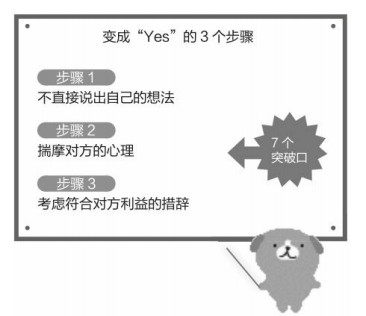

## 所谓情商高就是会说话

### 小tip

- 为什么要看这些书，说说我自己吧，我因为自己的**笨嘴拙舌处理不好人与人的关系**，又由于自己的**仍性**，相信自己是对的而**抱怨对方**。我发现自己**压力的产生**有很大部分是**源于自己在与人交往中的不足**，总是用**自己的思考方式，自己的语感**来处理人际关系，着实很累，这也导致了**我把与人对话这件日常活动当作是一种累赘**。
- 为什么我想要改变，因为当你准备踏出社会时，你会意识到：**不会说话，不爱说话是相当致命的**。因为一个人的本事决定了他目前所处的地位，而会说话则决定了他有多大的上升空间。与人说话是个学习的过程，**学习为人，学习专业知识最有效的方法就是与人交流**。
- 说话和练字一样，可以反映一个人的内心环境。只有内心沉稳的人，才能写出刚劲有力的字，才能说出让人舒服的话。**情商高就是会说话，此话不假**，因为善于控制自己情绪的人，可以掩盖住自己内心的真实想法，说出让人舒服的话。**只要注意一些细节，与人对话就不会那么困难**。
- 情商和智商是共同发展的，只有**情商高了，才能发现自己内心微妙的情绪变化**，并作出改变，让自己**积极阳光地面对着每一天单调的生活**，才能不停地**吸收新知识**。
- 个人感觉先看[别输在不会表达上](https://book.douban.com/subject/26986715/)，再看[所谓情商高就是会说话](https://book.douban.com/subject/26865749/)，效果会比较好
- 前书主要通过中国历史事件和现代小案例，分析比较不同说话者在该场合，该对象，使用不同的表达方式，以及比较听者的不同感受和表现，来**得出怎样说话才能让对方舒服**。
- 只有当你从前书中认识到说话并不是把自己内心的想法不加掩盖的表达出来，而是需要通过**对脑子里要表达的意思进行再编码**，最后才能从口中说出来。
- 前书**以中国人处事逻辑**，涵盖的面比较广，涉及人与人的关系也比较广。它**每一个小标题就有提醒告诫作用**，每一小节都有小总结，便于我们不单单可以作为一本日常会话的**工具书**，也可以作为一本**提高自我修养**的书，比如教我们要**谦虚，委婉，幽默**等。
- 后书诙谐幽默，读起来很轻松，主要介绍了**措辞的技巧，让对方的回答从No变成Yes，实操性较强**，虽然作者是日本人，但是有些方法还是具有普世价值的，**具体问题具体分析**。

### 前言

**人的行为意愿，会受到措辞的影响**。措辞就像做菜，是**有谱可循**的。 

- 例子1：**“去把垃圾扔了。”**可结果呢？就得看对方当时的心情了。 得到的回答很可能是**“我现在很累”**，或是**“我正在看电视呢”**。

  换种说法：**“扔垃圾和打扫浴室，你选哪个？”** 一般人自然会选择更轻松的扔垃圾。

- 例子2：邀请意中人约会时，很多人会这样说： **“你这周六有空吗？”** 若是两情相悦，那自然没什么问题，否则能不能得到肯定的回答可就难说了

  要换种说法，就能跨过这道障碍，成功得到“OK”的答复。

  “那家很有名的意大利餐厅，现在只能**订到这周五或周六的位子**，你哪天有空？”这样一说，对方就会从中选择一天。

**把“No”变成“Yes”的7个突破口**

- ①“投其所好” 
- ②“儆其所恶” 
- ③“选择的自由” 
- ④“被认可欲” 
- ⑤“非你不可” 
- ⑥“团队化” 
- ⑦“感谢” 

**创造“警句”的5个技巧** 

- ①“惊奇法” 
- ②“反差法” 
- ③“赤裸裸法” 
- ④“重复法” 
- ⑤“高潮法” 
- ⑥“数字法” 
- ⑦“合体法” 
- ⑧“顶点法”

​		我正无所事事地看着本子上的字句，突然发现了**“语言的法则”**。按照这个所谓的“法则”去写文案，竟然**得到了“很有趣”的好评**。我的人生并不是逐渐改变的，而是在**掌握了“语言的法则”之后，一下子就发生了天翻地覆的变化**。

### 第一章 完美掌握！把“No”变成“Yes”的技巧

#### 1、三个步骤

##### 1）步骤1、不直接说出自己的想法

- 我们都是凡人，不可能保证所有事都不直接说出来，但至少请记住，**不要直接说出“这是很重要的请求！”之类的话**。有人从老家寄来很多柑橘，家人甚至都吃腻了，而你不想让剩下的柑橘白白烂掉。 在这种时候，**请不要直接说： “大家继续吃啊！”**  

##### 2）步骤2、揣摩对方的心理 

- 请试着揣测吃腻了柑橘的家人的心理。 **“不能光吃柑橘。”** 这应该就是家人的想法。此时，请再次忘记自己的请求，**想想家人的喜恶。**例如： **“不想感冒。”** 没人愿意生病。 到了容易感冒的季节，身边就会出现感冒患者，家人都很在意这一 点。

##### 3）步骤3：考虑符合对方利益的措辞：

- 关键在于，要创造**符合对方利益的上下文关系**。即使措辞有所改变，只要最终达成目的就行。 既然家人不想感冒，就可以对他们说： **“多吃柑橘就不会感冒了。”** 

#### 2、7个突破口

##### 1）突破口1：投其所好

既是最基本的，也是最管用的 

- **反面例子：** “**抱歉，这种衬衫只剩这一件了。**” 听到店员这样说，你会怎么想？ 可能会一下子产生“是别人挑剩下的吧”“恐怕有很多人试穿过”的印象。

- **正面例子：** “**这种衬衫卖得特别快，这是最后一件了。**” 你又会怎么想？大概会产生“要是流行，我也想买”“最后一件了，不买就没了”的印象。 

- 店员的目的是“**希望顾客消费**”，但不能直接说出来，而是要**揣摩顾客的心理**，采用“**投其所好”的措辞**。 

- **反面例子：**飞机上在分配供餐的一幕，由于乘客大多优先选择牛肉，所以导致鱼大量剩余。 **“对不起，只剩鱼了。”** 如果空姐这样说，乘客就会觉得自己简直成了废品回收站，哪里还有吃东西的心情

- **正面例子：** “**机内供应以优质香草、富含矿物质的天然岩盐和粗制黑胡椒嫩煎而成的白身鱼，以及普通牛肉。**” 乘客就会**心甘情愿地主动选择鱼**。 这就是措辞的力量。

- **正面例子：**  有种白薯名叫“山田芋（化名）”，团队由于提升不了这种白薯的销量而发愁，菅女士同团队众人商议，决定不用品种名，而是起个昵称。**“生焦糖芋”** 这个昵称恰到好处地体现了其令人陶醉的味道与温和润滑的口感。 

  **这正是购物主妇的“所好”，用主妇特别喜欢的“生焦糖”一词重新命名**，成功地刺激了顾客的购买欲。

- **反面例子：**某公司做的是向汽车厂商提供导航系统的生意，也就是所谓的外包公司，但厂商的条件非常苛刻，某公司得到的利润很低。所以某公司向厂商提议，**“让我们制作高价的高规格型号吧。”** 厂商对此的回答是“No”。

- **正面例子：** “**让我们制作贵公司的旗舰型号吧。**“ 厂商的部长则一拍大腿： 

  “好，早就在等你提出这个方案呢！！” 

##### 2）突破口2：儆其所恶 

对难以说服的人有效。效力强劲的最终手段

- **反面例子：** 大家应该都见过这样的警示语： “**请勿触碰展品。**” 这是展示方不希望有人触摸展品。 可就算这样写，还是不免有人触碰。有的人**越被命令，就越想反 抗**。

- **正面例子：** **“涂有药品，请勿触碰。”**看到这句话，就没人想碰了，因为一旦摸到，药品就会沾在手上， 可能对身体有害，所以还是不摸为好。 “因为有这样的坏处，所以不要这样做。”

- **反面例子：** 结婚已有二十五年的安藤由衣（化名）一直在独自生闷气，因为丈 

  夫上完厕所总是不合上马桶盖。如果马桶盖开着，由衣担心家里养的猫会去马桶里喝水，所以她每次都得提醒： **“合上马桶盖。”** 丈夫当时会不情愿地合上马桶盖，但第二天就会旧态复萌。由衣彻底搞不懂丈夫的神经了。 

- **正面例子：** **“听说不合上马桶盖会失去财运哦。”** 

- **反面例子：** 傍晚的家庭餐厅。当天，餐厅里有一帮带着孩子的妈妈，还有很多 

  工薪族。店员齐藤典子很伤脑筋，因为孩子们不光吵闹，甚至还离开座位，在地上跑来跑去。齐藤来到孩子们的妈妈桌前，向正在愉快交谈的妈妈帮提出请求： 

  **“为了避免打扰其他客人，可否请你们让孩子坐在座位上？”** 这句话说完，妈妈帮只是向齐藤瞥了一眼，然后就若无其事地继续 谈论学校老师的闲话了。齐藤希望她们管管孩子，而不是闲聊。 

- **正面例子：** “**刚做好的菜很烫，如果端出来的时候被撞撒了，会给孩子造成很严重的烫伤**。 可否请你们让孩子回到座位上？” 妈妈帮先是面面相觑，随后不是喊孩子回到座位上，就是自己起身去接孩子。这就是“儆其所恶”的措辞突破口。 

- **反面例子：** 大阪某书店的店长山田高次（化名）最近很烦恼。 尽管店员非常用心，但偷书行为仍屡禁不绝。店里准备了公告，上面写着大字： “**偷窃是犯罪！”** 

  **可是毫无效果**。

- **正面例子：** 新公告上是这样写的： **“多亏大家的协助，我们捉到了盗窃犯。谢谢！”** 

##### 3）突破口3：选择的自由 

 关键在于，要给出两个合适的选项，**无论对方选择哪个，自己都能达到目的**

- **反面例子：** “要不要来份甜点？”
- **正面例子：**“甜点有杧果布丁和抹茶冰激凌，您要哪种？” 
- 不直接说“ 穿衬衫” ，而是问**“有花纹的衬衫和有小熊的衬衫， 你想穿哪件？”** 措辞**在育儿方面尤其有效**，高明的措辞能让孩子变得主动自愿。不过，如果一直使用“选择的自由”，难免千篇一律，所以应该尝试经常换不同的“措辞菜谱”。 **“措辞菜谱”能成为推动孩子的人生不断向前的真正力量**。

##### 4）突破口4：被认可欲

​	对于**生意和家人**效果极大！人际关系也会改善 

- **正面例子**： “**你把窗户擦擦！我忙不过来。**” 妻子对从不干家务活儿的丈夫这样说，丈夫会主动开始擦窗户吗？ 答案当然是“No”。丈夫会产生被迫做麻烦事的感觉，只想立刻逃开。 **“你能够到高的地方，能把窗户擦得更亮。拜托了！”** 这样一说，丈夫就会跃跃欲试。

- 商务人士自不用说，主妇、学生、老人统统如此。**一个人得到别人的认可，就会产生回应期待的欲望。**在这种情况下，**哪怕是有些麻烦的请求，对方也会欣然接受**。 

- **正面例子：** 一天，铃木急匆匆地给藤木打来电话，声称自己交货失误，必须向 

  客户解释。藤木叫铃木立刻给客户打电话道歉，可是藤木在电话里听出，铃木是想让自己代他打电话解释。 **“连这点小事儿都办不到？”** 若在平时，藤木肯定会像这样表示拒绝，但她这次没这么说，而是变成：**“没关系，铃木你一定能做到！客户也在期待听你亲自说明。”**

- 两个人站在变绿的信号灯下，却不过马路，在旁人看来可能显得很奇怪。下田靖子（化名）想领着三岁的外甥过马路，可是外甥不愿意牵手，而那条马路上车来车往，甚至还有大卡车。 **“这里很危险，拉住我的手。” 下田说了很多遍，可外甥每次都说“不”，就是不牵手。**看来外甥不想被当成小孩子对待，尽管他明明就是个小孩子…… 信号灯又变绿了，可两个人仍旧站在原地。下田望着再度变红的信 

  号灯犯愁。然后，她尝试使用了“措辞菜谱”。 **“我一个人很害怕，你能不能拉着我的手一起过马路？” 她反过来把外甥当作大人对待了。**结果，外甥很开心地牵住了她的手。

##### 5）突破口5：非你不可

​		听到“只有你是特别的”，人就容易被说动 

- **反面例子：**据说二十多岁的年轻人不会和上司喝酒。 我的朋友问公司的一个新人： “**去喝酒吧？”** 对方却反问： “为什么要去喝酒？”朋友根本没想到对方会如此反问，慌忙回答：**“啊，你要是忙就算了。”**

- **正面例子：**这个时代就是这样。 朋友的烦恼还没完。部门里有酒会，朋友负责组织。部长对他说：“上次人来得不全，这次一定要把人都叫来。”这可是大危机啊。 朋友仔细考虑后，使用了这样的措辞： “**市川，你不来不热闹，所以只有市川你务必得出席啊。**” 他把这条信息发给了所有部门成员。当然不是群发，而是对应姓名 逐一发送的。结果，当天的部门酒会全员到齐。

- **正面例子：**我随身携带这些精密机器外出使用时，经常出故障。于是我询问支持中心，得知符合条件就可以免费更换。当时，A公司的客服并没有像下面这样说： “**我们会免费为您更换。**” 光是免费更换，我就已经很感激了，可对方更是这样说的： “**我们只为一直支持本公司的佐佐木先生您免费更换。**” 听对方这样说，我很开心。原本是对故障的投诉，可是客服如此应对，反而**使我产生了“享受到了服务”的良好印象**。

- **正面例子：** 两人早就约定一起吃饭的周五晚上。结果，由于永井临时参加一个 

  脱不开身的会议，约会不得不在最后关头取消了。 第二天周六，二人一起吃午饭，女朋友开口了： “工作和我哪个重要？” 如果永井此时回答： “**对不起。但我也不是因为喜欢才工作的。**” 那就**彻底出局了**。女朋友肯定会气得青筋直暴，玻璃杯里的水大概也会震得溅出来吧。 然而，永井当时是这样说的： “**对不起。但是只有优子你，我不愿让你这样想。对不起。是我没用**。” 出乎意料的温言暖语，**利用“非你不可”**，能让对方感到只有自己被选中的**优越感**，从而乐于做出回 

  应。

##### 6）突破口6：团队化

​		“一起”这种说法，本身就令人愉快。**喜欢和别人一起做事**，本来就是人的本能。利用好这种本能，就算是麻烦的请求，也容易说动对方。

- **正面例子**： “你也来组织酒会吧。” 如果朋友对你这么说，你大概会认为很麻烦，觉得还不如自己一个人组织呢。那像下面这样说呢？ “**咱们一起组织酒会吧。**”

- **正面例子：** 2013年在足球世界杯预选赛上，一直以0：1落后的日本队，最后在伤停补时阶段，追平比分，帮助日本队拿到了参加巴西世界杯正赛的入场券。涉谷十字路口，驻足的陌生人也停下来反复击掌，人越来越多，不仅造成拥堵，还陷入恐慌。是平时，在场的巡警会这样说： **“请不要踏入车道！请遵守交通规则！”** 可是就算这样提醒，对于因世界杯出线和醉酒而陷入兴奋状态的球迷们也完全没用。当天的巡警不同，“**别看我这个巡警在你们面前板着脸，其实我也因为日本队的世界杯出线而感到开心。**” “**巡警也是你们的队友。请听听队友的话。**” 听巡警这样一说，球迷们立刻开始鼓掌。这番话一下子就抓住了球迷们的心。年轻人会想： “**原来是队友啊！队友的话必须得听，因为日本队正是靠着良好的团队合作才能出线的……**” 

- **正面例子：**出于健康考虑，母亲和亚由美都曾这样劝说过，但父亲完全不动如 

  山，可能是觉得现在再运动也没什么用了，反倒麻烦，所以才没动力吧。一次，亚由美得知“措辞菜谱”的存在后，就死马当作活马医地用在了父亲身上。 **“我想夜跑，但自己一个人害怕，你能不能陪我一起跑？”** “大山”瞬间动了。听女儿说完，父亲挠了挠头，最后还是同意跟女儿一起跑步了。 

##### 7）突破口7：感谢 

- 关键在于说“谢谢”的时机。应该在提出请求后立刻就说“谢谢”。按正常顺序来说，一般都是在事成之后才说“谢谢”，但这个“措辞菜谱”的诀窍就是，要在**提出请求的瞬间，趁对方还没做出任何思考和决定的时候，就说出“谢谢”**。 

- **正面例子：** “请把货物搬到二楼。谢谢！” ，“请把垃圾扔了。谢谢！”，“请最迟在明天答复。谢谢！”

- **正面例子：**砍价高手至今已在无数卖场砍价成功，对销售员的回答当然无法接 

  受。他开始吹毛求疵，指责印刷上的细微歪斜，试图从所有角度砍价。后辈一脸为难。一直在后面观察的河濑迅速上前，替下后辈销售员，重新向顾客介绍了该商品的魅力。然后，他把手伸入口袋，像掏出什么东西一样，小心翼翼地把手中那个“**看不见的东西**”放在了商品上。“那是什么？”顾客们纷纷询问。河濑说道： 

  “**请允许我送上我的真心作为赠品，还请高抬贵手。谢谢。**” 听河濑这么说，砍价高手笑道：“**大哥你很有趣，太有趣了。**”最后，他按定价买下了那个商品。

#### 3、小总结 

①利用“**投其所好**” 

既能获得对方的好感，又能实现自己的期望。 

②利用“**儆其所恶**” 

能形成强大的强制力。这是措辞的最终手段。 

③利用“**选择的自由**” 

能够**引导对方**，同时又不会留下被迫感。 

④利用“**被认可欲**” 

对方即使**很难对付**，也会乐于回应期待。 

⑤利用“**非你不可**” 

能让对方感到只有自己**被选中的优越感**，从而乐于做出回应。 

⑥利用“**团队化**” 

能使对方产生**伙伴意识**，即使是麻烦的请求，也会乐于接受。 

⑦利用“**感谢**” 

能让对方隐约产生**信赖意识**，从而难以轻易拒绝

#### 4、实例1：想邀请对方一起吃饭 

**反面例子：** “一起吃顿饭吧？” 

**正面例子：** 

**步骤1：**不直接说出自己的想法。 

**步骤2：**揣摩对方的心理。

假设对方的情况如下： **“经常受到邀请。” “喜欢美食。” “想去平时去不了的地方。”**

**步骤3：** 考虑符合对方利益的措辞。

- ①投其所好 

  “**常去的那家餐厅**很快就要停业了。 趁停业之前去一趟吧？ “ 但是“常去的餐厅”能在多大程度上投其所好，似乎不太好说。 

- ①投其所好 

  “**那家特别好吃的餐厅**很快就要停业了。趁停业之前去一趟吧？ “

- ①投其所好 

  刚从**夏威夷上岸的烤饼店**开业了

- ①投其所好 

  现在**客人还不多，要不要一起去**？

- ③选择的自由 

  **航天食物餐厅和学校食堂**，你想去哪里一起吃顿饭？

  考虑到对方**“想去平时去不了的地方”**，我给出了“航天食物餐厅”和“学校食堂”这两个选项。 

#### 5、实例2：希望下属准确报告 

​		村山是你的下属。 报告的内容总是含糊不清。 怎样说才能让村山准确报告呢？ 怎样说才能让下属村山变得乐意主动做报告。 

**反面例子**   “希望你能准确报告”

**正面例子**

- ②儆其所恶 

  如果不准确报告的话，要是**出了问题，你得承担后果**。 

- ①投其所好 

  为了**确保在出问题之前**我能保持跟进，**请准确报告**。 

- ④被认可欲 

  **我想提高对你的评价**。在此期间，**如果你能好好做报告，我也方便给好评**。 

**备注：**

- 尽量把“儆其所恶”当作**万不得已才使用的手段**。

- **“投其所好”和“被认可欲”** ——这两个突破口是生意场上的利器

#### 6、实例3：希望上司提供建议 

​		你在工作上非常苦恼，但上司远山很忙，抽不出时间帮助你。 该怎么说，才能让上司抽出时间给你提供一些建议呢？ 

**正面例子：**

- ⑤投其所好”  

- ⑤非你不可 

  “有件事**需要马上做出决定**，我**只想**请您指点一下。”

- ④被认可欲 

  我想**努力追上您的脚步**，您能**听听我在工作上的烦恼吗**？ 

**备注：**

- 事实上，每个上司都会感到不安。 他们会想：“下属真的信赖我吗？” **作为上司，其实更想得到认可。**

- 你在面对上司的时候，请营造温暖的氛围，告诉上司： **“我信赖您。” “我想向前辈您学习。”** 

### 第二章 完美掌握！创造“警句”的技巧

​		只要有了菜谱，就算达不到专业大厨的水准，也能做出家庭大厨的味道。 正如做菜有菜谱一样，措辞同样有谱可循。 

​		无论是历史上的人物，还是当代的企业家和领导，他们的手中无一不握有警 

句。 这就是使用了**“反差法”**这一措辞技巧

- 前田敦子： **“就算讨厌我，也请不要讨厌AKB！”**
- 孙正义： **“不是头发在后退，而是我在前进。”** 
- 卓别林： **“人生近看是悲剧，远看是喜剧。”** 
- 电视广播作家铃木： **“看似无意义的事，竟是有意义的。”** 

#### 1、8大技巧

​	把**交流视为“技巧”而非“唯心论”** 。

##### 1）技巧1：“惊奇法” 

- **步骤：**
  - **①确定想传达的内容 **
  - **②加入适当的惊奇词** 

- **正面例子：**木村拓哉在电视剧《恋爱世纪》中，对将要离去的女主人公说：**“噢咦！等等！”** 。他想传达的内容就是“等等”，但通过加入“噢咦”，就产生了独创性。

- **正面例子： “震惊全美！” **这句话常被用作电影的宣传语，它令人一看就想知道究竟是什么样 

  的电影，并将其加入观影候选名单中。

- **正面例子： “喔喔！真是我的挚友啊！”** 《哆啦A梦》里的刚田武总是脾气暴躁，但只要别人支持他成为歌手的梦想，他的态度就会骤然一变，说出上面这句话。光是“真是我的 挚友啊”这句话，就**蕴含了感动、激动之情**，再加入**“喔喔”，更进一步加强了力度**。 

- **惊奇词表：**

  - “啊” ，“哇”， “对啊” ，“吓一跳” ，“喔喔喔！” ，“哎呀” “竟然是这样！” ，“啊呀” ，“哎！？” ，“真的！？” ，“难以置信” ，“（放在句尾的）！” 

- **正面例子：** “我要成为海贼王” 仅从意思上来说，这就完全能表达清楚了，但光凭这句话，肯定成 不了名言。实际上，路飞是这样说的： **“我要成为海贼王！！！”** 

- 正面例子： 请回忆自己的童年。说到骑自行车，大概都是装上辅助轮再练习， 这款“变身自行车”承载了他的巨大期待，可是发售以后，只卖出了全年目标的一半。商品本身很好，但“**无须特训就能学会骑自行车**”这一宣传口号，没能引起妈妈们的兴趣。他彻夜思考，嘴里不停念叨，终于想出了这样一句宣传语： “**啊！只要半个小时就能学会骑自行车！**”

**备注：**

- 例如，在**商业文件中如果加入“！！！”，就会显得做过头**了
- 但对于**面向年轻人的网络媒体**等，则非常合适。 

##### 2）技巧2：“反差法” 

​		将想要传达的内容，**与“反义词”放在一起**，就能形成令人印象深刻的信息。 心理学上有一个与这种**反差法相似的法则**，称为“得失效应”。该法则在人际交流方面的解释是：“最初的**评价是消极的**，但在**不经意间看到积极的一面**，评价就会猛然涨高。” 

- **步骤：**
  - ①确定最**想传达的内容** 
  - ②在前半句**加入反义词**
  - ③**自由加入其他词**，使前后句连接起来 

- **正面例子：** 龙猫中主人公皋月和妹妹小梅所说的话，**“好像在做梦”，“可又不是梦”** 。（“在做梦”  <-> “不是梦” ）

- **正面例子：** **“最好是枚金牌，最坏也是金牌。”** 

  在悉尼奥运会的记者会上，被问到参赛目标的田村亮子选手，通过这句回答**表达了自己的决心。**“最坏也是金牌”的表意已经足够清楚， 而她又加上了含义相反的“最好是枚金牌”，令全日本为之感动，也给大家带来了希望。 (“最好”  <-> “最坏” )

- **正面例子： 《美女与野兽》** 这个故事讲述了一个王子被人施加魔法变成野兽的模样后寻找真爱的历程。这本是一则法国民间故事，被迪士尼公司拍成动画片后，顿时风靡全世界。标题中加入**“美女”和“野兽”这两个反差明显的词**，形成了极大的冲击力。 （“美女”  <->  “野兽” ）

- “大章鱼烧” --》大<->小  --》“显得**盘子很小**的**大章鱼烧”**

- **正面例子：** 乔布斯在苹果电脑拥有自己团队的时期。团队试图实现的是令人感动、改变常识；团队成员追求的是前所未有的创意、超越业界藩篱的探索。乔布斯用下面这句话比喻了自己这伙**人试图打破常规的风格**： **“当海盗更有趣。**” 

  光是这句话，就已经相当朗朗上口了，因为它的内容很独特。然而，乔布斯没有就此罢手，他实际说出的话给人的印象更深刻： **“加入海军还不如当海盗更有趣。”** 他加入了**无拘无束的“海盗”的反义词——重视纪律的“海军”。** 这正是“反差法”的应用。

- 刻在印度孤儿院墙上的一段话，据说特里莎修女生前对其格外重视。这段话偶尔用到了反差法，**但作者并没有刻意顾及“法则”，而是坦率地写出了人类的“本质”**： 

  人是**不讲理**的，会做自私的事。 

  即便如此，也请**原谅**。 

  你若**显露善意**，必会**被人怀疑**。即便如此，也请坚持。 

  你若**获得成功**，必会**遭叛树敌**。 

  即便如此，也请成功。 

  你若**做人正直**，必会**为人所骗**。 

  即便如此，也请正直。 

  你用**多日所创**，别人**一晚即毁**。 

  即便如此，也请创造。 

  你寻**安乐幸福**，必会**遭人妒忌**。 

  即便如此，也请幸福。 

  今日**纵然行善**，明日**或即被忘**。 

  即便如此，也请行善。 

  你若**予人以物**，必有**人不知足**。 

  即便如此，也请给予。

##### 3）技巧3：“赤裸裸法” 

​		令人脸上发烧、难为情的、暴露自我的“措辞菜谱”。 能让你创造出自己从来没写过的、充满人情味儿的、生气勃勃的、吸引人的话语。大家可能以为，正因为说者付出了认真的努力，这些闪闪发光、热情四溢的话才会自然而然地从他们嘴里脱口而出，也只有经历过的人才能说得出来。 但**实际上，这些话也是可以通过技巧创造出来的**。

- **步骤：**
  - ①确定最**想传达的内容** 
  - ②把**自己的身体反应**赤裸裸地变成话语 
  - ③在想传达的内容前**加入“赤裸裸词”** 

- 雅典奥运会上夺得金牌的北岛康介选手所说的话。他在受伤及身体欠佳的艰难状态下赢得了胜利： **“激动得战栗！”，“心情超爽！”** ，

- 《花样男子》中，喜欢杉菜的道明寺司所说的一句台词： “我喜欢你，**迷恋到连自己都觉得莫名其妙。**” 

- 日本职棒联赛的乐天VS巨人的比赛中：“**从没打过像今天这样令人陶醉的比赛**。很开心。真的连眼泪都出来了。” 

- 《绝对内定》的作者杉村太郎：**“梦想不是想出来的，是从心里涌出来的。”**  

- **正面例子：**

  - 嘴？→说不出话 	**“好吃得说不出话”** 
  - 皮肤？→起鸡皮疙瘩	 **“好吃得起鸡皮疙瘩”** 
  - 脑中？→一片空白 	**“好吃得脑中一片空白”** 

- **赤裸裸法问题表：**

  - 脸上？→情不自禁地微笑 
  - 喉咙？→咕噜响 
  - 嘴唇？→舔嘴唇 
  - 呼吸？→瞬间停顿 
  - 眼睛？→想闭上 
  - 汗毛？→全身汗毛直立 
  - 皮肤？→起鸡皮疙瘩 
  - 脑中？→一片空白 
  - 手心？→汗津津的 
  - 指尖？→颤抖 
  - 血流？→变快 

- **正面例子：** 高田绘里（化名）在自己所憧憬的公司的最终面试中陷入了危机。 

  对于一些常见的问题，她按照事先准备做了回答。这时，一位面试官说了这样一句话： “回答得相当流利啊。是事先准备好的吗？”高田的脑中顿时一片空白。她的回答确实都是事先针对可能的提问准备好的，却被面试官识破了。数秒钟的沉默，仿佛成了永远。然后，高田如此答道： 

  “不是，我很紧张。” 不仅如此，她还把自己参加面试的想法和紧张赤裸裸地直接说了出来： “**我很紧张。喉咙很干，手心冒汗，还惊讶于自己身上的毛孔竟然这么多！**” 

- **正面例子：** 有些学生所做的演讲非常出色，小出（化名）就是其中一人。一开始，渡部坦率地告诉小出： **“你的演讲很感人。没什么需要修改的地方。”** 渡部站在评价者的立场上，已经留意向对方准确传达状况，可是听完评价，小出却问：**“真的没有需要修改的地方吗？”**渡部不知道怎么说才能让小出明白。到了正式演讲的最后一堂课，渡部改变了措辞。他听完小出更加饱含热情的演讲后，**赤裸裸地直接说出了自己的感想**： **“我哭了……这样就很好。”** 渡部接着还说：**“同学们应该也会这样想的。”** 小出听完，流下了眼泪。尽管班里还有女生，他觉得哭出来很难为情，但仍然控制不住情绪。

##### 4）技巧4：“重复法” 

​		重复会如此令人**印象深刻**。 心理学上的“纯粹接触效应”——“光靠增加接触次数就能提升好感度”——已被实验证实。 

- **步骤：**
  - ①确定想传达的内容 
  - ②重复 

- **正面例子**： “**不要着急，不要着急。休息一会儿，休息一会儿。**” 这是动画片《聪明的一休》中，一休在片尾躺下来时的口头禅。

- **正面例子**： **“我有一个梦想……我有一个梦想……”**  马丁·路德·金一生致力于建立一个与肤色和出身无关的、人人平等的社会。这段话就出自他满怀希望的一场演讲。将“我有一个梦想”加以重复，就成了美国历史上纪念碑般的名言。

- **正面例子**：**“不能逃避，不能逃避，不能逃避。”** 这是动画片《新世纪福音战士》的主人公碇真嗣所说的话。他想改变，所以告诉自己“不能逃避”。通过重复，就成了足以烙印在观众记忆中的警句。

- **正面例子**：“**罗密欧啊，罗密欧！为什么你偏偏是罗密欧呢？**” 这是《罗密欧与朱丽叶》中十分著名的一幕。**两人分别生在敌对家族，却爱上了彼此**。

- **正面例子：**据说很多人听**吉卜力电影的音乐**，都会感到“心灵仿佛受到了洗 

  礼”“不禁回想起儿时”。 的确，电影呈现的世界加上吉卜力的音乐，让观众深深地沉浸其中。《悬崖上的金鱼公主》上映后，全日本都被片中的那首歌洗脑了。 

  我当时也会边走边下意识地哼唱：“波妞，波妞，波妞”。这支音乐里藏着秘密，它是按照令人上瘾的音乐制法完成的。例如刚才提到的副歌部分，从含义上来说，就是在**介绍名字： “波妞，鱼之子”** 但实际唱出来的时候，就**使用了“重复法”，变成：“波妞，波妞，波妞，鱼之子”** 重复以后，不仅变得**富有节奏，而且令人印象深刻**。

##### 5）技巧5：“高潮法” 

这个格外重要，请不要忘记。 

​		人们读书时看到句子中的**“——”或“……”**，就会想：**“接下来会说什么呢？”** 这就是“高潮法” 。这种技巧能能让对方觉得“接下来的话很重要，必须仔细听！”从而**集中注意力**。 

- 步骤：
  - ①**不突然说出“想传达的内容”** 
  - ②**从高潮词开始** 

- 《哈尔的移动城堡》：哈尔出战之前，对女主人公苏菲如此说道 “**我必须守护的人终于出现了……那就是你。”**

- **“只有两种选择——要么拼命去活，要么拼命去死。”** 电影《肖申克的救赎》，讲述了蒙冤入狱的安迪没有放弃希望，坚信自己能够等来重获自由的那一天。这句强有力的名言，**同时用到了高潮法和反差法**。 

- 是冈本太郎在讨论人生时所说的话，**“我就直截了当地回答吧——抛弃金钱和名誉，剩下的就是生命。”**

- **高潮词表：**

  - “请保密” 
  - “这里测验会考到” 
  - “**能听见这个是你走运**” 
  - “**只在这里说**” 
  - “接下来禁止拍照” 
  - “**只说一遍**” 
  - “**关键有两点**” 
  - “**在其他场合不会透露**” 
  - “**只告诉你一个人**”
  - “我要告白了” 

- 正面例子：

  Before：“大章鱼烧” 

  After：“接下来禁止拍照的……大章鱼烧”

- 正面例子：演讲时，**“光听下面这部分，大家就没白来……请看例题。”** 

##### 6）技巧6：“数字法”

​	单纯从语言效果的角度来看，**2、4、6、8、10等偶数**显得比较柔和，所以**弱**；**1、3、5、7、9等奇数**则显得有棱角，所以**强**。 

- **步骤：**
  - ①确定想传达的内容 
  - ②用**合适的数字置换**

- 正面例子：**“一颗300米”** 这是格力高公司的奶糖宣传语。意思是说，一颗奶糖所含的能量能支持一个人跑300米。其目的本是宣传**“一颗奶糖就含有大量营养”**， 

  而通过变成数字，使**说服力和冲击力都更强**了。

- **正面例子**：“**101只斑点狗**”，而不是“很多只斑点狗”，

- **正面例子**：“**3分钟烹饪**” ，而不是“短时间烹饪”

- **正面例子**：“**天才就是1%的灵感加上99%的努力**”，而不是“天才就是**很少**的灵感加上**很大**的努力” （数字法，差法）

##### 7）技巧7：“合体法“

​		世上的新事物，绝大多数都是由“两个事物组合”而成的。 这种“合体法”常用于**“新商品的命名”**和**“企图引领潮流的现象名”**。

- 步骤：
  - ①选择**主要核心词** 
  - ②准备大量用于替换次要核心词的**同义候选词** 
  - ③**组合** 

- **“妖怪手表”**，“妖怪”和“手表”本身都是很普通的词，但将这两个**向来无关的词合体，就创造出了新的名称**。

- “**懒散吉祥物**” ，日本全国本来就有许多形象懒洋洋的吉祥物，三浦纯给它们起了这个统一的名称以后，吉祥物集团开始受到关注，进而风靡全国。除了合体词中的“懒散”，还有**“无力”“泄气”“柔软”“温和”等词作为候选**，而“懒散”显然要高出数筹。 

- **“清凉商务”**  ，指让夏天也能舒适度过的服装。这个词的出现，目的性很强。表示 

  凉爽、帅气的“清凉”，与表示生意、商业的“商务”合体，**打破了企业文化中“轻装等于失礼”的概念**。

- **“壁咚”**，指男性将女性逼至墙边，“咚”地把手撑到墙上的行为。据说被“壁咚”的女性会瞬间怦然心动。

- **“儿童店长”** ，在丰田汽车电视广告系列中登场的角色。由加藤清史郎扮演的店 

  长，**用儿童口吻的比喻解释了减税等活动政策**。（用到反义词的“反差法”，又是“合体法”）

- **正面例子：**

  Before：“大章鱼烧” 

  After：“棒球章鱼烧” 

- **正面例子：** 用**“草食男子”** 为**“消极恋爱的男子”**命名。因为男性是主题，所以主要**核心词是“男子”**，**次要核心词是“消极的”**，再把它的**同义候选词**写出来： “保守” “温顺” “草食”“客气” ……只要从中选择以前没见过的、语感好的词就行了。 

- **正面例子**：**“正在寻找结婚对象”**这是以前常用的说法。这样说会令人产生**沉重感**，反而难以促成约会。现在都像下面这样说： **“正在进行婚活”** 这种说法更痛快。正在进行“活动”，就像在工作中进行项目一样，**没有暗含的沉重感**。多亏了这个词，人们在寻找结婚对象时不再羞于说出口了。

##### 8）技巧8：“顶点法”

​		人们会**对位于顶点的东西产生强烈的兴趣**， 对于第二乃至其下的东西则不会

- **步骤：**
  - ①确定想传达的内容 
  - ②加入**合适的顶点词** 

- **正面例子**：“**点心的本垒打之王**” 这是龟屋万年堂的纳沃纳点心的电视广告所使用的短语，出自当时的本垒打之王王贞治选手之口。这句话虽然没说这是“**最好吃的点心**”“**最畅销的点心**”

- **正面例子**：“**店长推荐**”，有的店可能连“全区No.1”都称不上，但任何一家店都能说“店长推荐”。这是在**店里说动顾客的用语之一**。

- 顶点法类型：

  - **1.“真实顶点法”** 

    例如，像**“全区No.1”“店长推荐”**那样，向顾客真实地传达商品 位于某个顶点。这种方法的关键，是要考虑截取怎样的范围才能让商品 

    居于顶点。比如下面这样： 

    **世界第一＞东亚第一＞日本第一＞全县第一＞全市第一＞全区第一＞对你个人来说是第一** 

    其中肯定有个合适的位置。在条件允许的前提下，应尽量选择最大的范

  - **2.“表现顶点法”** 

    还可以像**“第一榨”，“点心的本垒打之王**”那样，从表现手法的角度，创造某个词语，让顾客觉得这个商品是最好的。如果**不是最畅销的，就不能自称“最畅销”，但可以通过表现手法**，让顾客觉得是最畅销的。

- **正面例子：**

  Before：“大章鱼烧” 

  After：“原宿第一大章鱼烧”

- **正面例子：**

  人气节目**《全世界最想上的课》**始终**保持着高收视率**。 节目中会有各领域的专家登场，收看过程很愉快，又能了解到大量信息，所以我很喜欢。如果命名成**“非常想上的课”** ，收视率不一定高了。

#### 2、小总结

- ①瞬间即可完成的“措辞菜谱”——“惊奇法” 
- ②即使忘记其他“措辞菜谱”，也要记住这个能创造名言的“措辞菜谱”——“反差法” 
- ③令人脸上发烧、难为情的、暴露自我的“措辞菜谱”——“赤裸裸法” 
- ④非常非常简单就能完成、令人记忆深刻的“措辞菜谱”——“重复法” 
- ⑤唯独不要忘记这个吸引注意力的“措辞菜谱”——“高潮法” 
- ⑥95%的人不知道的、通过使用数字来增强说服力的“措辞菜谱”——“数字法” 
- ⑦可用“潮流发明器”来形容的、创造流行语的“措辞菜谱”——“合体法”
- ⑧商店货架上最常用的、制造购买动机的“措辞菜谱”——“顶点法”