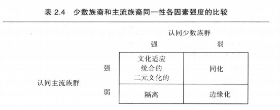

## 自我

### 第二章、自我的性质

​		虽然并非每个人都会用如此多的词语来描述自己，但每个人
的确**都会有丰富的自我认识**。他们对自己的身**体状况、能力高低、社会角色、
个性特质、意见、天赋**等诸多方面都会有着法。

​		本章最后一节将考察主我的特点。几个世纪以来，哲学家们都在苦苦思索
一个哲学问题，即**个人同一性问题**。这里的关键问题是，自我的某些方面是否
可以用来解释**所感知到的心理统一体**。威廉-詹姆斯也致力于该问题的研究，
我们将研究他提岀的解决方案。我们还要回顾两位早期哲学家（约翰•洛克和
大卫•休谟）所提出的解决方案，因为他们**解决个人同一性疑问**的尝试正是詹
姆斯分析该问题的基础。

#### 1、宾我的特点

​		宾我：注意目标指向的自我

​		詹姆斯继续将**经验自我**的不同部分划为三类，（1）**物质自我**,（2）**社会自我**,
以及（3）**精神自我**。

##### 1）物质自我

- 物质自我的**躯体部分**无需多做解释.某个人谈及我的手臂或我的双腿，这
些实体显然属于**“我是谁”的固有组成部分**。但我们对于自我的感知却并不限
于我们的身体。它还包括**其他人**（我的孩子）、**宠物**（我的狗）、**财产**（我的汽
车）、**地方**（我的家乡），以及我们的**劳动成果**（我的绘画作品）。
- **物质自我并非由物质实体本身构成**。相反，恰恰由我们**对这些物质
实体心理上的占有欲**组成(Scheibe, 1985)。例如，某个人也许有一张他最喜
- 判断某一实体**是否属于延伸的自我**的另一个方法是，看我们对它的反应方
式.如果我们**非常关注它，并努力想提升或拥有它**，就能推断**该实体属于自我**。
- 【**物质自我的所有部分**】都是人们**本能偏爱的事物**，它们时人们的生
活具有十分重要的实际利益。我们都会**无条件关注自己的身体**，为它
穿戴华美的服饰；关爱妻儿老小；寻找我能安居的家。
同样的本能冲动驱使我们积攒财产,**财物因而成为经验自我的重要组
成部分**，虽然它们带来的亲密感不一样。感觉最亲密的财富当属饱含
我们辛勤劳动汗水的那部分
- 詹姆斯认为，这些财物并不仅仅因为它们的功用而受重视，还因为它们已经成为我们的一部分。詹姆斯写道：“**不仅仅是我认识的人，我所了解的地方和事物也都以一种隐喻的方式扩展了自我**”。
- 首先，**财物具有象征功能**，可以**帮助人们定
义自己**。我们**穿戴的服饰、驾驶的汽车以及装饰房间和办公室的风格都在提醒
我们：我们认为自己是谁，我们希望他人怎样看待自己**。
- 我认为物质自我是属于人的**自然属性**的自我。

##### 2）社会自我

- 詹姆斯认为第二种经验自我是社会自我。社会自我指的是**他人如何认识和
对待我们**。（我将把自我的这些方面称为**个体的社会同一性**。）社会自我包括我们所拥有的各种**社会地位**和我们所扮演的各种**社会
角色**。但从本质上看，自我并不仅仅是这些社会身份。更重要的是，**我们认为
他人会如何认识和对待我们**，即我们认为他人会怎样评价我们。

- 有学者（Deauxet&l., 1995）划分了**五类社会身份**：**私人关系**（如夫妻）、
**种族/宗教**（如非裔美国人、穆斯林）、**政治倾向**（如民主党人、和平主义者）、
**烙印群体**（如酒鬼、罪犯），以及**职业/副业**（如教授、艺术家）。有些身份是
**先赋身份**（生而具有，如儿子或女儿），有些是**自致身份**（通过个人努力获得，
如教授或博士）。每一种身份都伴有**一系列特别的期望和行为**。
- 许多学者虽
然承认**人们在不同的社会情境下会有不同的行为**，但也**主张存在一种普遍的自
我**，贯穿这些不同的社会身份。威廉•詹姆斯赞同这一观点。詹姆斯认为我们
的**社会角色是自我的重要部分**，但它们**绝不是自我的惟一部分，也不是最重要
的部分**。
- 詹姆斯继续对社会自我进行论述。他假定存在一种渴望他人注意和认可的
**本能驱力**。詹姆斯认为，我们与他人发生联系并不仅仅是因为我们喜欢有同伴,
而是因为我们**渴望得到认可和地位**。
- 我认为社会自我是属于人的**社会属性**的自我。

##### 3）精神自我

- 精神自我是我们的**内部自我或
心理自我**。除去真实物体、人、地方和社会角色之外，由能称为我的（my或
者mine）的一切构成。我们**感知到的能力、态度、情绪、兴趣、动机、观点、
特质及愿望**都是精神自我的组成部分.（我将把精神自我的这些部分称为个人。
- **思考精神自我的方法**：
  - 詹姆斯认为，我们可以把它分成不同的能力，……
彼此剥离，**轮流确认我们自己的每种能力**。这是处理意识的**抽象方法（不带具体观点）**
  - 或者我们也可以坚持**具体的观点**，那么我们的精神自我要么
是我们的**全部个人意识河流**，要么是当前的“**片段流**”
  - 但是，不管具体还是抽象思考，我们对于精神自我的理解毕竟是一个**反映过
程**。

##### 4）物质自我和精神自我的比较

- 罗森伯格（Rosenberg,. 1979）指出，**社会同一性**往往以**名词**的形式出现,
并且把我们置身于更为广阔的社会背景当中（如我是美国人，我是民主党人〉.
相形之下,**个人同一性**（詹姆斯所谓的精神自我）往往以**形容词**的形式出现,
并且有助于区分我们与他人（如我郁郁寡欢：我责任心强）。

##### 5）集体自我

- 詹姆斯撰写《心理学原理》的时期，心理学还是欧洲受过高等教育的男性
独占的领域，因而他的分析具有一定的狭隘性。这种局限性明显表现在**詹姆斯
不太关注人们的种族、宗教和种族身份**。这些身份（现代研究者称之为集体自我）
对人们有非同寻常的意义，尤其是**少数民族**的人，例如，爱尔兰人、犹太人和
非裔美国人等格外**重视他们的种族身份**。

  

  

##### 6）身份重要性的文化差异

​		不同自我的层级具有文化差异性（Markus & Kitayama, 1991 ； Triandis,
1989）。

- 西方国家（如美国、加拿大和西欧国家）非常崇尚**个人主义**。他们是
竞争取向的，强调**人们的差异性**。这种倾向使得他们非常**注重个人同一性**
- 相
反，东方文化（如日本、中国和印度）更倾向于**合作、集体主义的和相互依赖**。
他们的文化并**不强调人们的差异性**，而重视人与人之冋的相互联系，因而他们
更**注重社会同一性**。

#### 2、自我感受、自利和自卫

##### 1）自感

​		就自感而言，詹姆斯认为某些情绪总是以自我为参照点，称为**自
我满足**和**自我不满**，并将它们与更一般的情绪（如快乐和忧伤）进行了区分。

- 一方面是骄做、自负、空虚、自尊、傲慢、虚荣；
- 另一方面
是谦逊、谦卑、困惑、胆怯、害羞、差耻、屈辱、悔悟、污名和施绝望。

​        人类具有**体验积极情感，避免消极情感的内在驱力**，每个人心中迸发出的最响亮的声音，**谁都可以失败，我不
能，我一定要成功。**

##### 2）自负和价值

​	    这个世界上我们的自感完全取决于支撑我们存在和行动的因素。它决
定于我们实际的能力和认为的潜能之间的比值，即以自负为分母、成
功为分子的分数，因而，**自尊=成功/自负**。

- 詹姆斯书中的自负(pretensions)有两种不同的含义。有时他用它来指代
**个人重要性领域**(domains of personal importance)。
- 他认为，**高个人重要性领域**的结果比起低个人
重要性领域能引起更**强烈的情绪反应**。这就**赋予了自负以价值**（依据事物对个
人的重要性）。

##### 3）自负与抱负

- 自负除了可以指代**对个人重要的事物之外**，詹姆斯也用它来指代**个人的抱
负水平**，即能让个体满意的**最低成绩**。

- 假设两位学生在同一门课上都得了 70分。甲学生可能并不满意，因为他
原本期望得到80分；乙学生却可能非常兴奋，因为60分他就满足

- 有两种方法可以**让你对某领域的表现感觉良好**。你可以**提高你的成绩**或**降低抱负水平**。用詹姆斯的话来讲，任何一种方法都能让你感觉更好。

  可以**减小分母或增加分子来提高自尊**。放弃自负可以让他们如释重
负，得到满足……**加诸于自我的一切都是负担**，自豪也一样……我们
的自感就体现在我们的实力里。

##### 4）羞愧与内疚

- 羞愧感是**公开的情绪**，跟随**外界的反对和责骂**而产生
- 内疚感是一种
**更为私密的知觉反应**，因为个体**没能达到他的标准**和理想而产生。
- **内疚促使个体弥补自己**（知觉到）的过失并做出赔偿。相反,
**羞愧**使得个体想避开其他人，**隐藏自己（知觉到）的不足和缺点**。

##### 5）可达自我

- 代表了**个体想要或能够成为的一类人**。这看起来好像是詹姆斯在讨论自负时所
说的**抱负水平**。
- 他的分析也表明，我们**当前的自我观念**与这些**可达到的自我**越
接近，我们的**自我感觉就越好**。

##### 6）理想自我

- 人们往往也怀有**更为理想或光辉的自我观念**。他们梦想成为“摇滚巨星”、
“百万富翁”或“诺贝尔奖获得者”。每个人都怀有这样的自我观念，但大多数
人并**不会混淆理想的自我意象与可达到的自我意象**。他们知道这些理想的自我
意象大都只是幻想而已。可是有些人却分不清楚。
- 什么是神经质人格：霍尼(Homey, 1945)认为，**神经质
人格**的特征就是**固执的**、**理想化的自我**。她指出，这类人不能忍受低人一等的
感觉，因而**构建出理想的自我意象，隐蔵真实的自我**。这样的人在任何事上都
要做到最好，想要得到所有人的喜欢、崇拜和认可。当然，不可能达到如此苛
刻的期望，因而他们注定要失望和受挫。[神经质人格](https://book.douban.com/subject/4897264/)
- 需要着重指出的是，区分**神经质人格**和**正常人格**在**本质上并非理想的自我
意象**。每个人或多或少都渴望成为梦想中的人物。
- 当**理想自我变成必须自我**
(must self)时，问题就出现了：因为当我们必须成为“完美的丈夫”、“尖子生”、**这样的理想自我意象才成为心理问题的来源**。

##### 7）应为自我

​		另一个自我观念的类别是我们**应该成为的自我**。例如，某个孩子可能**认为
他有责任成为“继承家族生意的忠诚的孩子”**

​		希金斯(Higgins, 1987)把这些观念视为
应为自我的组成元素，并据此解释人们的**内疚和焦虑感**，原因在于他们发现**现
在的自我**与观念中的**应为自我不一致**。

##### 8）不欲自我

- 最后，人们也会考虑**他们害怕或不想成为的自我**。如害怕成为“生意上的
失败者”、“过气演员”或“依靠子女的人' 
- 奥格尔维(Ogilvie, 1987)把这
些形象归结为不欲**(不想成为的)自我**，并指出，它们在**决定人们快乐和满足
的程度上起了重要的作用**。我们**现在的自我**与**害怕成为的自我**心理距离**越远**(即
我们越不类似这些负面的自我意象)，我们的生活**越幸福**。
- 这些潜在的**负面自
我意象**还具有**重要的动机功能**。如果不是太极端还具有诱因的作用。它们可以
**激励人们努力工作以避免这些负面身份**。(Oyserman & Markus. 1990)。

##### 9）小结

#### 3、主我的特点

​		**主动地体验世界**的自我

##### 1）个人同一性疑问

- 个人同一性疑问乃指是否存在**将我们无数的知觉和思维联为一体的事物**。
我们的心理活动是变动不居的感知万花筒（我们看到、听到、思考、记忆），
种种知觉看似联系在一起。**统合这些知觉的这个我**的特点是什么呢？

##### 2）实体论学派：灵魂是联结的纽带

- 亚里士多德认为灵魂是统合个体多种感、知觉的**非物质实体**。
- 但有些哲学家认为在我们**无数知觉
的背后存在物质实体支持个体的同一性整体**。因此，这种观点的追随者可称为
实体论者(substantialists).

##### 3）洛克：同一性是一种记忆

- 英国哲学家洛克(John Locke, 1632~1704)，在洛克看来，精神人指的是我们的个人同一性。他将精神人定义成：一种有思考智慧的存在，有理智，能反省，能把自己作为自己来思
考.……即使**时空不同依然能认为自己是一样的**。而且，由于**这一意识能延伸至任何过去的行为和思维**，因而能够**触及此人的同一性**。

- 在洛克看来，个人的**同一
性是与记忆**联系在一起的：它一直可以**追溯到个体最初具有记忆的时候**。
- 同时，他从实体论传统的脱离并不彻底。洛克无法让自己相信：个体的知觉并
不是以某种方式统合在一起。他得出结论：我们的**记忆存在于一种非物质中**。尽管他认为我们无法了解这种非物质是什么，但却确定它存在。

##### 4）休谟：同一性是一种假象

- 总结一下，休谟与洛克一样认为，个人同一性的感觉乃由想法和知觉构成。
然而，不同于洛克的是，**休谟并没有把这些知觉看成统一体**。休谟认为，“我
们归结为**人类心理的同一性是虚幻的**”。我们体验到的一切都是**飞速地依次出
现的想法和知觉**。各种想法的快速出现造成了统一体的幻觉。我们的知觉以为
它们是连接在一起的整体，而事实上它们彼此分离。对休谟而言，任何**自我的
观点都是虚幻**的，除了**知觉的连续**出现之外。

- 个人感觉休谟在**强调自我是意识，而非物质**，用物质统一体来解释意识，是解释不清楚的。

##### 5）詹姆斯：同一性是一种持续感

- ……所有人都必須从他们所谓的自我里挑选出一些核心部分……有人
会说那才是**纯粹的能动物质**，即**灵魂**，有了它才能产生意识；

- 也有人
认为，它**只不过是一种假象**，由代词“我”表示的**虚假存在**，在这两
种极端观点之间可以发现各种折中的观点……［但留出点时间想一想
核心部分究竟是什么，］让我们尽可能清楚地面对自我，自我的这个
核心会带给你怎样的感觉。

- ［因为］不论它是**精神物质**还是**欺骗性的
词语**……**自我的核心部分是感觉到的**。仅仅**用理性的方式并不能认识
它..自我就存在于感觉之中**。

- 詹姆斯继续声称**自我的这一核心**（所谓的主我）是**精神自我的一种成分**。我们曾在前面指出过詹姆斯认为，思考精神自我的方法有两种。抽象方法指**孤
立地探査精神自我的每一个单独方面**，具体方法指把精神自我视为一种**连续的
知觉流**。

- **每一种知觉都在流动**，但这些知觉井非分离和独立的，正
如休谟所言，只是由于它们的**邻近而造成一种联结的假象**。相反，它们结合在
一起是因为它们**同属于一个意识流**。而且，正是与**每种知觉都有关的情感**为它
们提供了**联系的纽带**。每种**知觉都承载着独特的情感**，我们认为它属于我们，仅仅属于我们。

- 个人感觉詹姆斯用**发展的眼光，新旧事物**来解释自我的核心部分，**不单纯是记忆，还包括经验，逻辑**。

  原话是这样的：**每种想法都会消退，并为另一种想法所取代**。新想法了解它之前的想
法,如前所述**对它产生“温暖感”**，问候它说：“你是我的,是我身
上同一个自我的一部分。”由于每一种后来的想法都了解，因而**包含
先前的想法**，因而**它们是容纳和占有一切的最后容器**（侵呑它们后成
为最后的所有者）。因而每一种想法在其诞生时就是所有者，在其消
遥时则我侵呑，从而把它认识到的任何自我要素都传递给后来的所有
者。（p.339）

