# 《辩证行为疗法》摘录 -- 情绪调节篇

## 第零章、导言

- 辩证行为疗法教授四种极为重要的技巧，当某些情绪困扰你的时候，它们能**减少你情绪波动的幅度，让你保持平衡**。

  - 1.**痛苦承受**技巧将帮助你通过建立良好的心理弹性以更好地应对痛苦的事情，并且教你缓和消极环境因素影响的新方法。

  - 2.**正念**技巧将帮助你忽略过去的痛苦经历和未来可能发生的恐惧事情，从而更**充分地体验当前的经历**。

  - 3.**情绪调节**技巧帮助你更清楚地认识你的感受，然后**体察每一种情绪**而不是被它们左右。**目的是用非对抗的**，非破坏性的方式来调整你的感觉。
  - 
4.**人际效能**技巧给你新的方式来表达你的信念和需求，设定原则，协商解决问题的方法———其前提是维护你的社会关系和尊重他人。

- 此书适合任何**独自和压迫性情绪抗争**的人。这里所有提供的方法都旨在让你掌控情绪的能力达到显著的改善。
- 话说回来，如果你是自学此书并感到实施这些新技巧
有一定困难，我们强烈建议你寻求合格的辩证行为治疗师的服务。

- 如果你真的努力实施这些技巧，你对一些**情绪的反应方式总会改变**。因为——不管是**遗传还是儿时伤痛**的因素——你在这儿学到的技巧能够影响每一次冲突，每一个泪丧的后果，还能明显改变你社会关系的进程。你有充分的理由**满怀希望**，你所有需要做的就是开始阅读此书，然后**持之以恒地练习**。


---

## 第一章、承受痛苦的技巧

- 但对某些人来说，**对精神和身体的伤痛总比其他人感觉更强烈**，并且发生得也更频繁。他们的痛苦来得更快，就像汹涌的浪潮。经常，这种状况好像永不会结束，**深陷其中的人不知道怎么应对伤痛的残酷**（神经质人格）。

- 鉴于此书的写作目的，我们把这种问题叫做**压迫性情绪**（但是记住，精神和生理的伤痛常常如影随形）。
挣扎于压迫性情绪中的人常常用**非常不健康、非常无效**的方式去对付痛苦，因为他们别无选择。这是可以理解的，因为处于精神痛苦中的人很难理智地找到好的解决之道。尽管如此，许多被**有压迫性情绪的人**使用的**应对策略只会使问题变得更糟**。


  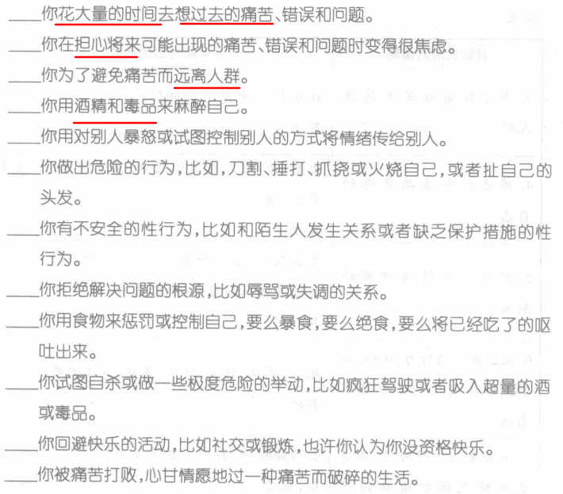

### 一、基本技巧

#### 1、全盘接受 √

##### 1）解释

- 当一个人处于烦恼中，他通常的第一反应就是**发怒或沮丧或责备**，这是引起烦恼的罪魁祸首。但不幸的是，**无论你责备谁，你的烦恼依然存在**，你照样感到难受。事实上，在某些情况下，你会更生气，你的烦恼不减反增。

- 显然，发怒、沮丧或苛刻并不能改善状况。

- **全盘接受**态度提倡的另一选择就是**承认你目前的处境**，无论怎样，**不要去评
判它或自责**。

- 全盘接受意味着**正
视自己和现实**，然后**客观**地看待它。

- 全盘接受**不是指你宽恕或同意别人的错误行为**，而是指你**不再用愤怒和责备与过去之事纠缠不休**。把你的注意力转移到你当前能做的事儿上面
。

##### 2）练习

- 全盘接受应对陈述：
  - "它只能是这样了。"
  - "一连串的事情导致了现状。"
  - "我不能改变既成事实。"
  - "和过去作战没用。"

  - "和过去作战只能让我看不清现实。"
  - "我只能抓住眼前。"
  - 
"**和已发生之事作战是浪费时间。**"
  - "当下最可贵，即便我不知道要发生什么。"
  - "鉴于之前发生的事，现在就应该是这个样子。"
  - "现在的情况是无数个决定的结果。

- 练习tips：
  - 读一篇报上关于某个争端的报道，**对所发生之事不要去评价**。
  - 下次你若**遇到堵车**，不要抱怨，**静静等待**。

  - 收看电视上的**国际新闻**，不要去责骂看到的事。
  - 不带评价地收听**广播**里的新闻故事和政治评论。
  - 
回忆一下很多年前你生活中发生的一件并不使你感到失望的事情，运用彻底接受的态度不带评价地记住它。

#### 2、摆脱自毁行为 √

##### 1）解释

- 一些有**压迫性情绪**的人说，自伤行为能暂时地缓释他们的痛苦感受。这或许是真的，但这些行为**一旦走向极端**，可能造成严重的**永久伤害**甚至死亡，这也是事实。


- 如果你真的想从经历的伤痛中恢复过来，你的第一步


- 自毁式应对策略的**代价**：自毁式应对策略的代价是显而易见的，它们将把你眼前的烦恼扩大成永久的痛苦。记住，有时**烦恼难免**，但因**烦恼而遭受的痛苦**却往往**能避免**。


  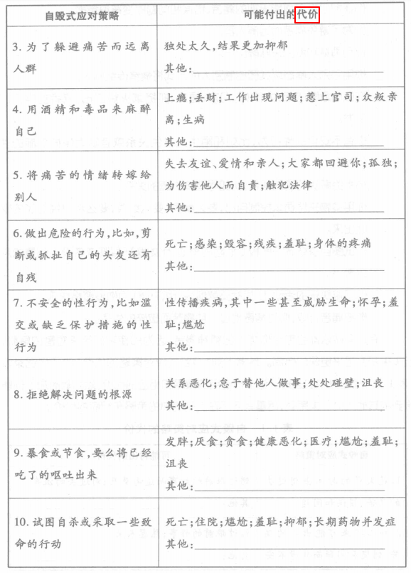

##### 2）练习

- 下面是一些你可以利用来**摆脱自毁情绪和思想**的更**安全的替代行为**。

  - 1、用**手握住一块冰**然后挤压它来代替你的自伤行为，彻骨的寒意让人麻痹并分散你的注意力。
  - 2、
用**红色粗头记号笔**在你身上具体标出你想切割的部位来代替刀割，用红油漆或指甲油营造出流血的感觉。然后用黑笔画上伤口缝线。如果你需要更多地分散注意力，就同时用另一只手挤压冰块。
  - 
3、你每次想自伤的时候就弹你手腕上的橡胶带，这或许痛苦，但它比刀割、
火烧或残损自己的伤害小得多。
  - 4、用指甲掐你的手臂，但不要弄破皮。
  - 5、把你恨的人画在气球上，然后拍打。
给你恨的人或伤害过你的人写封信，说说他们对你做过的事和你恨他们的原因，然后把信扔掉或保存下来以后再看。
  - 6、拼命地把泡沫球、袜子卷或枕头扔到墙上。
  - 
7、**对着枕头，或一个不会引人注意的地方尽力尖叫**，比如**声音很大的音乐
会**或你的车里。
用别针扎巫术玩偶代替自伤，你可用卷起的袜子、泡沫球和记号笔来制作巫术娃娃。或者你也可从商店买一个玩偶来扎，要那种软的易扎的。
  - 8、**哭泣**。有时人们用做其他事来代替哭泣，他们害怕一旦哭出来就停不下来，不会这样的。事实上，**哭泣能让你感觉好些**，因为体内会分泌缓压荷尔蒙。


##### 3）我的想法

- 用**有色**的圆珠笔在手上**画"正"字**
- 用**无色**的圆珠笔在手上或者腿上**划线**，并提高自己的**触觉体验**，让自己放松。

#### 3、让自己转向快乐的活动 √

##### 1）解释

- 有时，做些**愉快的事**是摆脱痛苦情绪的良方。但是记住，你**不必等到情绪很压抑**的时候才进行这些活动。**定时安排**这类活动也很有帮助。
- 实际上，你应该**每天都找点乐事**。锻炼也特别重要，因为它不仅有利于身体的全面健康，在某些情况下，能有效治疗抑郁症（Babyak et al.，2000）。
- 虽然这些活动不能完全消除痛苦，但是也不至于让悲伤将自己打垮

##### 2）练习

- **开心活动的词汇**

  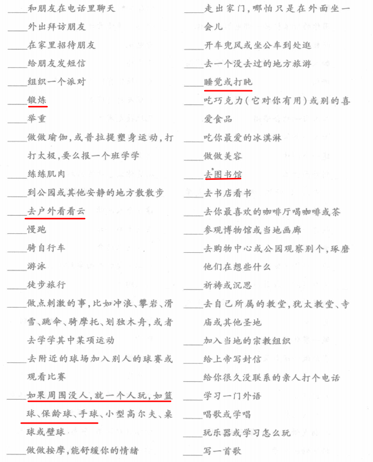

  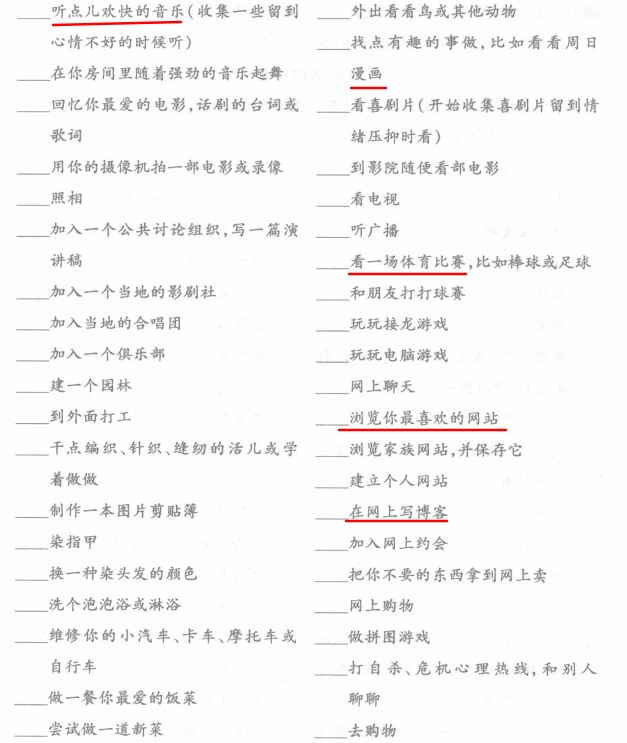

##### 3）我的想法

- 和朋友打打篮球
- 带**降噪耳机**，听点欢快的音乐
- 在网上写博客
- 抬头看看云，**拥抱大自然**
- 玩玩**简单休闲的游戏**：第五人格等
- 打盹
- 听**新课程**并做点笔记。

#### 4、转移注意力或转移思想 √

##### 1）解释

- 另一个摆脱烦恼的很棒的办法是将**注意力投注到别人身上**。

- 实际上，**你越努力不去想，那个形象越是活跃**，你大脑越要把它引入你的思想。但凡**你越想忘掉什么，你的大脑越要记住它**。这就是为什么**强迫自己忘掉发生的事是不可能的**，这也是你不能强行摆脱某种讨厌情绪的原因。


##### 2）练习

- **转移注意力：**

  - **为他人做点事**。给你朋友打电话，问问他们是否需要帮助做点什么，例
如

    - **脏累活儿，采购杂货或做清洁**。
    - 问问你的父母、祖父母或兄弟姐妹看能否帮他们点什么，告诉他们你很无聊，想找点事做。
    - **给你认识的人打个电话，带他出去吃午饭**。走出家门，看见第一个需要钱的人，请慷概解囊。
    - 如果在你压抑的时候，你能提前做点类似的安排，你可以打电话给当地的**施粥站、收容所**或**自愿者组织**。计划参加救助活动。加入当地的政治活动、环境保护社团或其他组织，参与帮助他人。


  - **将注意力从自己身上移开**。

    - 去**当地的商店、购物中心、书店或公园**。就坐那儿观察别人或穿行于他们中间，看看他们做什么，怎样打扮。
    - **听听他们谈话**，数数他们衬衫上的纽扣，**尽可能捕捉与这些人有关的细节**。看看是蓝眼睛的人多，还是棕色眼睛的人多。当烦恼重新来袭的时候，再次去关注这些人的细节。

  - **想想你关心的人。**

    - 放一张他们的照片在钱包里，这个人可以是**你的丈夫、妻子、父母、男朋友、女朋友、孩子、好朋友或者你崇拜的人**，像德瑞莎修女、甘地、耶稣、象头神甘奈施等，还可以是电影明星、运动员或你未曾见过的人。
    - 于是，当你痛苦时，拿出他们的照片，**想象你受到伤害时**能**和他们进行友善的有疗伤作用的谈话**。他们说什么能让你感觉好些?就想象他们在对你说什么。


  - 有时**最好的办法是走开**。

    如果你和某人**关系恶化**，你意识到你的情绪会让你感到压抑并可能使情况变得更糟，于是，**走为上策**。

  - 用**数数**来转移注意力


    - **数你的呼吸**。坐在舒适的椅子上，手放在肚子上，做一个舒缓的深呼吸。想象吸气进入胃里，而不是肺里，感觉你的肚子随着每一次吸气像气球一样胀大，开始数你的呼吸。当你不可控制地又想到引起你烦恼的事，重新开始数。

    - **数其他的东西**。如果你太专注你的烦恼，就去**数你听到的声音**，这能将
你的注意力转至别处，你也可以去**数身边经过的小汽车**，去数你的每一种知觉或者任何可以计数的事物，如你正看着的树的枝丫。

    - **在基数之上不断增减七**。例如，用一百作基数，减去七，得到的数字继续减七，一直进行下去。这个活动确实能让你从烦恼中摆脱出来，因为它需要你注意力特别集中。


- **转移思想**：

  - 记住过去的一些**愉快、有趣或刺激的事情**。尽可能多地记住这些美好回忆的细节，你做了什么?你和谁在一起?发生了什么?

  - 想一些**令你兴奋的性内容**，营造你和某个认识或想认识的人之间的性幻想，尽可能多想些细节，都有些什么刺激的事儿。
  - 看看**屋外的大自然**，尽可能贴近地观察花朵、树木、天空和自然景观。**观察周围所有的动物，听它们发出的声音**。或者如果你生在远离自然的都市，尽力去观察你能接触到的或者闭上眼想想你以前观察过的景象。
  - 
**想象**你**得到**其意见对你很重要的人的**夸赞**，你做过什么?这个人对你说
什么?为什么他的意见对你有影响?

  - **想象你最大的幻想实现了**，它是什么？它的实现会涉及到什么人?之后
你会做些什么?


##### 3）我的想法

**转移注意力：**

- **去人多的地方**：商场，地铁站，公园等，默默**关注不同人的细节**。
- 约朋友一起去吃饭，和朋友闲聊，**听听他分享的有趣故事**。
- 整理自己的**电脑桌面，书桌，房间**
- **倒倒垃圾**，洗洗衣服。
- 去**理个发**
- 剪指甲。
- **数数**：呼吸，声音，汽车

**转移思想**：

- **想象自己身处在安全的环境**中，动用自己**全身的感觉器官**去感知这个环境。
- 想象自己**最大的幻想**实现了，我能从中得到什么？

#### 5、放松及自我安慰 √

##### 1）解释

- 从很多方面讲，学会放松和自我抚慰都非常重要。当你放松时，你身体感觉更好，机能也更有效。在放松状态下，你的**心跳更慢，血压降低**，**你的身体不再处于**时刻难备遭遇压力或力图逃避的**应激状态**，这样，你的大脑更容易想到解决问题的有效办法。

- 这里涵盖了一些需要调动你的**嗅觉、视觉、听觉、味觉和触觉**来让你放松和舒缓的活动，它们会给你生活带来一丝丝的宁静。如果其中任何一个活动没能帮你放松或使你更糟，那就不要再做了，尝试点其他的。记住，**个体之间有差异**。例
如，**有些人听音乐时更放松，而另一些人觉得洗泡泡浴更有效**。

##### 2）嗅觉练习

- 嗅觉是一种能强有力的能开启你记忆开关的知觉，让你体验某种感情，因此，**识别让你感觉愉悦而不是讨厌的气味**对你很重要。

- 在你屋子里点上**香烛或香**，寻找到令你榆悦的气味。
- 洒点令你感觉快乐、自信或性感的香油、**香水或古龙水**。
- 将杂志上的香卡剪下来，放在手提包或钱包里，随身携带。
- **去有吸引你的香味的地方**，比如面包房或餐厅。
- 给自己烘制有**诱人气味食物**，比如巧克力甜饼。
- 在附近公园找块地儿躺着，**闻闻草香和户外的气息**。
- 买些刚摘的花或从邻居家求些花来。
- 拥抱一个气味能让你平静下来的人。


##### 3）视觉练习

视觉效果视**不同人的品味和偏好而定**。


- 浏览**杂志和书籍**，剪切下你喜欢的图片，把它们拼贴在一起挂在地上，或放一些在你的手提包或钱包里，离家的时候可以看看。
- 
找一个你看着舒服的地方，如**公园或博物馆**或是这些地方的照片，如大峡谷。
- 
到书店找一本让你放松的**摄影集或画册**，比如安塞尔·亚当斯的自然风光摄影。
- 
画一幅令你自得其乐的画。

- 带上一张**你爱的人、你倾慕的人**或你崇拜的人的照片。


##### 4）听觉练习

- 听**舒缓的音乐**。可以是古典乐、歌剧、老歌、新世纪音乐、摩城音乐、爵士、凯尔特音乐、非洲音乐或者任何对你有效的音乐，可以是歌曲，也可以是纯音乐。
- 通过卡带或光碟**听书籍的朗读**。
- **收听电台轻松的谈话节目**。注意——是轻松的谈话节目，而不是让你难过或发火的。避开政治谈话节目或新闻，找谈话主题较为中性的，比如国家公共电台的汽车谈话节目或园艺类节目。
- 打开窗户听外面**宁静的声响**。或者，如果你居住地外面没有**轻快的声响**，那就去找一个有的，比如公园。
- 
听**自然界声响的录音**。例如鸟类或其他野生动物的叫声。
- 听听**白色噪声**。噪声并不增加烦躁，而是包含所有**同等频率的声音**。研究表明,一个**稳定、平和的声音流**，如白噪声、**可过滤和分散噪音**，可以帮助减轻噪音分心或者你可以打开电感来屏蔽噪声，有的白色噪声机器本身录有声响，像**鸟叫、瀑布、热带雨林的声音**，很多人发现这类机器的声音很让人放松。


##### 5）味觉练习

- 吃你**最爱的饭菜**，无论是什么。**慢慢地吃**，这样你能充分享受它的独特风味。

- 带点**棒棒糖、口香糖**或其他糖果在身边，沮丧的时候吃点。
- 买一块成熟而多汁的新鲜水果，然后**慢慢吃**。


##### 6）触觉练习

- 放点**柔软顺滑**的东西在口袋里，需要的时候摸摸，如一块布。
- 洗一个**热水或冷水浴**，享受水从你皮肤滑落的感觉。

- **自我按摩**。有时自己揉揉酸痛的肌肉也很舒服。

- **逗宠物**。养一只宠物对健康有诸多好处。**宠物主人通常血压不高，胆固醇不高，心脏病发病率较低**（Anderson，Reid，&Jennings，1992），其他的健康指数也较高（Serpll，1991）。另外，和宠物玩耍及**爱抚动物皮毛**能给你一种**温柔的触觉体验**。如果你没有宠物，养一只吧，如果你养不起，就去**拜访有宠物的朋友**，要么去当地动物收养所和那些被救的动物
玩要。


##### 7）我的想法

**嗅觉：**

- 喷香水，遮掩腋臭
- 去树木，花草比较多的地方，闻一闻**花草树木的气息**，特别是在**雨天过后**。
- 用**带香片的风扇**吹风

**视觉：**

- 看**CG插画**
- 看**宠物图**（猫，狗，毛绒绒的都行）

**听觉：**

- **自然界的声响**：雨声，猫叫声，瀑布，海浪声
- 舒缓的**纯音乐**
- ASM助眠敲击声
- 网抑云听小姐姐聊天

**味觉：**

- 沮丧的时候嚼口香糖
- **慢慢吃饭**，品尝味道。
- **慢慢喝水**，感受水的味道和柔软。

**触觉：**

- 洗一个**热水或冷水浴**
- 用**无色**的圆珠笔在**手心**上或者**大腿内侧**等比较敏感的部位上**划线**，并提高自己的**触觉体验**，给自己按摩，让自己放松。

### 二、高级技巧：改变现状

#### 1、安全地方形象化 √

##### 1）解释

- 通过想象一个让你**放松的安详、安全的环境，达到自我抚慰**。实际上，你的大脑和身体常常不能区分事实和想象。所以，如果你能成功地**在脑海里构建一个宁静、放松的画面**，你的身体也能得到抚慰。

- 如果你想不出这样的地方（比如海滩、公园、田野、教堂/庙宇、你的房间，等等），那就想想**让你放松的颜色**，如粉红或婴儿蓝。尽你的全力去
，那就**想想让你放松的颜色**。

##### 2）练习

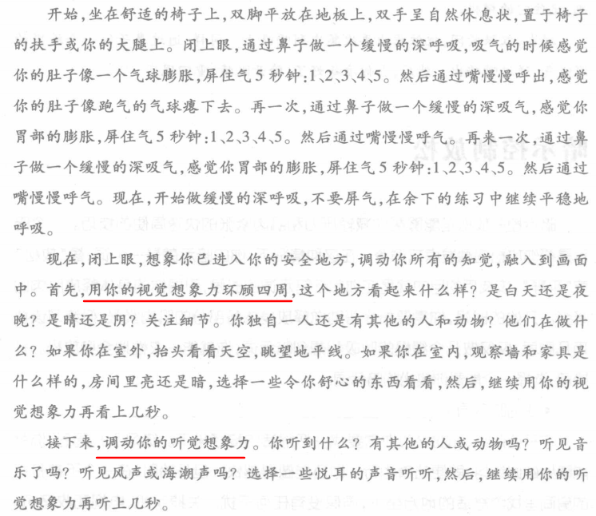

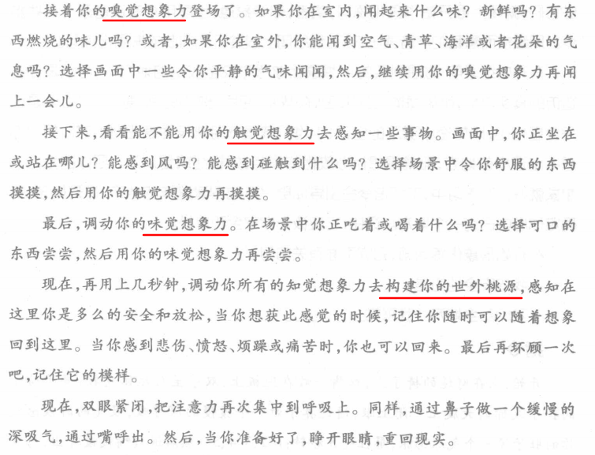

##### 3）我的想法

​	我喜欢幻想自己身处在一片**广袤无垠的草原上，那就是我的幻想乡**

​	我幻想着躺在草原上，抬头望望天空，静静地享受这安静，舒适的环境。

#### 2、暗示控制放松 √

##### 1）解释

​		暗示控制放松是能够帮你减轻压力和肌肉紧张的快速筒便的技巧。**一个暗示**是帮你放松的**触发点或命令**。在这种情况下，你的暗示就是一个词，像"放松"或"平静"，该技巧的目的就是在你想到暗示词的时候，引导你的身体释放肌肉的紧张。开始的时候，**你需要指令帮助你释放身体各部分的肌肉紧张**，但练习该技巧几周后，仅仅**做几个缓慢的呼吸和想到暗示词**，你就能一灭性地**全身放松**。开始前，选择个能帮你放松的暗示词。


##### 2）练习

​		练习暗示控制放松法**每天两次**，记录下**放松所需的时间**。每天坚持练习，这个方法能帮你越来越快地放松。同样，记住这个方法的终极目的仅仅是训练你在默念像"放松"这样的暗示词的时候，全身放松。只有**定时练习，才有收获**。

##### 3）我的想法

​	我打算采用"**静下心来**"，作为自己控制放松的暗示词。

#### 3、重识你的价值 √

##### 1）解释

- "价值"这个词可以理解为你的**伦理、原则理想、标准或道德**。这些词在字面上是一些提升你人生境界的思想、概念和行动。**铭记你的人生价值观是帮助你克服环境压力的强大力量**。
- 当你发现自己在同样的情况下或对同样的人一次次地失望，这种铭记也特别有用。有时，我们忘记为什么要去做一件困难的事，这让我们难以继续。也许，你搞不懂为什么不舍得丢弃一份讨厌的工作; 也许，你不记得去上学的目的;或者，你不明白为什么要保持一份不尽如人意的人际关系。在这样的情况下，**记住你的价值观能帮你克服苦难，创建更完美的人生**。

##### 2）练习

- **用0到10来给每个部分的重要性排个名**，0代表一点不重要，10代表极为重要。根据你的真实想法，而不是你认为该怎么排。尽可能使排名反映实情。

- 然后，你可以用你对下面练习中的**人生价值问卷调查**的回答来探知你的价值观。


  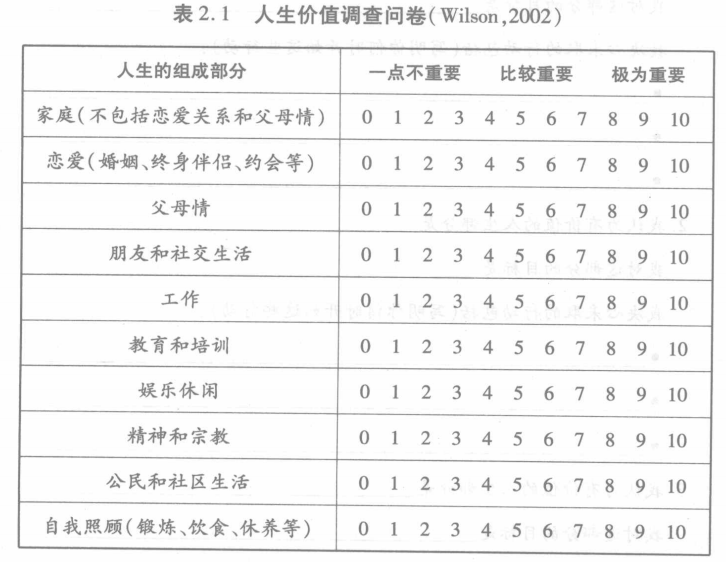

- 最后，写出几个为了**达到目标**你立志**要采取的行动**，同时注明你**何时开始兑现你的承诺**。例如，你的目的是**回到学校**，你列出的行动可能包括"下周弄一份**课程分类表**"和"在接下来的三周内报名参加一门课程"。如果你的目的是**花更多的时间陪伴你的配偶**，你决心要做的事可能包括"**下个月绝不加班**"和"在接下来两周内少和朋友玩"。

- 同样，这些练习的目的是**用对你重要的活动来填充你的人生**。创造一个你认为有价值的人生会帮助你应对痛苦和不顺心的环境。当你做着不喜欢的事情时，拥有一个充实的人生能给你奋斗的目标，也能在艰难时刻给予你力量。

##### 3）我的想法

**评分：**

- 家庭（不包括恋爱和父母情）：6
- 恋爱（婚姻，约会）：4
- 父母情：8
- 朋友和社交生活: 7
- 工作：8
- 教育和培训：8
- 娱乐休闲：7
- 自我照顾（锻炼，饮食，修养）：8

**行动：**

- 为了完成学业，需要巩固英语，编程，数学这些基础知识。
- 为了完成就业实习，需要学会与人交流
- 为了有个好身体，需要坚持健身锻炼
- 为了能充实地过好每一天，需要学会调节情绪，照顾自己。

#### 4、超然力量 √

##### 1）解释

- 无论你相信**上帝、众神、神圣的宇宙**还是每个人都**心存的善念**，相信一山更比一山高常会让你感到强大、安全和平静，这就是人们在谈论信仰"超然力量"和看到人生的"宏伟蓝图"时所表述的意思。**相信神圣的、崇高的、非凡的事物会帮你忍受痛苦和自我抚慰**。

- 当你准备探索你的灵魂，记住你的**精神信仰可能随着时间而改变**。有时，一个人会在一种已毫无意义、鲜有裨益的精神传统中长大。然而，他（她）有时会不顾事实，继续遵循这个传统，因为他或她相信"这是该做的事"。但事实上，**如果你的精神传统不再给你安宁和力量**，那么，如果有必要的话，**重新审视你的信仰和改变传统就是合理的**。

##### 2）练习

- 记住**你的超然力量并不一定是上帝**。

  它可能是某个让你更强大，在**应对挑战时更自信的人**。想想某个**你崇拜**并可能成为你超然力量的人，描绘一下他，他有什么特殊之处。于是，下次你再处于困境中时，把自己想象成他，留意一下你处理问题的方式有什么不同。


- **仰望星空**。

  **你正看见的星光有几百万年的历史了**，它来自于几十亿英里之遥的星星。实际上，每次你看着星星，就等于穿越时间机器，看见几十亿年前的宇宙。神奇的是，你看见的许多星星已经陨落，可它们的光芒却刚刚到达地球，映入你的眼帘。仰望星星，去发现创造它们的力量也创造了我们，无论它是上帝还是宇宙的巨变。你和星星连在了一起，想象你正融入宇宙。

- **去海滩。**

  **数数满满一把沙子有多少颗**，试着想象一下，世上的沙子用手抓能有多少把，包括所有的沙滩和沙漠。想象一下要经过几个十亿年才形成这么多的沙子。同样，去发现构成沙子的化学元素也存于你的身体。站在沙子里，去感觉和这颗星球的联系。


- **去公园或农田，观察树木、青草和动物。**

  同样，去理解创造这一切的也创造了我们。记住，所有的生物都由相同的化学元素组成，从亚原子的层面讲，人和其他生命形式没有多大差别，当然，人也有不一样的特殊之处，这些较之于其他生命的独特之处在哪呢?


- **想想人的身体，特别是你自己的**。

  人类的身体比艺术品神奇，比所有的电脑都要复杂。你的大多数方面都由 **DNA（脱氧核糖核酸）**来决定，它是存在于你身体的每一个细胞内的指令。不可思议的是，创造你身体各个部分的每一套指令都是由四种化学元素以不同的组合形式构成，这些不同的组合叫做**基因**。它们**是你从父母那遗传来的指令**，决定你的方方面面，从眼睛的颜色到心脏的结构。神奇的是，塑造一个人只需要大约3~4万个基因。想象一下，**写下几个指令就能创造一个会思考，会呼吸，会吃饭，会运动以及做其他所有事情的人**。另外，记住这些指令还负责创造大约1000亿个大脑神经元，60000英里布满全身的血管，600块骨骼肌，206块骨头，32颗牙齿和11品脱的血液。


##### 3）我的想法

**敬畏自然**：

- 去海边，感受大海的呼吸
- 去树林，感受树木的气息
- 眺望星空，感慨宇宙的震撼
- 去人群中，感慨人类是多么有趣。

#### 5、停下歇歇 √

##### 1）解释

- **休息不只是小孩的专利**。为了恢复体力、脑力和精神，我们都需要放松。但很多人不懂得安排自己的休息，因为他们觉得这样会让别人失望，像他们的老板、配偶、家人或朋友。**很多人疲于应付以取悦他人，结果他们忽略了自我照顾**。
- 很多人忘记自己的需要，因为**他们感觉为自己做事有惭愧感，显得自私**。但只考虑别人不顾自己又能维持多久?

##### 2）练习

- **像对待别人那样来对待自己**，为自己做一件早该做的温馨的事。
- **花时间照顾自己**，哪怕一周只有几个小时，比如散散步或为自己做一顿喜爱的饭菜。
- 
如果你够大胆，**逃半天的班**，去个漂亮的地方，比如公园、海边、湖边、山地、博物馆，甚至像购物中心这样的地方。

- **花时间为自己的生活做点事**，比如购物，做一些杂事，看医生，等等。

##### 3）我的想法

#### 6、活在脚下 √

##### 1）解释

- **做事时神游是可能的**，我们偶尔这样，但有的人却很频繁。这些人每天花很大一部分时间去想昨天已做完的事、过去做错的事以及明天才需要做的事。结果，**他们要么活在过去，要么活在将来**，他们很少注意眼前发生的事。于是，他们**错过了活在眼下**——唯一能存放真实生活的时间。
- 更糟的是，**拒绝活在眼下还使生活变得很痛苦**。例如，你可能**猜想**正和你交谈的人会说出一些令你恼怒的侮辱字眼——即便此人什么都还没说!再如，你也许正**想着过去**某件让你身心俱疲的事，于是干扰了你正在做的事。很明显，**两种神游都可导致本可避免的痛苦**。


##### 2）练习

- 练习1：**你在何处**

  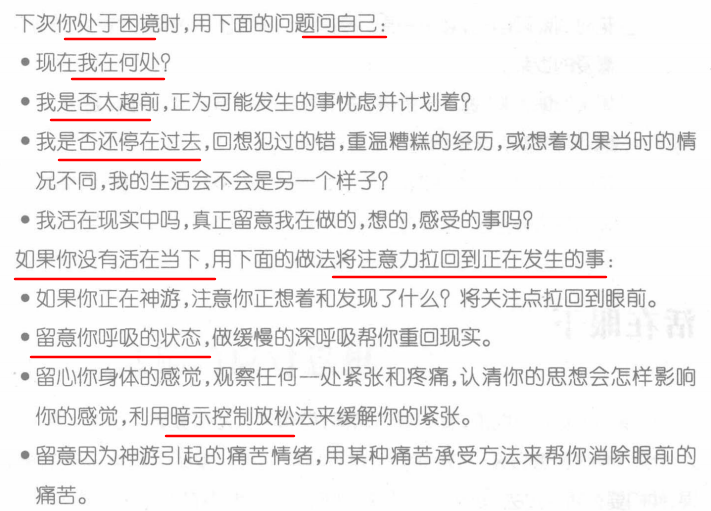

- 练习2：**倾听现在**

  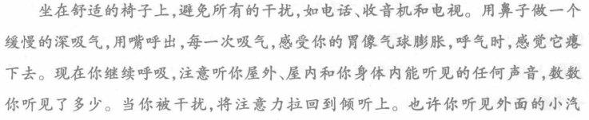

  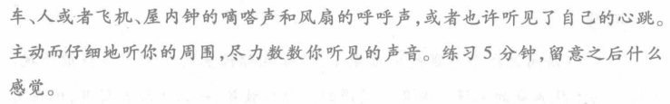

  
如果你发现自己开小差，在想些以前和未来的事，就**把你的注意力集中到对方的穿着**，比如他衬衫上的纽扣、他戴的帽子、他的衣领，**留意这些部分的颜色和样式**，有时这样做可以打断你的神游。现在继续倾听，如果走神，用同样的做法保持倾听。


- 练习3：**正念呼吸**

  另一个帮你集中注意力于眼前的练习是呼吸。它听起来很简单，但**我们确实常常不会正确地呼吸**。想想∶谁教过你呼吸?如果你和我们一样，恐柏没人。然
而，我们每分钟呼吸大约15次，每天大约22000次!每个人都知道我们呼吸是为了氧气，但它在我们吸进的空气中占多大的比重呢——100%?75%?正确答案是21%。

  **如果你的身体缺氧，会使你的生物平衡系统紊乱**。就凭这一个原因，说明做**缓慢而充分的呼吸**很重要。

  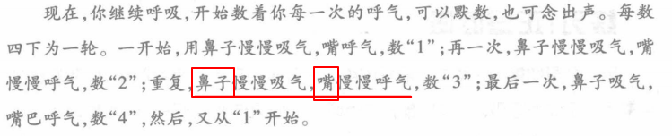

##### 3）我的想法

- 正念呼吸：心理调节缓慢呼吸，**用鼻子吸气，用嘴呼气**。
- 倾听现在：将注意力关注在现在的事物上。

#### 7、自我激励 √

##### 1）解释

​		生活中我们常会遇到困难，这时，我们需要听到鼓励的话语来让自己振作，帮助我们度过正在经历的难关。但**有时需要我们独自面对，你得给自己加油，保持坚强**。

##### 2）练习

- 应对思想一览表

  

  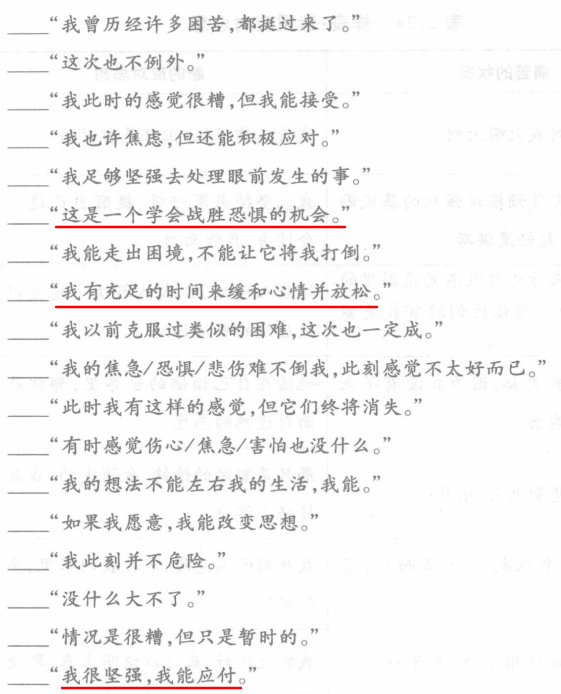

- 这种应对思想能给你力量和动力来经受考验，克服困境。现在你已了解了它们，可以立即运用。在**索引卡或贴纸**上写下你最喜欢的五种应对思想，放在你的钱包里。你也可以把它放在显眼的位置，**以便天天可以看见**，比如冰箱或镜子上。**你越经常看到你的应对思想，它们就越快会成为你自动思维过程的一部分**。


  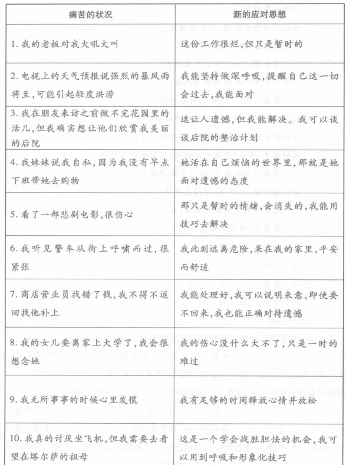

##### 3）我的想法

- **被老师批评** -- 这个状况不会永远持续
- **不敢和陌生人聊天** -- 这是一个学会战胜恐惧的机会
- **要完成的事情很多** -- 我很坚强，我能应付

#### 8、全盘接受

##### 1）解释

- **"辩证"**这个词是指把两个看起来很不一样甚至**矛盾的事物平衡**并加以比较。在辩证行为疗法中，**平衡**是指**改变与接受**（Linehan，1993a）。你需要改变在生活中给你和他人带来麻烦的行为，但同时接受真实的自己。这听起来有些矛盾，但这正是这种治疗的关键。
- **辩证行为疗法的基础是接受并改变**，而**并不是接受或改变**。本书的大部分内容集中在你可用于改变生活的技巧，但这部分主要讨论怎样接受你的生活。实际上，是**彻底地接受**。

- 全盘接受意味着你**不带评判地完全接受**某样事物。例如，**彻底接受现实**指的是你**不与它对抗，不因它而发火**，不去试图改变它的本来面目。
- 全盘接受还意味着，你必须**承认现实是过去一连串的事情**以及你和其他人所作决定的结果。如果没有已经发生的事情的促成，现实不会自动地形成。试想你人生的每一个时刻就像多米诺骨牌连在一起，环环相扣。
- 但记住，**全盘接受并不意味着你让步**，完全被动接受每一件不好的事情。生活有时不公，比如你遭到别人的侮辱和攻击。但在另一些情况下，你自己也有一定的责任，在**你和他人的责任间有个平衡问题**。然而，很多挣扎于压迫性情绪中的人觉得生活对他们只是"发生"了而已，**却没意识到他们自己在导致眼前这种情况中应负的责任**。结果，他们的第一反应是发火。
- 从许多方面讲，**全盘接受**就像平静的祈祷，内容是∶"请赐予我平静
的心来**接受无法改变的事实**，请赐予我勇气去**改变能改变的一切**，请赐予我智慧去明辨是非。"
- 重要的是记住**全盘接受**也同样适用于**接受你自己**。在这种情况下，彻底接受指的是**抛开自我评判和指责**，去**拥抱真实的自我**，换句话说，彻底接受你自己就是爱那个本来样子的你，**包括一切优点和缺点**。**发现自己内在的优点也许是个不小的挑战**，特别当你挣扎在压迫性情绪中的时候。

##### 2）练习

- 对于最近经历的痛苦，回答如下问题

  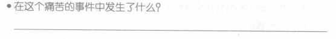

  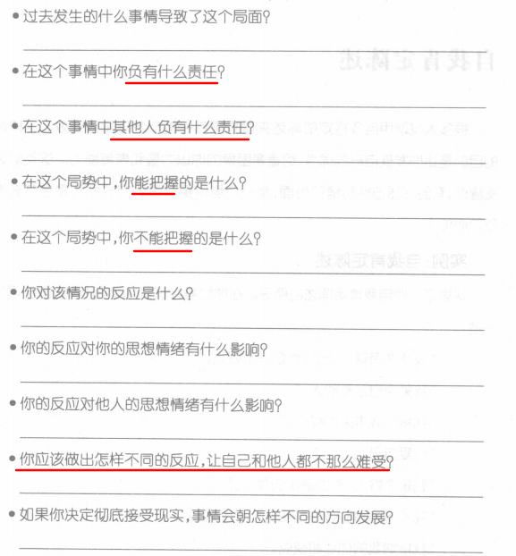

##### 3）我的想法

- 由于他人而产生痛苦的时候，**承认现实（接受）**，并考虑双方的责任，**接下来应该怎么做（改变）**，才能将问题往好的方向发展。
- 由于自己产生痛苦的时候，接纳真实的自己，包括优点和缺点。

#### 9、自我肯定陈述

##### 1）解释

​		很多人发现用**自我肯定的陈述**来建立更良性的自我形象很有效。这种陈述的目的是让你**发现自己的优点**，给遭遇困境的你以力量和恢复能力。

##### 2）练习

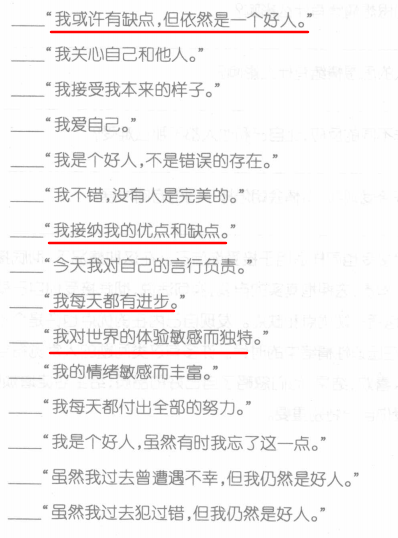

##### 3）我的想法

- 我每天都在进步

---

## 第二章、掌握正念的技巧

### 一、基本技巧

### 二、高级技巧

---

## 第三章、情绪调节

### 一、理解

#### 1、原生情绪 vs 衍生情绪？

- 你对所发生事情的**第一反应**被称为**原生情绪**。这些强烈的情绪迅速出现，而且没有经过对所发生的事情的思考。

- 但是，在**经历了最初的"原生情绪"之后**，有可能会经历**衍生情绪**。它们是**对你原生情绪的情绪化反应**。或者换句话说，衍生情绪是**对你感受的感受**（Mara，2005）。

- 不过，**单一的原生情绪**有可能会**引起多种衍生情绪**。

  这有一个更复杂的例
子。邵娜变得**有些忧虑**，因为她被要求在不久的工作中做一场报告。随着日子的临近，想到自己变得如此的忧虑，她变得**压抑起来**，然后她为自己连一个简单的报告都搞不定而**认为自己很没用**。结果，在报告后，她又为自己如此的小题大做而感到有些**内疚**。你可以看到一个人的情绪可以在短时间内变得非常复杂。**忧虑是邵娜的原生情绪，而压抑、无用的感觉和内疚都是由忧虑引起的衍生情绪**。


- 原生情绪有可能会**无限制地引发**一系列痛苦的衍生情绪，从而造成**比最初的情绪大得多的伤痛**。因此，在令人痛苦的情况下，**分辨出哪种情绪才是最初的原生情绪是非常重要的**，这样你才能在衍生情绪淹没你之前学会对付这种感觉。

- 因为没有这些技巧，**人们经常选择只会使他们遭受更多的痛苦的方式来对付原生和衍生情绪**。

- 情绪调节技巧在处理另一个被称为**矛盾性的问题**时也非常重要。当你对同一件事有着不只一种的情绪反应，而且**不同的情绪**将你带往**不同的方向**或是想**做不同的事情**时，矛盾性就会出现。例如，蒂娜是在没有父亲的环境下长大的。但在她25岁时，她的父亲联系上了她，并想要见一见她。蒂娜对有一个机会能够重建与父亲的关系而**感到兴奋**，同时她也对父亲曾经抛弃自己的家庭而**感到愤怒**。很明显，蒂娜的**情绪分裂**了，而在怎样处理这件事上，她被分裂的情绪导向了两个不同的方向。


#### 2、情绪的展现和处理？

- **情绪**是你身体中的一些电化学信号，它们使你留心到正在发生的事情。这些信号常常**从你的视觉、触觉、听觉、良觉和味觉开始**。当这些信号到达你的大脑时，它们会在一个被称为**中枢边缘系统**的区域得到**处理**，这个系统专门负责对情绪的留意和处理，这样你才能对各种情绪化的状况做出反应。中枢边缘系统同时也与大脑和身体的其他部分关联，这样它才能告诉你在不**同的情绪化状况中，你该如何反应**。

- 在这个例子中，**微笑**是两个女人交流的行为。它帮助人们认识到对方的情绪。如果歌莲在见到希拉时不是微笑，而是**皱着眉头**，希拉可能会**把这看成是厌恶的表现**而避免和歌莲的接触。

#### 3、九种情绪调节技巧

- 辩证行为疗法的**四组技巧（忍耐痛苦、掌握正念、情绪调节和人际效能）**部分重叠并且相互强化。

- 九种情绪调节技巧：
  - 1.认清你的情绪。
  - 
2.跨越通往健康情绪的障碍。（情绪，思想，行为三者的关系）
  - 3.减少你身体的弱点。
  - 4.减少你认知的弱点。
  - 5.增强你的正面情绪。
  - 6.不带评判地密切关注你的情绪。
  - 7.情绪宣露。
  - 8.逆情绪而为。
  - 9.解决问题。


### 二、基本技巧

#### 1、认清你的情绪

##### 1）解释

- 学习如何**认清你的情绪**以及它们对你生活的影响是**控制自己强烈情绪反应的第一步**。同样的情况也发生在**人们与压迫性情绪抗争**时，只是它经常以另一种形式出现。与这个问题抗争的人常常会**发现负面情绪**（比如悲伤、生气、内疚、羞愧，等等）**如同潮水一般将自己淹没**，但是，认识到这—点的时候已经为时太晚，**来不及补救**。

- 想要控制自己的压迫性情绪反应，首先必须**放慢自己的情绪处理速度**，这样我们才能将它**好好审视一下**。审视之后，你才能做出更健康的决定。
- **大声说出自己的感受**对认清自己的情绪很有帮助。这个方式听起来好像有点傻，但是大声说出自己的感受可以凸显你当时的情绪，并**帮助你更加注意到你正在经历的事情**。大声地描述出你的情绪，特别是那些压迫性情绪，也能帮助你减弱自己的负面感受。所以，**你对自己的情绪说得越多，因它而起的冲动就会越
少**。

##### 2）练习

- 常见情绪或感受

  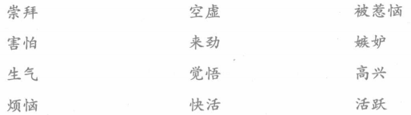

  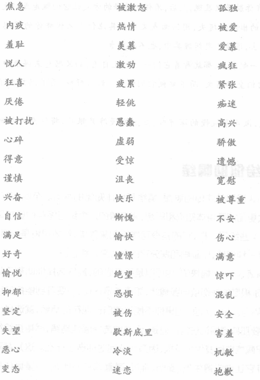

  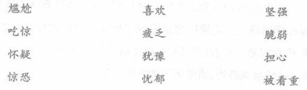

- 认清你的情绪表格

  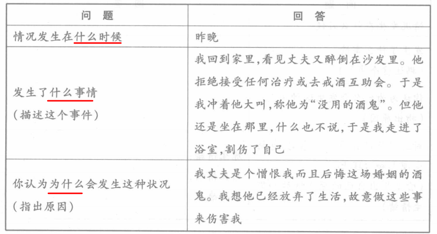

  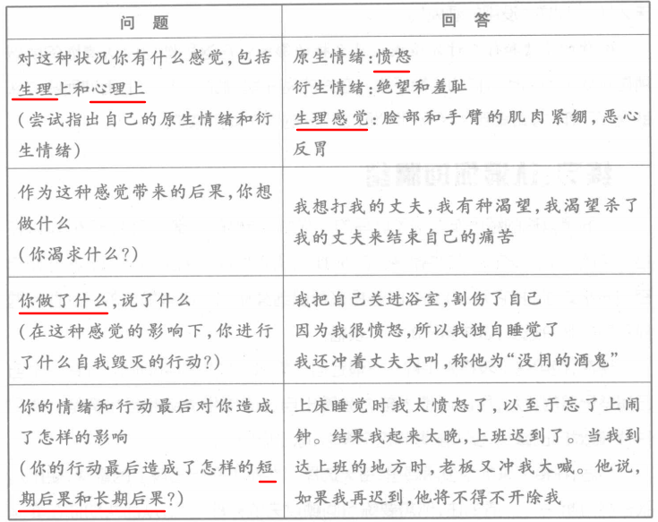

- **基于你的感受，你准备做些什么?**

  这是个很重要的问题，因为**它定位了你的冲动**。当一个人被情绪所淹没时，他或她很可能会有说或做一些极端、痛苦或者非常危险事情的冲动。

- **你曾经说过或做过些什么?**

  这是帮你认清，受情绪的驱使，你曾经实际上
都做了些什么。


- 情绪记录

  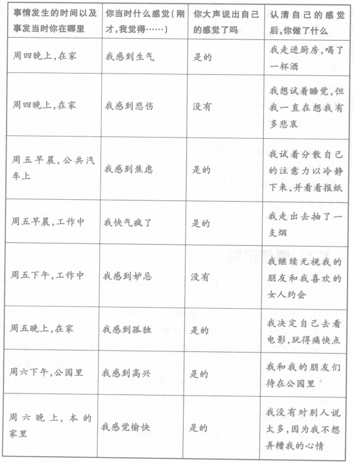

#### 2、情绪 vs 行为 vs 思想

##### 1）解释

- 这幅图描述了你的**情绪是如何影响你的思想和行为**，同时，你的思想和行为又是如何**反作用**于你的情绪的。例如，吉姆丢失了他最喜欢的一块表（一种行为）。他感到很郁闷（一种情绪），他想到∶"我太心不在焉了，我真是个白痴"（—
种思想）。但这种想法只会使他更泪丧（又一种情绪）。


  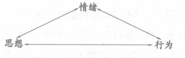

- 如果你陷入自我毁灭的行为或是**自我否定**的想法之中，这种情绪可能导致—种**恶性循环**。但如果你使用更加健康的行为以及自我肯定的想法，这种循环也能导向更加愉快的情绪体验。

- 很明显，你的**情绪和行为是联系在一起**的，而且，强烈的情绪常常引发强烈的行为反应。结果很多有着压迫性情感的人常常和自己失控的行为作斗争。拥有**压迫性情绪的人常常在感到愤怒、沮丧和焦虑时做出自毁行为**。他们**伤害自己的肉体，控制他人的行为**（通常导致打斗或毁灭性的关系），暴食、厌食、酗酒或者吸毒。很明显，这些行为都是有害的。而且陷入其中的人常常**不停地重复**上述行为。

- 这些**回报增强**了这些行为。

  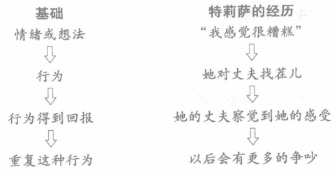

- 处于压迫性情绪的人常常会陷入的**两种自我毁灭的行为**：**自残/自伤，伤害他人**。

##### 2）我的想法

- **对自己**：当自己情绪上头的时候，通过承受痛苦的技巧，正念的技巧来**处理情绪**，避免做出不健康的行为。
- **对他人**：当自己情绪上头的时候，也许会由于冲动或者无意识的言谈举止，有想控制对方的欲望，这是神经质人格（压迫性情绪）的缺点，这时要**识别情绪，并且做出处理**，避免做出冲动，伤害别人的行为。

#### 3、减轻压迫性情绪对身体的伤害

​		除了认识到自己的想法和行为是如何影响到自己的情绪外，你还需要认识到其他一些与**健康相关的问题**是如何**影响你的感受**的。


##### 1）食物

- 比如冰淇淋和糕点，会暂时地让你感到榆悦和满足。但你如果吃的太多，你会感到有些迟钝和无精打采。久而久之，如果你**长期食用过量的脂肪和糖分**，你还会**长胖**。这常常会使人觉得**不高兴或是沮丧**
- 就像过量食用某些食物会让人生病一样，吃得太少也会使人不健康。**摄入过少的营养**可能会使你在身体需要能量维持机能时感到**头晕目眩**。


##### 2）暴食和缩食

- 有些人通过食物来进行某种方式的自毁，要么**暴饮暴食**，要么**缩减饮食**。有时，人们暴食是因为食物可以让他们在短时间内情绪冷静，甚至麻木。

- 有些人尝试通过**排泄手段**，例如呕吐，来达到**控制过量饮食**的目的，实际上，这些行为同样危险。频繁的排泄可能会导致一种被称为**神经性贪食的进食障碍发作**，对身体有着毁灭性的伤害。


##### 3）毒品和酒精

- **酒精和毒品**可以使人感到**暂时的榆悦、麻木、兴奋**，或者与以前不同。很自然，这些感觉会让你**不停地重复食用这些物质**。
- 酒精是一种抑制剂，使你感到**疲倦、呆滞和悲哀**。很多人都不相信，因为他们说，酒精使他们感受到更多的活力和更好的社交。
- 酒精实际上使他们**自我意识减弱**，所以他们更愿意**做一些他们通常不愿意做的事或说一些通常不愿意说的话**。但是当体内的酒精达到一定的量时，他们将感到伤心和疲惫。


##### 4）体育锻炼

​	需要进行一定量的体育锻炼，经常地锻炼对**保持心脏的健康**尤其重要。

##### 5）睡眠

- 想要获得健康，**充足的睡眠至关重要**。成年人平均每晚需要7~8小时的睡眠。儿童和有的成年人需要的睡眠略多一些。如果你每晚没有获得足够的睡眠，可能会整天觉得呆滞和疲惫，同时你可能也会**很难进行清晰的思考**。难怪，睡眠不足往往**引发意外事故和欠佳的决策能力**。


- 睡眠卫生指南：

  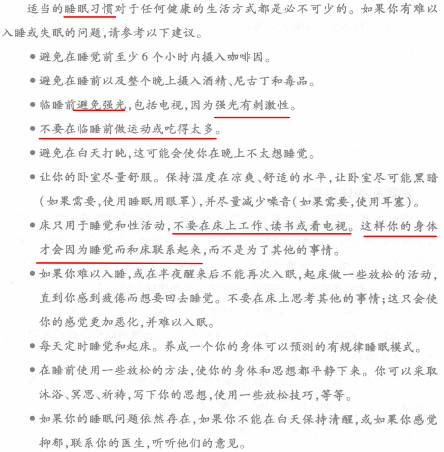

##### 6）身体的紧张

- 如果你时常经历**身体紧张**，那么你很可能也会感到**压力过大，忧虑、劳累**或者**烦躁**等情绪。肌肉紧张就像一种疾病，会直接影响你的情绪。同样，如果你觉得焦虑，你的情绪往往也会导致肌肉紧张，尤其是在颈部和肩部，以及胃部不适和皮肤的问题。

- 现代生活中有许多情况都可能使你感到身心紧张和压力∶**长时间工作，不喜欢自己的工作，上下班来回奔波劳顿，难以相处的人际关系**，紧张的家庭时间安排表，世界发生的重大事件、政治冲突，等等。因此，找到健康的方法以应付紧张和压力，使它们不会导致进一步的疾病是非常重要的。


##### 7）我的想法

- 食物的摄入要有营养，一日三餐要有规律
- 坚持体育锻炼
- 保证充足睡眠
- 身体要学会放松

#### 4、减少认知的弱点

##### 1）解释

- 这种类型的思想被称为**触发思想**，因为**它触发或导致了情绪的痛苦**。如果你**经常纠缠于触发思想**，你可能会比其他人**更频繁地经历压迫性情绪**。

- 不过，我们**大家都会不时地弹出触发思想**。情绪调节技能的目的是**在这些想法出现时，学会怎样应对你的思想**。

- **触发思想**的一些例子：

  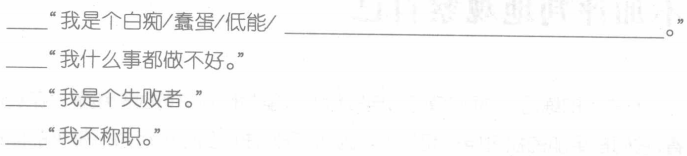

  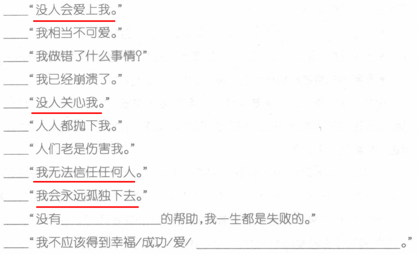

- 三种认知技巧：思想和情感的解脱，应对思想，平衡你的想法和感受。

##### 2）思想和情感的解脱

- **思想解脱**是一个技能，帮助你从你的**想法和压迫性情绪中"脱钩"**。这种技能需要**运用你的想象力**。其目的是为了使你的**想法和情绪形象化**，无论是**以图片还是文字形式**，让它们在没有造成伤害之前从你身边**飘然离去**，并避免沉迷于其中，不去分析他们，不死死纠缠。

- 思想解脱的例子：
  - 试想，坐在地上看着你的想法和情绪**随着云彩游荡开**。

  - 想象这样一副场景，坐在小溪边，看着你的想法和情绪**随落叶随波漂去**。
  - 看着你的想法和情绪写在沙滩上，然后**被浪花冲刷干净**。


##### 3）应对思想

应对思想列表：

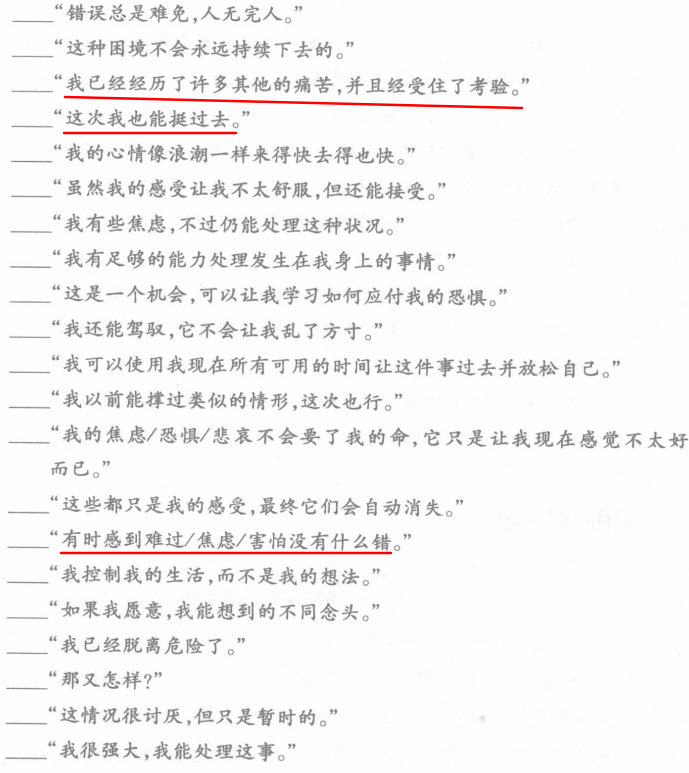

##### 4）平衡你的想法和感受

- 支持情绪刺激性食物的**两面性的证据**：

  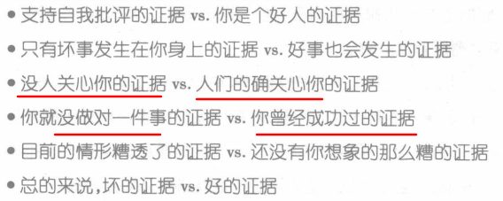

- 你注意到每个人在思考过程中的**"过滤"行为**了吗?泽娃被一次仅次于A的成绩压垮，因为她过滤掉了过去所有获得的成功。安东尼奥过滤掉了他的女友说她会在另一个更方便的时间过来的事实。看到**"全景图"**正好与**"过滤"**相反。

- **纵观全局**也会给你的未来**带来希望**。很多**过滤自己经历的人觉得无望甚至绝望**，是因为他们只看到了生活中的问题和困难。但是**对相反证据的寻找拓宽了他们的视野**，让他们看到生活中确实包含了一些积极的经历。

- 如何看到全景图：

  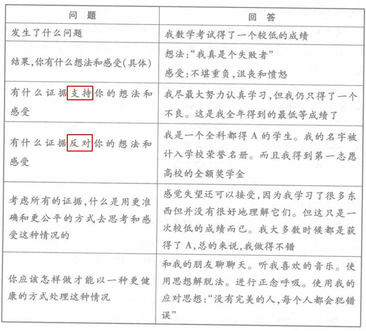

##### 5）我的想法

- 我经常因为**自己的孤独**觉得十分的痛苦，我会通过某种**触发思想**加以强化，痛苦也会更深：

  "没人会爱上我"，"**没人关心我**"，"我无法信任任何人"，"**我会永远孤独下去**"

- 采用“思想解脱”方法，**使情绪和思想脱钩**；

  采用“平衡想法和感受”的方法，寻找**相反证据**，**用“全景图”看真实的自己**。

#### 5、增强正面情绪

##### 1）解释

- 很多经历**压迫性情绪的人**对自己愉快的情绪大打折扣，**将愉快的情绪过滤出来**，或从一开始就**没有给自己经历这些愉快情绪的机会**。因此，他们**只关注自己的痛苦情绪**，如愤怒、恐惧、悲伤，而很**少注意到他们愉快的情绪**，如快乐、惊喜和爱。

- 留意自己的愉快情绪是非常重要的。生活中每时每刻，**我们都可能经历痛苦的情绪。但你的生活不一定由它们主宰**。


##### 2）练习

​		要为自己建立一个**更为平衡、健康的生活**，需要每天花一些时间为自己创造一个**愉快的经历**，并记录下这个经历为你带来了怎样的感受和想法。

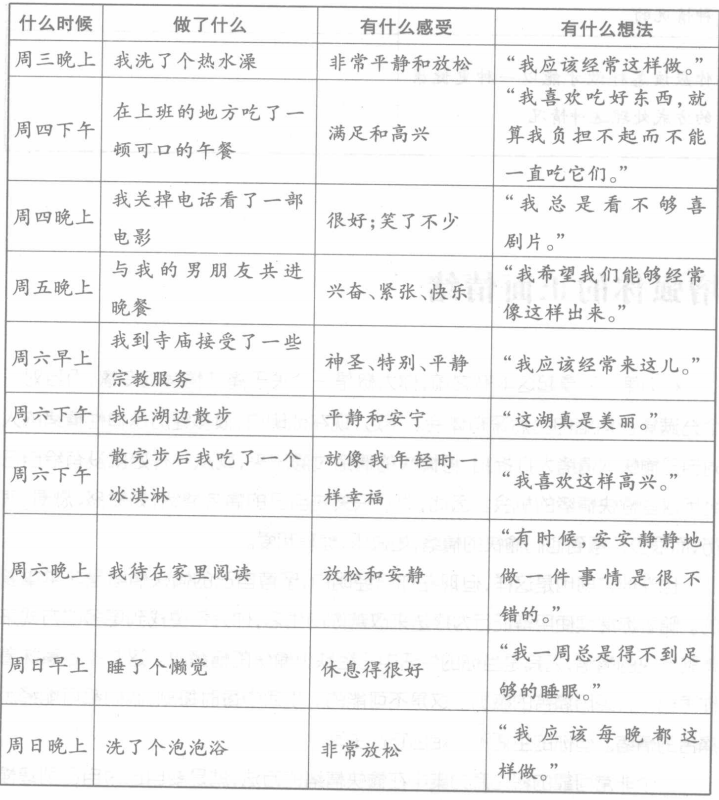

### 二、高级技巧

---

## 第四章、人际效能

### 一、基本技巧

### 二、高级技巧

---

## 补充1：精华部分

备注：★表示对于我自己的适用程度，最高5★

### 一、理解

#### 1、情绪是什么

- **单一的原生情绪**有可能会**引起多种衍生情绪**。
- 在令人痛苦的情况下，**分辨出哪种情绪才是最初的原生情绪是非常重要的**，这样你才能在衍生情绪淹没你之前学会对付这种感觉。

#### 2、情绪展现和处理（★★★★）

- **情绪**是你身体中的一些电化学信号，它们使你留心到正在发生的事情。这些信号常常**从你的视觉、触觉、听觉、良觉和味觉开始**。当这些信号到达你的大脑时，它们会在一个被称为**中枢边缘系统**的区域得到**处理**

#### 3、情绪 vs 思想 vs 行为（★★★★★）

- 你的**情绪和行为是联系在一起**的，拥有**压迫性情绪的人常常在感到愤怒、沮丧和焦虑时做出自毁行为**。他们**伤害自己的肉体，控制他人的行为**

- 处于压迫性情绪的人常常会陷入的**两种自我毁灭的行为**：**自残/自伤，伤害他人**。

- **自残：**

  虽然自我伤害带来的**伤痛缓解是暂时**的，但是**伤痕、记忆**，还有伤害自己的**罪恶感**会一直伴随着这些行为。


- **伤害他人：**

  如果**你强迫别人做你想要的事情**，你可能觉得**满足或者有一种掌控感**。这些都可以被称为强情绪回报，特别是很多有压迫性情绪的人，他们都感到**自己的生活失去了控制**。不过再说一次，这些情绪回报都是暂时的。

  **没人喜欢被控制**。实际上，一个被控制的人会因为被控制而觉得疲惫，然后**提升对控制的抵抗程度**。

### 二、练习

#### 1、全盘接受（★★★★）

- **全盘接受**态度提倡的另一选择就是**承认你目前的处境**，无论怎样，**不要去评
判它或自责**。

- 全盘接受**不是指你宽恕或同意别人的错误行为**，而是指你**不再用愤怒和责备与过去之事纠缠不休**。把你的注意力转移到你当前能做的事儿上面
。
- 全盘接受还意味着，你必须**承认现实是过去一连串的事情**以及你和其他人所作决定的结果。
- **全盘接受并不意味着你让步**，在一些情况下，你自己也有一定的责任，在**你和他人的责任间有个平衡问题**
- 重要的是记住**全盘接受**也同样适用于**接受你自己**。在这种情况下，彻底接受指的是**抛开自我评判和指责**，去**拥抱真实的自我，包括一切优点和缺点**。

#### 2、转移注意力或思想（★★）

- 实际上，**你越努力不去想，那个形象越是活跃**，你大脑越要把它引入你的思想。但凡**你越想忘掉什么，你的大脑越要记住它**。这就是为什么**强迫自己忘掉发生的事是不可能的**，这也是你不能强行摆脱某种讨厌情绪的原因。

- 有时**最好的办法是走开**。如果你和某人关系恶化，你意识到你的情绪会让你感到压抑并可能使情况变得更糟，于是，**走为上策**。


#### 3、动用感觉器官（★★★★★）

​		这里涵盖了一些需要调动你的**嗅觉、视觉、听觉、味觉和触觉**来让你放松和舒缓的活动，它们会给你生活带来一丝丝的宁静。如果其中任何一个活动没能帮你放松或使你更糟，那就不要再做了，尝试点其他的。记住，**个体之间有差异**。例
如，**有些人听音乐时更放松，而另一些人觉得洗泡泡浴更有效**。

#### 4、重识你的价值（★★）

- "价值"这个词可以理解为你的**伦理、原则理想、标准或道德**。这些词在字面上是一些提升你人生境界的思想、概念和行动。**铭记你的人生价值观是帮助你克服环境压力的强大力量**。
- **记住你的价值观能帮你克服苦难，用对你重要的活动来填充你的人生**。

#### 5、超然力量（★★）

- 记住**你的超然力量并不一定是上帝**。
- **仰望星空**。你正看见的星光有几百万年的历史了。
- **去海滩。数数满满一把沙子有多少颗**
- **去公园或农田，观察树木、青草和动物。**

#### 6、活在脚下（★★★）

- **做事时神游是可能的**，我们偶尔这样，但有的人却很频繁。这些人每天花很大一部分时间去想昨天已做完的事、过去做错的事以及明天才需要做的事。结果，**他们要么活在过去，要么活在将来**，他们很少注意眼前发生的事。
- **倾听现在**：把你的注意力集中到对方的穿着
- **正念呼吸**：**如果你的身体缺氧，会使你的生物平衡系统紊乱**。就凭这一个原因，说明做**缓慢而充分的呼吸**很重要。

#### 7、自我鼓励（★★）

- **有时需要我们独自面对，你得给自己加油，保持坚强**。
- **索引卡或贴纸**上写下你最喜欢的五种应对思想。你越经常看到你的应对思想，它们就越快会成为你**自动思维**过程的一部分

#### 8、认清你的情绪（★★★★）

- 学习如何**认清你的情绪**以及它们对你生活的影响是**控制自己强烈情绪反应的第一步**。

- 想要控制自己的压迫性情绪反应，首先必须**放慢自己的情绪处理速度**，这样我们才能将它**好好审视一下**。审视之后，你才能做出更健康的决定。
- **大声说出自己的感受**对认清自己的情绪很有帮助。**你对自己的情绪说得越多，因它而起的冲动就会越
少**

#### 9、健康相关问题（★★★★★）

​		**食物，睡眠，体育锻炼，身体紧张**一定要规律，**如果这些方面处理不好，会加重自己的压迫性情绪**，痛苦会不停地反复。

#### 10、减少你的认知的弱点（★★★★★）

- 我们**大家都会不时地弹出触发思想**。情绪调节技能的目的是**在这些想法出现时，学会怎样应对你的思想**
- **思想解脱**是一个技能，帮助你从你的**想法和压迫性情绪中"脱钩"**。这种技能需要**运用你的想象力**。其目的是为了使你的**想法和情绪形象化**，无论是**以图片还是文字形式**。
- 想象一下，如果你一直带着**黑色的太阳镜**生活，那么你就**不可能看见世界的多姿多彩**。想一想，你可能会过着一种受限制、沉闯无聊的生活。**平衡想法和感受**也是一种方法，**寻找反面证据**，用**全景图**来看真实的东西。

#### 11、增强正面的情绪

- 留意自己的愉快情绪是非常重要的。生活中每时每刻，**我们都可能经历痛苦的情绪。但你的生活不一定由它们主宰**。


- 要为自己建立一个**更为平衡、健康的生活**，需要每天花一些时间为自己创造一个**愉快的经历**(承受痛苦的技巧中就有介绍)，并记录下这个经历为你带来了怎样的感受和想法。

---

## 补充2：我的理解 

### 1、痛苦的情感有哪些

- 沮丧，抑郁，自闭
- 寂寞，无聊
- 恐惧，焦虑，迷茫
- 愤怒，烦躁
- 嫉妒。。。

### 2、常见情绪

### 3、**压迫性情绪** & 神经质人格

- **压迫性情绪**和**神经质人格**（好像是一样的）都对痛苦有极强的敏感程度，而且这类人容易深陷到这个情绪中，感到无比的痛苦。
- 压迫性情绪的人总是强迫自己忘掉当前的痛苦，但是**强迫自己忘掉发生的事是不可能的**
- 许多被**有压迫性情绪的人**使用的**应对策略只会使问题变得更糟**。
这种应对方式**非常不健康、非常无效**
- 许多有**压迫性情绪**的人在**面对争吵、排斥、失败**或其他不榆快的事情时会很**暴躁**。**情绪可能过于激动**。

### 4、分散注意力 & 逃避

- 别把**分散注意力**和**逃避**相混淆，后者是指你**放弃应对困境**，但**分散注意力**却是指当你的**情绪平静**到具有相当承受力的时候，你会**主动去应对它**。


### 5、分散注意力 & 做喜欢的事

- 对于我来说，我做喜欢的事一般不会注意力过于集中，比如看漫画，看动漫，相反**发散性思维更加活跃**。
- 对于我来说，要想**分散注意力**，最好是做一些**比较简单**的，注意力比较集中的，**发散性思维比较少**的事情，比如整理书桌，打扫房间，洗碗，洗衣服等。
- 对于我这种压迫性情绪的人来说，**发散性思维对于放松未必是好事情**，因为容易产生现实和想象的**情绪落差**，或者容易**压迫自己继续联想**下去，**不明不白就更痛苦了**。

### 6、停下歇歇 vs 其他技巧

- **停下歇歇**需要自己抽出一整段连续的时间，**像对待别人那样，花时间地对待自己**，比如吃顿好的，去公园放松一下等等。
- 其他技巧则侧重于如何**快速摆脱突然袭来**的，或者**快速摆脱将要到来**的痛苦。
- 而停下歇歇需要为自己**安排一段时间**来摆脱痛苦。

### 7、转移注意力 vs 全盘接受

- 当遇到痛苦的时候，我们可以运用书中的技巧来缓解。**但是使用不同的技巧，效果是不同的**。

- 转移注意力 = 走开，全盘接受 = 不加批判的接纳，两个动作不一样，心理变化的效果也不一样。

  如果你**一味的走开**，直到有一次怎么绕也绕不开痛苦的时候，可以**尝试使用全盘接受**的方法。

  如果你**一味的接纳**，直到有一次觉得接纳它很痛苦，接纳不了的时候，可以**尝试使用转移注意力**的方法。

- **摆脱痛苦**的道路千千条，不要只卡在一条路上。

- **认清自己的情绪**之后，采用不同的方法效果不同。如果你对未来的未知感到**恐惧**，或者是对接下来繁重的工作感到**迷茫拖延**时。

  如果采用**适当的转移注意力**的方法，有利于完成任务，但是**过分的“转移注意力”**更像是一种**逃避**的行为，任务，困难就摆在那里，你不能一直逃避。

  但是如果采用**全盘接受**的方法，在**承认这种现状**下，**不批判自己**，既可以**解开这份情绪**，也可以**勇往直前**，让问题得到解决。

### 8、所有技巧的关系

​		辩证行为疗法的**四组技巧（忍耐痛苦、掌握正念、情绪调节和人际效能）**部分重叠并且相互强化，这样能帮助你更加容易地学习这些技巧，并且能更快地记住它们。

### 9、注意情绪，思想和行为

- 情绪可以影响思想和行为，而**思想和行为也可以反作用于情绪**。

- 认清自己的**原生情绪**是情绪处理的第一步。

- 在情绪处理过程中，不单单要学会承受痛苦的技巧，正念的技巧，还要**处理好自己的思想和行为**。这样才**不会使得情绪来主导我们的生活**。

  - **情绪上**：
- **行为上**：注意自己的**饮食，睡眠，体育锻炼**等。也可以采用**微习惯**的策略。
  - **思想上**：采用**思想解脱**的技能，**将想法和情绪脱钩**，关键是使用**想法和情绪形象化法**，把情绪和想法想象成文字或图片，随波消逝
