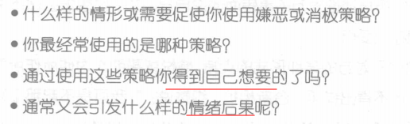

# 《辩证行为疗法》摘录 -- 人际交往篇

## 第八章、人际效能的技巧

- 高效人际交往的基本技巧 = **社交技能培训** + **自信心训练**  + **倾听技巧**三者合并的一个综合体系
- **人际交往技能的障碍**
：
  - 咄咄逼人的旧习 
  - 消极被动的旧习
  - 压迫性情绪
  - 无法认清自己的需要
  - 恐惧
  - 有害关系
  - 误思

- **人际关系很重要，但同时也及其脆弱**，它给我们带来了爱、陪伴和支持。然而，有些时候，它可能会支离破碎以至于无法修复
- 所有技巧中，最必要和最重要的就是**自信**：
  - 敢于提出要求；
  - 敢于说不；
  - 敢于就冲突或矛盾进行协商谈判
- 

### 一、基本技巧

#### 1、全心关注 √

##### 1）解释

- **关注**，意思是说**你的思维应该以当前的会话为中心**——而**不是思考接下来你想说什么或者是沉浸在某些回忆当中**。这意味着你要**全身心关注眼前的所见、所闻及所感**。
- 当留心关注时，你会发现在**困难或问题**向你袭来之前你就能**提前察觉到**，并能争取足够的时间提出**具体清晰**的问题，从而有助于你及时更正误解。

- 全心关注也包括**留意**与他人交往时**你自身的感受**。

- 人际交往技巧**首要**的一点就是要**培养全心关注的能力**


##### 2）我的想法

​		在与人交流过程中，**有时我会沉浸到某些回忆中，或者是自己的观点中**，没有全心关注说话人表达的内容。需要改正

#### 2、消极被动 & 咄咄逼人 √

##### 1）消极被动

- 人际交往模式对你的人际关系有很大的影响。**消极被动**有时看起来似乎是安全的。你按照其他人所期望的方式行事。但从**长远来看**，被动最终会给人际交往带来**灾难性后果**。当你**屈从于别人而放弃自己的需要**时，你心里会产生**挫折感和怨恨**。最终，这种关系变得让人很痛苦以至于你会恼怒、沮丧或逃避。

##### 2）咄咄逼人

- 相比之下，**过于强势也会破坏人际关系**，因为它会使你难以接近。咄出逼人的人际风格通常有两个来源。
  - **第一个是强烈的对错感，认为事情应该怎样就是怎样的**。尤其是你十分清楚别人本应该怎样行事。你明白什么样的行事方式才是正确或者错误的。当别人的行事方式违反你的意愿，你可能会觉得非常有必要惩罚他们。

  - 第二个来源是**希望能控制人际交往活动**。事物总是以某种方式发展，期望得到某些结果或不发生某种结果。因此，当对方违反了你的对错感，或未能按照你的期望办事，你就会感觉到非常的惯怒。企图控制事情发展会给你带来更大压力。有时**控制欲太强，你可能会暴跳如雷甚至是赶走对方**。


##### 3）我的想法

​		很抱歉，我发现我两种都有：**对于强势的人，我唯唯诺诺；对于弱势的人，我重拳出击**，这就是所谓的消极被动和咄咄逼人吧。

#### 3、“我要-别人要”比例 √

​		如果**"我要—别人要"比例不平衡**，你们的**关系就会变得不稳定**。善解人意并**采取积极的措施化解矛盾冲突**，对于维持一段健康长久的关系至关重要。


#### 4、“我想-我应该”比例 

- 每一段关系都应该在你觉得**应该做什么**和你**想做什么**之间保持一个**微妙的平衡**（这也是为维持这段关系或对方的利益）。如果总是**着眼于自己的所需所得**而**忽略对方的需求或感受**，你将很快**引起别人的反感**。
- 而如果**过多地注重"应该"**——应该为对方做什么，应该如何去做————**这段关系又会像是沉重的负担**，让人想逃之天天。

- 对于很多人来说，"应该"可能会成为控制性力量，它迫使人们忽略自己的需求，**奔命于做无私的老好人却没有意识到其实自己已变得多么压抑和绝望**。这种否定自我的痛苦会越来越大，迟早会因为忍无可忍而不得不逃避或结束这段关系。

#### 5、六大核心人际交往技巧 √

- 1、**清楚地知道你想得到什么**。怎样做到呢？有时，你会有一种**需求感**或者是**不适感**。关键是要留意并找到一种恰当的方式在你的内心描述自己的感受。
- 
2、**用一种保护而不是破坏这种关系的方式开口索求你想要的**。
- 3、**协商双方相冲突的需求**。抱着**没有胜负**、没有输赢的意愿是**平心静气谈判**的先决条件，充分理解和肯定各自的需求。
- 4、**收集相关信息**。在人际交往中一个最重要的步骤是了解对方有什么需求，他们的顾虑、愿望，等等。**收集信息可能会遇到下面的障碍**∶

  - （1）错误地以为你已经了解对方的所需。

  - （2）将你自己的顾虑、需求和感受投射到对方身上。
  - （3）担心自己像是在打听别人的隐私。
  - （4）担心得到最坏的答案。
  - （5）不知道如何询问或询问什么。

- 5、用一种**不会破坏关系的方式说"不"**。
- 6、**按照你的价值观做事**。在一段关系中**过于被动或强势都将伤害双方的自尊心**，因为其中一方会感到自己的需求和感受被忽略。清楚地意识到怎样对待别人是有效交往的关键。问问自己，"**我到底想要一种什么样的关系?**"一种相互爱恋的关系？相互信赖的关系？或是彼此忠诚的关系?


#### 6、**人际交往技能的障碍**
：√

##### 1）咄咄逼人的旧习 

使用畏惧、羞辱或者其他不良心理压力对他人施加影响的方法叫做**嫌恶策略**。一共有八项∶


##### 2）消极被动的旧习

消极策略的记录

##### 3）压迫性情绪

- **情绪过激**是另一阻碍人际交往技能发挥的主要因素。

- 首先，**将注意力集中在那些你将要失控的危险信号上**，当然，不同的人有不同的信号，以下是一些典型信号∶
  - **全身发热**，脸涨得通红。
  - 心跳加速。
  - 呼吸急促。

  - 手掌、手臂、额头、肩膀肌肉收缩。
  - **语速加快或音量提高**。

  - **有强烈的求胜心**，一心想要打倒或挫败对方。


##### 4）无法认清自己的需要

​		如果在特定状况下你**不知道自己需要什么**，那么**人际交往技巧对你就没有多大帮助了**。若不能明确表达你的需求，你就只会遭遇挫败。

##### 5）恐惧

- 当你**害怕面对某件事情**的时候，**人际交往技能**就往往会被**抛到九霄云外**。你会满脑子装满**灾难性的"假如"**而无法清晰地思考∶"假如我被拒绝了该怎么办?""假如我丢了工作怎么办?""假如我承受不了该怎么办?"**对不幸后果的忧虑使你心生恐惧**，从而**采取攻击性和厌恶性的策略**;或者使你完全逃避所面对的状况。
- 无论怎样，唯一的结果就是使你**表现不佳和行为不得力**。


##### 6）有害关系

- 在人际关系中，**别人使用嫌恶策略**来对付你，会使你的**人际交往技能难以实施**。不管你怎样下决心要自信果断，不盛气凌人，也不消极被动，但他人的责怪、威胁和藐视都可能使你的努力功亏一篑，你要么会大发雷霆，要么一走了之。


- 最好的办法就是对这些人**敬而远之**，因为他们本性难移，，你无法避免遭受他
们的侵犯。

- 这些人有可能是你的老板和家人。

  第一，你对付这些人之前必须**头脑冷静**，用有意识呼吸法或者慧心冥思可以使你精神集中。

  第二，你需要根据以往的经验，**精确地预测对方可能采取的行为**，然后制订一个详细的应对计划。提前计划的制订和详细的应对构思将使你


##### 7）误思


人际关系的**四个破怀性的误思**∶

- 1.如果我有某种需求，就意味着我是错的或不好的。=> 我**有权**提出要求。

- 2.我无法承受别人的愤怒和拒绝。=> 即使别人不给予，我也**有权**说出我的需要。

- 3.拒绝他人或提出要求是自私的。 =>  提出需求是正常和健康的。

- 4.我什么都控制不了。 =>  我**可以选择**更有效的行为方法

##### 8）我的想法

- 我有**压迫性情绪**，我需要将注意力集中在要失控的的危险信号上：**全身发热，语速加快，音量提高**等
- 在与人交往中，**我不知道自己想要什么**，这样人际交往技巧就没用了。一定要明确自己想要什么。然后自信果断，能够**提出简单的要求**。
- 对于**恐惧心理**，这个才是我的最大障碍。在与人交往中，**灾难性“假如”**占据我的脑子，使得人际交往技巧发挥不出来。我觉得我要**全心关注对方**说的内容，学会倾听技巧，也要**全心关注自己的感受**。
- 身边的人各种各样，对于**有害关系，**那些使用嫌恶策略的人，我之前总是容易因为他们**情绪上头**，惹自己生气。以后我要**选择敬而远之，冷静对付**他们。
- 对于误思，因为**思想会反作用于情绪**，我自己有时会因为自己的思想而影响自己的情绪。要**纠正一些不健康的思想**。

### 二、高级技巧

#### 1、了解自己想要什么 √

- **人际交往**的效果应**始于自我认识**，你必须明白你的感受和要求。


- 好情绪和坏情绪

  

- 一旦你确定**用什么词来表达你的感受**，接下来的问题就是，**这种情绪让你想去改变什么**? 特别是，你想要**别人在行动上**做出什么改变?你是否要别人在某事上做得更多或更少?你是否想阻止某事?你是否想别人做出让你有不同感觉的另外的行为?


- 有位女士，她姐姐经常批评她怎么养了一个有那么多毛病的孩子，于是她这样描述她想要的改变∶"**我希望布伦达不要再评论麦克（我的儿子）**，不要再说我需要对他拿出自己的威风，我希望她不要再这样，特别是在熟人面前。我宁愿她关心我其他的事儿——我的工作、摄影、写作。

- 不幸的是，很多人生活在忽略他们需求的家庭中，**一生都不敢提出自己的要求——好像他们很糟糕，没有价值**，好像他们的感受和痛苦一点都不重要。


- 你的合法权利

  

  

#### 2、调节强硬度 √

- 你的需要有多迫切

  

  对方及你与他们的关系有多脆弱

  

  注意，你可用10级制来评估这种差别。分数越高，你越应该坚持，**分数越低，你越应该客气与温和**。

- 记住"**有多迫切**"和"**有多脆弱**"能帮你快速地做出决定，**声音的力度、强硬度和音量**应掌握在什么程度上。


#### 3、提出一个简单要求 √

##### 1）解释

- **提要求的技巧有助于自我保护**。问路，在餐馆里**要求换位**，请你的机修工向你说明更换了你小车哪些零件，请别人不要在你家抽烟———**这些要求都有关自我保护和生活品质**。
- 如果你**不能恰当地提出这些要求**，就会很容易产生**无助感和怨恨情绪**。

- 简单要求的四个步骤：
  - 1.**一个筒短的解释（任选）**。用一句话说明题。"这儿太热……·这些包太重…要走的路太远了……这东西看起来有点紧。"**很多事不需要解释，如果需要，就简单解释一下**。

  - 2.**一个委婉的陈述。这点很重要**，可以为你建立一个**有礼貌，不苛责**，通情达理的良好形象。委婉的陈述通常这样开头∶

    - "请问你是否介意。"
    - "**如果你能**……那将太好了。"
    -  "如果你能……我将非常感谢。"
    - （面带笑容）"我能要点儿……吗?"
    - "嗨，我在想是否可以…"

  - 3.**直接具体地提出问题**。你要清楚而准确地说出你的要求，不要带命令口气和个人情绪，**用一种平和的，讲道理的方式**。不要责备或暗示别人有错，让你的要求听起来合情合理———这样任何人都能包容。**提问尽量用一句话——你越解释和修饰，越容易遭到拒绝**。

  - 4.**一个充满感激的表白**。这会增加别人答应你的可能性，他们会觉得你很看重其所做的事，这里举几个例∶

    - "这真的帮了我的大忙。"
    - "感谢你为此所做的努力。"
    - "这样真的大不一样了。"
    - "我为此衷心感谢。"


##### 2）练习

- 提出一个简单要求的练习

  

  

#### 4、果断自信的陈词 √

- **自信是维持良好关系的重要技巧**。没有它，你要么显得消极被动，要么显得咄咄逼人，这会损害彼此的信任和亲近。


- 一个果断自信的陈述有三个基本组成部分和一个任选部分。


  - 1.**"我认为"**。这部分**集中在事实和你对情况的理解**，不要对别人的动机妄加评论和猜测，**不要带有攻击性**。**"我认为"是对事件、你的体验**或一个改变的清楚的表达，例如∶


    - "我想我们很久没在一起了——上周有两个晚上，前一周只有一个晚上。"
    - "你把我没认可的修理账单寄给了我。"
    - "回想最近一段时间，大部分会议你都迟到。"
    - "我从机场回来会有点晚——大约11点———还有……"


  - 2."**我觉得**"。这个部分可以任选。**和朋友、家人在一起时可以用上**，对你的汽车修理工就不必了。其目的是简短而不带贬义地**描述你由事实引发的情绪**。


    **情绪的言辞**最适合**用"我"**来开头。
**谴责和批评**的话通常**用"你"**开头——所以被叫做"你"陈述。


    - "我害怕。"
    - "我感到孤独"。

    - "最近，我为我们的事感到难过。"
    - "我伤心，因为被迫放弃而难过。"
    - "我感到几分失落和无形中越来越被疏远。"
    - "我感到被排斥。"
    - "我很期待，又很紧张。"


  - 3."**我想。**"果断就全部体现在这一部分，你需要把它彻底想清楚。这里有一些遵循的原则∶


    - 要求**行动上，而不是态度上的改变**。你当然不能指望别人因为你的好恶而
改变他们的判断和感觉。**信念和感情往往不是人能控制的**，但你可以要求某人作出行为上的改变。

    - 每一次**要求别人改一点**。不要要求一次就改完，那会让人感到压力。
    - **只要求改变现在能改变的**。"下次我们去度假，我希望你…"是非常苍白

    - 要**明确而具体**。像"乖一点"这样**含糊的要求不能表达你任何思想**，因为别人不知道它的准确含义。明确说出你期待别人什么样的新举动，以及你想在何时何地看到。

  - 4."**自助解决**"（任选）∶光提要求是不够的。有时，**你需要给他们鼓励（强化）**，别人才会乐意为你做事。

    - "如果你不能按时去参加派对，我自己开车去。"
    - "如果你不能帮着做清洁，我就请一个女佣，费用我们平摊。"
    - "如果你不能让派对的声音小点，我就叫警察来帮你。"

    - "如果你不办保险就驾驶，我就把车转到你名下，所有费用由你承担。"


#### 5、洗耳恭听 √

- 如果在倾听过程中你**不能准确理解**对方的感受和愿望**，直接问他**，"我不确定你对此事的感觉——**能再解释一下吗**?""你觉得在这种情况下我们该作何改变?"
**你的问题越主动，你了解到的就越多**，你越有能力找到双赢的解决办法和折
中方案。

  - "照你看来，**问题的关键在哪**?"

  - "你怎样理解目前这个状况?你认为会发生什么事?"
  - "当你在跟（具体问题）___抗争的时候，你有**什么**感受?"
  - "当你在跟（具体问题）___抗争的时候，你想做什么?"
  - "你认为**什么**需要改变?"
  - "在这件事上，你需要我怎样的帮助?"


- **主动的倾听很有价值**，但记住——那仅仅是因为你可以发现别人的需求，并不是说你必须予以满足。

- **倾听的障碍：**

  

#### 6、学会说“不” √

- **学会说"不"是良性交流的关键部分**，没有它，任何关系都是危险的——就像驾驶有油门没刹车的小汽车，你无法控制别人对你的行为。
**说"不"既筒单又困难。话不多，但说出来需要勇气。**让我们从"怎样说不"开始。只有两个步骤∶

  - 1.表示**理解**对方的需求和愿望。
  - 2.明确表示你**不赞成**这么做。

- 举些例子：
  - "杀人如麻的动作片**确实好看**，但我今晚只想安静。"

  - "我看得出荨麻酒色**很好看**——很有活力——但在卧室里，我更喜欢柔和
色彩。"


#### 7、应对阻力和冲突 √

应对阻力和冲突的五大技巧：1.彼此认同；2.软磨硬泡；3.刨根问底；4.话留三分；5.果断推延。

##### 1）彼此认同

因此，**彼此包容**意味着你**承认和理解别人的体验**，你知道他们的出发点，同时，你也**认可自己的感受**。例如∶


- "**我知道**冒这么大的财务风险是很可怕的;你的确应该谨慎。但**对我**而言，为了退休后生活更宽裕，急于做一些高回报的投资。我们的出发点都是合理的，只是做法不同。"

- "**我知道**，我说你没尽力的话伤了你，谁听了这话都会觉得刺耳，**换我也一样**。但**就我而言**，我很害怕这个工程有超出预算的危险，我得想办法，我需要大家齐心协力。"

- "**我理解**你担心我的安全才换了这个部件，我非常感谢。但**就我而言**，我手头很紧，无法支付修理费。实际上，只要车子能跑就行，安全不是我目前最关心的。"


##### 2）软磨硬泡

- 在别人没有抓住你意思的时候，运用这个技巧。就你的想法做一个**简短、具体、易懂的陈述**，最好就一句话，不用找借口，也不用解释。**站直或坐直**，用一种坚定有力的声音，然后根据需要**反复地陈述**，个别地方换个说法———但**不要改动太多**。


- **不要争吵，不要动怒**，也不要辩论和反驳别人的话。
你应该这样回答∶"**我只是更喜欢那样**，"或者"**那只是我的感觉。**"在任何情况下，你都不应该为支持你的观点提供进一步的信息和证据。就像—张老唱片，**礼貌地、清楚地重复你的陈述**。例如∶

  

##### 3）刨根问底

​		这里的关键语句是∶
·"让你烦心的那个___（事情的具体名称）是怎么回事?就这样**一直问下去，直到获得有用的信息**。


##### 4）话留三分

- 这个技巧让你**"部分同意"某人意见**，而不是全盘接受他说的话。它能让人心平气和，停止输赢的争。
**问题关键是你要找到对方话语中你能接受的部分**，然后承认他在这一点上是正确的，其他的争论就不要管了。

- 举个栗子：

  **批评者**∶你总是为一点小事就发脾气。

  **你**∶没错，**我有时**也发现自己容易被激怒。


##### 5）果断推延

​		这个技巧**给了你缓冲的空间**，特别是**事态激化**的时候。对方常常催促你立马做出一个决定或同意一项计划。果断推延技巧让你有惴息的机会——**哪怕几分钟或几小时**。趁这空当，你可以**冷静下来**，仔细想想别人的话，酝酿一个恰当的回应。"你对我讲了很多，我需要时间整理出个头绪。""**给我一个小时，这很重要**，我想在表态前仔细考虑一下。"


#### 8、怎样协商 √

##### 1）五个指导原则

- **思想放松。冷静对待冲突**，每—次开口前做一个深呼吸，用呼气缓解你的紧张。

- **避免反感**。记住你可能不由自主地表现出厌恶。为了避免，你要**谨慎出言**。
- **理解对方的需求**。争取一个**公平、双赢**的结果，双方的需求都能得到部分的满足。
- 
**审视你的价值观**。你希望在某种关系中得到什么样的对待——你想怎么对待别人?**你想达到什么目的**，不只是关于冲突，还有这种关系本身。

- **中性的语调**。语调中不要带怒气和轻蔑。
只要你遵循这五个原则，就可以开始实际的协商过程。一开始，你们轮流提出自己的解决方案，要确保你的建议至少体现了对方的部分需要，如果你不明白对方的需求是什么，就问问。


##### 2）几个折中方案

- **给对方优选权**。离婚后，莎朗把家里的艺术品分成两部分，但劳伦斯可以先选。

- **轮换**。琳达和莫伊每年假期去登山和去海边交替着来。·兼收并蓄。同时满足两人的需求。

- **试验期**。每个方案实行一段时间，完后重新评估。如一方反对，重新展开
商议。

- **各自采取自己的做法**。每个人都用自己的方法处理问题。山姆和卡特琳娜合伙开了家卖流行服饰的小店，山姆认为卡特琳娜做的那个写有"欢迎光临"的标识牌过于鲜艳。他们同意，山姆看店的时候就把它收起来。
- **分工**。室友吉尔和丹尼斯说好，只要吉尔每周清洁一次浴室，丹尼斯就每
周用吸尘器打扫一次房屋。

- **兼顾**。两个朋友或同事准备一起启程去参加一个会议。一个想悠闲地坐火车去，另一个想急着乘飞机去，于是决定去时乘飞机，回来时坐火车。
- **都让一点**。这个办法在讨价还价和商量在某事上花多少时间的时候常常
有用。


#### 9、怎样分析问题的关联

​	这一小节是对所有的**沟通技巧的分析思路总结**，详见书中该章节

### 补充1：精华部分

#### 1、人际交往技能障碍（★★★★★）

- **咄咄逼人的旧习**：8项嫌恶策略
- **消极被动的旧习**：消极被动策略不能得到我想要的东西
- **压迫性情绪**：将注意力集中在那些将要失控的**危险信号**上
  - **全身发热**，脸涨得通红。
  - **语速加快或音量提高**。
  - **有强烈的求胜心**，一心想要打倒或挫败对方。

- **无法认清自己的需要**：不知道自己需要什么，那么**人际交往技巧对你就没有多大帮助了**
- **恐惧**：当你**害怕面对某件事情**的时候，**人际交往技能**就往往会被**抛到九霄云外**。你会满脑子装满**灾难性的"假如"**而无法清晰地思考
- **有害关系**：在人际关系中，**别人使用嫌恶策略**来对付你，会使你的**人际交往技能难以实施**。最好办法是敬而远之
- **误思**
：破坏性的误思会消磨你的情绪。

#### 2、全心关注（★★★★）

- **关注**，意思是说**你的思维应该以当前的会话为中心**——而**不是思考接下来你想说什么或者是沉浸在某些回忆当中**。这意味着你要**全身心关注眼前的所见、所闻及所感**。
- 人际交往技巧**首要**的一点就是要**培养全心关注的能力**

#### 3、了解自己想要什么（★★★★）

- **人际交往**的效果应**始于自我认识**，你必须明白你的感受和要求。

- 一旦你确定**用什么词来表达你的感受**，接下来的问题就是，**这种情绪让你想去改变什么**? 特别是，你想要**别人在行动上**做出什么改变?

#### 4、调节强硬度（★★★★）

- 记住"**有多迫切**"和"**有多脆弱**"能帮你快速地做出决定，**声音的力度、强硬度和音量**应掌握在什么程度上。


#### 5、提出一个简单要求（★★★★）

- 1.**一个筒短的解释（任选）**。很多事不需要解释，如果需要，就简单解释一下。

- 2.**一个委婉的陈述。这点很重要**，可以为你建立一个**有礼貌，不苛责**，通情达理的良好形象。委婉的陈述通常这样开头∶

  - "请问你是否介意。"
  - "**如果你能**……那将太好了。"
  -  "如果你能……我将非常感谢。"
  - （面带笑容）"我能要点儿……吗?"
  - "嗨，我在想是否可以…"

- 3.**直接具体地提出问题**。用一种平和的，讲道理的方式。不要责备或暗示别人有错，**提问尽量用一句话——你越解释和修饰，越容易遭到拒绝**。

- 4.**一个充满感激的表白**。


#### 6、果断自信的陈词

- **自信是维持良好关系的重要技巧**。

- 一个果断自信的陈述有三个基本组成部分和一个任选部分。


  - 1.**"我认为"**。这部分**集中在事实和你对情况的理解**。

  - 2."**我觉得**"。其目的是简短而不带贬义地**描述你由事实引发的情绪**。


    **情绪的言辞**最适合**用"我"**来开头。
**谴责和批评**的话通常**用"你"**开头——所以被叫做"你"陈述。


  - 3."**我想。**"果断就全部体现在这一部分，你需要把它彻底想清楚（让别人做出什么改变或让步）。这里有一些遵循的原则∶


  - 4."**自助解决**"（任选）∶光提要求是不够的。有时，**你需要给他们鼓励（强化）**，别人才会乐意为你做事。

#### 7、主动倾听（★★★★）

​		如果在倾听过程中你**不能准确理解**对方的感受和愿望**，直接问他**，"我不确定你对此事的感觉——**能再解释一下吗**?""你觉得在这种情况下我们该作何改变?"
**你的问题越主动，你了解到的就越多**

#### 8、学会说“不”（★★★★）


		**说"不"既筒单又困难。话不多，但说出来需要勇气。**让我们从"怎样说不"开始。只有两个步骤∶


- 1.表示**理解**对方的需求和愿望。
- 2.明确表示你**不赞成**这么做。


#### 9、应对阻力和冲突（★★★★）

​		应对阻力和冲突的五大技巧：1.彼此认同；2.软磨硬泡；3.刨根问底；4.话留三分；5.果断推延。

#### 10、怎样协商（★★★★）

- 五个指导原则：
  - **思想放松，冷静对待冲突**
  - **避免反感，谨慎出言**。
  - **理解对方的需求：公平，双赢**
  - 
**审视你的价值观：你的目的**
  - **中性的语调**
- 几个折中方案：
  - **给对方优选权**。
  - **轮换，交替**。
  - **试验期**。
  - **各自采取自己的做法**。
  - **分工**。

  - **兼顾**。
  - **都让一点**。

### 补充2：我的理解

#### 1、自己想要什么 vs 调节强硬度

- **对于自己想要什么**：

  在与人交往过程中，既要**全心关注说话者表达的内容**，也要**全心关注，识别自己的情绪**，然后**不要觉得自己的情绪是不合理的**就过分压抑它。

  **出于这份情绪，你想要做出什么改变**。想让别人帮忙做什么事情。

- **对于调节强硬度**：

  **自己声音的气势，音量的强硬度**是在分析了**自己的需要**和**彼此的关系程度**的基础上，做出的决定。

#### 2、自己想要什么 vs 提出一个简单要求

- **自己想要什么**是在沟通过程中，明确自己的需要，识别自己的情绪，想要对方或自己做出什么改变。**它是一个识别的，分析的，孕育思想动机的过程**。
- **提出一个简单的要求**是在**明确自己想要什么**之后，在一些沟通技巧上，**合理恰当地提出自己的要求**，既能满足自己的需要，也不会让对方反感。它是一个**输出的过程**。

#### 3、有害关系 vs 沟通技巧

- 对于有害关系：在与人交往中，**别人有可能对你咄咄逼人**，此时你的交往技巧都得不到好的实施。最好的办法是**敬而远之**，或者是每次遇到他们时，要学会深呼吸，缓和自己的情绪。
- 虽然**不同人有不同人的个性**，沟通技巧的使用也不尽相同，但是**为了很好地沟通和引导**，无论是**对方还是自己**，**沟通技巧的学习是必要的。**

#### 4、压迫性情绪

​	**压迫性情绪**容易让我**情绪上头**，进而**影响我的思想和行为**。它是我在人际交往过程中必须克服的、**最关键的障碍**，我必须多加练习才行。

#### 5、全心关注 vs 主动倾听

- 全心关注不单单要关注对方的表达内容，也要关注自己的感受。
- 主动倾听是指在**避免倾听障碍**（不要乱猜测，妄加评论等）的前提下，全心关注对方说话内容。

#### 6、自信的表达

​	**自信的**表达自己的情绪用的是"我"：**我认为（事件），我觉得（情绪），我想（别人改变）**，不是用"你"。它是摆脱咄咄逼人，消极被动，**维持良好关系的关键**。

